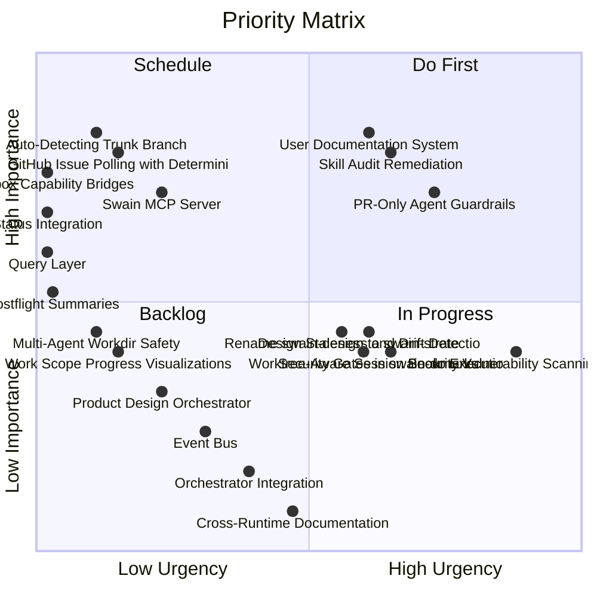
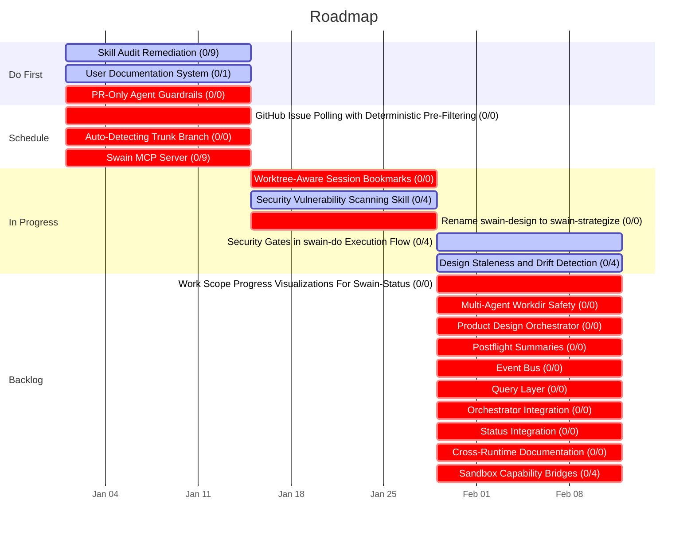
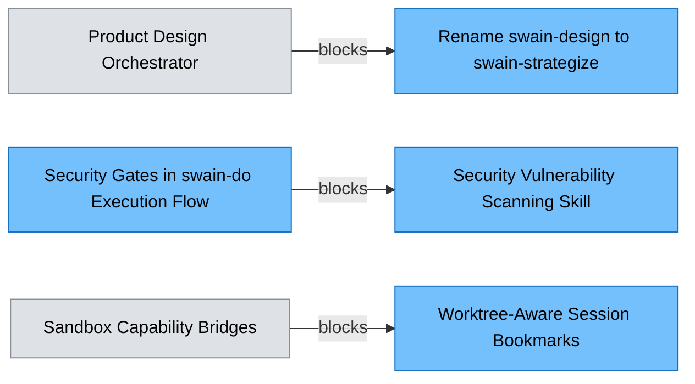

# Roadmap

<!-- Auto-generated by `chart.sh roadmap`. Do not edit manually. -->

### Do First
*High priority, active or unblocking*

| Epic | Initiative | Progress | Unblocks | Needs |
|------|-----------|----------|----------|-------|
| [Skill Audit Remediation](docs/epic/Active/(EPIC-031)-Skill-Audit-Remediation/(EPIC-031)-Skill-Audit-Remediation.md) | [Agent Runtime Efficiency](docs/initiative/Active/(INITIATIVE-003)-Agent-Runtime-Efficiency/(INITIATIVE-003)-Agent-Runtime-Efficiency.md) | 0/9 | 0 | — |
| [User Documentation System](docs/epic/Active/(EPIC-034)-User-Documentation-System/(EPIC-034)-User-Documentation-System.md) | [swain-stage Redesign](docs/initiative/Active/(INITIATIVE-015)-swain-stage-Redesign/(INITIATIVE-015)-swain-stage-Redesign.md) | 0/1 | 0 | — |
| [PR-Only Agent Guardrails](docs/epic/Active/(EPIC-037)-PR-Only-Agent-Guardrails/(EPIC-037)-PR-Only-Agent-Guardrails.md) | [Unattended Agent Safety](docs/initiative/Active/(INITIATIVE-017)-Unattended-Agent-Safety/(INITIATIVE-017)-Unattended-Agent-Safety.md) | 0/0 | 0 | **needs decomposition** |

### Schedule
*High priority, not yet started*

| Epic | Initiative | Progress | Unblocks | Needs |
|------|-----------|----------|----------|-------|
| [GitHub Issue Polling with Deterministic Pre-Filtering](docs/epic/Proposed/(EPIC-024)-GitHub-Issue-Polling-With-Deterministic-Pre-Filtering/(EPIC-024)-GitHub-Issue-Polling-With-Deterministic-Pre-Filtering.md) | [Automated Work Intake](docs/initiative/Active/(INITIATIVE-008)-Automated-Work-Intake/(INITIATIVE-008)-Automated-Work-Intake.md) | 0/0 | 0 | **activate or drop** |
| [Auto-Detecting Trunk Branch](docs/epic/Proposed/(EPIC-029)-Auto-Detecting-Trunk-Branch/(EPIC-029)-Auto-Detecting-Trunk-Branch.md) | [Unified Project State Graph](docs/initiative/Proposed/(INITIATIVE-009)-Unified-Project-State-Graph/(INITIATIVE-009)-Unified-Project-State-Graph.md) | 0/0 | 0 | **activate or drop** |
| [Swain MCP Server](docs/epic/Proposed/(EPIC-033)-Swain-MCP-Server/(EPIC-033)-Swain-MCP-Server.md) | [Cross-Surface Portability](docs/initiative/Active/(INITIATIVE-014)-Cross-Surface-Portability/(INITIATIVE-014)-Cross-Surface-Portability.md) | 0/9 | 0 | **activate or drop** |

### In Progress
*Active or unblocking, medium priority*

| Epic | Initiative | Progress | Unblocks | Needs |
|------|-----------|----------|----------|-------|
| [Worktree-Aware Session Bookmarks](docs/epic/Proposed/(EPIC-016)-Worktree-Aware-Session-Bookmarks/(EPIC-016)-Worktree-Aware-Session-Bookmarks.md) | [Concurrent Session Safety](docs/initiative/Active/(INITIATIVE-013)-Concurrent-Session-Safety/(INITIATIVE-013)-Concurrent-Session-Safety.md) | 0/0 | 1 | **activate or drop** |
| [Security Vulnerability Scanning Skill](docs/epic/Active/(EPIC-017)-Security-Vulnerability-Scanning-Skill/(EPIC-017)-Security-Vulnerability-Scanning-Skill.md) | [Security & Trust](docs/initiative/Active/(INITIATIVE-004)-Security-And-Trust/(INITIATIVE-004)-Security-And-Trust.md) | 0/4 | 1 | — |
| [Rename swain-design to swain-strategize](docs/epic/Proposed/(EPIC-019)-Rename-Swain-Design-To-Swain-Strategize/(EPIC-019)-Rename-Swain-Design-To-Swain-Strategize.md) | [Product Design](docs/initiative/Proposed/(INITIATIVE-007)-Product-Design/(INITIATIVE-007)-Product-Design.md) | 0/0 | 1 | **activate or drop** |
| [Security Gates in swain-do Execution Flow](docs/epic/Active/(EPIC-023)-Security-Gates-in-swain-do-Execution-Flow/(EPIC-023)-Security-Gates-in-swain-do-Execution-Flow.md) | [Security & Trust](docs/initiative/Active/(INITIATIVE-004)-Security-And-Trust/(INITIATIVE-004)-Security-And-Trust.md) | 0/4 | 0 | — |
| [Design Staleness and Drift Detection](docs/epic/Active/(EPIC-035)-Design-Staleness-And-Drift-Detection/(EPIC-035)-Design-Staleness-And-Drift-Detection.md) | [Operator Situational Awareness](docs/initiative/Active/(INITIATIVE-005)-Operator-Situational-Awareness/(INITIATIVE-005)-Operator-Situational-Awareness.md) | 0/4 | 0 | — |

### Backlog
*Not yet prioritized or started*

| Epic | Initiative | Progress | Unblocks | Needs |
|------|-----------|----------|----------|-------|
| [Work Scope Progress Visualizations For Swain-Status](docs/epic/Proposed/(EPIC-018)-Work-Scope-Progress-Visualizations-For-Swain-Status/(EPIC-018)-Work-Scope-Progress-Visualizations-For-Swain-Status.md) | [Operator Situational Awareness](docs/initiative/Active/(INITIATIVE-005)-Operator-Situational-Awareness/(INITIATIVE-005)-Operator-Situational-Awareness.md) | 0/0 | 0 | **activate or drop** |
| [Multi-Agent Workdir Safety](docs/epic/Proposed/(EPIC-020)-Multi-Agent-Workdir-Safety/(EPIC-020)-Multi-Agent-Workdir-Safety.md) | [Concurrent Session Safety](docs/initiative/Active/(INITIATIVE-013)-Concurrent-Session-Safety/(INITIATIVE-013)-Concurrent-Session-Safety.md) | 0/0 | 0 | **activate or drop** |
| [Product Design Orchestrator](docs/epic/Proposed/(EPIC-021)-Frontend-Design-Orchestrator/(EPIC-021)-Frontend-Design-Orchestrator.md) | [Product Design](docs/initiative/Proposed/(INITIATIVE-007)-Product-Design/(INITIATIVE-007)-Product-Design.md) | 0/0 | 0 | **activate or drop** |
| [Postflight Summaries](docs/epic/Proposed/(EPIC-022)-Postflight-Summaries/(EPIC-022)-Postflight-Summaries.md) | [Operator Situational Awareness](docs/initiative/Active/(INITIATIVE-005)-Operator-Situational-Awareness/(INITIATIVE-005)-Operator-Situational-Awareness.md) | 0/0 | 0 | **activate or drop** |
| [Event Bus](docs/epic/Proposed/(EPIC-025)-Event-Bus/(EPIC-025)-Event-Bus.md) | [Unified Project State Graph](docs/initiative/Proposed/(INITIATIVE-009)-Unified-Project-State-Graph/(INITIATIVE-009)-Unified-Project-State-Graph.md) | 0/0 | 0 | **activate or drop** |
| [Query Layer](docs/epic/Proposed/(EPIC-026)-Query-Layer/(EPIC-026)-Query-Layer.md) | [Unified Project State Graph](docs/initiative/Proposed/(INITIATIVE-009)-Unified-Project-State-Graph/(INITIATIVE-009)-Unified-Project-State-Graph.md) | 0/0 | 0 | **activate or drop** |
| [Orchestrator Integration](docs/epic/Proposed/(EPIC-027)-Orchestrator-Integration/(EPIC-027)-Orchestrator-Integration.md) | [Unified Project State Graph](docs/initiative/Proposed/(INITIATIVE-009)-Unified-Project-State-Graph/(INITIATIVE-009)-Unified-Project-State-Graph.md) | 0/0 | 0 | **activate or drop** |
| [Status Integration](docs/epic/Proposed/(EPIC-028)-Status-Integration/(EPIC-028)-Status-Integration.md) | [Unified Project State Graph](docs/initiative/Proposed/(INITIATIVE-009)-Unified-Project-State-Graph/(INITIATIVE-009)-Unified-Project-State-Graph.md) | 0/0 | 0 | **activate or drop** |
| [Cross-Runtime Documentation](docs/epic/Proposed/(EPIC-032)-Cross-Runtime-Documentation/(EPIC-032)-Cross-Runtime-Documentation.md) | [Cross-Surface Portability](docs/initiative/Active/(INITIATIVE-014)-Cross-Surface-Portability/(INITIATIVE-014)-Cross-Surface-Portability.md) | 0/0 | 0 | **activate or drop** |
| [Sandbox Capability Bridges](docs/epic/Proposed/(EPIC-036)-Sandbox-Capability-Bridges/(EPIC-036)-Sandbox-Capability-Bridges.md) | [Concurrent Session Safety](docs/initiative/Active/(INITIATIVE-013)-Concurrent-Session-Safety/(INITIATIVE-013)-Concurrent-Session-Safety.md) | 0/4 | 0 | **activate or drop** |

## Timeline

## Blocking Dependencies

