# Roadmap

<!-- Auto-generated by `chart.sh roadmap`. Do not edit manually. -->

| Priority Matrix | Legend |
|:---:|:---|
|  | **Do First** <br> *Remote Operator Interaction* — [E70](docs/epic/Active/(EPIC-070)-Host-Bridge-Kernel/(EPIC-070)-Host-Bridge-Kernel.md), [E71](docs/epic/Active/(EPIC-071)-Project-Bridge-Kernel/(EPIC-071)-Project-Bridge-Kernel.md), [E72](docs/epic/Active/(EPIC-072)-Chat-Plugin-System/(EPIC-072)-Chat-Plugin-System.md), [E73](docs/epic/Active/(EPIC-073)-Runtime-Plugin-System/(EPIC-073)-Runtime-Plugin-System.md) <br> *Portfolio Economics* — [E65](docs/epic/Proposed/(EPIC-065)-Framework-Cost-Model/(EPIC-065)-Framework-Cost-Model.md), [E66](docs/epic/Proposed/(EPIC-066)-ROI-Scoring-Engine/(EPIC-066)-ROI-Scoring-Engine.md) <br> *Unified Project State Graph* — [E29](docs/epic/Active/(EPIC-029)-Auto-Detecting-Trunk-Branch/(EPIC-029)-Auto-Detecting-Trunk-Branch.md) <br> *Agent Runtime Efficiency* — [E31](docs/epic/Active/(EPIC-031)-Skill-Audit-Remediation/(EPIC-031)-Skill-Audit-Remediation.md), [E48](docs/epic/Active/(EPIC-048)-Session-Startup-Fast-Path/(EPIC-048)-Session-Startup-Fast-Path.md), [E68](docs/epic/Active/(EPIC-068)-Doctor-Script-Reconciliation/(EPIC-068)-Doctor-Script-Reconciliation.md) <br> *swain-stage Redesign* — [E34](docs/epic/Active/(EPIC-034)-User-Documentation-System/(EPIC-034)-User-Documentation-System.md) <br> *Unattended Agent Safety* — [E37](docs/epic/Active/(EPIC-037)-PR-Only-Agent-Guardrails/(EPIC-037)-PR-Only-Agent-Guardrails.md) <br> *Session-Scoped Decision Support* — [E42](docs/epic/Active/(EPIC-042)-Retro-Session-Intelligence/(EPIC-042)-Retro-Session-Intelligence.md), [E49](docs/epic/Active/(EPIC-049)-Context-Rich-Progress-Tracking/(EPIC-049)-Context-Rich-Progress-Tracking.md) <br> *Security & Trust* — [E52](docs/epic/Active/(EPIC-052)-Automated-Test-Gates/(EPIC-052)-Automated-Test-Gates.md) <br> *Artifact System Maturity* — [E59](docs/epic/Active/(EPIC-059)-Automated-Completion-Pipeline/(EPIC-059)-Automated-Completion-Pipeline.md), [E69](docs/epic/Active/(EPIC-069)-Plugin-Namespaced-Script-Aggregation/(EPIC-069)-Plugin-Namespaced-Script-Aggregation.md) <br> [E53](docs/epic/Active/(EPIC-053)-Deprecate-and-Replace-Superpowers-with-Native-Skills/(EPIC-053)-Deprecate-and-Replace-Superpowers-with-Native-Skills.md) Deprecate and Replace Superpowers with Native Skills <br> <br> **Schedule** <br> *Automated Work Intake* — [E24](docs/epic/Proposed/(EPIC-024)-GitHub-Issue-Polling-With-Deterministic-Pre-Filtering/(EPIC-024)-GitHub-Issue-Polling-With-Deterministic-Pre-Filtering.md) <br> *Cross-Surface Portability* — [E33](docs/epic/Proposed/(EPIC-033)-Swain-MCP-Server/(EPIC-033)-Swain-MCP-Server.md) <br> *Artifact System Maturity* — [E61](docs/epic/Proposed/(EPIC-061)-Materialized-Artifact-Parenting-View/(EPIC-061)-Materialized-Artifact-Parenting-View.md) <br> *Portfolio Economics* — [E64](docs/epic/Proposed/(EPIC-064)-Appraisal-Value-Model/(EPIC-064)-Appraisal-Value-Model.md), [E67](docs/epic/Proposed/(EPIC-067)-Backlog-Appraisal-Bootstrap/(EPIC-067)-Backlog-Appraisal-Bootstrap.md), [E75](docs/epic/Proposed/(EPIC-075)-Appraisal-Value-Model/(EPIC-075)-Appraisal-Value-Model.md) <br> <br> **In Progress** <br> *Security & Trust* — [E17](docs/epic/Active/(EPIC-017)-Security-Vulnerability-Scanning-Skill/(EPIC-017)-Security-Vulnerability-Scanning-Skill.md), [E23](docs/epic/Active/(EPIC-023)-Security-Gates-in-swain-do-Execution-Flow/(EPIC-023)-Security-Gates-in-swain-do-Execution-Flow.md) <br> *Concurrent Session Safety* — [E16](docs/epic/Proposed/(EPIC-016)-Worktree-Aware-Session-Bookmarks/(EPIC-016)-Worktree-Aware-Session-Bookmarks.md), [E36](docs/epic/Active/(EPIC-036)-Session-Aware-Commit-Atomization/(EPIC-036)-Session-Aware-Commit-Atomization.md) <br> *Product Design* — [E19](docs/epic/Proposed/(EPIC-019)-Rename-Swain-Design-To-Swain-Strategize/(EPIC-019)-Rename-Swain-Design-To-Swain-Strategize.md) <br> *Operator Situational Awareness* — [E35](docs/epic/Active/(EPIC-035)-Design-Staleness-And-Drift-Detection/(EPIC-035)-Design-Staleness-And-Drift-Detection.md) <br> *Artifact System Maturity* — [E62](docs/epic/Active/(EPIC-062)-BDD-Traceability/(EPIC-062)-BDD-Traceability.md) <br> *Remote Operator Interaction* — [E74](docs/epic/Active/(EPIC-074)-Provisioning-Swain-Stage/(EPIC-074)-Provisioning-Swain-Stage.md) <br> [E77](docs/epic/Active/(EPIC-077)-Implement-CHORE-Artifact-Type/(EPIC-077)-Implement-CHORE-Artifact-Type.md) Implement CHORE Artifact Type <br> [E44](docs/epic/Active/(EPIC-044)-Swain-Memory-Architecture/(EPIC-044)-Swain-Memory-Architecture.md) Swain Memory Architecture <br> [E45](docs/epic/Active/(EPIC-045)-Shell-Launcher-Onboarding/(EPIC-045)-Shell-Launcher-Onboarding.md) Shell Launcher Onboarding <br> [E78](docs/epic/Active/(EPIC-078)-Deterministic-Worktree-Placement/(EPIC-078)-Deterministic-Worktree-Placement.md) Deterministic Worktree Placement <br> <br> **Backlog** <br> *Operator Situational Awareness* — [E18](docs/epic/Proposed/(EPIC-018)-Work-Scope-Progress-Visualizations-For-Swain-Status/(EPIC-018)-Work-Scope-Progress-Visualizations-For-Swain-Status.md), [E22](docs/epic/Proposed/(EPIC-022)-Context-Recovery-Summaries/(EPIC-022)-Postflight-Summaries.md) <br> *Concurrent Session Safety* — [E20](docs/epic/Proposed/(EPIC-020)-Multi-Agent-Workdir-Safety/(EPIC-020)-Multi-Agent-Workdir-Safety.md) <br> *Product Design* — [E21](docs/epic/Proposed/(EPIC-021)-Frontend-Design-Orchestrator/(EPIC-021)-Frontend-Design-Orchestrator.md) <br> *Unified Project State Graph* — [E25](docs/epic/Proposed/(EPIC-025)-Event-Bus/(EPIC-025)-Event-Bus.md), [E26](docs/epic/Proposed/(EPIC-026)-Query-Layer/(EPIC-026)-Query-Layer.md), [E27](docs/epic/Proposed/(EPIC-027)-Orchestrator-Integration/(EPIC-027)-Orchestrator-Integration.md), [E28](docs/epic/Proposed/(EPIC-028)-Status-Integration/(EPIC-028)-Status-Integration.md) <br> *Cross-Surface Portability* — [E32](docs/epic/Proposed/(EPIC-032)-Cross-Runtime-Documentation/(EPIC-032)-Cross-Runtime-Documentation.md) <br> *Unattended Agent Safety* — [E40](docs/epic/Proposed/(EPIC-040)-Sandbox-Capability-Bridges/(EPIC-040)-Sandbox-Capability-Bridges.md) <br> *Artifact System Maturity* — [E58](docs/epic/Proposed/(EPIC-058)-Related-Artifacts-Symlink-Materialization/(EPIC-058)-Related-Artifacts-Symlink-Materialization.md) <br> [E41](docs/epic/Proposed/(EPIC-041)-Worktree-Discipline/(EPIC-041)-Worktree-Discipline.md) Worktree Discipline <br> [E57](docs/epic/Proposed/(EPIC-057)-Usage-Telemetry-Implementation/(EPIC-057)-Usage-Telemetry-Implementation.md) Usage Telemetry Implementation |

## Recommended Next

> **SPEC-082**: MCP Server Scaffold + SQLite Persistence — unblocks 7 items, weight: high, score: 21

## Decisions Waiting on You

| Artifact | Unblocks |
|----------|----------|
| SPEC-082: MCP Server Scaffold + SQLite Persistence | 7 |
| SPIKE-052: Reporting Format Library Design | 3 |
| SPEC-062: Threat Surface Detection Heuristic | 3 |
| SPEC-059: Tooling Availability Strategy | 2 |
| SPEC-266: Specgraph Hierarchy Projection Output | 2 |
| SPEC-269: Gherkin Notation Convention | 2 |
| SPIKE-054: Transitive Leverage Depth Decay | 1 |
| SPIKE-060: Cost Axis Composition Model | 1 |
| ADR-025: Artifact Model Correction — Three Tracks with Correct Types | 1 |
| EPIC-016: Worktree-Aware Session Bookmarks | 1 |
| EPIC-019: Rename swain-design to swain-strategize | 1 |
| SPEC-058: Context-File Injection Heuristic Scanner | 1 |
| SPEC-244: Telemetry Configuration Management | 1 |
| SPEC-248: Extend Projection Schema with Relationship Fields | 1 |
| SPEC-314: Deterministic Worktree Path Function and Convention | 1 |
| SPIKE-021: Scope Progress Visualization Options For Swain-Status | 1 |
| SPIKE-023: Product Design Integration Strategy | 1 |
| SPIKE-024: Postflight Summary Design | 1 |
| ADR-007: Event-Driven Orchestrator Replaces Prose Chaining Table | — |
| ADR-031: Skill Naming Convention: Verbs Not Nouns | — |
| EPIC-024: GitHub Issue Polling with Deterministic Pre-Filtering | — |
| EPIC-025: Event Bus | — |
| EPIC-026: Query Layer | — |
| EPIC-027: Orchestrator Integration | — |
| EPIC-028: Status Integration | — |
| EPIC-032: Cross-Runtime Documentation | — |
| EPIC-033: Swain MCP Server | — |
| EPIC-041: Worktree Discipline | — |
| EPIC-057: Usage Telemetry Implementation | — |
| EPIC-058: Related Artifacts Symlink Materialization | — |
| EPIC-061: Materialized Artifact Parenting View | — |
| EPIC-064: Appraisal Value Model | — |
| EPIC-075: Appraisal Value Model | — |
| INITIATIVE-007: Product Design | — |
| INITIATIVE-009: Unified Project State Graph | — |
| INITIATIVE-020: Platform Enforcement Substrate | — |
| INITIATIVE-021: Portfolio Economics | — |
| SPEC-051: Batch Repository Ingestion for swain-search | — |
| SPEC-166: Refactor Skill Chaining Table Into Reference File | — |
| SPEC-233: Worktree-Bookmark Lifecycle Coupling | — |
| SPEC-234: Session-State Tolerance in Retro and Teardown | — |
| SPEC-235: Bookmark Creation During Worktree Lifecycle | — |
| SPEC-236: next-artifact-id Misses Untracked Artifacts In Other Worktrees | — |
| SPEC-237: Session Gate Must Offer Startup Before Mutating Work | — |
| SPEC-240: Session-State Tolerance in Retro and Teardown | — |
| SPEC-241: Bookmark Creation During Worktree Lifecycle | — |
| SPEC-264: Remove swain-session Skill Directory | — |
| SPEC-265: Structural Cross-Skill Invariant Tests | — |
| SPEC-316: Investigate specwatch Scan Timeout | — |
| SPIKE-019: Worktree Session Bookmark Design | — |
| SPIKE-039: MCP Session-State Tracker Design | — |
| SPIKE-040: Post-Hoc Process Audit Pipeline | — |
| SPIKE-041: Cross-Platform Deny-Rule Portability | — |
| SPIKE-063: Reporting Format Library Design | — |
| SPIKE-064: Agent Runtime I/O Compatibility for Mobile Bridge | — |

## Implementation Ready (agent can handle)

| Artifact | Unblocks |
|----------|----------|
| SPEC-081: Worktree-Enforced Sandbox Isolation | 4 |
| SPEC-147: swain_trunk() Auto-Detection Helper | 4 |
| EPIC-070: Host Bridge Kernel | 3 |
| SPEC-199: Session Digest Auto-Generation | 2 |
| SPEC-094: Frontmatter Schema — artifact-refs, sourcecode-refs, rel types | 2 |
| SPEC-226: Verification evidence recording | 2 |
| SPEC-150: swain-security-check: JSONL scrub mode | 1 |
| SPEC-160: Chart Critical Path Lens | 1 |
| SPEC-201: Artifact Context Utility | 1 |
| SPEC-213: Portable skill path resolution | 1 |
| SPEC-257: swain-do Completion Chain | 1 |
| SPEC-291: Non-Interactive Launcher Mode | 1 |
| SPIKE-034: Sandbox Templates In Regular Docker Containers | 1 |
| SPIKE-035: Container-Compatible Auth Flows Per Runtime | 1 |
| EPIC-017: Security Vulnerability Scanning Skill | 1 |
| EPIC-077: Implement CHORE Artifact Type | 1 |
| SPEC-056: Tmux Pane-Aware Session Naming | 1 |
| SPEC-095: Design Intent Template Section | 1 |
| SPEC-098: Session Action Log | 1 |
| SPEC-148: Worktree Discipline for Skill Changes | 1 |
| SPEC-311: Bash Script Support for CHORE Prefix | 1 |
| SPIKE-022: Multi-Agent Collision Vectors | 1 |
| SPIKE-036: External CLI Assumption Verification | 1 |
| SPIKE-037: GitHub Token Scoping Mechanisms | 1 |
| CHORE-001: Artifact Cleanup And Restructuring | — |
| EPIC-029: Auto-Detecting Trunk Branch | — |
| EPIC-031: Skill Audit Remediation | — |
| EPIC-034: User Documentation System | — |
| EPIC-035: Design Staleness and Drift Detection | — |
| EPIC-042: Retro Session Intelligence | — |
| EPIC-044: Swain Memory Architecture | — |
| EPIC-045: Shell Launcher Onboarding | — |
| EPIC-048: Session Startup Fast Path | — |
| EPIC-049: Context-Rich Progress Tracking | — |
| EPIC-052: Automated Test Gates | — |
| EPIC-053: Deprecate and Replace Superpowers with Native Skills | — |
| EPIC-059: Automated Completion Pipeline | — |
| EPIC-062: BDD Traceability | — |
| EPIC-068: Doctor Script Reconciliation | — |
| EPIC-069: Plugin-Namespaced Script Aggregation | — |
| EPIC-078: Deterministic Worktree Placement | — |
| INITIATIVE-002: Artifact System Maturity | — |
| INITIATIVE-003: Agent Runtime Efficiency | — |
| INITIATIVE-004: Security & Trust | — |
| INITIATIVE-005: Operator Situational Awareness | — |
| INITIATIVE-008: Automated Work Intake | — |
| INITIATIVE-013: Concurrent Session Safety | — |
| INITIATIVE-014: Cross-Surface Portability | — |
| INITIATIVE-015: swain-stage Redesign | — |
| INITIATIVE-016: Agent Implementation Reliability | — |
| INITIATIVE-018: Remote Operator Interaction | — |
| INITIATIVE-019: Session-Scoped Decision Support | — |
| SPEC-053: Namespace Swain Docs Directory | — |
| SPEC-054: Project Identity Enforcement | — |
| SPEC-055: Trove Analysis Layer | — |
| SPEC-072: Universal find-based script discovery | — |
| SPEC-073: Description enrichment | — |
| SPEC-075: Fix swain-sync functional bugs | — |
| SPEC-076: Fix swain-update functional bugs | — |
| SPEC-077: allowed-tools hygiene sweep | — |
| SPEC-078: State location migration | — |
| SPEC-079: Progressive disclosure cleanup | — |
| SPEC-080: Prune deprecated swain-push | — |
| SPEC-093: Documentation Viewer | — |
| SPEC-100: swain-sync must restore CWD after worktree cleanup | — |
| SPEC-101: ssh-readiness.sh: expand tilde in IdentityFile path before file test | — |
| SPEC-102: swain-doctor SSH Binary Check | — |
| SPEC-113: Eliminate swain-sync context disruption | — |
| SPEC-116: Read Before Reasoning | — |
| SPEC-117: Evidence Basis For All Actions | — |
| SPEC-124: Roadmap legend should display epic names alongside initiative names | — |
| SPEC-135: swain_trunk() Auto-Detection Helper | — |
| SPEC-140: Artifact ID Collision Detection | — |
| SPEC-141: Spec-Level Priority Weight | — |
| SPEC-144: Brief Description Frontmatter Field | — |
| SPEC-145: Design Creation Prompts | — |
| SPEC-146: Design Coverage Audit Lens | — |
| SPEC-154: Superpowers chain skips artifact creation | — |
| SPEC-155: Paywall Proxy Fallback for swain-search | — |
| SPEC-162: EPIC Child Specs Section Not Updated on Completion | — |
| SPEC-164: PURPOSE Migration and VISION-001 Supersession | — |
| SPEC-165: Worktree Isolation By Default In swain-do | — |
| SPEC-167: Doctor Superpowers Detection Zsh Word-Split Bug | — |
| SPEC-168: Gitignore Skill Folders Check | — |
| SPEC-172: Shell Launcher Templates | — |
| SPEC-173: Init Launcher Recommendation | — |
| SPEC-176: TDD Coverage Self-Critique Gate | — |
| SPEC-177: Remove Tmux-Based swain-stage | — |
| SPEC-178: Worktree Timestamp Zeroed Time Component | — |
| SPEC-179: Launcher Free-Text Session Purpose | — |
| SPEC-183: finishing-a-development-branch: Merge Locally fails in worktrees | — |
| SPEC-184: Session End Operation | — |
| SPEC-191: Preflight Self-Healing Compliance Audit | — |
| SPEC-194: Flesch-Kincaid Readability Enforcement | — |
| SPEC-195: Defer Worktree Creation to Task Dispatch | — |
| SPEC-197: Specgraph Module Import Shadowing | — |
| SPEC-220: swain-test.sh script | — |
| SPEC-222: Doctor Warn-Only Check Auto-Repair Audit | — |
| SPEC-225: Flat artifact migration | — |
| SPEC-228: Remove Vendored Superpowers Chaining | — |
| SPEC-229: Native Implementation Planning in swain-do | — |
| SPEC-230: Native Socratic Discovery in swain-design | — |
| SPEC-231: Global Debugging Loop in AGENTS.md | — |
| SPEC-242: Worktree Ticket Isolation | — |
| SPEC-243: Session Sleep Operation | — |
| SPEC-251: Exclude Docker MCP Gateway from Crash Debris Detection | — |
| SPEC-252: Retro ID renumbering migration | — |
| SPEC-253: Git-Compact Wrapper Script | — |
| SPEC-254: Audit grep -c || echo fallback pattern across swain scripts | — |
| SPEC-255: Doctor Bundle-And-Offer Fixes | — |
| SPEC-256: Worktree preamble must commit dirty tracked files before branching | — |
| SPEC-259: Swain-Sync Preflight Script | — |
| SPEC-260: Improve swain-search snapshot evidence | — |
| SPEC-285: Raise FK Grade Threshold To 10 | — |
| SPEC-286: bin/swain Missing Tmux Wrapping | — |
| SPEC-287: Dual version display — show release and skill versions together | — |
| SPEC-288: Reconcile Doctor Script and Skill | — |
| SPEC-289: Readability checker scores markdown syntax as prose | — |
| SPEC-290: .swain-init not symlinked into pre-existing worktrees | — |
| SPEC-293: Output Shaping for Chat | — |
| SPEC-295: swain-bridge Daemon Mode | — |
| SPEC-298: Control Thread Worktree and Session Spawning | — |
| SPEC-300: Resolve Duplicate Artifact ID Collisions in SpecGraph | — |
| SPEC-301: Consolidate swain-init inline bash into a single preflight script | — |
| SPEC-302: Swain-Sync Preflight Script | — |
| SPEC-303: Output Shaping for Chat | — |
| SPEC-304: Adopt trafilatura for main-content extraction in swain-search | — |
| SPEC-305: Gitignore .swain/session/ in consumer projects | — |
| SPEC-306: swain-search: X-Thread Source Type and Media Transcript Ingestion | — |
| SPEC-307: Change traceability — auto-resolve upstream drift on edits | — |
| SPIKE-026: Context Fork as Model Routing Implementation Path | — |
| SPIKE-033: Skill Routing Disambiguation | — |
| SPIKE-042: Critical Path Analysis for Swain | — |
| SPIKE-043: Phase Complexity Model for Adaptive Ceremony and Autonomy | — |
| SPIKE-044: Memory Architecture Spike | — |
| SPIKE-045: Ollama Cloud Dispatch Worker Feasibility | — |
| SPIKE-046: Task Management Decision Framework Integration | — |
| SPIKE-047: Agentic CLI Runtime Invocation Patterns | — |
| SPIKE-048: Noisy Tool-Call Pattern Audit | — |
| SPIKE-049: Doctor Single-Script Consolidation | — |
| SPIKE-050: PR Queue MCP for Merge Handoff | — |
| SPIKE-058: Embedding Nearest-Neighbor Artifact Navigation | — |
| SPIKE-061: Doctor Script Simplification | — |
| SPIKE-062: Doctor Python Migration | — |
| SPIKE-067: Swain Runtime Adapter Architecture | — |
| SPIKE-068: Session Recovery After Host Restart | — |
| SPIKE-069: Agentrc Primitives Adoption For Swain | — |
| TROVE-001: OpenCode Server API | — |

### Do First
*High priority, active or unblocking*

| Initiative | Epic | Progress | Unblocks | Needs |
|-----------|------|----------|----------|-------|
| [Concurrent Session Safety](docs/initiative/Active/(INITIATIVE-013)-Concurrent-Session-Safety/(INITIATIVE-013)-Concurrent-Session-Safety.md) | [swain-box: Unified Sandbox Launcher](docs/spec/Active/(SPEC-092)-swain-box-Unified-Sandbox-Launcher/(SPEC-092)-swain-box-Unified-Sandbox-Launcher.md) | 0/0 | 5 | **needs decomposition** |
|  | [Worktree-Enforced Sandbox Isolation](docs/spec/Active/(SPEC-081)-Worktree-Enforced-Sandbox-Isolation/(SPEC-081)-Worktree-Enforced-Sandbox-Isolation.md) | 0/0 | 4 | **needs decomposition** |
|  | [Sandbox Templates In Regular Docker Containers](docs/research/Active/(SPIKE-034)-Sandbox-Templates-In-Regular-Docker-Containers/(SPIKE-034)-Sandbox-Templates-In-Regular-Docker-Containers.md) | 0/0 | 1 | **needs decomposition** |
|  | [Container-Compatible Auth Flows Per Runtime](docs/research/Active/(SPIKE-035)-Container-Compatible-Auth-Flows/(SPIKE-035)-Container-Compatible-Auth-Flows.md) | 0/0 | 1 | **needs decomposition** |
|  | [swain-doctor SSH Binary Check](docs/spec/Active/(SPEC-102)-swain-doctor-SSH-Binary-Check/(SPEC-102)-swain-doctor-SSH-Binary-Check.md) | 0/0 | 0 | **needs decomposition** |
|  | [PR Queue MCP for Merge Handoff](docs/research/Active/(SPIKE-050)-PR-Queue-MCP-Merge-Handoff/SPIKE-050.md) | 0/0 | 0 | **needs decomposition** |
| [Operator Situational Awareness](docs/initiative/Active/(INITIATIVE-005)-Operator-Situational-Awareness/(INITIATIVE-005)-Operator-Situational-Awareness.md) | [Reporting Format Library Design](docs/research/Proposed/(SPIKE-052)-Reporting-Format-Library-Design/(SPIKE-052)-Reporting-Format-Library-Design.md) | 0/0 | 3 | **activate or drop** |
|  | [Project Identity Enforcement](docs/spec/Active/(SPEC-054)-Project-Identity-Enforcement/(SPEC-054)-Project-Identity-Enforcement.md) | 0/0 | 0 | **needs decomposition** |
|  | [Trove Analysis Layer](docs/spec/Active/(SPEC-055)-Trove-Analysis-Layer/(SPEC-055)-Trove-Analysis-Layer.md) | 0/0 | 0 | **needs decomposition** |
|  | [Eliminate swain-sync context disruption](docs/spec/Active/(SPEC-113)-Sync-Latency-Reduction/SPEC-113.md) | 0/0 | 0 | **needs decomposition** |
|  | [Read Before Reasoning](docs/spec/Active/(SPEC-116)-Read-Before-Reasoning/SPEC-116.md) | 0/0 | 0 | **needs decomposition** |
|  | [Evidence Basis For All Actions](docs/spec/Active/(SPEC-117)-Evidence-Basis-For-All-Actions/SPEC-117.md) | 0/0 | 0 | **needs decomposition** |
|  | [Roadmap legend should display epic names alongside initiative names](docs/spec/Active/(SPEC-124)-Roadmap-Legend-Shows-Epic-Names/SPEC-124.md) | 0/0 | 0 | **needs decomposition** |
|  | [Artifact ID Collision Detection](docs/spec/Active/(SPEC-140)-Artifact-ID-Collision-Detection/SPEC-140.md) | 0/0 | 0 | **needs decomposition** |
|  | [Spec-Level Priority Weight](docs/spec/Active/(SPEC-141)-Spec-Level-Priority-Weight/(SPEC-141)-Spec-Level-Priority-Weight.md) | 0/0 | 0 | **needs decomposition** |
|  | [Brief Description Frontmatter Field](docs/spec/Active/(SPEC-144)-Brief-Description-Frontmatter-Field/(SPEC-144)-Brief-Description-Frontmatter-Field.md) | 0/0 | 0 | **needs decomposition** |
| [Remote Operator Interaction](docs/initiative/Active/(INITIATIVE-018)-Remote-Operator-Interaction/(INITIATIVE-018)-Remote-Operator-Interaction.md) | [Host Bridge Kernel](docs/epic/Active/(EPIC-070)-Host-Bridge-Kernel/(EPIC-070)-Host-Bridge-Kernel.md) | 0/0 | 3 | **needs decomposition** |
|  | [Project Bridge Kernel](docs/epic/Active/(EPIC-071)-Project-Bridge-Kernel/(EPIC-071)-Project-Bridge-Kernel.md) | 0/5 | 1 | — |
|  | [Chat Plugin System](docs/epic/Active/(EPIC-072)-Chat-Plugin-System/(EPIC-072)-Chat-Plugin-System.md) | 0/0 | 1 | **needs decomposition** |
|  | [Non-Interactive Launcher Mode](docs/spec/Active/(SPEC-291)-Non-Interactive-Launcher-Mode/(SPEC-291)-Non-Interactive-Launcher-Mode.md) | 0/0 | 1 | **needs decomposition** |
|  | [OpenCode Server Adapter](docs/spec/Active/(SPEC-292)-OpenCode-Server-Adapter/(SPEC-292)-OpenCode-Server-Adapter.md) | 0/0 | 1 | **needs decomposition** |
|  | [Runtime Plugin System](docs/epic/Active/(EPIC-073)-Runtime-Plugin-System/(EPIC-073)-Runtime-Plugin-System.md) | 0/0 | 0 | **needs decomposition** |
|  | [Session Recovery After Host Restart](docs/research/Active/(SPIKE-068)-Session-Recovery-After-Host-Restart/(SPIKE-068)-Session-Recovery-After-Host-Restart.md) | 0/0 | 0 | **needs decomposition** |
| [Session-Scoped Decision Support](docs/initiative/Active/(INITIATIVE-019)-Session-Scoped-Decision-Support/(INITIATIVE-019)-Session-Scoped-Decision-Support.md) | [Chart Critical Path Lens](docs/spec/Active/(SPEC-160)-Chart-Critical-Path-Lens/(SPEC-160)-Chart-Critical-Path-Lens.md) | 0/0 | 1 | **needs decomposition** |
|  | [Retro Session Intelligence](docs/epic/Active/(EPIC-042)-Retro-Session-Intelligence/(EPIC-042)-Retro-Session-Intelligence.md) | 0/5 | 0 | — |
|  | [Context-Rich Progress Tracking](docs/epic/Active/(EPIC-049)-Context-Rich-Progress-Tracking/(EPIC-049)-Context-Rich-Progress-Tracking.md) | 0/5 | 0 | — |
|  | [Computed Priority Scoring](docs/spec/Active/(SPEC-161)-Computed-Priority-Scoring/(SPEC-161)-Computed-Priority-Scoring.md) | 0/0 | 0 | **needs decomposition** |
|  | [Worktree Timestamp Zeroed Time Component](docs/spec/Active/(SPEC-178)-Worktree-Timestamp-Zeroed-Time-Component/(SPEC-178)-Worktree-Timestamp-Zeroed-Time-Component.md) | 0/0 | 0 | **needs decomposition** |
|  | [Session End Operation](docs/spec/Active/(SPEC-184)-Session-End-Operation/(SPEC-184)-Session-End-Operation.md) | 0/0 | 0 | **needs decomposition** |
|  | [Flesch-Kincaid Readability Enforcement](docs/spec/Active/(SPEC-194)-Flesch-Kincaid-Readability-Enforcement/(SPEC-194)-Flesch-Kincaid-Readability-Enforcement.md) | 0/0 | 0 | **needs decomposition** |
|  | [Session Sleep Operation](docs/spec/Active/(SPEC-243)-Session-Sleep-Operation/(SPEC-243)-Session-Sleep-Operation.md) | 0/0 | 0 | **needs decomposition** |
| [Portfolio Economics](docs/initiative/Proposed/(INITIATIVE-021)-Portfolio-Economics/(INITIATIVE-021)-Portfolio-Economics.md) | [Framework Cost Model](docs/epic/Proposed/(EPIC-065)-Framework-Cost-Model/(EPIC-065)-Framework-Cost-Model.md) | 0/0 | 1 | **activate or drop** |
|  | [ROI Scoring Engine](docs/epic/Proposed/(EPIC-066)-ROI-Scoring-Engine/(EPIC-066)-ROI-Scoring-Engine.md) | 0/0 | 1 | **activate or drop** |
| — | [Deprecate and Replace Superpowers with Native Skills](docs/epic/Active/(EPIC-053)-Deprecate-and-Replace-Superpowers-with-Native-Skills/(EPIC-053)-Deprecate-and-Replace-Superpowers-with-Native-Skills.md) | 0/4 | 0 | — |
| [Artifact System Maturity](docs/initiative/Active/(INITIATIVE-002)-Artifact-System-Maturity/(INITIATIVE-002)-Artifact-System-Maturity.md) | [Automated Completion Pipeline](docs/epic/Active/(EPIC-059)-Automated-Completion-Pipeline/(EPIC-059)-Automated-Completion-Pipeline.md) | 0/2 | 0 | — |
|  | [Plugin-Namespaced Script Aggregation](docs/epic/Active/(EPIC-069)-Plugin-Namespaced-Script-Aggregation/(EPIC-069)-Plugin-Namespaced-Script-Aggregation.md) | 0/0 | 0 | **needs decomposition** |
|  | [Worktree preamble must commit dirty tracked files before branching](docs/spec/Active/(SPEC-256)-Worktree-Preamble-Must-Commit-Dirty-Tracked-Files/(SPEC-256)-Worktree-Preamble-Must-Commit-Dirty-Tracked-Files.md) | 0/0 | 0 | **needs decomposition** |
|  | [.swain-init not symlinked into pre-existing worktrees](docs/spec/Active/(SPEC-290)-swain-init-not-symlinked-into-pre-existing-worktrees/(SPEC-290)-swain-init-not-symlinked-into-pre-existing-worktrees.md) | 0/0 | 0 | **needs decomposition** |
| [Agent Runtime Efficiency](docs/initiative/Active/(INITIATIVE-003)-Agent-Runtime-Efficiency/(INITIATIVE-003)-Agent-Runtime-Efficiency.md) | [Skill Audit Remediation](docs/epic/Active/(EPIC-031)-Skill-Audit-Remediation/(EPIC-031)-Skill-Audit-Remediation.md) | 1/9 | 0 | — |
|  | [Session Startup Fast Path](docs/epic/Active/(EPIC-048)-Session-Startup-Fast-Path/(EPIC-048)-Session-Startup-Fast-Path.md) | 0/5 | 0 | — |
|  | [Doctor Script Reconciliation](docs/epic/Active/(EPIC-068)-Doctor-Script-Reconciliation/(EPIC-068)-Doctor-Script-Reconciliation.md) | 0/1 | 0 | — |
|  | [Specgraph Module Import Shadowing](docs/spec/Active/(SPEC-197)-Specgraph-Module-Import-Shadowing/(SPEC-197)-Specgraph-Module-Import-Shadowing.md) | 0/0 | 0 | **needs decomposition** |
| [Security & Trust](docs/initiative/Active/(INITIATIVE-004)-Security-And-Trust/(INITIATIVE-004)-Security-And-Trust.md) | [Automated Test Gates](docs/epic/Active/(EPIC-052)-Automated-Test-Gates/(EPIC-052)-Automated-Test-Gates.md) | 1/7 | 0 | — |
| [Unified Project State Graph](docs/initiative/Proposed/(INITIATIVE-009)-Unified-Project-State-Graph/(INITIATIVE-009)-Unified-Project-State-Graph.md) | [Auto-Detecting Trunk Branch](docs/epic/Active/(EPIC-029)-Auto-Detecting-Trunk-Branch/(EPIC-029)-Auto-Detecting-Trunk-Branch.md) | 0/6 | 0 | — |
| [swain-stage Redesign](docs/initiative/Active/(INITIATIVE-015)-swain-stage-Redesign/(INITIATIVE-015)-swain-stage-Redesign.md) | [User Documentation System](docs/epic/Active/(EPIC-034)-User-Documentation-System/(EPIC-034)-User-Documentation-System.md) | 0/1 | 0 | — |
|  | [Remove Tmux-Based swain-stage](docs/spec/Active/(SPEC-177)-Remove-Tmux-Swain-Stage/(SPEC-177)-Remove-Tmux-Swain-Stage.md) | 0/0 | 0 | **needs decomposition** |
| [Agent Implementation Reliability](docs/initiative/Active/(INITIATIVE-016)-Agent-Implementation-Reliability/(INITIATIVE-016)-Agent-Implementation-Reliability.md) | [Agentrc Primitives Adoption For Swain](docs/research/Active/(SPIKE-069)-Agentrc-Primitives-Adoption-For-Swain/(SPIKE-069)-Agentrc-Primitives-Adoption-For-Swain.md) | 0/0 | 0 | **needs decomposition** |
| [Unattended Agent Safety](docs/initiative/Active/(INITIATIVE-017)-Unattended-Agent-Safety/(INITIATIVE-017)-Unattended-Agent-Safety.md) | [PR-Only Agent Guardrails](docs/epic/Active/(EPIC-037)-PR-Only-Agent-Guardrails/(EPIC-037)-PR-Only-Agent-Guardrails.md) | 0/0 | 0 | **needs decomposition** |

### Schedule
*High priority, not yet started*

| Initiative | Epic | Progress | Unblocks | Needs |
|-----------|------|----------|----------|-------|
| [Artifact System Maturity](docs/initiative/Active/(INITIATIVE-002)-Artifact-System-Maturity/(INITIATIVE-002)-Artifact-System-Maturity.md) | [Materialized Artifact Parenting View](docs/epic/Proposed/(EPIC-061)-Materialized-Artifact-Parenting-View/(EPIC-061)-Materialized-Artifact-Parenting-View.md) | 0/0 | 0 | **activate or drop** |
| [Operator Situational Awareness](docs/initiative/Active/(INITIATIVE-005)-Operator-Situational-Awareness/(INITIATIVE-005)-Operator-Situational-Awareness.md) | [Reporting Format Library Design](docs/research/Proposed/(SPIKE-063)-Reporting-Format-Library-Design/(SPIKE-063)-Reporting-Format-Library-Design.md) | 0/0 | 0 | **activate or drop** |
| [Automated Work Intake](docs/initiative/Active/(INITIATIVE-008)-Automated-Work-Intake/(INITIATIVE-008)-Automated-Work-Intake.md) | [GitHub Issue Polling with Deterministic Pre-Filtering](docs/epic/Proposed/(EPIC-024)-GitHub-Issue-Polling-With-Deterministic-Pre-Filtering/(EPIC-024)-GitHub-Issue-Polling-With-Deterministic-Pre-Filtering.md) | 0/0 | 0 | **activate or drop** |
| [Concurrent Session Safety](docs/initiative/Active/(INITIATIVE-013)-Concurrent-Session-Safety/(INITIATIVE-013)-Concurrent-Session-Safety.md) | [Container-Compatible Runtime Auth Commands](docs/spec/Proposed/(SPEC-128)-Container-Compatible-Runtime-Auth/(SPEC-128)-Container-Compatible-Runtime-Auth.md) | 0/0 | 0 | **activate or drop** |
| [Cross-Surface Portability](docs/initiative/Active/(INITIATIVE-014)-Cross-Surface-Portability/(INITIATIVE-014)-Cross-Surface-Portability.md) | [Swain MCP Server](docs/epic/Proposed/(EPIC-033)-Swain-MCP-Server/(EPIC-033)-Swain-MCP-Server.md) | 0/9 | 0 | **activate or drop** |
| [Remote Operator Interaction](docs/initiative/Active/(INITIATIVE-018)-Remote-Operator-Interaction/(INITIATIVE-018)-Remote-Operator-Interaction.md) | [Agent Runtime I/O Compatibility for Mobile Bridge](docs/research/Proposed/(SPIKE-064)-Agent-Runtime-IO-Compatibility-For-Mobile-Bridge/(SPIKE-064)-Agent-Runtime-IO-Compatibility-For-Mobile-Bridge.md) | 0/0 | 0 | **activate or drop** |
| [Session-Scoped Decision Support](docs/initiative/Active/(INITIATIVE-019)-Session-Scoped-Decision-Support/(INITIATIVE-019)-Session-Scoped-Decision-Support.md) | [Session Gate Must Offer Startup Before Mutating Work](docs/spec/Proposed/(SPEC-237)-Session-Gate-Must-Offer-Startup-Before-Mutating-Work/(SPEC-237)-Session-Gate-Must-Offer-Startup-Before-Mutating-Work.md) | 0/0 | 0 | **activate or drop** |
| [Platform Enforcement Substrate](docs/initiative/Proposed/(INITIATIVE-020)-Platform-Enforcement-Substrate/(INITIATIVE-020)-Platform-Enforcement-Substrate.md) | [MCP Session-State Tracker Design](docs/research/Proposed/(SPIKE-039)-MCP-Session-State-Tracker-Design/(SPIKE-039)-MCP-Session-State-Tracker-Design.md) | 0/0 | 0 | **activate or drop** |
|  | [Post-Hoc Process Audit Pipeline](docs/research/Proposed/(SPIKE-040)-Post-Hoc-Process-Audit-Pipeline/(SPIKE-040)-Post-Hoc-Process-Audit-Pipeline.md) | 0/0 | 0 | **activate or drop** |
|  | [Cross-Platform Deny-Rule Portability](docs/research/Proposed/(SPIKE-041)-Cross-Platform-Deny-Rule-Portability/(SPIKE-041)-Cross-Platform-Deny-Rule-Portability.md) | 0/0 | 0 | **activate or drop** |
| [Portfolio Economics](docs/initiative/Proposed/(INITIATIVE-021)-Portfolio-Economics/(INITIATIVE-021)-Portfolio-Economics.md) | [Appraisal Value Model](docs/epic/Proposed/(EPIC-064)-Appraisal-Value-Model/(EPIC-064)-Appraisal-Value-Model.md) | 0/0 | 0 | **activate or drop** |
|  | [Backlog Appraisal Bootstrap](docs/epic/Proposed/(EPIC-067)-Backlog-Appraisal-Bootstrap/(EPIC-067)-Backlog-Appraisal-Bootstrap.md) | 0/0 | 0 | **activate or drop** |
|  | [Appraisal Value Model](docs/epic/Proposed/(EPIC-075)-Appraisal-Value-Model/(EPIC-075)-Appraisal-Value-Model.md) | 0/0 | 0 | **activate or drop** |

### In Progress
*Active or unblocking, medium priority*

| Initiative | Epic | Progress | Unblocks | Needs |
|-----------|------|----------|----------|-------|
| — | [Implement CHORE Artifact Type](docs/epic/Active/(EPIC-077)-Implement-CHORE-Artifact-Type/(EPIC-077)-Implement-CHORE-Artifact-Type.md) | 0/3 | 1 | — |
| [Security & Trust](docs/initiative/Active/(INITIATIVE-004)-Security-And-Trust/(INITIATIVE-004)-Security-And-Trust.md) | [Security Vulnerability Scanning Skill](docs/epic/Active/(EPIC-017)-Security-Vulnerability-Scanning-Skill/(EPIC-017)-Security-Vulnerability-Scanning-Skill.md) | 0/4 | 1 | — |
|  | [Security Gates in swain-do Execution Flow](docs/epic/Active/(EPIC-023)-Security-Gates-in-swain-do-Execution-Flow/(EPIC-023)-Security-Gates-in-swain-do-Execution-Flow.md) | 0/4 | 0 | — |
| [Product Design](docs/initiative/Proposed/(INITIATIVE-007)-Product-Design/(INITIATIVE-007)-Product-Design.md) | [Rename swain-design to swain-strategize](docs/epic/Proposed/(EPIC-019)-Rename-Swain-Design-To-Swain-Strategize/(EPIC-019)-Rename-Swain-Design-To-Swain-Strategize.md) | 0/0 | 1 | **activate or drop** |
| [Concurrent Session Safety](docs/initiative/Active/(INITIATIVE-013)-Concurrent-Session-Safety/(INITIATIVE-013)-Concurrent-Session-Safety.md) | [Worktree-Aware Session Bookmarks](docs/epic/Proposed/(EPIC-016)-Worktree-Aware-Session-Bookmarks/(EPIC-016)-Worktree-Aware-Session-Bookmarks.md) | 0/0 | 1 | **activate or drop** |
|  | [Session-Aware Commit Atomization](docs/epic/Active/(EPIC-036)-Session-Aware-Commit-Atomization/(EPIC-036)-Session-Aware-Commit-Atomization.md) | 0/2 | 0 | — |
| [Agent Implementation Reliability](docs/initiative/Active/(INITIATIVE-016)-Agent-Implementation-Reliability/(INITIATIVE-016)-Agent-Implementation-Reliability.md) | [External CLI Assumption Verification](docs/research/Active/(SPIKE-036)-External-CLI-Assumption-Verification/(SPIKE-036)-External-CLI-Assumption-Verification.md) | 0/0 | 1 | **needs decomposition** |
| — | [Swain Memory Architecture](docs/epic/Active/(EPIC-044)-Swain-Memory-Architecture/(EPIC-044)-Swain-Memory-Architecture.md) | 0/0 | 0 | **needs decomposition** |
| — | [Shell Launcher Onboarding](docs/epic/Active/(EPIC-045)-Shell-Launcher-Onboarding/(EPIC-045)-Shell-Launcher-Onboarding.md) | 0/3 | 0 | — |
| — | [Deterministic Worktree Placement](docs/epic/Active/(EPIC-078)-Deterministic-Worktree-Placement/(EPIC-078)-Deterministic-Worktree-Placement.md) | 0/2 | 0 | — |
| [Artifact System Maturity](docs/initiative/Active/(INITIATIVE-002)-Artifact-System-Maturity/(INITIATIVE-002)-Artifact-System-Maturity.md) | [BDD Traceability](docs/epic/Active/(EPIC-062)-BDD-Traceability/(EPIC-062)-BDD-Traceability.md) | 0/7 | 0 | — |
|  | [Retro ID renumbering migration](docs/spec/Active/(SPEC-252)-Retro-ID-Renumbering-Migration/(SPEC-252)-Retro-ID-Renumbering-Migration.md) | 0/0 | 0 | **needs decomposition** |
|  | [Git-Compact Wrapper Script](docs/spec/Active/(SPEC-253)-Git-Compact-Wrapper-Script/(SPEC-253)-Git-Compact-Wrapper-Script.md) | 0/0 | 0 | **needs decomposition** |
|  | [Doctor Bundle-And-Offer Fixes](docs/spec/Active/(SPEC-255)-Doctor-Bundle-And-Offer-Fixes/(SPEC-255)-Doctor-Bundle-And-Offer-Fixes.md) | 0/0 | 0 | **needs decomposition** |
|  | [Gitignore .swain/session/ in consumer projects](docs/spec/Active/(SPEC-305)-Gitignore-Agentic-Runtime-Folders/(SPEC-305)-Gitignore-Agentic-Runtime-Folders.md) | 0/0 | 0 | **needs decomposition** |
| [Agent Runtime Efficiency](docs/initiative/Active/(INITIATIVE-003)-Agent-Runtime-Efficiency/(INITIATIVE-003)-Agent-Runtime-Efficiency.md) | [EPIC Child Specs Section Not Updated on Completion](docs/spec/Active/(SPEC-162)-Epic-Child-Specs-Not-Updated-On-Completion/(SPEC-162)-Epic-Child-Specs-Not-Updated-On-Completion.md) | 0/0 | 0 | **needs decomposition** |
|  | [Phase Complexity Model for Adaptive Ceremony and Autonomy](docs/research/Active/(SPIKE-043)-Phase-Complexity-Model/(SPIKE-043)-Phase-Complexity-Model.md) | 0/0 | 0 | **needs decomposition** |
|  | [Doctor Single-Script Consolidation](docs/research/Active/(SPIKE-049)-Doctor-Single-Script-Consolidation/SPIKE-049.md) | 0/0 | 0 | **needs decomposition** |
| [Operator Situational Awareness](docs/initiative/Active/(INITIATIVE-005)-Operator-Situational-Awareness/(INITIATIVE-005)-Operator-Situational-Awareness.md) | [Design Staleness and Drift Detection](docs/epic/Active/(EPIC-035)-Design-Staleness-And-Drift-Detection/(EPIC-035)-Design-Staleness-And-Drift-Detection.md) | 0/6 | 0 | — |
| [swain-stage Redesign](docs/initiative/Active/(INITIATIVE-015)-swain-stage-Redesign/(INITIATIVE-015)-swain-stage-Redesign.md) | [Documentation Viewer](docs/spec/Active/(SPEC-093)-Documentation-Viewer/SPEC-093.md) | 0/0 | 0 | **needs decomposition** |
| [Remote Operator Interaction](docs/initiative/Active/(INITIATIVE-018)-Remote-Operator-Interaction/(INITIATIVE-018)-Remote-Operator-Interaction.md) | [Provisioning (swain-stage)](docs/epic/Active/(EPIC-074)-Provisioning-Swain-Stage/(EPIC-074)-Provisioning-Swain-Stage.md) | 0/0 | 0 | **needs decomposition** |
|  | [Output Shaping for Chat](docs/spec/Active/(SPEC-293)-Output-Shaping-For-Chat/(SPEC-293)-Output-Shaping-For-Chat.md) | 0/0 | 0 | **needs decomposition** |
|  | [Mermaid Rendering for Chat](docs/spec/Active/(SPEC-294)-Mermaid-Rendering-For-Chat/(SPEC-294)-Mermaid-Rendering-For-Chat.md) | 0/0 | 0 | **needs decomposition** |
|  | [Output Shaping for Chat](docs/spec/Active/(SPEC-303)-Output-Shaping-For-Chat/(SPEC-303)-Output-Shaping-For-Chat.md) | 0/0 | 0 | **needs decomposition** |

### Backlog
*Not yet prioritized or started*

| Initiative | Epic | Progress | Unblocks | Needs |
|-----------|------|----------|----------|-------|
| — | [Worktree Discipline](docs/epic/Proposed/(EPIC-041)-Worktree-Discipline/(EPIC-041)-Worktree-Discipline.md) | 0/2 | 0 | **activate or drop** |
| — | [Usage Telemetry Implementation](docs/epic/Proposed/(EPIC-057)-Usage-Telemetry-Implementation/(EPIC-057)-Usage-Telemetry-Implementation.md) | 0/4 | 0 | **activate or drop** |
| [Artifact System Maturity](docs/initiative/Active/(INITIATIVE-002)-Artifact-System-Maturity/(INITIATIVE-002)-Artifact-System-Maturity.md) | [Related Artifacts Symlink Materialization](docs/epic/Proposed/(EPIC-058)-Related-Artifacts-Symlink-Materialization/(EPIC-058)-Related-Artifacts-Symlink-Materialization.md) | 0/3 | 0 | **activate or drop** |
|  | [next-artifact-id Misses Untracked Artifacts In Other Worktrees](docs/spec/Proposed/(SPEC-236)-next-artifact-id-Misses-Untracked-Artifacts-In-Other-Worktrees/(SPEC-236)-next-artifact-id-Misses-Untracked-Artifacts-In-Other-Worktrees.md) | 0/0 | 0 | **activate or drop** |
| [Operator Situational Awareness](docs/initiative/Active/(INITIATIVE-005)-Operator-Situational-Awareness/(INITIATIVE-005)-Operator-Situational-Awareness.md) | [Work Scope Progress Visualizations For Swain-Status](docs/epic/Proposed/(EPIC-018)-Work-Scope-Progress-Visualizations-For-Swain-Status/(EPIC-018)-Work-Scope-Progress-Visualizations-For-Swain-Status.md) | 0/0 | 0 | **activate or drop** |
|  | [Context Recovery Summaries](docs/epic/Proposed/(EPIC-022)-Context-Recovery-Summaries/(EPIC-022)-Postflight-Summaries.md) | 0/0 | 0 | **activate or drop** |
| [Product Design](docs/initiative/Proposed/(INITIATIVE-007)-Product-Design/(INITIATIVE-007)-Product-Design.md) | [Product Design Orchestrator](docs/epic/Proposed/(EPIC-021)-Frontend-Design-Orchestrator/(EPIC-021)-Frontend-Design-Orchestrator.md) | 0/0 | 0 | **activate or drop** |
| [Unified Project State Graph](docs/initiative/Proposed/(INITIATIVE-009)-Unified-Project-State-Graph/(INITIATIVE-009)-Unified-Project-State-Graph.md) | [Event Bus](docs/epic/Proposed/(EPIC-025)-Event-Bus/(EPIC-025)-Event-Bus.md) | 0/0 | 0 | **activate or drop** |
|  | [Query Layer](docs/epic/Proposed/(EPIC-026)-Query-Layer/(EPIC-026)-Query-Layer.md) | 0/0 | 0 | **activate or drop** |
|  | [Orchestrator Integration](docs/epic/Proposed/(EPIC-027)-Orchestrator-Integration/(EPIC-027)-Orchestrator-Integration.md) | 0/0 | 0 | **activate or drop** |
|  | [Status Integration](docs/epic/Proposed/(EPIC-028)-Status-Integration/(EPIC-028)-Status-Integration.md) | 0/0 | 0 | **activate or drop** |
| [Concurrent Session Safety](docs/initiative/Active/(INITIATIVE-013)-Concurrent-Session-Safety/(INITIATIVE-013)-Concurrent-Session-Safety.md) | [Multi-Agent Workdir Safety](docs/epic/Proposed/(EPIC-020)-Multi-Agent-Workdir-Safety/(EPIC-020)-Multi-Agent-Workdir-Safety.md) | 0/0 | 0 | **activate or drop** |
| [Cross-Surface Portability](docs/initiative/Active/(INITIATIVE-014)-Cross-Surface-Portability/(INITIATIVE-014)-Cross-Surface-Portability.md) | [Cross-Runtime Documentation](docs/epic/Proposed/(EPIC-032)-Cross-Runtime-Documentation/(EPIC-032)-Cross-Runtime-Documentation.md) | 0/0 | 0 | **activate or drop** |
| [Agent Implementation Reliability](docs/initiative/Active/(INITIATIVE-016)-Agent-Implementation-Reliability/(INITIATIVE-016)-Agent-Implementation-Reliability.md) | [CLI Command Verification in Agent Execution](docs/spec/Proposed/(SPEC-126)-CLI-Command-Verification-In-Agent-Execution/(SPEC-126)-CLI-Command-Verification-In-Agent-Execution.md) | 0/0 | 0 | **activate or drop** |
| [Unattended Agent Safety](docs/initiative/Active/(INITIATIVE-017)-Unattended-Agent-Safety/(INITIATIVE-017)-Unattended-Agent-Safety.md) | [Sandbox Capability Bridges](docs/epic/Proposed/(EPIC-040)-Sandbox-Capability-Bridges/(EPIC-040)-Sandbox-Capability-Bridges.md) | 0/2 | 0 | **activate or drop** |

## Timeline

```mermaid
gantt
    title Roadmap
    dateFormat YYYY-MM-DD
    axisFormat %b %d
    tickInterval 1week
    section Do First
    swain-box#colon; Unified Sandbox Lau (0/0) :crit, t0, after t11, 14d
    Worktree-Enforced Sandbox Isol (0/0) :crit, t1, 2026-01-15, 14d
    Host Bridge Kernel (0/0) :crit, t2, 2026-01-29, 14d
    Reporting Format Library Desig (0/0) :crit, t3, 2026-01-29, 14d
    Framework Cost Model (0/0) :crit, t4, 2026-01-43, 14d
    ROI Scoring Engine (0/0) :crit, t5, after t4 t64, 14d
    Project Bridge Kernel (0/5) :active, t6, after t2, 14d
    Chat Plugin System (0/0) :crit, t7, after t2, 14d
    Chart Critical Path Lens (0/0) :crit, t8, 2026-01-43, 14d
    Non-Interactive Launcher Mode (0/0) :crit, t9, 2026-01-43, 14d
    OpenCode Server Adapter (0/0) :crit, t10, after t9, 14d
    Sandbox Templates In Regular D (0/0) :crit, t11, 2026-01-43, 14d
    Container-Compatible Auth Flow (0/0) :crit, t12, 2026-01-43, 14d
    Auto-Detecting Trunk Branch (0/6) :active, t13, 2026-01-57, 14d
    Skill Audit Remediation (1/9) :active, t14, 2026-01-57, 14d
    User Documentation System (0/1) :active, t15, 2026-01-57, 14d
    PR-Only Agent Guardrails (0/0) :crit, t16, 2026-01-57, 14d
    Retro Session Intelligence (0/5) :active, t17, 2026-01-57, 14d
    Session Startup Fast Path (0/5) :active, t18, 2026-01-57, 14d
    Context-Rich Progress Tracking (0/5) :active, t19, 2026-01-57, 14d
    Automated Test Gates (1/7) :active, t20, 2026-01-57, 14d
    Deprecate and Replace Superpow (0/4) :active, t21, 2026-01-57, 14d
    Automated Completion Pipeline (0/2) :active, t22, 2026-01-57, 14d
    Doctor Script Reconciliation (0/1) :active, t23, 2026-01-57, 14d
    Plugin-Namespaced Script Aggre (0/0) :crit, t24, 2026-01-57, 14d
    Runtime Plugin System (0/0) :crit, t25, after t6, 14d
    Project Identity Enforcement (0/0) :crit, t26, 2026-01-57, 14d
    Trove Analysis Layer (0/0) :crit, t27, 2026-01-57, 14d
    swain-doctor SSH Binary Check (0/0) :crit, t28, 2026-01-57, 14d
    Eliminate swain-sync context d (0/0) :crit, t29, 2026-01-57, 14d
    Read Before Reasoning (0/0) :crit, t30, 2026-01-57, 14d
    Evidence Basis For All Actions (0/0) :crit, t31, 2026-01-57, 14d
    Roadmap legend should display  (0/0) :crit, t32, 2026-01-57, 14d
    Artifact ID Collision Detectio (0/0) :crit, t33, 2026-01-57, 14d
    Spec-Level Priority Weight (0/0) :crit, t34, 2026-01-57, 14d
    Brief Description Frontmatter  (0/0) :crit, t35, 2026-01-57, 14d
    Computed Priority Scoring (0/0) :crit, t36, after t8, 14d
    Remove Tmux-Based swain-stage (0/0) :crit, t37, 2026-01-57, 14d
    Worktree Timestamp Zeroed Time (0/0) :crit, t38, 2026-01-57, 14d
    Session End Operation (0/0) :crit, t39, 2026-01-57, 14d
    Flesch-Kincaid Readability Enf (0/0) :crit, t40, 2026-01-57, 14d
    Specgraph Module Import Shadow (0/0) :crit, t41, 2026-01-57, 14d
    Session Sleep Operation (0/0) :crit, t42, 2026-01-57, 14d
    Worktree preamble must commit  (0/0) :crit, t43, 2026-01-57, 14d
    .swain-init not symlinked into (0/0) :crit, t44, 2026-01-57, 14d
    PR Queue MCP for Merge Handoff (0/0) :crit, t45, 2026-01-57, 14d
    Session Recovery After Host Re (0/0) :crit, t46, 2026-01-57, 14d
    Agentrc Primitives Adoption Fo (0/0) :crit, t47, 2026-01-57, 14d
    section Schedule
    GitHub Issue Polling with Dete (0/0) :crit, t48, 2026-01-57, 14d
    Swain MCP Server (0/9) :crit, t49, 2026-01-57, 14d
    Materialized Artifact Parentin (0/0) :crit, t50, 2026-01-57, 14d
    Appraisal Value Model (0/0) :crit, t51, 2026-01-57, 14d
    Backlog Appraisal Bootstrap (0/0) :crit, t52, after t5, 14d
    Appraisal Value Model (0/0) :crit, t53, 2026-01-57, 14d
    Container-Compatible Runtime A (0/0) :crit, t54, after t12, 14d
    Session Gate Must Offer Startu (0/0) :crit, t55, 2026-01-57, 14d
    MCP Session-State Tracker Desi (0/0) :crit, t56, 2026-01-57, 14d
    Post-Hoc Process Audit Pipelin (0/0) :crit, t57, 2026-01-57, 14d
    Cross-Platform Deny-Rule Porta (0/0) :crit, t58, 2026-01-57, 14d
    Reporting Format Library Desig (0/0) :crit, t59, 2026-01-57, 14d
    Agent Runtime I/O Compatibilit (0/0) :crit, t60, 2026-01-57, 14d
    section In Progress
    Worktree-Aware Session Bookmar (0/0) :crit, t61, 2026-01-71, 14d
    Security Vulnerability Scannin (0/4) :active, t62, 2026-01-71, 14d
    Rename swain-design to swain-s (0/0) :crit, t63, 2026-01-71, 14d
    Implement CHORE Artifact Type (0/3) :active, t64, 2026-01-71, 14d
    External CLI Assumption Verifi (0/0) :crit, t65, 2026-01-71, 14d
    Security Gates in swain-do Exe (0/4) :active, t66, after t62, 14d
    Design Staleness and Drift Det (0/6) :active, t67, 2026-01-85, 14d
    Session-Aware Commit Atomizati (0/2) :active, t68, after t61, 14d
    Swain Memory Architecture (0/0) :crit, t69, 2026-01-85, 14d
    Shell Launcher Onboarding (0/3) :active, t70, 2026-01-85, 14d
    BDD Traceability (0/7) :active, t71, 2026-01-85, 14d
    Provisioning (swain-stage) (0/0) :crit, t72, after t2 t7, 14d
    Deterministic Worktree Placeme (0/2) :active, t73, 2026-01-85, 14d
    Documentation Viewer (0/0) :crit, t74, 2026-01-85, 14d
    EPIC Child Specs Section Not U (0/0) :crit, t75, 2026-01-85, 14d
    Retro ID renumbering migration (0/0) :crit, t76, 2026-01-85, 14d
    Git-Compact Wrapper Script (0/0) :crit, t77, 2026-01-99, 14d
    Doctor Bundle-And-Offer Fixes (0/0) :crit, t78, 2026-01-113, 14d
    Output Shaping for Chat (0/0) :crit, t79, 2026-01-113, 14d
    Mermaid Rendering for Chat (0/0) :crit, t80, 2026-01-113, 14d
    Output Shaping for Chat (0/0) :crit, t81, 2026-01-113, 14d
    Gitignore .swain/session/ in c (0/0) :crit, t82, 2026-01-113, 14d
    Phase Complexity Model for Ada (0/0) :crit, t83, 2026-01-113, 14d
    Doctor Single-Script Consolida (0/0) :crit, t84, 2026-01-113, 14d
    section Backlog
    Work Scope Progress Visualizat (0/0) :crit, t85, 2026-01-113, 14d
    Multi-Agent Workdir Safety (0/0) :crit, t86, 2026-01-113, 14d
    Product Design Orchestrator (0/0) :crit, t87, after t63, 14d
    Context Recovery Summaries (0/0) :crit, t88, 2026-01-113, 14d
    Event Bus (0/0) :crit, t89, 2026-01-113, 14d
    Query Layer (0/0) :crit, t90, 2026-01-113, 14d
    Orchestrator Integration (0/0) :crit, t91, 2026-01-113, 14d
    Status Integration (0/0) :crit, t92, 2026-01-113, 14d
    Cross-Runtime Documentation (0/0) :crit, t93, 2026-01-113, 14d
    Sandbox Capability Bridges (0/2) :crit, t94, 2026-01-113, 14d
    Worktree Discipline (0/2) :crit, t95, 2026-01-113, 14d
    Usage Telemetry Implementation (0/4) :crit, t96, 2026-01-113, 14d
    Related Artifacts Symlink Mate (0/3) :crit, t97, 2026-01-113, 14d
    CLI Command Verification in Ag (0/0) :crit, t98, after t65, 14d
    next-artifact-id Misses Untrac (0/0) :crit, t99, 2026-01-113, 14d
```

## Blocking Dependencies

```mermaid
flowchart TD
    classDef doFirst fill:#e03131,stroke:#c92a2a,color:#fff
    classDef scheduled fill:#f59f00,stroke:#e67700,color:#000
    classDef inProgress fill:#1c7ed6,stroke:#1864ab,color:#fff
    classDef backlog fill:#868e96,stroke:#495057,color:#fff
    subgraph INITIATIVE_004["Security & Trust"]
        EPIC_017["Security Vulnerability Scanning Skill"]:::inProgress
        EPIC_023["Security Gates in swain-do Execution Flow"]:::inProgress
    end
    subgraph INITIATIVE_007["Product Design"]
        EPIC_019["Rename swain-design to swain-strategize"]:::inProgress
        EPIC_021["Product Design Orchestrator"]:::backlog
    end
    subgraph INITIATIVE_013["Concurrent Session Safety"]
        EPIC_016["Worktree-Aware Session Bookmarks"]:::inProgress
        EPIC_036["Session-Aware Commit Atomization"]:::inProgress
    end
    subgraph INITIATIVE_018["Remote Operator Interaction"]
        EPIC_070["Host Bridge Kernel"]:::doFirst
        EPIC_071["Project Bridge Kernel"]:::doFirst
        EPIC_072["Chat Plugin System"]:::doFirst
        EPIC_073["Runtime Plugin System"]:::doFirst
        EPIC_074["Provisioning (swain-stage)"]:::inProgress
    end
    subgraph INITIATIVE_021["Portfolio Economics"]
        EPIC_065["Framework Cost Model"]:::doFirst
        EPIC_066["ROI Scoring Engine"]:::doFirst
        EPIC_067["Backlog Appraisal Bootstrap"]:::scheduled
    end
    EPIC_077["Implement CHORE Artifact Type"]:::inProgress
    EPIC_021 -->|blocks| EPIC_019
    EPIC_023 -->|blocks| EPIC_017
    EPIC_036 -->|blocks| EPIC_016
    EPIC_066 -->|blocks| EPIC_065
    EPIC_066 ==>|blocked by lower priority| EPIC_077
    EPIC_067 -->|blocks| EPIC_066
    EPIC_071 -->|blocks| EPIC_070
    EPIC_072 -->|blocks| EPIC_070
    EPIC_073 -->|blocks| EPIC_071
    EPIC_074 -->|blocks| EPIC_070
    EPIC_074 -->|blocks| EPIC_072
```


