# Roadmap

<!-- Auto-generated by `chart.sh roadmap`. Do not edit manually. -->

| Priority Matrix | Legend |
|:---:|:---|
|  | **Do First** <br> *Unified Project State Graph* — [E29](docs/epic/Active/(EPIC-029)-Auto-Detecting-Trunk-Branch/(EPIC-029)-Auto-Detecting-Trunk-Branch.md) <br> *Agent Runtime Efficiency* — [E31](docs/epic/Active/(EPIC-031)-Skill-Audit-Remediation/(EPIC-031)-Skill-Audit-Remediation.md) <br> *swain-stage Redesign* — [E34](docs/epic/Active/(EPIC-034)-User-Documentation-System/(EPIC-034)-User-Documentation-System.md) <br> *Unattended Agent Safety* — [E37](docs/epic/Active/(EPIC-037)-PR-Only-Agent-Guardrails/(EPIC-037)-PR-Only-Agent-Guardrails.md) <br> *Session-Scoped Decision Support* — [E42](docs/epic/Active/(EPIC-042)-Retro-Session-Intelligence/(EPIC-042)-Retro-Session-Intelligence.md), [E46](docs/epic/Active/(EPIC-046)-Pre-Runtime-Crash-Recovery/(EPIC-046)-Pre-Runtime-Crash-Recovery.md), [E47](docs/epic/Active/(EPIC-047)-ADR-019-Script-Convention-Implementation/(EPIC-047)-ADR-019-Script-Convention-Implementation.md) <br> <br> **Schedule** <br> *Automated Work Intake* — [E24](docs/epic/Proposed/(EPIC-024)-GitHub-Issue-Polling-With-Deterministic-Pre-Filtering/(EPIC-024)-GitHub-Issue-Polling-With-Deterministic-Pre-Filtering.md) <br> *Cross-Surface Portability* — [E33](docs/epic/Proposed/(EPIC-033)-Swain-MCP-Server/(EPIC-033)-Swain-MCP-Server.md) <br> <br> **In Progress** <br> *Security & Trust* — [E17](docs/epic/Active/(EPIC-017)-Security-Vulnerability-Scanning-Skill/(EPIC-017)-Security-Vulnerability-Scanning-Skill.md), [E23](docs/epic/Active/(EPIC-023)-Security-Gates-in-swain-do-Execution-Flow/(EPIC-023)-Security-Gates-in-swain-do-Execution-Flow.md) <br> *Concurrent Session Safety* — [E16](docs/epic/Proposed/(EPIC-016)-Worktree-Aware-Session-Bookmarks/(EPIC-016)-Worktree-Aware-Session-Bookmarks.md), [E36](docs/epic/Active/(EPIC-036)-Session-Aware-Commit-Atomization/(EPIC-036)-Session-Aware-Commit-Atomization.md) <br> *Product Design* — [E19](docs/epic/Proposed/(EPIC-019)-Rename-Swain-Design-To-Swain-Strategize/(EPIC-019)-Rename-Swain-Design-To-Swain-Strategize.md) <br> *Operator Situational Awareness* — [E35](docs/epic/Active/(EPIC-035)-Design-Staleness-And-Drift-Detection/(EPIC-035)-Design-Staleness-And-Drift-Detection.md) <br> [E44](docs/epic/Active/(EPIC-044)-Swain-Memory-Architecture/(EPIC-044)-Swain-Memory-Architecture.md) Swain Memory Architecture <br> [E45](docs/epic/Active/(EPIC-045)-Shell-Launcher-Onboarding/(EPIC-045)-Shell-Launcher-Onboarding.md) Shell Launcher Onboarding <br> <br> **Backlog** <br> *Operator Situational Awareness* — [E18](docs/epic/Proposed/(EPIC-018)-Work-Scope-Progress-Visualizations-For-Swain-Status/(EPIC-018)-Work-Scope-Progress-Visualizations-For-Swain-Status.md), [E22](docs/epic/Proposed/(EPIC-022)-Postflight-Summaries/(EPIC-022)-Postflight-Summaries.md) <br> *Concurrent Session Safety* — [E20](docs/epic/Proposed/(EPIC-020)-Multi-Agent-Workdir-Safety/(EPIC-020)-Multi-Agent-Workdir-Safety.md) <br> *Product Design* — [E21](docs/epic/Proposed/(EPIC-021)-Frontend-Design-Orchestrator/(EPIC-021)-Frontend-Design-Orchestrator.md) <br> *Unified Project State Graph* — [E25](docs/epic/Proposed/(EPIC-025)-Event-Bus/(EPIC-025)-Event-Bus.md), [E26](docs/epic/Proposed/(EPIC-026)-Query-Layer/(EPIC-026)-Query-Layer.md), [E27](docs/epic/Proposed/(EPIC-027)-Orchestrator-Integration/(EPIC-027)-Orchestrator-Integration.md), [E28](docs/epic/Proposed/(EPIC-028)-Status-Integration/(EPIC-028)-Status-Integration.md) <br> *Cross-Surface Portability* — [E32](docs/epic/Proposed/(EPIC-032)-Cross-Runtime-Documentation/(EPIC-032)-Cross-Runtime-Documentation.md) <br> *Unattended Agent Safety* — [E40](docs/epic/Proposed/(EPIC-040)-Sandbox-Capability-Bridges/(EPIC-040)-Sandbox-Capability-Bridges.md) <br> [E41](docs/epic/Proposed/(EPIC-041)-Worktree-Discipline/(EPIC-041)-Worktree-Discipline.md) Worktree Discipline |

## Recommended Next

> **SPEC-082**: MCP Server Scaffold + SQLite Persistence — unblocks 7 items, weight: high, score: 21

## Decisions Waiting on You

| Artifact | Unblocks |
|----------|----------|
| SPEC-082: MCP Server Scaffold + SQLite Persistence | 7 |
| SPEC-062: Threat Surface Detection Heuristic | 3 |
| SPEC-059: Tooling Availability Strategy | 2 |
| ADR-020: Preflight Self-Healing Convention | 1 |
| EPIC-016: Worktree-Aware Session Bookmarks | 1 |
| EPIC-019: Rename swain-design to swain-strategize | 1 |
| SPEC-058: Context-File Injection Heuristic Scanner | 1 |
| SPIKE-021: Scope Progress Visualization Options For Swain-Status | 1 |
| SPIKE-023: Product Design Integration Strategy | 1 |
| SPIKE-024: Postflight Summary Design | 1 |
| ADR-007: Event-Driven Orchestrator Replaces Prose Chaining Table | — |
| ADR-019: Project-Root Script Convention | — |
| EPIC-024: GitHub Issue Polling with Deterministic Pre-Filtering | — |
| EPIC-025: Event Bus | — |
| EPIC-026: Query Layer | — |
| EPIC-027: Orchestrator Integration | — |
| EPIC-028: Status Integration | — |
| EPIC-032: Cross-Runtime Documentation | — |
| EPIC-033: Swain MCP Server | — |
| EPIC-041: Worktree Discipline | — |
| INITIATIVE-007: Product Design | — |
| INITIATIVE-009: Unified Project State Graph | — |
| INITIATIVE-020: Platform Enforcement Substrate | — |
| SPEC-051: Batch Repository Ingestion for swain-search | — |
| SPEC-166: Refactor Skill Chaining Table Into Reference File | — |
| SPIKE-019: Worktree Session Bookmark Design | — |
| SPIKE-039: MCP Session-State Tracker Design | — |
| SPIKE-040: Post-Hoc Process Audit Pipeline | — |
| SPIKE-041: Cross-Platform Deny-Rule Portability | — |

## Implementation Ready (agent can handle)

| Artifact | Unblocks |
|----------|----------|
| SPEC-081: Worktree-Enforced Sandbox Isolation | 4 |
| SPEC-147: swain_trunk() Auto-Detection Helper | 4 |
| SPEC-186: Doctor .agents/bin/ Auto-Repair | 3 |
| SPEC-094: Frontmatter Schema — artifact-refs, sourcecode-refs, rel types | 2 |
| SPEC-150: swain-security-check: JSONL scrub mode | 1 |
| SPEC-160: Chart Critical Path Lens | 1 |
| SPEC-182: Crash Debris Detection Checks | 1 |
| SPIKE-034: Sandbox Templates In Regular Docker Containers | 1 |
| SPIKE-035: Container-Compatible Auth Flows Per Runtime | 1 |
| EPIC-017: Security Vulnerability Scanning Skill | 1 |
| SPEC-056: Tmux Pane-Aware Session Naming | 1 |
| SPEC-095: Design Intent Template Section | 1 |
| SPEC-098: Session Action Log | 1 |
| SPEC-148: Worktree Discipline for Skill Changes | 1 |
| SPIKE-022: Multi-Agent Collision Vectors | 1 |
| SPIKE-036: External CLI Assumption Verification | 1 |
| SPIKE-037: GitHub Token Scoping Mechanisms | 1 |
| EPIC-029: Auto-Detecting Trunk Branch | — |
| EPIC-031: Skill Audit Remediation | — |
| EPIC-034: User Documentation System | — |
| EPIC-035: Design Staleness and Drift Detection | — |
| EPIC-042: Retro Session Intelligence | — |
| EPIC-044: Swain Memory Architecture | — |
| EPIC-045: Shell Launcher Onboarding | — |
| EPIC-046: Pre-Runtime Crash Recovery | — |
| EPIC-047: ADR-019 Script Convention Implementation | — |
| INITIATIVE-003: Agent Runtime Efficiency | — |
| INITIATIVE-004: Security & Trust | — |
| INITIATIVE-005: Operator Situational Awareness | — |
| INITIATIVE-008: Automated Work Intake | — |
| INITIATIVE-013: Concurrent Session Safety | — |
| INITIATIVE-014: Cross-Surface Portability | — |
| INITIATIVE-015: swain-stage Redesign | — |
| INITIATIVE-016: Agent Implementation Reliability | — |
| INITIATIVE-018: Remote Operator Interaction | — |
| INITIATIVE-019: Session-Scoped Decision Support | — |
| SPEC-053: Namespace Swain Docs Directory | — |
| SPEC-054: Project Identity Enforcement | — |
| SPEC-055: Trove Analysis Layer | — |
| SPEC-072: Universal find-based script discovery | — |
| SPEC-073: Description enrichment | — |
| SPEC-075: Fix swain-sync functional bugs | — |
| SPEC-076: Fix swain-update functional bugs | — |
| SPEC-077: allowed-tools hygiene sweep | — |
| SPEC-078: State location migration | — |
| SPEC-079: Progressive disclosure cleanup | — |
| SPEC-080: Prune deprecated swain-push | — |
| SPEC-093: Documentation Viewer | — |
| SPEC-100: swain-sync must restore CWD after worktree cleanup | — |
| SPEC-101: ssh-readiness.sh: expand tilde in IdentityFile path before file test | — |
| SPEC-102: swain-doctor SSH Binary Check | — |
| SPEC-113: Eliminate swain-sync context disruption | — |
| SPEC-116: Read Before Reasoning | — |
| SPEC-117: Evidence Basis For All Actions | — |
| SPEC-124: Roadmap legend should display epic names alongside initiative names | — |
| SPEC-135: swain_trunk() Auto-Detection Helper | — |
| SPEC-140: Artifact ID Collision Detection | — |
| SPEC-144: Brief Description Frontmatter Field | — |
| SPEC-145: Design Creation Prompts | — |
| SPEC-146: Design Coverage Audit Lens | — |
| SPEC-154: Superpowers chain skips artifact creation | — |
| SPEC-155: Paywall Proxy Fallback for swain-search | — |
| SPEC-162: EPIC Child Specs Section Not Updated on Completion | — |
| SPEC-164: PURPOSE Migration and VISION-001 Supersession | — |
| SPEC-165: Worktree Isolation By Default In swain-do | — |
| SPEC-167: Doctor Superpowers Detection Zsh Word-Split Bug | — |
| SPEC-168: Gitignore Skill Folders Check | — |
| SPEC-172: Shell Launcher Templates | — |
| SPEC-173: Init Launcher Recommendation | — |
| SPEC-176: TDD Coverage Self-Critique Gate | — |
| SPEC-177: Remove Tmux-Based swain-stage | — |
| SPEC-178: Worktree Timestamp Zeroed Time Component | — |
| SPEC-179: Launcher Free-Text Session Purpose | — |
| SPEC-183: finishing-a-development-branch: Merge Locally fails in worktrees | — |
| SPEC-184: Session End Operation | — |
| SPEC-192: swain-doctor parallel check cascade failure | — |
| SPEC-193: Artifact ID allocation must check all local branches | — |
| SPIKE-026: Context Fork as Model Routing Implementation Path | — |
| SPIKE-033: Skill Routing Disambiguation | — |
| SPIKE-042: Critical Path Analysis for Swain | — |
| SPIKE-043: Phase Complexity Model for Adaptive Ceremony and Autonomy | — |
| SPIKE-044: Memory Architecture Spike | — |
| SPIKE-045: Ollama Cloud Dispatch Worker Feasibility | — |
| SPIKE-046: Task Management Decision Framework Integration | — |
| SPIKE-047: Agentic CLI Runtime Invocation Patterns | — |
| SPIKE-048: Noisy Tool-Call Pattern Audit | — |
| SPIKE-049: Doctor Single-Script Consolidation | — |
| SPIKE-050: PR Queue MCP for Merge Handoff | — |

### Do First
*High priority, active or unblocking*

| Initiative | Epic | Progress | Unblocks | Needs |
|-----------|------|----------|----------|-------|
| [Concurrent Session Safety](docs/initiative/Active/(INITIATIVE-013)-Concurrent-Session-Safety/(INITIATIVE-013)-Concurrent-Session-Safety.md) | [swain-box: Unified Sandbox Launcher](docs/spec/Active/(SPEC-092)-swain-box-Unified-Sandbox-Launcher/(SPEC-092)-swain-box-Unified-Sandbox-Launcher.md) | 0/0 | 5 | **needs decomposition** |
|  | [Worktree-Enforced Sandbox Isolation](docs/spec/Active/(SPEC-081)-Worktree-Enforced-Sandbox-Isolation/(SPEC-081)-Worktree-Enforced-Sandbox-Isolation.md) | 0/0 | 4 | **needs decomposition** |
|  | [Sandbox Templates In Regular Docker Containers](docs/research/Active/(SPIKE-034)-Sandbox-Templates-In-Regular-Docker-Containers/(SPIKE-034)-Sandbox-Templates-In-Regular-Docker-Containers.md) | 0/0 | 1 | **needs decomposition** |
|  | [Container-Compatible Auth Flows Per Runtime](docs/research/Active/(SPIKE-035)-Container-Compatible-Auth-Flows/(SPIKE-035)-Container-Compatible-Auth-Flows.md) | 0/0 | 1 | **needs decomposition** |
|  | [swain-doctor SSH Binary Check](docs/spec/Active/(SPEC-102)-swain-doctor-SSH-Binary-Check/(SPEC-102)-swain-doctor-SSH-Binary-Check.md) | 0/0 | 0 | **needs decomposition** |
|  | [Artifact ID allocation must check all local branches](docs/spec/Active/(SPEC-193)-artifact-id-allocation-must-check-all-branches.md) | 0/0 | 0 | **needs decomposition** |
|  | [PR Queue MCP for Merge Handoff](docs/research/Active/(SPIKE-050)-PR-Queue-MCP-Merge-Handoff/SPIKE-050.md) | 0/0 | 0 | **needs decomposition** |
| [Session-Scoped Decision Support](docs/initiative/Active/(INITIATIVE-019)-Session-Scoped-Decision-Support/(INITIATIVE-019)-Session-Scoped-Decision-Support.md) | [Chart Critical Path Lens](docs/spec/Active/(SPEC-160)-Chart-Critical-Path-Lens/(SPEC-160)-Chart-Critical-Path-Lens.md) | 0/0 | 1 | **needs decomposition** |
|  | [Retro Session Intelligence](docs/epic/Active/(EPIC-042)-Retro-Session-Intelligence/(EPIC-042)-Retro-Session-Intelligence.md) | 0/5 | 0 | — |
|  | [Pre-Runtime Crash Recovery](docs/epic/Active/(EPIC-046)-Pre-Runtime-Crash-Recovery/(EPIC-046)-Pre-Runtime-Crash-Recovery.md) | 0/3 | 0 | — |
|  | [ADR-019 Script Convention Implementation](docs/epic/Active/(EPIC-047)-ADR-019-Script-Convention-Implementation/(EPIC-047)-ADR-019-Script-Convention-Implementation.md) | 0/5 | 0 | — |
|  | [Computed Priority Scoring](docs/spec/Active/(SPEC-161)-Computed-Priority-Scoring/(SPEC-161)-Computed-Priority-Scoring.md) | 0/0 | 0 | **needs decomposition** |
|  | [Worktree Timestamp Zeroed Time Component](docs/spec/Active/(SPEC-178)-Worktree-Timestamp-Zeroed-Time-Component/(SPEC-178)-Worktree-Timestamp-Zeroed-Time-Component.md) | 0/0 | 0 | **needs decomposition** |
|  | [finishing-a-development-branch: Merge Locally fails in worktrees](docs/spec/Active/SPEC-183-worktree-merge-locally-checkout-fails.md) | 0/0 | 0 | **needs decomposition** |
|  | [Session End Operation](docs/spec/Active/(SPEC-184)-Session-End-Operation/(SPEC-184)-Session-End-Operation.md) | 0/0 | 0 | **needs decomposition** |
| [Agent Runtime Efficiency](docs/initiative/Active/(INITIATIVE-003)-Agent-Runtime-Efficiency/(INITIATIVE-003)-Agent-Runtime-Efficiency.md) | [Skill Audit Remediation](docs/epic/Active/(EPIC-031)-Skill-Audit-Remediation/(EPIC-031)-Skill-Audit-Remediation.md) | 1/9 | 0 | — |
|  | [swain-doctor parallel check cascade failure](docs/spec/Active/(SPEC-192)-swain-doctor-parallel-check-cascade-failure.md) | 0/0 | 0 | **needs decomposition** |
| [Operator Situational Awareness](docs/initiative/Active/(INITIATIVE-005)-Operator-Situational-Awareness/(INITIATIVE-005)-Operator-Situational-Awareness.md) | [Project Identity Enforcement](docs/spec/Active/(SPEC-054)-Project-Identity-Enforcement/(SPEC-054)-Project-Identity-Enforcement.md) | 0/0 | 0 | **needs decomposition** |
|  | [Trove Analysis Layer](docs/spec/Active/(SPEC-055)-Trove-Analysis-Layer/(SPEC-055)-Trove-Analysis-Layer.md) | 0/0 | 0 | **needs decomposition** |
|  | [Eliminate swain-sync context disruption](docs/spec/Active/(SPEC-113)-Sync-Latency-Reduction/SPEC-113.md) | 0/0 | 0 | **needs decomposition** |
|  | [Read Before Reasoning](docs/spec/Active/(SPEC-116)-Read-Before-Reasoning/SPEC-116.md) | 0/0 | 0 | **needs decomposition** |
|  | [Evidence Basis For All Actions](docs/spec/Active/(SPEC-117)-Evidence-Basis-For-All-Actions/SPEC-117.md) | 0/0 | 0 | **needs decomposition** |
|  | [Roadmap legend should display epic names alongside initiative names](docs/spec/Active/(SPEC-124)-Roadmap-Legend-Shows-Epic-Names/SPEC-124.md) | 0/0 | 0 | **needs decomposition** |
|  | [Artifact ID Collision Detection](docs/spec/Active/(SPEC-140)-Artifact-ID-Collision-Detection/SPEC-140.md) | 0/0 | 0 | **needs decomposition** |
|  | [Brief Description Frontmatter Field](docs/spec/Active/(SPEC-144)-Brief-Description-Frontmatter-Field/(SPEC-144)-Brief-Description-Frontmatter-Field.md) | 0/0 | 0 | **needs decomposition** |
| [Unified Project State Graph](docs/initiative/Proposed/(INITIATIVE-009)-Unified-Project-State-Graph/(INITIATIVE-009)-Unified-Project-State-Graph.md) | [Auto-Detecting Trunk Branch](docs/epic/Active/(EPIC-029)-Auto-Detecting-Trunk-Branch/(EPIC-029)-Auto-Detecting-Trunk-Branch.md) | 0/6 | 0 | — |
| [swain-stage Redesign](docs/initiative/Active/(INITIATIVE-015)-swain-stage-Redesign/(INITIATIVE-015)-swain-stage-Redesign.md) | [User Documentation System](docs/epic/Active/(EPIC-034)-User-Documentation-System/(EPIC-034)-User-Documentation-System.md) | 0/1 | 0 | — |
|  | [Remove Tmux-Based swain-stage](docs/spec/Active/(SPEC-177)-Remove-Tmux-Swain-Stage/(SPEC-177)-Remove-Tmux-Swain-Stage.md) | 0/0 | 0 | **needs decomposition** |
| [Unattended Agent Safety](docs/initiative/Active/(INITIATIVE-017)-Unattended-Agent-Safety/(INITIATIVE-017)-Unattended-Agent-Safety.md) | [PR-Only Agent Guardrails](docs/epic/Active/(EPIC-037)-PR-Only-Agent-Guardrails/(EPIC-037)-PR-Only-Agent-Guardrails.md) | 0/0 | 0 | **needs decomposition** |

### Schedule
*High priority, not yet started*

| Initiative | Epic | Progress | Unblocks | Needs |
|-----------|------|----------|----------|-------|
| [Automated Work Intake](docs/initiative/Active/(INITIATIVE-008)-Automated-Work-Intake/(INITIATIVE-008)-Automated-Work-Intake.md) | [GitHub Issue Polling with Deterministic Pre-Filtering](docs/epic/Proposed/(EPIC-024)-GitHub-Issue-Polling-With-Deterministic-Pre-Filtering/(EPIC-024)-GitHub-Issue-Polling-With-Deterministic-Pre-Filtering.md) | 0/0 | 0 | **activate or drop** |
| [Concurrent Session Safety](docs/initiative/Active/(INITIATIVE-013)-Concurrent-Session-Safety/(INITIATIVE-013)-Concurrent-Session-Safety.md) | [Container-Compatible Runtime Auth Commands](docs/spec/Proposed/(SPEC-128)-Container-Compatible-Runtime-Auth/(SPEC-128)-Container-Compatible-Runtime-Auth.md) | 0/0 | 0 | **activate or drop** |
| [Cross-Surface Portability](docs/initiative/Active/(INITIATIVE-014)-Cross-Surface-Portability/(INITIATIVE-014)-Cross-Surface-Portability.md) | [Swain MCP Server](docs/epic/Proposed/(EPIC-033)-Swain-MCP-Server/(EPIC-033)-Swain-MCP-Server.md) | 0/9 | 0 | **activate or drop** |
| [Platform Enforcement Substrate](docs/initiative/Proposed/(INITIATIVE-020)-Platform-Enforcement-Substrate/(INITIATIVE-020)-Platform-Enforcement-Substrate.md) | [MCP Session-State Tracker Design](docs/research/Proposed/(SPIKE-039)-MCP-Session-State-Tracker-Design/(SPIKE-039)-MCP-Session-State-Tracker-Design.md) | 0/0 | 0 | **activate or drop** |
|  | [Post-Hoc Process Audit Pipeline](docs/research/Proposed/(SPIKE-040)-Post-Hoc-Process-Audit-Pipeline/(SPIKE-040)-Post-Hoc-Process-Audit-Pipeline.md) | 0/0 | 0 | **activate or drop** |
|  | [Cross-Platform Deny-Rule Portability](docs/research/Proposed/(SPIKE-041)-Cross-Platform-Deny-Rule-Portability/(SPIKE-041)-Cross-Platform-Deny-Rule-Portability.md) | 0/0 | 0 | **activate or drop** |

### In Progress
*Active or unblocking, medium priority*

| Initiative | Epic | Progress | Unblocks | Needs |
|-----------|------|----------|----------|-------|
| [Security & Trust](docs/initiative/Active/(INITIATIVE-004)-Security-And-Trust/(INITIATIVE-004)-Security-And-Trust.md) | [Security Vulnerability Scanning Skill](docs/epic/Active/(EPIC-017)-Security-Vulnerability-Scanning-Skill/(EPIC-017)-Security-Vulnerability-Scanning-Skill.md) | 0/4 | 1 | — |
|  | [Security Gates in swain-do Execution Flow](docs/epic/Active/(EPIC-023)-Security-Gates-in-swain-do-Execution-Flow/(EPIC-023)-Security-Gates-in-swain-do-Execution-Flow.md) | 0/4 | 0 | — |
| [Product Design](docs/initiative/Proposed/(INITIATIVE-007)-Product-Design/(INITIATIVE-007)-Product-Design.md) | [Rename swain-design to swain-strategize](docs/epic/Proposed/(EPIC-019)-Rename-Swain-Design-To-Swain-Strategize/(EPIC-019)-Rename-Swain-Design-To-Swain-Strategize.md) | 0/0 | 1 | **activate or drop** |
| [Concurrent Session Safety](docs/initiative/Active/(INITIATIVE-013)-Concurrent-Session-Safety/(INITIATIVE-013)-Concurrent-Session-Safety.md) | [Worktree-Aware Session Bookmarks](docs/epic/Proposed/(EPIC-016)-Worktree-Aware-Session-Bookmarks/(EPIC-016)-Worktree-Aware-Session-Bookmarks.md) | 0/0 | 1 | **activate or drop** |
|  | [Session-Aware Commit Atomization](docs/epic/Active/(EPIC-036)-Session-Aware-Commit-Atomization/(EPIC-036)-Session-Aware-Commit-Atomization.md) | 0/2 | 0 | — |
| [Agent Implementation Reliability](docs/initiative/Active/(INITIATIVE-016)-Agent-Implementation-Reliability/(INITIATIVE-016)-Agent-Implementation-Reliability.md) | [External CLI Assumption Verification](docs/research/Active/(SPIKE-036)-External-CLI-Assumption-Verification/(SPIKE-036)-External-CLI-Assumption-Verification.md) | 0/0 | 1 | **needs decomposition** |
| — | [Swain Memory Architecture](docs/epic/Active/(EPIC-044)-Swain-Memory-Architecture/(EPIC-044)-Swain-Memory-Architecture.md) | 0/0 | 0 | **needs decomposition** |
| — | [Shell Launcher Onboarding](docs/epic/Active/(EPIC-045)-Shell-Launcher-Onboarding/(EPIC-045)-Shell-Launcher-Onboarding.md) | 0/3 | 0 | — |
| [Agent Runtime Efficiency](docs/initiative/Active/(INITIATIVE-003)-Agent-Runtime-Efficiency/(INITIATIVE-003)-Agent-Runtime-Efficiency.md) | [EPIC Child Specs Section Not Updated on Completion](docs/spec/Active/(SPEC-162)-Epic-Child-Specs-Not-Updated-On-Completion/(SPEC-162)-Epic-Child-Specs-Not-Updated-On-Completion.md) | 0/0 | 0 | **needs decomposition** |
|  | [Phase Complexity Model for Adaptive Ceremony and Autonomy](docs/research/Active/(SPIKE-043)-Phase-Complexity-Model/(SPIKE-043)-Phase-Complexity-Model.md) | 0/0 | 0 | **needs decomposition** |
|  | [Doctor Single-Script Consolidation](docs/research/Active/(SPIKE-049)-Doctor-Single-Script-Consolidation/SPIKE-049.md) | 0/0 | 0 | **needs decomposition** |
| [Operator Situational Awareness](docs/initiative/Active/(INITIATIVE-005)-Operator-Situational-Awareness/(INITIATIVE-005)-Operator-Situational-Awareness.md) | [Design Staleness and Drift Detection](docs/epic/Active/(EPIC-035)-Design-Staleness-And-Drift-Detection/(EPIC-035)-Design-Staleness-And-Drift-Detection.md) | 0/6 | 0 | — |
| [swain-stage Redesign](docs/initiative/Active/(INITIATIVE-015)-swain-stage-Redesign/(INITIATIVE-015)-swain-stage-Redesign.md) | [Documentation Viewer](docs/spec/Active/(SPEC-093)-Documentation-Viewer/SPEC-093.md) | 0/0 | 0 | **needs decomposition** |

### Backlog
*Not yet prioritized or started*

| Initiative | Epic | Progress | Unblocks | Needs |
|-----------|------|----------|----------|-------|
| — | [Worktree Discipline](docs/epic/Proposed/(EPIC-041)-Worktree-Discipline/(EPIC-041)-Worktree-Discipline.md) | 0/2 | 0 | **activate or drop** |
| [Operator Situational Awareness](docs/initiative/Active/(INITIATIVE-005)-Operator-Situational-Awareness/(INITIATIVE-005)-Operator-Situational-Awareness.md) | [Work Scope Progress Visualizations For Swain-Status](docs/epic/Proposed/(EPIC-018)-Work-Scope-Progress-Visualizations-For-Swain-Status/(EPIC-018)-Work-Scope-Progress-Visualizations-For-Swain-Status.md) | 0/0 | 0 | **activate or drop** |
|  | [Postflight Summaries](docs/epic/Proposed/(EPIC-022)-Postflight-Summaries/(EPIC-022)-Postflight-Summaries.md) | 0/0 | 0 | **activate or drop** |
| [Product Design](docs/initiative/Proposed/(INITIATIVE-007)-Product-Design/(INITIATIVE-007)-Product-Design.md) | [Product Design Orchestrator](docs/epic/Proposed/(EPIC-021)-Frontend-Design-Orchestrator/(EPIC-021)-Frontend-Design-Orchestrator.md) | 0/0 | 0 | **activate or drop** |
| [Unified Project State Graph](docs/initiative/Proposed/(INITIATIVE-009)-Unified-Project-State-Graph/(INITIATIVE-009)-Unified-Project-State-Graph.md) | [Event Bus](docs/epic/Proposed/(EPIC-025)-Event-Bus/(EPIC-025)-Event-Bus.md) | 0/0 | 0 | **activate or drop** |
|  | [Query Layer](docs/epic/Proposed/(EPIC-026)-Query-Layer/(EPIC-026)-Query-Layer.md) | 0/0 | 0 | **activate or drop** |
|  | [Orchestrator Integration](docs/epic/Proposed/(EPIC-027)-Orchestrator-Integration/(EPIC-027)-Orchestrator-Integration.md) | 0/0 | 0 | **activate or drop** |
|  | [Status Integration](docs/epic/Proposed/(EPIC-028)-Status-Integration/(EPIC-028)-Status-Integration.md) | 0/0 | 0 | **activate or drop** |
| [Concurrent Session Safety](docs/initiative/Active/(INITIATIVE-013)-Concurrent-Session-Safety/(INITIATIVE-013)-Concurrent-Session-Safety.md) | [Multi-Agent Workdir Safety](docs/epic/Proposed/(EPIC-020)-Multi-Agent-Workdir-Safety/(EPIC-020)-Multi-Agent-Workdir-Safety.md) | 0/0 | 0 | **activate or drop** |
| [Cross-Surface Portability](docs/initiative/Active/(INITIATIVE-014)-Cross-Surface-Portability/(INITIATIVE-014)-Cross-Surface-Portability.md) | [Cross-Runtime Documentation](docs/epic/Proposed/(EPIC-032)-Cross-Runtime-Documentation/(EPIC-032)-Cross-Runtime-Documentation.md) | 0/0 | 0 | **activate or drop** |
| [Agent Implementation Reliability](docs/initiative/Active/(INITIATIVE-016)-Agent-Implementation-Reliability/(INITIATIVE-016)-Agent-Implementation-Reliability.md) | [CLI Command Verification in Agent Execution](docs/spec/Proposed/(SPEC-126)-CLI-Command-Verification-In-Agent-Execution/(SPEC-126)-CLI-Command-Verification-In-Agent-Execution.md) | 0/0 | 0 | **activate or drop** |
| [Unattended Agent Safety](docs/initiative/Active/(INITIATIVE-017)-Unattended-Agent-Safety/(INITIATIVE-017)-Unattended-Agent-Safety.md) | [Sandbox Capability Bridges](docs/epic/Proposed/(EPIC-040)-Sandbox-Capability-Bridges/(EPIC-040)-Sandbox-Capability-Bridges.md) | 0/2 | 0 | **activate or drop** |

## Timeline

```mermaid
gantt
    title Roadmap
    dateFormat YYYY-MM-DD
    axisFormat %b %d
    tickInterval 1week
    section Do First
    swain-box#colon; Unified Sandbox Lau (0/0) :crit, t0, after t3, 14d
    Worktree-Enforced Sandbox Isol (0/0) :crit, t1, 2026-01-15, 14d
    Chart Critical Path Lens (0/0) :crit, t2, 2026-01-29, 14d
    Sandbox Templates In Regular D (0/0) :crit, t3, 2026-01-29, 14d
    Container-Compatible Auth Flow (0/0) :crit, t4, 2026-01-29, 14d
    Auto-Detecting Trunk Branch (0/6) :active, t5, 2026-01-43, 14d
    Skill Audit Remediation (1/9) :active, t6, 2026-01-43, 14d
    User Documentation System (0/1) :active, t7, 2026-01-43, 14d
    PR-Only Agent Guardrails (0/0) :crit, t8, 2026-01-43, 14d
    Retro Session Intelligence (0/5) :active, t9, 2026-01-43, 14d
    Pre-Runtime Crash Recovery (0/3) :active, t10, 2026-01-43, 14d
    ADR-019 Script Convention Impl (0/5) :active, t11, 2026-01-43, 14d
    Project Identity Enforcement (0/0) :crit, t12, 2026-01-43, 14d
    Trove Analysis Layer (0/0) :crit, t13, 2026-01-43, 14d
    swain-doctor SSH Binary Check (0/0) :crit, t14, 2026-01-43, 14d
    Eliminate swain-sync context d (0/0) :crit, t15, 2026-01-43, 14d
    Read Before Reasoning (0/0) :crit, t16, 2026-01-43, 14d
    Evidence Basis For All Actions (0/0) :crit, t17, 2026-01-43, 14d
    Roadmap legend should display  (0/0) :crit, t18, 2026-01-43, 14d
    Artifact ID Collision Detectio (0/0) :crit, t19, 2026-01-43, 14d
    Brief Description Frontmatter  (0/0) :crit, t20, 2026-01-43, 14d
    Computed Priority Scoring (0/0) :crit, t21, after t2, 14d
    Remove Tmux-Based swain-stage (0/0) :crit, t22, 2026-01-43, 14d
    Worktree Timestamp Zeroed Time (0/0) :crit, t23, 2026-01-43, 14d
    finishing-a-development-branch (0/0) :crit, t24, 2026-01-43, 14d
    Session End Operation (0/0) :crit, t25, 2026-01-43, 14d
    swain-doctor parallel check ca (0/0) :crit, t26, 2026-01-43, 14d
    Artifact ID allocation must ch (0/0) :crit, t27, 2026-01-43, 14d
    PR Queue MCP for Merge Handoff (0/0) :crit, t28, 2026-01-43, 14d
    section Schedule
    GitHub Issue Polling with Dete (0/0) :crit, t29, 2026-01-43, 14d
    Swain MCP Server (0/9) :crit, t30, 2026-01-43, 14d
    Container-Compatible Runtime A (0/0) :crit, t31, after t4, 14d
    MCP Session-State Tracker Desi (0/0) :crit, t32, 2026-01-43, 14d
    Post-Hoc Process Audit Pipelin (0/0) :crit, t33, 2026-01-43, 14d
    Cross-Platform Deny-Rule Porta (0/0) :crit, t34, 2026-01-43, 14d
    section In Progress
    Worktree-Aware Session Bookmar (0/0) :crit, t35, 2026-01-57, 14d
    Security Vulnerability Scannin (0/4) :active, t36, 2026-01-57, 14d
    Rename swain-design to swain-s (0/0) :crit, t37, 2026-01-57, 14d
    External CLI Assumption Verifi (0/0) :crit, t38, 2026-01-57, 14d
    Security Gates in swain-do Exe (0/4) :active, t39, after t36, 14d
    Design Staleness and Drift Det (0/6) :active, t40, 2026-01-71, 14d
    Session-Aware Commit Atomizati (0/2) :active, t41, after t35, 14d
    Swain Memory Architecture (0/0) :crit, t42, 2026-01-71, 14d
    Shell Launcher Onboarding (0/3) :active, t43, 2026-01-71, 14d
    Documentation Viewer (0/0) :crit, t44, 2026-01-71, 14d
    EPIC Child Specs Section Not U (0/0) :crit, t45, 2026-01-71, 14d
    Phase Complexity Model for Ada (0/0) :crit, t46, 2026-01-71, 14d
    Doctor Single-Script Consolida (0/0) :crit, t47, 2026-01-71, 14d
    section Backlog
    Work Scope Progress Visualizat (0/0) :crit, t48, 2026-01-71, 14d
    Multi-Agent Workdir Safety (0/0) :crit, t49, 2026-01-71, 14d
    Product Design Orchestrator (0/0) :crit, t50, after t37, 14d
    Postflight Summaries (0/0) :crit, t51, 2026-01-71, 14d
    Event Bus (0/0) :crit, t52, 2026-01-71, 14d
    Query Layer (0/0) :crit, t53, 2026-01-71, 14d
    Orchestrator Integration (0/0) :crit, t54, 2026-01-71, 14d
    Status Integration (0/0) :crit, t55, 2026-01-71, 14d
    Cross-Runtime Documentation (0/0) :crit, t56, 2026-01-71, 14d
    Sandbox Capability Bridges (0/2) :crit, t57, 2026-01-71, 14d
    Worktree Discipline (0/2) :crit, t58, 2026-01-71, 14d
    CLI Command Verification in Ag (0/0) :crit, t59, after t38, 14d
```

## Blocking Dependencies

```mermaid
flowchart TD
    classDef doFirst fill:#e03131,stroke:#c92a2a,color:#fff
    classDef scheduled fill:#f59f00,stroke:#e67700,color:#000
    classDef inProgress fill:#1c7ed6,stroke:#1864ab,color:#fff
    classDef backlog fill:#868e96,stroke:#495057,color:#fff
    subgraph INITIATIVE_004["Security & Trust"]
        EPIC_017["Security Vulnerability Scanning Skill"]:::inProgress
        EPIC_023["Security Gates in swain-do Execution Flow"]:::inProgress
    end
    subgraph INITIATIVE_007["Product Design"]
        EPIC_019["Rename swain-design to swain-strategize"]:::inProgress
        EPIC_021["Product Design Orchestrator"]:::backlog
    end
    subgraph INITIATIVE_013["Concurrent Session Safety"]
        EPIC_016["Worktree-Aware Session Bookmarks"]:::inProgress
        EPIC_036["Session-Aware Commit Atomization"]:::inProgress
    end
    EPIC_021 -->|blocks| EPIC_019
    EPIC_023 -->|blocks| EPIC_017
    EPIC_036 -->|blocks| EPIC_016
```


