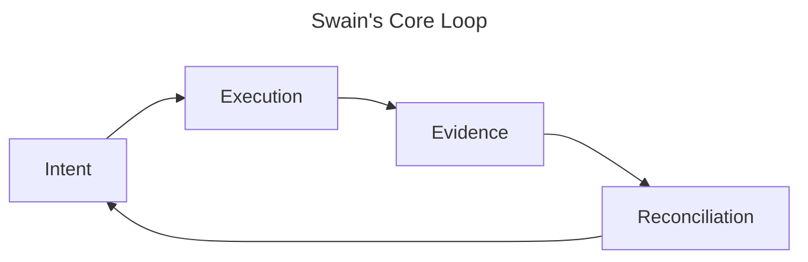

I spent 730 commits and 14 days building [swain](https://github.com/cristoslc/swain), a system for keeping AI agents aligned with what I'd decided. The [core loop](../01-why-swain-exists/) is still right. The enforcement mechanism was wrong.

## You Can't Steer With Specs

The hypothesis seemed sound: agents forget what you decided between sessions, so capture those decisions as artifacts. I built ten artifact types, a dependency graph, a roadmap renderer with Eisenhower quadrants and Gantt charts — all for the intent half of the loop. I automated reconciliation too: a retro skill that gathered session context, synthesized what happened, and classified learnings into new specs and ADRs.

Agents went off the rails anyway.

The [VISION-006 session retro](https://github.com/cristoslc/swain/blob/trunk/docs/swain-retro/2026-04-07-vision-006-full-session-retro.md) is the clearest example. In one session, the architecture shifted three times:

1. **Ports & adapters → plugins.** The initial design assumed adapters would be core contributions. A few iterations in, I realized this would block community extensions and pivoted to a plugin model.

2. **In-process → subprocess.** The agent implemented adapters as in-process Python classes. We had a documented architectural decision saying plugins must run as subprocesses. The agent's code worked. It passed tests. It was structurally wrong, and only my review caught it.

3. **tmux scraping → HTTP API.** The agent built a tmux adapter that worked but was fragile. I asked why sessions weren't showing up in `tmux ls`. Turns out `opencode run` is single-shot — we needed `opencode serve`, a completely different architecture.

The hierarchy was supposed to *tell* agents what to build. Telling didn't work. From the [retro](https://github.com/cristoslc/swain/blob/trunk/docs/swain-retro/2026-04-07-vision-006-full-session-retro.md):

> "The first half was spent debugging live... The operator said 'stop. reset. TDD from architectural plan.' After that, tests drove every change. Every pivot was validated before going live. **The live debugging wasted 60+ minutes; the TDD approach wasted zero.**"

This wasn't a one-off. Across the project I kept finding the same failure modes:

- Code that was tested in isolation but never wired into the system — three separate incidents ([1](https://github.com/cristoslc/swain/blob/trunk/docs/swain-retro/2026-03-28-release-skill-deletion-incident.md), [2](https://github.com/cristoslc/swain/blob/trunk/docs/swain-retro/2026-03-31-dead-code-in-release.md), [3](https://github.com/cristoslc/swain/blob/trunk/docs/swain-retro/2026-04-01-teardown-rewrite-release.md)).
- Stale state files that referenced worktrees I'd already deleted.
- Agents that linked new artifacts to their dependencies but never went back to update the things they depended on.

The [overnight artifact sweep](https://github.com/cristoslc/swain/blob/trunk/docs/swain-retro/2026-03-22-overnight-autonomous-artifact-sweep.md) was the one that really got me: 9 specs, already fully implemented, still marked Active. The code existed. The features worked. Nobody — human or agent — had gone back to update the spec.

And the retro skill caught all of it. Every session, it would synthesize the drift, surface candidates for new specs and ADRs. I'd tell swain to integrate them and move on. But the output of reconciliation was always more intent: new specs, updated ADRs, revised constraints. The next session's agent would read those artifacts, and drift again. The retro would catch that too, produce more specs, and the cycle would repeat. Automated, fast, and never catching up — because the whole system was a spec-production loop, and the steering mechanism was always one session behind the thing it was trying to steer.

## Tests Run During, Not After

Halfway through that VISION-006 session, I stopped debugging live and told the agent to write tests first. The dynamic changed completely. The agent wrote the tests, then wrote code until the tests passed. I wasn't reviewing code anymore — I was reviewing tests. If a test described the wrong behavior, I'd say so and the agent would rewrite it. Everything else happened in the TDD loop without me.

This held across every model I used. Opus 4.6, Sonnet 4.6, Qwen3.5:397b, Gemma 4:31b — without tests they all drifted, with tests they all converged. The model didn't matter.

But TDD only got me partway there. The in-process adapter implementation had tests and passed them all. It was still architecturally wrong — the tests checked behavior, not structure. I caught that violation myself. TDD kept the code functionally correct; whether it respected the boundaries I'd designed was still on me.

## More Tests, Not More Specs

TDD worked, but only at the behavioral layer. The 80-test suite caught regressions and kept agents converging on functional requirements. Architectural compliance was still me. I was the fitness function, reviewing whether agents respected subprocess boundaries and plugin isolation. When I caught a violation, I'd write it into an ADR. Another spec.

Swain's first iteration asked: what if we had more kinds of *artifacts* to steer agents? Ten types, a dependency graph, automated retros feeding back into the system. The answer was clear — more specs weren't enough.

The next iteration asks the opposite question: what if we had more kinds of *tests*? Not just unit and integration tests for behavior, but fitness functions for architecture, boundary tests for isolation, protocol tests for communication contracts. Every constraint I wrote into an ADR and hoped agents would read — encode it as a test that runs during execution and fails on violation.

Swain v1 built a spec factory. Swain v2 needs a test factory.

Coming up in this series: how different kinds of tests map to different kinds of drift, what a minimum viable test suite looks like for a real project, and whether specs can be generated from evidence instead of written up front.

If you're building with agents and have your own hard-won lessons, I'm at [@cristoslc](https://github.com/cristoslc). The [swain codebase](https://github.com/cristoslc/swain) is public — retros in `docs/swain-retro/`, tests in `spec/`.
