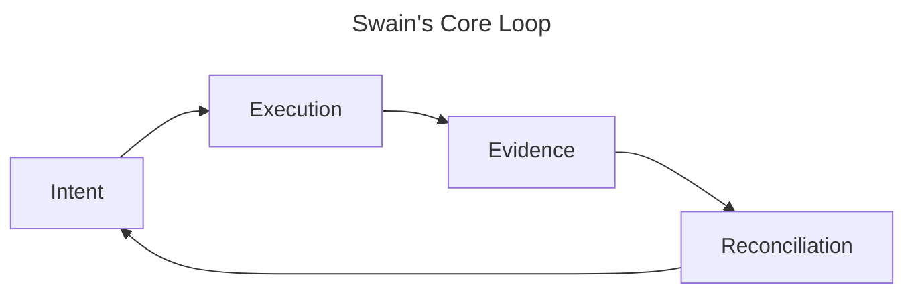

I spent 730 commits and 14 days building [swain](https://github.com/cristoslc/swain), a system for keeping AI agents aligned with what I'd decided. The [core loop](../01-why-swain-exists/) is still right. The enforcement mechanism was wrong.


```mermaid
---
title: Swain's Core Loop
---
flowchart LR
    intent["Intent"] --> execution["Execution"]
    execution --> evidence["Evidence"]
    evidence --> reconciliation["Reconciliation"]
    reconciliation --> intent

    intent ~~~ evidence
    execution ~~~ reconciliation
```


## My Hypothesis

I started from a clear hypothesis: **specs steer humans, tests constrain agents.** Write the spec to clarify your own thinking. Encode the constraints as tests that agents can run during execution. The spec gives context; the tests give enforcement.

The evidence was strong. The [VISION-006 session](https://github.com/cristoslc/swain/blob/trunk/docs/swain-retro/2026-04-07-vision-006-full-session-retro.md) was the clearest example. In one session, the architecture shifted three times:

1. **Ports & adapters → plugins.** The initial design assumed adapters would be core contributions. Mid-implementation, I realized this would block community extensions. I pivoted to plugins before the agent wrote any code.

2. **In-process → subprocess.** The agent implemented adapters as in-process Python classes. This violated [ADR-038](https://github.com/cristoslc/swain/blob/trunk/docs/adr/Active/(ADR-038)-Microkernel-Plugin-Architecture/(ADR-038)-Microkernel-Plugin-Architecture.md). The code worked. The tests passed. It was architecturally wrong, and only my review caught it.

3. **tmux scraping → HTTP API.** The agent built a tmux adapter that worked but was fragile. I asked why sessions weren't visible in `tmux ls`. The answer revealed a completely different architecture was needed.

Midway through that session, I stopped debugging live and told the agent to write tests first. The [retro](https://github.com/cristoslc/swain/blob/trunk/docs/swain-retro/2026-04-07-vision-006-full-session-retro.md) is blunt:

> "The first half was spent debugging live... The operator said 'stop. reset. TDD from architectural plan.' After that, tests drove every change. Every pivot was validated before going live. **The live debugging wasted 60+ minutes; the TDD approach wasted zero.**"

This held across every model I used. Opus 4.6, Sonnet 4.6, Qwen3.5:397b, Gemma 4:31b — without tests they all drifted, with tests they all converged. The model didn't matter.

But TDD only got me partway there. The in-process adapter passed all its behavioral tests and was still architecturally wrong. I was the fitness function — reviewing whether agents respected the boundaries I'd designed. When I caught a violation, I'd write it into an ADR. Another spec.

My plan for the next iteration was clear: **build more kinds of tests.** Not just unit and integration tests for behavior, but fitness functions for architecture, boundary tests for isolation, protocol tests for communication contracts. Every constraint I wrote into an ADR and hoped agents would read — encode it as a test that runs during execution and fails on violation. Swain v1 built a spec factory. Swain v2 would build a test factory.


## What I Got Right

Before I explain what changed, three things the hypothesis got right:

**Tests do constrain agents.** The 80-test bats-core suite caught regressions and kept agents converging on functional requirements across every model. This part is solid. If you take one thing from this post, it's that TDD works for agents. Write the test, let the agent make it pass. It works.

**Specs do steer humans.** I still write specs. I still write ADRs. They clarify my thinking, capture product decisions, and document architecture. They serve the operator, not the agent. The [core loop](../01-why-swain-exists/) is correct: Intent → Execution → Evidence → Reconciliation.

**Architectural tests are the missing layer.** Fitness functions — tests that verify architectural constraints, not just behavioral correctness — are real and necessary. ADR-038 said "plugins must run as subprocesses." A behavioral test doesn't catch a violation of that. A fitness function that checks whether `import plugin_module` appears in the host code does.


## What the Research Changed

My plan was to encode every ADR as a fitness function, add BDD traceability from specs to test code, and wire automated test gates into the merge pipeline. BDD, TDD, fitness functions, smoke tests — I had six kinds of testing in mind.

Then I did what I should have done from the start: I surveyed the testing landscape beyond what I already knew. Twenty practices, from the well-known (TDD, BDD, integration testing) to the ones that don't even have "test" in the name (synthetic transactions, chaos engineering, architecture fitness functions, exploratory testing, canary deployment). The full research is in a [public trove](https://github.com/cristoslc/swain/tree/trunk/docs/troves/testing-practices-beyond-unit) if you want the deep references.

The survey changed three things about my plan.


## Change 1: Verification and Exploration Are Different Practices

I was planning to build a verification factory. Verification confirms known requirements are met: TDD, BDD, contract testing, smoke tests, mutation testing, compliance testing. All useful. All about checking that reality matches what you wrote down.

What I was missing is exploration. **Exploration discovers problems that no spec covers.**

Brian Marick's testing quadrants make the split precise. Two axes: business-facing vs. technology-facing, and supporting the team vs. critiquing the product.

| | Supporting the Team | Critiquing the Product |
|---|---|---|
| **Business-facing** | Acceptance tests, specification by example | Exploratory testing, usability testing |
| **Technology-facing** | Unit tests, contract tests | Performance testing, chaos engineering |

The left column confirms what you already know. The right column discovers what you don't. My plan covered the left column. The right column — exploratory testing, chaos engineering, observability-driven testing — was entirely absent.

This matters because the VISION-006 failures were not all verification failures. The in-process adapter was a verification failure — ADR-038 said subprocess, the code said in-process, a fitness function would have caught it. But the tmux adapter was an exploration failure. No spec said "the adapter must use an HTTP API." I discovered that requirement when I asked why `tmux ls` showed nothing. The problem was that **the spec was missing an edge case**, not that the implementation violated the spec.

My verification loop — discover existing tests, write new tests, run them, loop — can confirm that known requirements are met. It cannot discover unknown edge cases. For that, you need exploration: structured sessions with charters that probe for what nobody thought to specify.

So the loop gains a phase. Not replacing verification, but after it:

```
Intent → Execution → Evidence → Verification → Exploration → Reconciliation
```

Verification asks: "does the evidence match the intent?" Exploration asks: "what problems exist that no intent covers?"


## Change 2: BDD Traceability Is Probably Not Worth the Overhead

My plan included a seven-spec chain for BDD traceability: Gherkin notation in specs, `@bdd:` markers in test code, a JSON contract for test results, evidence sidecars with symlinks, staleness detection, and a verification command. Full traceability from acceptance criteria to test code to test results.

The research gave me a reason to be skeptical. Justin Searls, endorsed by Martin Fowler, puts it plainly: "People love debating what percentage of which type of tests to write, but it's a distraction. Nearly zero teams write expressive tests that establish clear boundaries, run quickly and reliably, and only fail for useful reasons. Focus on that instead."

Gojko Adzic's Specification by Example work confirms that the *examples* are the value, not the traceability scaffolding. The concrete scenarios that clarify intent are worth writing. The chain of tags, contracts, and sidecars that links them to test code is infrastructure, and it's expensive infrastructure for a solo developer with 101 tests across 20 files.

The deeper issue is that BDD's Given/When/Then syntax is designed for the Three Amigos practice — product owner, developer, and tester collaborating on examples. In a solo-developer-plus-AI-agent context, there is no Three Amigos workshop. The operator is the sole stakeholder, and agents read SPEC acceptance criteria directly. The Gherkin layer is a translation step between two audiences that are the same person.

Swain has ~101 tests. The maintenance cost of a seven-spec traceability chain would exceed its discovery value for the foreseeable future. I cut it to three specs: acceptance criteria as verification targets (no new syntax needed), evidence sidecars (simplified recording, no `@bdd:` markers), and staleness detection.


## Change 3: The Loop Needs Adaptive Convergence, Not a Fixed Limit

My plan had a fixed loop limit: 5 consecutive failures, then escalate. Simple, predictable, easy to explain.

Property-based testing and chaos engineering both demonstrate a better pattern. Property-based testing shrinks failing cases to the minimal reproducing input. It doesn't just count failures — it tracks whether failures are getting smaller. Chaos engineering's steady-state hypothesis checks whether the system is improving, not just whether it's failing.

A fixed limit of 5 doesn't distinguish between:
- 5 different failures (the agent is trying different things and progressing)
- 5 identical failures (the agent is stuck in a loop)
- 5 failures that are getting smaller each time (the agent is converging on a fix)

I replaced the fixed limit with adaptive convergence tracking. The loop now tracks which tests fail in each cycle and compares against the previous cycle. If the failure set is identical (stuck), it escalates. If the failure set is shrinking (converging), it continues. If the failure set is growing (regressing), it escalates immediately. A full pass resets everything.

This is a smaller change than the first two, but it reflects a principle that the research made clear: **verification metrics should measure convergence, not just pass/fail counts.** Mutation testing takes this further — it measures whether your test suite catches bugs at all, not just whether the tests pass. But that's a topic for the next post in this series.


## What Stayed the Same

The core thesis survived. Tests do constrain agents. Fitness functions are the missing layer. The spec factory was the wrong priority.

What changed is the vocabulary. "More kinds of tests" was the right direction, but the testing landscape is larger and stranger than I assumed. Verification is necessary but insufficient. BDD traceability at the level I planned is probably over-engineered for a solo developer. And a test loop that counts failures without measuring convergence is leaving information on the table.

The next post in this series picks up where this one leaves off: when a test fails, which space drifted — problem, solution, or intent? And how do the different kinds of tests illuminate different kinds of drift?

If you're building with agents and have your own hard-won lessons, I'm at [@cristoslc](https://github.com/cristoslc). The [swain codebase](https://github.com/cristoslc/swain) is public — retros in `docs/swain-retro/`, tests in `spec/`, and the full [testing practices research trove](https://github.com/cristoslc/swain/tree/trunk/docs/troves/testing-practices-beyond-unit) is there too.