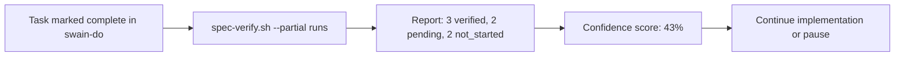

# Verification Model Reform

## Design Intent

**Context:** Swain verifies at one point — completion — with one strength — full evidence table. This means AI-generated bugs compound throughout implementation, and trivial changes carry the same verification burden as complex ones.

### Goals

- Move verification from a single gate to continuous checkpoints during implementation.
- Scale review gate strength with diff size — large AI-generated diffs get mandatory review, small changes get lighter verification.
- Give Builders mid-flight confidence that acceptance criteria are being met as work progresses.
- Give Shippers proportional evidence requirements — less for trivial changes, not none.

### Constraints

- Verification must remain evidence-based. Removing the verification table is not an option; simplifying it for low-risk work is.
- The line threshold for mandatory review must be configurable per repo (default: 500 lines added).
- Partial verification must not create a false sense of completeness — unverified criteria must be visible.
- swain-do task completion logic is the integration point, not a new parallel system.

### Non-goals

- Removing the Needs Manual Test phase entirely (it stays for complex SPECs).
- Automated CI integration (tracked in DESIGN-0028).
- Changing ADR compliance checking (already works).
- Making all verification optional (low-complexity SPECs get lighter verification, not none).

## Interface Surface

Verification model reform adds two interfaces: incremental verification during task completion, and proportional review gate strength.

## Contract Definition

### Incremental Verification — `spec-verify.sh --partial`

**Input:** SPEC file path, task ID (optional — scopes to completed tasks).
**Output:** Partial verification report showing per-criterion status.
**Exit code:** 0 always (partial check is informational).

**Criterion status values:**
- `verified` — Evidence exists and passes check.
- `pending` — Implementation exists, evidence not yet provided.
- `not_started` — No implementation or evidence for this criterion.

### Proportional Review Gate

**Input:** Git diff stats for a SPEC (lines added, lines removed, files changed).
**Output:** Review requirement determination.
**Threshold:** Configurable `review_threshold_lines` (default: 500 lines added).

| Diff size | Gate strength | Verification required |
|-----------|---------------|-----------------------|
| < threshold, fast-path SPEC | Light | Simplified verification table (summary, not per-criterion) |
| < threshold, normal SPEC | Standard | Full verification table |
| >= threshold, any SPEC | Mandatory | Full verification table + code review |

## Behavioral Guarantees

- `spec-verify.sh --partial` never fails a build — it's informational.
- Confidence score is `verified / total` criteria, displayed alongside task progress.
- Proportional review does not reduce verification coverage — it adjusts the evidence format for low-risk work.
- Mandatory review for large diffs cannot be overridden by fast-path designation.

## Integration Patterns

- `spec-verify.sh --partial` is called automatically by swain-do when a task is marked complete.
- Proportional review gate is checked during `Needs Manual Test → Complete` transition.
- Confidence score integrates into `swain-do` progress display and `chart.sh ready` lens.

## Evolution Rules

- Threshold values are repo-level configuration, not hardcoded.
- New criterion status values may be added (e.g., `blocked`) but `verified`, `pending`, `not_started` are stable.
- The simplified verification format for low-risk work may evolve but must always include a human-readable summary.

## Edge Cases and Error States

- **All criteria `not_started`:** Confidence score is 0%. SPEC is correctly in `In Progress` with no verification attempted.
- **SPEC with no acceptance criteria:** `spec-verify.sh --partial` reports "No criteria to verify" and exits 0.
- **Large diff from a fast-path SPEC:** Mandatory review still applies. Fast-path skips alignment/specwatch, not verification quality.
- **Task completed but criteria not linked:** `spec-verify.sh --partial` reports all criteria as `not_started` since no task claims to satisfy them.

## Design Decisions

1. **Confidence scores, not pass/fail.** A 43% verified state is more useful than a binary "not done yet." It tells the Builder where to focus review attention and tells the Shipper whether they're on track.
2. **Proportional strength, not optional verification.** The Shipper's pain is "filling out evidence forms for a one-line change," not "verification itself." Simplified verification for low-risk work addresses this without removing the gate.
3. **Mandatory review at scale.** The Builder's pain is "reviewing 2000 lines of AI-generated code with no signal about what to focus on." A line threshold triggers mandatory review for exactly this case.
4. **Integration via swain-do, not a new system.** Incremental verification plugs into the existing task completion flow, not into a parallel verification pipeline.

## Assets

_Index of supporting files to be added during implementation._

## Lifecycle

| Phase | Date | Commit | Notes |
|-------|------|--------|-------|
| Proposed | 2026-04-18 | — | Created from Builder/Shipper persona evaluation |
| Abandoned | 2026-04-18 | — | Redundant with INITIATIVE-022 automated verification loop |