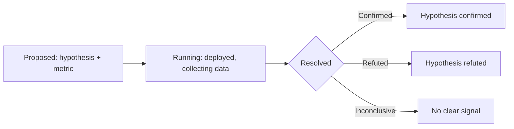

# Build-Measure-Learn Support

## Design Intent

**Context:** Swain's artifact model assumes you know what to build before you build it. Shippers often don't — they deploy to learn. Experiments and retroactive specs need first-class support.

### Goals

- Support a lifecycle that starts deployed, not planned — track hypotheses and outcomes, not just implementation tasks.
- Allow retroactive spec creation that backfills the artifact graph for work already done.
- Link implementation evidence to measured product outcomes, not just to test results.
- Enable the Shipper's build-measure-learn loop as a native workflow, not a workaround.

### Constraints

- EXPERIMENT must not duplicate SPIKE's purpose. SPIKE investigates a question before building; EXPERIMENT measures an outcome after deploying.
- Retroactive specs must produce valid artifact graph entries (indexes, lifecycle tables, frontmatter).
- Outcome fields must be optional — not every feature has measurable impact.
- CI/deployment hooks must be pluggable, not coupled to specific platforms.

### Non-goals

- Running A/B tests or analytics (Swain tracks the experiment, external tools measure it).
- Replacing SPEC with EXPERIMENT for planned work (SPEC remains the primary implementation artifact).
- Building a dashboard — outcomes surface in `chart.sh`.
- Changing the verification gate model (DESIGN-0027).

## Interface Surface

Three new interfaces: an EXPERIMENT artifact lifecycle, retroactive SPEC creation, and CI/deployment hooks in swain-sync and swain-release.

## Contract Definition

### EXPERIMENT Artifact

**Lifecycle:** `Proposed → Running → Resolved` (no In Progress or Needs Manual Test — the experiment is deployed before it's tracked).

**Frontmatter fields:**
- `hypothesis:` — What we expect to happen (required)
- `success-metric:` — How we measure success (required)
- `resolution:` — Confirmed, Refuted, or Inconclusive (set on resolution)
- `outcome-data:` — Links to metrics, dashboards, or raw data (optional)

### Retroactive SPEC Creation

**Command:** `swain-design create SPEC --retroactive [--since <commit>]`

**Behavior:**
1. Scan git log for commits since the specified ref (default: last 7 days).
2. Generate a SPEC describing what was built, with acceptance criteria derived from test evidence.
3. Place directly in `Complete` with verification table backfilled from passing tests.
4. Create proper index entries and lifecycle table.

### Product Outcome Tracking on SPECs

**New frontmatter field:**
- `outcome:` — Link to measured impact (optional). Values: free text linking to metrics, dashboards, or experiment IDs.

### CI/Deployment Hooks

**Integration points:**
- `swain-sync` post-push: configurable command that runs after successful push.
- `swain-release` post-tag: configurable command that runs after successful tag.

**Configuration:** `.swain/hooks.yaml` (or similar) with named hook entries.

## Behavioral Guarantees

- EXPERIMENT artifacts never pass through `In Progress` or `Needs Manual Test` — they start deployed.
- Retroactive SPEC creation never creates duplicate artifacts for the same commit range.
- CI hooks are best-effort — failure in the hook does not block the sync or release.
- Outcome fields on SPECs are advisory — they don't affect phase transitions.

## Integration Patterns

- EXPERIMENT integrates with `chart.sh` via a new `experiments` lens showing running and resolved experiments.
- Retroactive SPEC creation integrates with `swain-design create` as a flag, not a separate command.
- CI hooks integrate with `swain-sync` and `swain-release` as post-operation callbacks.
- EXPERIMENT resolution can be linked to SPECs (the feature built to test the hypothesis).

## Evolution Rules

- EXPERIMENT resolution types are stable: Confirmed, Refuted, Inconclusive. New types require a design decision.
- CI hook configuration must support both local scripts and remote webhook calls.
- Outcome data format must support plain text, URLs, and artifact references (e.g., `EXPERIMENT-003`).

## Edge Cases and Error States

- **EXPERIMENT that never gets deployed:** Stays in `Proposed` indefinitely. Same staleness detection as other artifacts.
- **EXPERIMENT with no clear resolution:** User can set `resolution: Inconclusive` and add notes about why.
- **Retroactive SPEC for commits with no tests:** Verification table shows manual evidence. Cannot auto-backfill without test evidence.
- **CI hook timeout:** Swain logs the timeout and continues. Hooks are fire-and-forget, not blocking.
- **Multiple EXPERIMENTs for the same feature:** Permitted — different hypotheses can be tested against the same feature.

## Design Decisions

1. **EXPERIMENT is a separate artifact type, not a SPEC variant.** Different lifecycle (deployed-first), different evidence model (outcomes, not test results), different resolution states (Confirmed/Refuted/Inconclusive). Shoe-horning it into SPEC would distort both.
2. **SPIKE investigates before; EXPERIMENT measures after.** SPIKE's question is "Should we use X?" EXPERIMENT's question is "Did X work?" The entry points on the timeline are opposite. This distinction is worth preserving in the type system.
3. **Retroactive specs start Complete.** There's no value in running Proposed → Active → Complete for work that's already done. The lifecycle table records the retroactive path.
4. **CI hooks are pluggable callbacks, not platform integrations.** Swain doesn't reinvent CI/CD. It provides hooks that teams can connect to their existing infrastructure.
5. **Outcome tracking is optional.** Not every feature has measurable impact. Making it mandatory would add ceremony without evidence.

## Assets

_Index of supporting files to be added during implementation._

## Lifecycle

| Phase | Date | Commit | Notes |
|-------|------|--------|-------|
| Proposed | 2026-04-18 | — | Created from Builder/Shipper persona evaluation |
| Abandoned | 2026-04-18 | — | Decomposed: retroactive SPEC creation to own EPIC, CI hooks into I22 teardown, EXPERIMENT to spike |