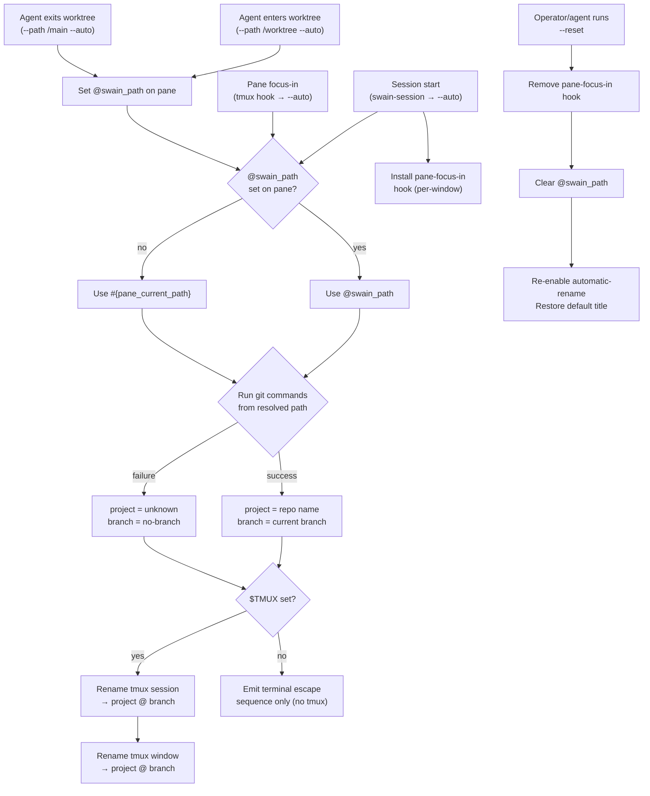

# Tmux Session Naming Flows

## Interaction Surface

The tmux status bar — specifically the **session name** (left side) and **window name** (tab label). These are the operator's primary at-a-glance indicators for which project and branch they're working in.

The naming pipeline is a single script (`swain-tab-name.sh`) invoked from three distinct trigger points, each with different constraints on how git context is resolved.

## Actors

- **Operator** — the human using tmux, switching panes/windows/sessions
- **TUI Agent** — Claude Code, opencode, gemini cli, codex, copilot — a long-running process in a tmux pane that doesn't change the pane's tracked CWD
- **Shell Pane** — an interactive shell where `cd` updates `#{pane_current_path}`
- **tmux** — the multiplexer; provides hooks, pane options, display-message

## State Model

Each tmux pane has two relevant pieces of state:

| State | Source | Mutability |
|-------|--------|------------|
| `#{pane_current_path}` | Set by the shell process in the pane | Only changes when the pane's foreground process calls `chdir()` — TUI agents don't do this |
| `@swain_path` | Per-pane tmux user option | Set explicitly by `swain-tab-name.sh --path` |

**Resolution priority** when the naming script needs a path:

```
@swain_path (if set on pane) → #{pane_current_path} (fallback)
```

From the resolved path, git context is derived:
- **Project name:** `basename $(git --git-common-dir)/..` (handles worktrees correctly)
- **Branch name:** `git rev-parse --abbrev-ref HEAD`
- **Format:** `{project} @ {branch}` (configurable via `terminal.tabNameFormat`)

## User Flows



### Flow 1: Session Start

**Trigger:** Agent reads AGENTS.md, invokes swain-session, which calls `swain-tab-name.sh --auto`.

```
Agent starts in tmux pane
  │
  ▼
swain-tab-name.sh --auto
  │
  ├─ Resolve path: @swain_path (unset) → pwd (agent launch dir)
  ├─ Resolve git: project=swain, branch=main
  ├─ Rename session → "swain @ main"
  ├─ Rename window → "swain @ main"
  ├─ Set @swain_path on this pane → /path/to/swain
  └─ Install pane-focus-in hook (per-window)
```

**What operator sees:** Session tab changes from default name to "swain @ main".

### Flow 2: Operator Switches Between Shell Panes

**Trigger:** Operator focuses a different pane that has a shell `cd`'d into a worktree.

```
Operator presses Ctrl-B + arrow (or clicks pane)
  │
  ▼
tmux fires pane-focus-in hook
  │
  ▼
swain-tab-name.sh --auto (via run-shell)
  │
  ├─ Resolve path: @swain_path (unset on shell pane) → #{pane_current_path}
  │  e.g., /Users/cristos/Documents/code/swain/.worktrees/copper-meadow-lantern
  ├─ Resolve git: project=swain, branch=copper-meadow-lantern
  ├─ Rename session → "swain @ copper-meadow-lantern"
  └─ Rename window → "swain @ copper-meadow-lantern"
```

**What operator sees:** Session and window names update instantly on pane switch.

### Flow 3: Operator Switches Back to Agent Pane (After Worktree Entry)

**Trigger:** Operator refocuses a pane running a TUI agent that previously entered a worktree.

```
Operator focuses agent pane
  │
  ▼
tmux fires pane-focus-in hook
  │
  ▼
swain-tab-name.sh --auto (via run-shell)
  │
  ├─ Resolve path: @swain_path = /path/to/worktree (set by prior --path call)
  ├─ Resolve git: project=swain, branch=feature-xyz
  ├─ Rename session → "swain @ feature-xyz"
  └─ Rename window → "swain @ feature-xyz"
```

**What operator sees:** Names reflect the agent's actual working context, not its stale launch CWD.

### Flow 4: Agent Enters a Worktree

**Trigger:** Agent (any agent that reads AGENTS.md) enters a worktree and calls the naming script.

```
Agent enters worktree at /path/to/worktree
  │
  ▼
Agent runs: swain-tab-name.sh --path /path/to/worktree --auto
  │
  ├─ Set @swain_path on this pane → /path/to/worktree
  ├─ Resolve git from /path/to/worktree: project=swain, branch=feature-xyz
  ├─ Rename session → "swain @ feature-xyz"
  └─ Rename window → "swain @ feature-xyz"
```

**What operator sees:** Names update immediately when the agent enters the worktree.

### Flow 5: Agent Exits a Worktree

**Trigger:** Agent returns to the main repo.

```
Agent exits worktree, returns to /path/to/swain
  │
  ▼
Agent runs: swain-tab-name.sh --path /path/to/swain --auto
  │
  ├─ Set @swain_path on this pane → /path/to/swain
  ├─ Resolve git from /path/to/swain: project=swain, branch=main
  ├─ Rename session → "swain @ main"
  └─ Rename window → "swain @ main"
```

### Flow 6: Operator Switches Between Tmux Sessions

**Trigger:** Operator switches from the swain session to the HouseOps session.

```
Operator presses Ctrl-B + s (session list) or Ctrl-B + )
  │
  ▼
tmux switches session
  │
  ▼
pane-focus-in hook fires in the NEW session's active pane
  │
  ├─ IF that session has the hook installed: names update per that pane's context
  └─ IF not: no change (hook is per-window, not global)
```

**What operator sees:** Each session maintains its own naming. Switching sessions shows that session's context.

### Flow 7: Reset / Cleanup

**Trigger:** Operator or agent runs `swain-tab-name.sh --reset`.

```
swain-tab-name.sh --reset
  │
  ├─ Remove per-window pane-focus-in hook
  ├─ Clear @swain_path on current pane
  ├─ Re-enable automatic-rename
  └─ Restore default terminal title
```

## Edge Cases and Error States

| Scenario | Behavior |
|----------|----------|
| Pane CWD is not a git repo, no `@swain_path` | Title → `unknown @ no-branch`, exit 0 |
| `jq` not installed | Settings lookup fails gracefully, uses default format `{project} @ {branch}` |
| `git` not installed | project=unknown, branch=no-branch |
| Not in tmux (`$TMUX` unset) | Skip all tmux commands, emit escape sequences for direct terminal only if stdout is a tty |
| Agent runs `--path` pointing to a deleted worktree | git commands fail, title → `unknown @ no-branch` |
| Multiple agents in the same pane (unlikely) | Last `--path` wins — `@swain_path` is overwritten |
| Hook script path changes (e.g., skill update) | Next `--auto` call reinstalls hook with new path |
| `--auto` called twice on same window | Hook replaced idempotently (tmux `set-hook -w` overwrites) |

## Design Decisions

1. **Per-window hook, not global.** Global hooks affect all sessions — the operator may have tmux sessions for other projects with their own naming conventions. Per-window scoping keeps each project isolated.

2. **`@swain_path` as the bridging mechanism.** Alternatives considered:
   - *Shell `PROMPT_COMMAND`/`precmd`*: only works in shell panes, not TUI agents.
   - *Agent-specific hooks (Claude Code `WorktreeCreate`)*: not agent-agnostic.
   - *Periodic polling*: wasteful and adds latency.
   - *Storing path in a file*: race-prone across panes, no per-pane isolation.
   `@swain_path` is built into tmux, per-pane, instant, and readable from hooks.

3. **`--git-common-dir` for project name.** `--show-toplevel` returns the worktree root, which has a misleading basename. `--git-common-dir` returns the shared `.git` directory, whose parent is always the real repo root.

4. **`set +e` instead of `set -e`.** Session naming is a convenience. Any git/tmux failure should degrade gracefully, not kill the script and leave the operator with a broken hook.

5. **Session AND window renamed together.** The operator's mental model is "I'm in project X on branch Y." Both the session label and the window tab should say the same thing. If a future need arises for different formats (e.g., session = project only), the `tabNameFormat` setting can be extended.

## Assets

None — this design is text-only. The interaction surface is the tmux status bar, which is plain text.

## Lifecycle

| Phase | Date | Commit | Notes |
|-------|------|--------|-------|
| Active | 2026-03-16 | | Initial creation — covers all 7 workflow permutations |
