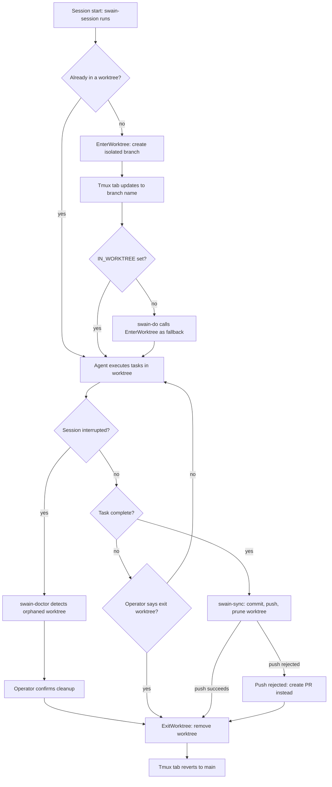

# Worktree Lifecycle UX

## Interaction Surface

The full enter → work → exit worktree lifecycle as experienced by the operator (watching the agent work) and the agent (executing skills). Covers the gap identified in the 2026-03-18 audit where `EnterWorktree` is used but `ExitWorktree` has no guidance.

## User Flow

### Operator's perspective

1. **Session start** — Agent runs swain-session. If on main worktree, agent enters a worktree via `EnterWorktree`. Tmux tab name updates to reflect the worktree branch.
2. **Working** — Agent executes tasks in the worktree. All file operations, test runs, and commits happen in the isolated context. Operator sees the branch name in their tmux tab.
3. **Task complete** — Agent finishes implementation. Runs swain-sync which commits, pushes to main, and prunes the worktree. Tab name reverts to main.
4. **Interrupted** — If the agent crashes or the session ends mid-work, swain-doctor detects the orphaned worktree at next session start and offers cleanup.

### Agent's perspective

1. **Entry decision** — swain-session Step 1.5 detects main worktree and calls `EnterWorktree`. If already in a worktree (e.g., dispatched agent), skip.
2. **Isolation confirmation** — swain-do's worktree preamble checks `IN_WORKTREE` before implementation. If still on main (session skipped entry), swain-do calls `EnterWorktree` as fallback.
3. **Working** — All skill invocations use `$REPO_ROOT` or `find`-based discovery to resolve paths correctly from the worktree.
4. **Exit triggers:**
   - swain-sync pushes and prunes → agent is back on main
   - All tasks in a plan complete → swain-do signals completion
   - Operator says "exit worktree" or "back to main" → agent calls `ExitWorktree`
5. **Cleanup** — `ExitWorktree` removes the worktree. Tab name reverts.

## Screen States

### Tmux tab states

| State | Tab name | Indicator |
|-------|----------|-----------|
| Main checkout | `swain @ main` | Default |
| In worktree | `swain @ feature-xyz` | Branch name changes |
| Worktree cleanup | `swain @ main` | Reverts after push |
| Orphaned worktree | `swain @ main` + doctor warning | Session start detection |

## Edge Cases and Error States

1. **Operator intends to work on main directly** — Step 1.5 auto-enters a worktree. Operator can say "exit worktree" or "I want to work on main." The agent calls `ExitWorktree` and proceeds without isolation. This should not be a hard gate.

2. **Multiple worktrees active** — When dispatching parallel agents, each gets its own worktree via the Agent tool's `isolation: "worktree"` parameter. The main session's worktree is independent.

3. **Worktree already exists for branch** — `EnterWorktree` creates a new branch. If the operator wants to resume a specific branch, they should use `git worktree add` manually or tell the agent which branch.

4. **Push rejected from worktree** — swain-sync handles this by creating a PR instead. The worktree is still cleaned up.

5. **Agent crashes mid-worktree** — swain-doctor's stale worktree detection catches this. Advisory warning, operator confirms cleanup.

## Design Decisions

1. **Auto-enter at session start, not just at dispatch** — EPIC-015 established that agents should never implement in the main worktree. Starting isolation early (session start) rather than late (task dispatch) prevents accidental main-worktree commits during exploratory work.

2. **`EnterWorktree` over manual `git worktree add`** — The built-in tool is the only mechanism that changes the agent's actual CWD. Manual git commands run in subshells and don't persist.

3. **swain-sync handles exit, not ExitWorktree** — The normal exit path is push → prune via swain-sync. `ExitWorktree` is for abnormal exits (operator cancels, switches context). This keeps the happy path simple.

4. **Graceful degradation** — If `EnterWorktree` fails, the session continues without isolation. swain-do will attempt again at dispatch. If both fail, the agent warns and proceeds — isolation is important but not a hard gate for all work.

## Assets

No wireframes — this is a CLI/terminal interaction design. The tmux tab name states above serve as the visual indicator.

## Lifecycle

| Phase | Date | Commit | Notes |
|-------|------|--------|-------|
| Active | 2026-03-18 | — | Documents the worktree lifecycle gap found in the 2026-03-18 skill audit |
