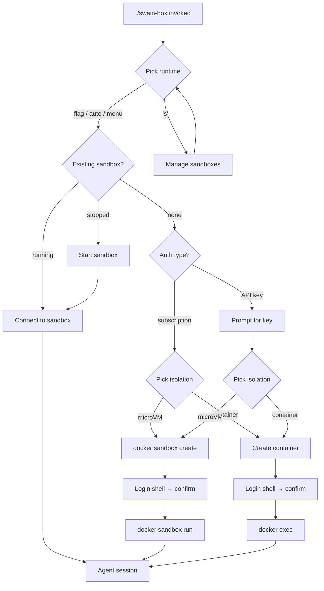

# swain-box Launcher UX

## Interaction Surface

The terminal UX for `./swain-box` from invocation to agent session. Covers: runtime selection, isolation mode selection with known-issues annotations, first-run auth setup (subscription login vs API key), container reconnect, per-runtime prompt injection, and cleanup. This is a CLI-only surface — no GUI, no TUI library.

## User Flow



**Key design principles:**

1. **One sandbox per runtime.** Each runtime gets at most one sandbox (container or microVM). Selecting a runtime that already has a sandbox connects to it immediately — no auth or isolation menus.

2. **Auth before isolation (first run only).** Auth type is chosen *before* isolation because the auth choice influences which isolation modes are viable. For example, Claude + subscription → microVM is broken (MITM proxy breaks OAuth), so the isolation menu annotates accordingly. Claude + API key → microVM works fine. This only applies when creating a new sandbox.

### Happy path: first run (Claude, subscription)

```
$ ./swain-box
swain-box: Select a runtime:
  1) claude
  2) copilot
  3) codex
  4) gemini
  5) kiro
  6) opencode

  s) Manage sandboxes  q) Quit
Choice [1]: 1
swain-box: using claude.

swain-box: How do you authenticate?
  1) Subscription (login inside sandbox)
  2) API key (ANTHROPIC_API_KEY)

  b) Back  q) Quit
Choice [1]: 1

swain-box: Select isolation for claude (subscription):
  1) Docker Sandboxes (microVM) — WARNING: OAuth/Max broken with MITM proxy
  2) Docker Container — OAuth/Max works via /login

  b) Back  q) Quit
Choice [2]: 2
swain-box: claude in container mode

swain-box: creating container claude-swain

swain-box: Opening a shell. Run:
  claude /login
When done, type 'exit' to return here.

agent@claude-swain:~$ claude /login
✓ Logged in
agent@claude-swain:~$ exit

swain-box: Did login complete successfully? [y/N]: y
swain-box: Login saved. Starting session...
[Claude Code interactive session begins]
```

### Happy path: subsequent run (reconnect)

```
$ ./swain-box
swain-box: Select a runtime:
  1) claude  ● running
  2) codex
  ...
Choice [1]: 1
swain-box: connecting to claude-swain...
[Claude Code interactive session begins — credentials persist from first run]
```

The runtime menu shows a status indicator (`● running`, `○ stopped`) next to runtimes that have an existing sandbox. Selecting one connects immediately — no auth or isolation menus.

### Happy path: reconnect to stopped sandbox

```
$ ./swain-box
swain-box: Select a runtime:
  1) claude  ○ stopped
  ...
Choice [1]: 1
swain-box: starting claude-swain...
swain-box: connecting to claude-swain...
[Claude Code interactive session begins]
```

### Happy path: codex in microVM (subscription)

```
$ ./swain-box --runtime=codex
swain-box: using codex.

swain-box: How do you authenticate?
  1) Subscription (login inside sandbox)
  2) API key (OPENAI_API_KEY)

  b) Back  q) Quit
Choice [1]: 1

swain-box: Select isolation for codex (subscription):
  1) Docker Sandboxes (microVM) — recommended, strongest isolation
  2) Docker Container

  b) Back  q) Quit
Choice [1]: 1
swain-box: codex in microvm mode
swain-box: creating sandbox...
✓ Created sandbox codex-sandbox-... in VM codex-swain

swain-box: Opening a shell. Run:
  codex login --device-auth
When done, type 'exit' to return here.

agent@codex-swain:~$ codex login --device-auth
✓ Logged in
agent@codex-swain:~$ exit

swain-box: Did login complete successfully? [y/N]: y
swain-box: Login saved. Starting session...
[codex starts]
```

### Happy path: Claude with API key → microVM works

```
swain-box: How do you authenticate?
  1) Subscription (login inside sandbox)
  2) API key (ANTHROPIC_API_KEY)

  b) Back  q) Quit
Choice [1]: 2

Enter ANTHROPIC_API_KEY: sk-ant-...

swain-box: Select isolation for claude (API key):
  1) Docker Sandboxes (microVM) — recommended, strongest isolation
  2) Docker Container

  b) Back  q) Quit
Choice [1]: 1
swain-box: claude in microvm mode
[microVM works fine with API key — MITM proxy handles api.anthropic.com correctly]
```

### Login confirmation gate

After the operator exits the login shell, swain-box asks:

```
swain-box: Did login complete successfully? [y/N]:
```

- **y**: writes a `.swain-box-auth-done` marker inside the sandbox/container, proceeds to agent launch
- **N / Enter / anything else**: does NOT write the marker, returns to the top of swain-box. On next launch, auth menu will appear again since the marker is absent.

This prevents false positives (operator exits shell without logging in) from permanently skipping the auth step.

### Auth flow by runtime

| Runtime | In-TUI login? | Pre-TUI login needed? | Login command | Env var fallback |
|---------|---------------|----------------------|---------------|------------------|
| claude | Yes (`/login`) | No | — | `ANTHROPIC_API_KEY` |
| copilot | Yes (`/login`) | No | — | `GH_TOKEN` |
| gemini | Yes (on first run) | No | — | `GOOGLE_API_KEY` |
| opencode | Yes (`/connect`) | No | — | Various |
| codex | No | **Yes** | `codex login --device-auth` | `OPENAI_API_KEY` |
| kiro | No | **Yes** | `kiro-cli login` | None |

### Happy path: single runtime

```
$ ./swain-box
swain-box: using claude.
[Skips runtime menu, proceeds to isolation menu]
```

### Explicit flags (skip menus)

```
$ ./swain-box --runtime=claude --isolation=container
swain-box: claude in container mode
swain-box: connecting to claude-swain
```

### Sandbox management

Typing `s` at the main menu enters the management screen. "Sandboxes" covers both Docker Sandboxes (microVM) and Docker Containers — they're the same concept to the user. Each runtime has at most one sandbox.

```
$ ./swain-box
swain-box: Select a runtime:
  1) claude  ● running
  2) codex   ○ stopped
  ...

  s) Manage sandboxes  q) Quit
Choice [1]: s

swain-box: Sandboxes:
  1) claude-swain      container  ● running
  2) codex-swain       microvm    ○ stopped

  Actions: [r]estart  [s]top  [d]elete  [b]ack
Select sandbox [1]: 1

  claude-swain (container, running)
  Action: [r]estart  [s]top  [d]elete  [b]ack
Action: d
  Delete claude-swain? This removes all data inside the sandbox. [y/N]: y
  deleting claude-swain... done.

[management screen refreshes with updated list]
```

**Management screen behavior:**

- Lists swain-box sandboxes: containers named `<runtime>-swain` and microVMs from `docker sandbox ls`
- Shows: name, isolation type (container/microvm), status (running/stopped)
- One sandbox per runtime — the list has at most one entry per runtime
- Actions show progress feedback: `stopping claude-swain...`, `deleting claude-swain...` with `done.` / `failed.` suffix
- Docker output is piped through (not suppressed) so the operator sees what's happening
- Actions:
  - **restart** — `docker start` (container) or `docker sandbox run` (microVM). Shows progress.
  - **stop** — `docker stop` (container) or `docker sandbox stop` (microVM). Shows progress.
  - **delete** — confirmation prompt first (`Delete <name>? This removes all data inside the sandbox. [y/N]:`), then `docker rm -f` (container) or `docker sandbox rm` (microVM). Shows Docker output. Deleting a sandbox means the next launch of that runtime goes through the full first-run flow again.
  - **back** — return to main menu
- After an action completes, the management screen refreshes (re-lists sandboxes)
- If no sandboxes exist: "No active sandboxes." then return to main menu

### Cleanup (CLI shortcut)

```
$ ./swain-box --cleanup claude-swain
swain-box: removed container claude-swain
swain-box: removed sandbox claude-swain
```

The `--cleanup` flag is a non-interactive shortcut for the delete action. The management screen is for interactive use.

## Screen States

| State | Description | Output target |
|-------|-------------|---------------|
| Runtime detection | Parsing `docker sandbox create --help` (instant) | none |
| Single runtime | Auto-selected, prints runtime name | stderr |
| Multi-runtime menu | Numbered list + prompt | stdout |
| Isolation menu | Two options with annotations + prompt | stdout |
| Auth menu (first run, all modes) | Subscription vs API key | stdout |
| Login shell | Interactive bash inside sandbox/container | stdout/stdin |
| Login confirmation | "Did login complete successfully? [y/N]" | stdout |
| API key prompt | Single-line input | stdout |
| Creating container | `docker run -d ... sleep infinity` | stderr |
| Reconnecting | `docker start` + `docker exec` | stderr |
| Agent session | `docker exec -it ... <runtime> <args>` | replaces process |
| Management list | Sandbox table with names, types, statuses | stdout |
| Management action | Restart/stop/delete confirmation and result | stderr |
| Cleanup | `docker rm` / `docker sandbox rm` | stderr |

## Edge Cases and Error States

| Scenario | Behavior |
|----------|----------|
| No Docker installed | Exit 1: "'docker' not found on PATH." |
| Docker Desktop < 4.58 | Exit 1: "'docker sandbox' subcommand is not available." |
| No runtimes detected | Exit 1: "No supported agent runtimes found." |
| Invalid runtime menu selection (2 attempts) | Exit 1 |
| Invalid isolation menu selection (2 attempts) | Exit 1 |
| `--runtime=unknown` | Exit 1: "Runtime 'unknown' is not available." |
| `--isolation=invalid` | Exit 1: "Invalid --isolation mode." |
| Non-interactive (stdin not TTY) | Auto-select defaults for both menus with warnings to stderr. Auth menu skipped with advisory note. |
| Sandbox exists but stopped | `docker start` (container) or `docker sandbox run` (microVM), then connect |
| Sandbox exists and running | Connect directly — skip auth and isolation menus |
| Docker daemon not running | Docker's own error message propagates |
| Login shell: user exits without logging in | Agent session starts anyway — runtime will prompt for auth or fail with a clear message |

## Design Decisions

**Subscription auth is the default choice (ADR-008).** The auth menu defaults to option 1 (subscription/login). Subscriptions are flat-rate and don't require separate billing accounts. API key is the fallback for non-interactive environments or operators who prefer per-token billing.

**Auth menu for ALL runtimes on first run.** Every runtime gets the auth menu (subscription login vs API key) on first run, regardless of isolation mode. This ensures the operator explicitly chooses their auth method. Auth state is tracked via a `.swain-box-auth-done` marker file inside the sandbox/container — absent means auth hasn't been confirmed, present means it has.

**Login confirmation gate.** After the operator exits the login shell, swain-box asks "Did login complete successfully? [y/N]". Only `y` writes the auth marker. This prevents false positives from operators who exit the shell without actually logging in. If not confirmed, the auth menu reappears on next launch.

**Per-runtime login commands.** Each runtime has its own login command shown in the auth shell prompt: `claude /login`, `codex login --device-auth`, `/login` (copilot), `kiro-cli login`, `/connect` (opencode), etc. Unknown runtimes get a generic `<runtime> login` guess.

**Isolation annotations adapt to auth choice.** The isolation menu knows both the runtime AND the auth type. Claude + subscription → microVM gets a warning (MITM breaks OAuth). Claude + API key → microVM is recommended. The default shifts to container when the auth+runtime combo has known issues, and stays on microVM otherwise.

**Container uses `sleep infinity` CMD.** The container stays alive indefinitely; agent sessions are launched via `docker exec`. This means exiting Claude doesn't kill the container, credentials persist, and multiple sessions can attach concurrently.

**`/swain-session` as default initial prompt for Claude.** Triggers the full session startup chain (preflight, tab naming, bookmark restore). Other runtimes get a stderr reminder since their prompt mechanisms are unknown.

## Assets

None. This design is fully expressible in prose and ASCII flows.

## Lifecycle

| Phase | Date | Commit | Notes |
|-------|------|--------|-------|
| Active | 2026-03-19 | — | Defines swain-box two-step launcher UX for SPEC-092 |
