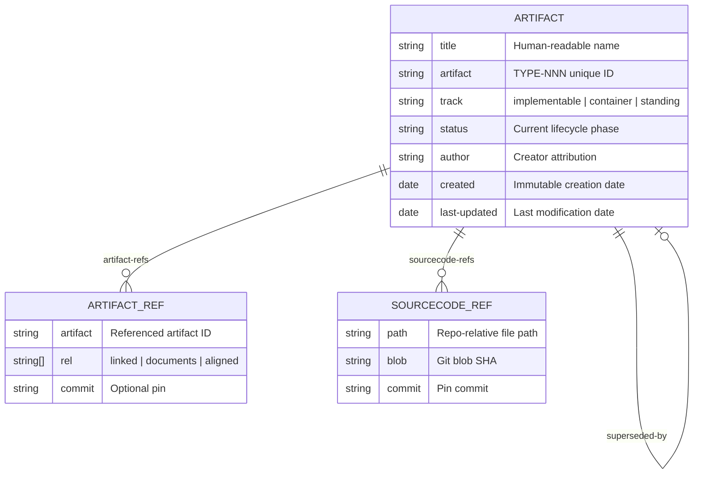
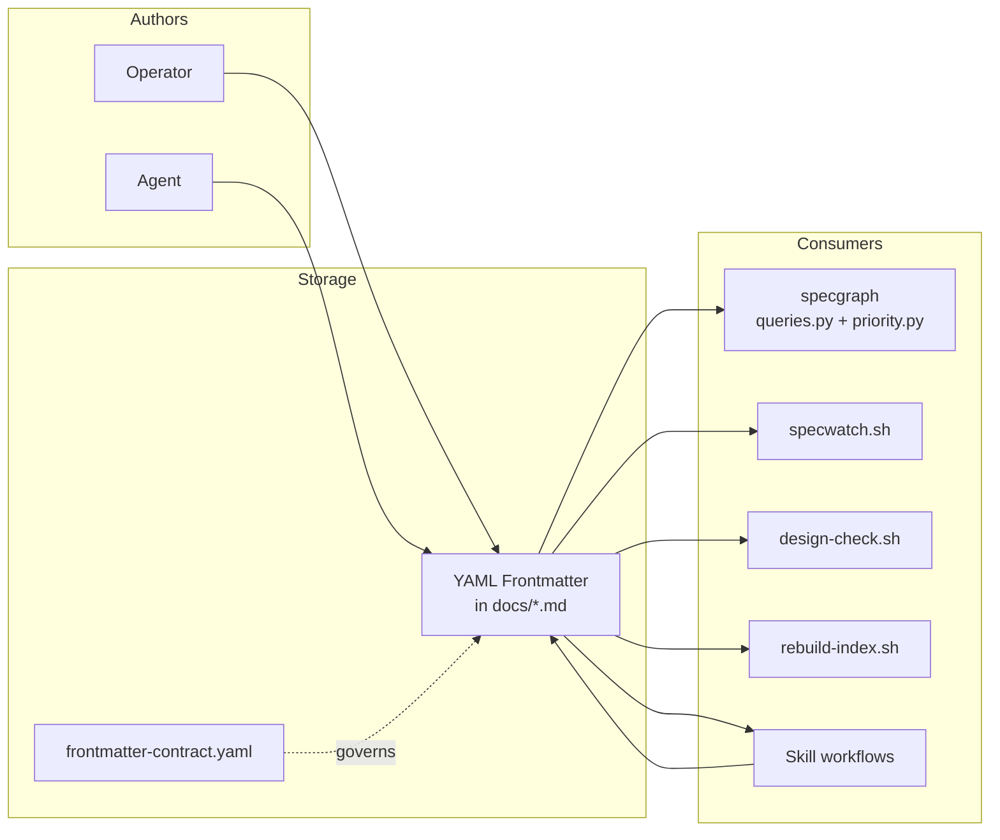
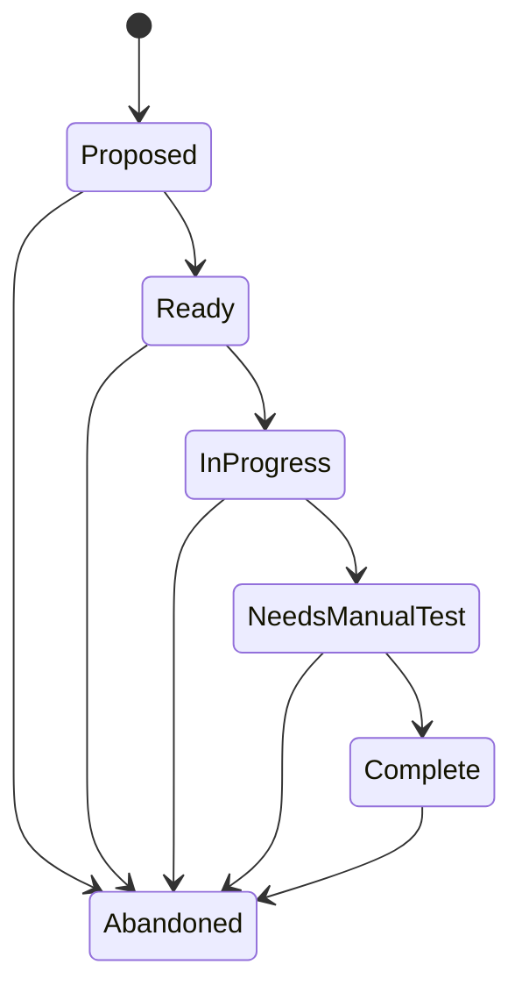
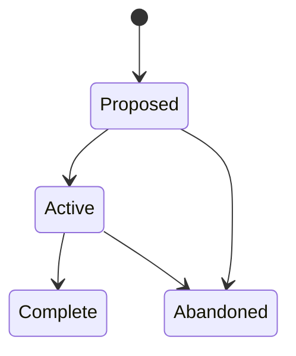
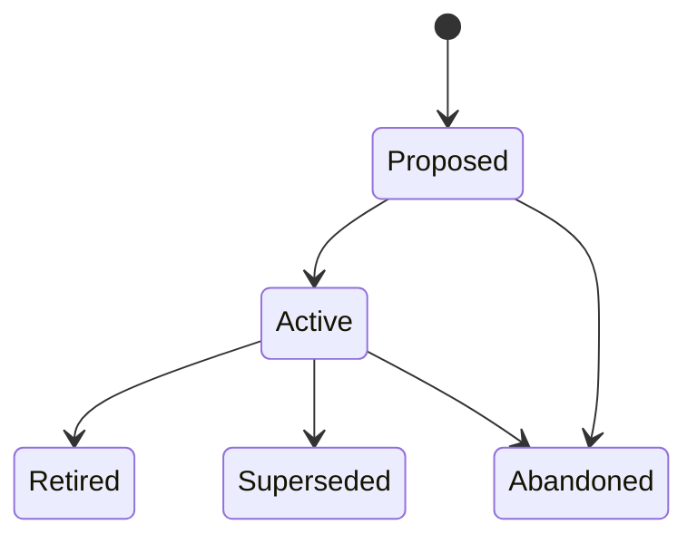

# Artifact Frontmatter Schema

## Design Intent

**Context:** Swain artifacts use YAML frontmatter as the structured metadata layer consumed by specgraph, specwatch, priority scoring, and all skill workflows. The schema grew organically across 13 artifact types with no canonical reference — field names, required/optional status, and semantic meaning were implicit in templates and parser code.

**Goals:**
- Single source of truth for which fields exist, what they mean, which types use them, and what values are valid
- Templates and parsers conform to the contract, not the other way around
- New artifact types (like RETRO) inherit the shared vocabulary rather than inventing ad hoc fields

**Constraints:**
- Field names use kebab-case in YAML frontmatter (e.g., `linked-artifacts`, not `linkedArtifacts`)
- No breaking changes to existing frontmatter without a migration path (per project feedback on migration requirements)
- Every field that exists in any template today must be documented in the contract
- The contract is the enforcement artifact; this DESIGN is the rationale

**Non-goals:**
- Machine-enforceable JSON Schema validation at CI time (future SPEC if needed)
- Schema versioning or migration tooling (that's [SPEC-094](../../../spec/Active/(SPEC-094)-Frontmatter-Schema-artifact-refs-sourcecode-refs/SPEC-094.md) territory)
- Prescribing body content structure (only frontmatter fields are in scope)

## Data Surface

The frontmatter schema governs the YAML metadata block at the top of every swain artifact markdown file. It is the primary structured data interface between human authors, agent skill workflows, and deterministic tooling.

**Bounded domain:** All `---`-delimited YAML frontmatter in files under `docs/` and `docs/swain-retro/`. Does not cover SKILL.md frontmatter (different schema, different consumer) or memory file frontmatter (Claude's memory system, not swain).

**Consumers:**
- `specgraph/queries.py` — parses frontmatter to build the artifact dependency graph (nodes + edges)
- `specgraph/priority.py` — reads `priority_weight` for recommendation scoring
- `specwatch.sh` — validates cross-references in `linked-artifacts`, `depends-on-artifacts`, `addresses`
- `design-check.sh` — reads `sourcecode-refs` for blob SHA drift detection
- `rebuild-index.sh` — reads `title`, `status`, `artifact`, `domain`, `train-type` for index tables
- `resolve-artifact-link.sh` — reads `artifact` to map IDs to filesystem paths
- All swain-design skill workflows — read/write frontmatter during creation, transitions, and metadata updates
- `swain-retro` — writes frontmatter on standalone retro documents

## Entity Model

## Data Flow

## Schema Definitions

The canonical schema is defined in `skills/swain-design/frontmatter-contract.yaml` ([ADR-014](../../../adr/Active/(ADR-014)-Data-Contracts-For-Agent-Produced-Data/(ADR-014)-Data-Contracts-For-Agent-Produced-Data.md) format). This DESIGN documents the rationale; the contract is the source of truth.

### Field vocabulary layers

**Universal fields** (all 13 types): `title`, `artifact`, `track`, `status`, `author`, `created`, `last-updated`

**Hierarchy fields** (subset of types): `parent-vision`, `parent-initiative`, `parent-epic` — form the tree that specgraph walks. Mutually exclusive constraints: a SPEC can have `parent-epic` OR `parent-initiative`, never both.

**Cross-reference fields** (subset of types): `linked-artifacts`, `depends-on-artifacts`, `addresses`, `superseded-by` — form non-hierarchical edges. `depends-on-artifacts` is the only one that affects resolution state (blocking).

**Scoring fields**: `priority-weight`, `sort_order` — consumed by `priority.py` for recommendation ranking. Weight cascades down the hierarchy.

**Provenance fields**: `trove`, `source-issue` — link artifacts to external sources (troves, GitHub issues).

**Design tracking fields**: `artifact-refs`, `sourcecode-refs` — typed relationships with blob pinning for drift detection. DESIGN and TRAIN types only.

**Type-specific fields**: `swain-do` (SPEC), `type` (SPEC), `domain` (DESIGN), `product-type` (VISION), `question` (SPIKE), `success-criteria` (EPIC/INITIATIVE), `gate` (SPIKE), `mode`/`trigger`/`validates` (RUNBOOK), `train-type`/`audience` (TRAIN), `scope`/`period` (RETRO).

### Naming conventions

- **kebab-case** for all field names: `parent-epic`, `linked-artifacts`, `last-updated`
- **Underscore exception**: `priority_weight` in specgraph's internal representation (Python dict keys use underscores). The YAML field is `priority-weight`; PyYAML converts hyphens to underscores on parse. Both forms refer to the same field.
- **Singular vs plural**: Scalar references are singular (`parent-epic`), list references are plural (`linked-artifacts`, `depends-on-artifacts`)
- **Date format**: ISO 8601 `YYYY-MM-DD` for all date fields

### Track vocabulary

| Track | Meaning | Used by |
|-------|---------|---------|
| `implementable` | Build-and-ship lifecycle: Proposed → Ready → InProgress → NeedsManualTest → Complete | SPEC |
| `container` | Coordinate children: Proposed → Active → Complete | EPIC, INITIATIVE, SPIKE |
| `standing` | Living document: Proposed → Active → Retired/Superseded | VISION, ADR, DESIGN, PERSONA, JOURNEY, RUNBOOK, TRAIN, RETRO |

### State machine definitions

These state machines define the **legal transitions** for the `status` field. Tooling (`resolved.py`, `specgraph.sh`, and the lifecycle MCP server per [SPEC-084](../../../spec/Proposed/(SPEC-084)-Lifecycle-State-Machine/(SPEC-084)-Lifecycle-State-Machine.md)) must derive transition rules from this section rather than hardcoding them. The definition files in `skills/swain-design/references/*-definition.md` contain the same diagrams — this section is the canonical machine-readable reference.

#### Implementable track (SPEC)

**Terminal phases:** Complete, Abandoned

**Notes:** `NeedsManualTest` is the acceptance-verification gate — entered when all swain-do tasks are done, exited only when every AC has documented evidence.

#### Container track (EPIC, INITIATIVE, SPIKE)

**Terminal phases:** Complete, Abandoned, Superseded

**Notes:** All three types share identical transitions. Container artifacts resolve when all children resolve.

#### Standing track (VISION, ADR, DESIGN, PERSONA, JOURNEY, RUNBOOK, TRAIN, RETRO)

**Terminal phases:** Retired, Superseded, Abandoned

**Resolution rule:** `Active` is **resolved** for standing-track artifacts — it means "adopted / in effect," not "work in progress." This is the key semantic difference from the other two tracks.

#### Legacy terminal aliases

For backward compatibility with older artifacts, these status values are treated as resolved by parsers:

`Implemented`, `Adopted`, `Validated`, `Archived`, `Sunset`, `Deprecated`, `Verified`, `Declined`

New artifacts must not use these values. They exist only so that pre-migration artifacts resolve correctly.

## Evolution Rules

1. **Adding a new field**: Add to the contract YAML with full semantic/source/quality documentation. Update the field presence matrix. Update the relevant template(s). No migration needed — new fields default to empty.

2. **Adding a new artifact type**: Add a column to the field presence matrix. Document which universal fields it uses and any type-specific fields. Create a template. Update specgraph parsers if the type participates in the dependency graph.

3. **Renaming a field**: Requires a migration script (per project constraint). The script must update all existing artifacts on disk, update all templates, update all parsers, and update the contract. Document the rename in the contract's changelog.

4. **Removing a field**: Requires a migration script. Verify no parser reads the field before removing. Fields may be deprecated (documented as "deprecated, do not use") before removal.

5. **Changing field semantics**: Update the contract's semantic and quality sections. If the change affects parser behavior, update parsers in the same commit. Document the change in the lifecycle table.

## Invariants

1. **Artifact ID uniqueness**: No two artifacts of the same type share a number, even across phases (including Abandoned).
2. **Status-directory agreement**: The `status` field must match the subdirectory the artifact lives in.
3. **Parent exclusivity on SPECs**: A SPEC may have `parent-epic` or `parent-initiative`, never both.
4. **Immutable created date**: The `created` field is set once and never modified.
5. **Track immutability**: The `track` field is determined by artifact type and never changes.
6. **Contract is source of truth**: When the contract and a template disagree, the contract wins. Templates are corrected to match.

## Edge Cases

- **Missing optional fields**: Parsers must handle absent fields gracefully. specgraph uses `.get("field", "")` throughout.
- **Hyphen-underscore mismatch**: PyYAML does NOT auto-convert hyphens to underscores. specgraph's `_load_artifacts()` handles the conversion explicitly. Code that reads frontmatter directly must account for kebab-case.
- **Empty string vs absent**: In YAML, `field: ""` and omitting the field entirely are semantically equivalent for swain purposes. Parsers treat both as "not set."
- **List fields with single item**: YAML allows `field: SPEC-001` (scalar) or `field:\n  - SPEC-001` (list). specgraph normalizes scalars to single-element lists for `parent-vision` and `parent-initiative`.

## Lifecycle

| Phase | Date | Commit | Notes |
|-------|------|--------|-------|
| Active | 2026-03-22 | -- | Initial creation alongside frontmatter-contract.yaml |
| Active | 2026-03-22 | -- | Added state machine definitions per track (addresses GH #54) |
