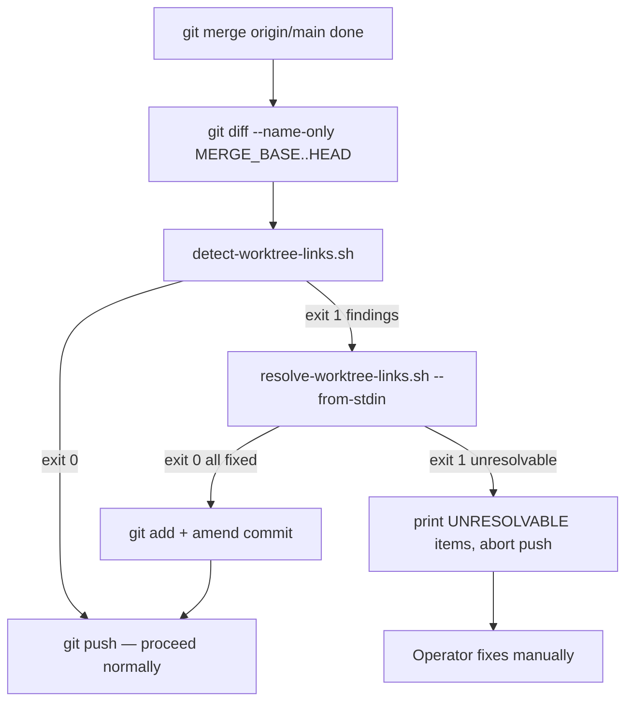

# Worktree Path Link Detection and Resolution

## Design Intent

**Context:** When an agent works in a git worktree and commits files with relative path links, those links may be valid in the worktree's directory context but broken on trunk after merge.

### Goals
- Give agents and operators a single, deterministic command to find any worktree-specific path artifact in a file set
- Provide automated rewriting so clean file sets require zero operator intervention
- Block — not silently pass — when any link cannot be resolved

### Constraints
- Detection must be deterministic: same inputs always produce same findings
- Resolution is always in-place and targeted (no whole-file rewrites)
- UNRESOLVABLE items always surface to the operator — never silently dropped
- Scripts must be POSIX-compatible with no external dependencies beyond git

### Non-goals
- Real-time link linting during worktree editing
- Validation of external (non-repo) URLs or documentation site links
- Rewriting links in binary files

---

## Interface Surface

Two scripts with a shared data format and a skill-level integration hook.

```
.agents/bin/detect-worktree-links.sh    ← pure detection, no side effects
.agents/bin/resolve-worktree-links.sh   ← rewriting; takes detector output
```

Both scripts are called by the worktree completion hook added to `finishing-a-development-branch` and `swain-sync`.

## Contract Definition

### Shared output format

Both scripts emit findings in a line-oriented format:

```
<file>:<line>: <link-target> [REASON]
```

Where `REASON` is one of:

| Reason | Meaning |
|--------|---------|
| `ESCAPES_REPO` | Markdown relative link resolves outside the repo root |
| `HARDCODED_WORKTREE_PATH` | Absolute path matching a known worktree pattern |
| `SYMLINK_ESCAPE` | Symlink target resolves outside repo root |
| `UNRESOLVABLE` | Resolver could not produce a valid repo-relative replacement |
| `FIXED` | Resolver successfully rewrote the link (resolution output only) |

### `detect-worktree-links.sh`

```
detect-worktree-links.sh [--repo-root PATH] [--worktree-root PATH] <files|dir...>
```

| Exit | Meaning |
|------|---------|
| 0 | No suspicious links found |
| 1 | One or more suspicious links found; findings on stdout |
| 2 | Usage error |

Side effects: none. Read-only.

### `resolve-worktree-links.sh`

```
resolve-worktree-links.sh [--repo-root PATH] [--worktree-root PATH] [<files|dir...>]
# OR: detect-worktree-links.sh ... | resolve-worktree-links.sh --from-stdin
```

| Exit | Meaning |
|------|---------|
| 0 | All links resolved (or no issues) |
| 1 | One or more UNRESOLVABLE links remain |
| 2 | Usage error |

Side effects: rewrites files in place. Idempotent.

### Completion hook (skill-level)

Called after `git merge origin/main`, before `git push`:



## Behavioral Guarantees

- Detection is pure (no side effects) — safe to call speculatively
- Resolution is idempotent — calling it twice on a fixed file is a no-op
- All UNRESOLVABLE findings block the merge push; none are silently dropped
- The hook scopes to changed files only — unchanged files are never scanned during completion
- Both scripts respect `--repo-root` and `--worktree-root` overrides; when omitted, each defaults to `$(git rev-parse --show-toplevel)`

## Integration Patterns

Both scripts are discovered via `.agents/bin/` using the standard swain bin-discovery pattern. The worktree completion hook calls them with no configuration — discovery is via `$(git rev-parse --show-toplevel)/.agents/bin/detect-worktree-links.sh`.

## Evolution Rules

- New `REASON` codes may be added in minor updates — callers should treat unknown codes as equivalent to `ESCAPES_REPO` (warn, don't skip)
- Adding new file-type scanners is additive and backward-compatible
- The shared output format (file:line: target [REASON]) is stable — parsers may rely on it

## Edge Cases and Error States

| Scenario | Behavior |
|----------|----------|
| Empty file set | Exit 0, no output |
| File not found | Print warning to stderr, skip that file, continue |
| Symlink loop | Print `SYMLINK_LOOP` warning, skip |
| Resolver cannot compute relative path | Emit `UNRESOLVABLE`, exit 1 |
| Script called outside a git repo | Exit 2 with `not a git repository` message |
| Changed file list is empty (merge base == HEAD) | Exit 0, no scan |

## Design Decisions

1. **Two scripts, not one** — detection is read-only (safe to call speculatively); resolution has side effects. Separating them lets callers run detection in CI-style checks without risk of mutation.

2. **Piped format as integration interface** — the pipe `detect | resolve` pattern avoids a shared state file and keeps both scripts independently usable.

3. **Targeted rewrite only** — the resolver touches only flagged lines, not whole files. This prevents formatting drift and makes diffs reviewable.

4. **UNRESOLVABLE always blocks** — a link that cannot be made repo-relative represents unknown state. Silently ignoring it risks broken links on trunk. The operator must decide.

## Assets

No supporting files at initial creation.

## Lifecycle

| Phase | Date | Commit | Notes |
|-------|------|--------|-------|
| Active | 2026-03-31 | — | Initial creation |
