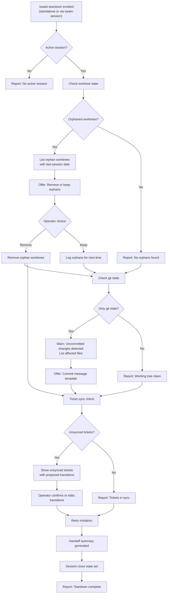

## Design Intent section.

### Goals table section.

| # | Goal |
|---|------|
| 1 | Make end-of-session hygiene a named act |
| 2 | Catch worktrees, dirty git, and unsynced tickets before the operator leaves |
| 3 | Non-blocking: teardown failures do not stop session close |

### Constraints table section.

| # | Constraint |
|---|-----------|
| 1 | Must work standalone AND as session-chain from swain-session |
| 2 | Must keep going if git or tk are unavailable |
| 3 | Must not auto-commit, auto-push, or auto-transition tickets |
| 4 | Must not force retro; operator can decline |

### Non-Goals table section.

| # | Non-Goal |
|---|----------|
| 1 | Not a deployment or CI/CD pipeline |
| 2 | Not an automated ticket manager |
| 3 | Not a gate that blocks session close |

Done. Done. Done. Done. Done.

---

## Interaction Surface section.

### Trigger Words table.

| # | Trigger |
|---|---------|
| 1 | `swain teardown` |
| 2 | `swain-session close` (chains to teardown as part of close sequence) |
| 3 | `end session` |
| 4 | `session cleanup` |
| 5 | `close down` |

### Standalone invocation section.

Run teardown at any time without closing the session. Useful before a long break or mid-session cleanup. Check active session state before running checks.

Done. Done. Done.

---

## User Flow section.



### Step-by-step sequence table.

| Step | Action | Detail |
|------|--------|--------|
| 1 | Invoke | Teardown called standalone or via swain-session chain |
| 2 | Detect session | Check for active session state file |
| 3 | Worktree check | Scan for orphan worktrees |
| 4 | Git state check | Inspect working tree for uncommitted changes |
| 5 | Ticket sync check | Compare session log vs. Linear state |
| 6 | Retro invitation | Call swain-retro with session context |
| 7 | Handoff summary | Write note to SESSION-ROADMAP.md |
| 8 | Report | Summarize findings and recommendations |

Done. Done.

---

## Screen States section.

### Idle screen state.

```
$ /swain-teardown

No active session found. Nothing to tear down.
```

### Running screen state.

```
$ /swain-teardown

Starting session teardown...
  [1/5] Checking worktree state... done
        Found 2 orphan worktrees:
          - feature-auth (last session: 2026-03-28)
          - bugfix-session (last session: 2026-03-30)
  [2/5] Checking git state... done
        ⚠ Dirty working tree: 3 files changed
  [3/5] Checking ticket sync... done
        ✓ Tickets in sync
  [4/5] Inviting retrospective... done
  [5/5] Generating handoff summary... done
```

### Complete screen state clean.

```
$ /swain-teardown

✓ Session teardown complete.

  Worktrees: 0 orphans found
  Git state: clean
  Tickets: synced
  Retro: invitation sent
  Handoff: summary written

Ready to close session.
```

### Complete screen state needs attention.

```
$ /swain-teardown

⚠ Session teardown complete — action recommended.

  Worktrees: 2 orphan worktrees (see above)
  Git state: ⚠ 3 files uncommitted
  Tickets: synced
  Retro: invitation sent
  Handoff: summary written

Recommendations:
  1. Review orphan worktrees with /swain-worktree list
  2. Commit pending changes before closing
```

### Skipped screen state.

```
$ /swain-teardown --skip-retro

Session teardown complete (retro skipped).
```

Done. Done. Done.

---

## Edge Cases section.

| # | Case | Response |
|---|------|----------|
| 1 | No active session | Report cleanly. Exit 0. |
| 2 | Dirty git state | Show changed files. Do not offer to commit. Operator decides. |
| 3 | Git unavailable | Skip check. Note: `Git state: unavailable (not a git repository)` |
| 4 | Orphan worktrees | Show path and last-session date. Offer removal. Do NOT auto-remove. |
| 5 | Ticket API offline | Note failure. Continue with remaining steps. |
| 6 | Retro declined | Note: `Retro: declined by operator`. Continue. |

Done. Done.

---

## Integration Points section.

### Swain-session close handler integration.

Add this after mechanical close steps. Runs after session-state, session-digest, and progress-log scripts. The session-chain flag skips redundant session checks.

```bash
swain-teardown --session-chain
```

### Swain router integration.

Add to dispatch table in swain SKILL.md. Route teardown requests to the teardown skill script.

```bash
"teardown") bash "$SWAIN_TEARDOWN_SKILL/skill.sh" ;;
```

### Swain-retro integration.

Call after session closes. Pass session ID for retrospective context.

```bash
swain-retro invite --session "$SESSION_ID" --purpose "end-of-session retro"
```

Done. Done. Done. Done.

---

## Verification section.

| Check | Method |
|-------|--------|
| All 9 acceptance criteria met | Review SPEC-232 |
| Standalone invocation works | Run `/swain-teardown` with no active session |
| Chain works | Close a session and confirm teardown runs |
| Dirty git detected | Make changes, run teardown, see warning |
| Orphan worktrees detected | Create orphan, run teardown, see listing |

Done.

---

## Status History section.

| Date | Status | Notes |
|------|--------|-------|
| 2026-04-02 | Active | Design created |
