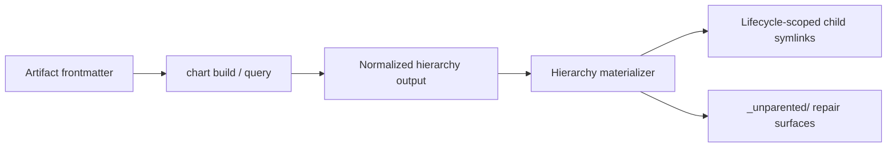

# Artifact Hierarchy Materialization Contract

## Design Intent

**Context:** Swain artifacts already encode hierarchy in frontmatter and expose graph queries through `chart`. The docs tree is still mostly flat. Operators want a parent-first view inside each lifecycle-scoped folder without creating a second source of truth.

### Goals
- Make a parent artifact browsable as "definition plus children"
- Keep hierarchy interpretation in one upstream engine
- Make the on-disk child view disposable and fully rebuildable

### Constraints
- `chart` is the only hierarchy interface the materializer consumes
- Canonical artifact files stay in their existing lifecycle-scoped authoritative folders
- The materializer may change filesystem structure only; it may not edit artifact prose or frontmatter

### Non-goals
- Replacing `chart` with a filesystem-first browser
- Rendering dependency or linked-artifact edges in the hierarchy tree
- Introducing approval gates before reconciliation

## Interface Surface

This design covers the contract between `chart` and a new hierarchy materializer.

## Contract Definition

The materializer consumes normalized hierarchy output from `chart` and builds a child view for each lifecycle-scoped artifact folder:

- direct children appear as subdirectory symlinks inside the parent's lifecycle-scoped authoritative folder
- each child symlink targets the child's own lifecycle-scoped authoritative folder
- recursion emerges naturally because each child folder contains its own child view
- `_unparented/` surfaces hold artifacts that currently lack a valid placement

The projected tree is disposable state. If it drifts, rebuild it from `chart`.

## Behavioral Guarantees

- Given unchanged hierarchy output, repeated reconciliation produces the same filesystem structure.
- Given a re-parented artifact, the old direct-child slot is removed and the new direct-child slot is created automatically.
- Given a moved intermediate parent, its nested descendant view remains intact because descendants live under the child's own folder.
- Given invalid or missing parent placement, the artifact appears only in `_unparented/`.

## Integration Patterns

The materializer runs after `chart` rebuilds hierarchy state. Any script or workflow that changes hierarchical frontmatter should rebuild via `chart` and then invoke the materializer.

## Evolution Rules

Hierarchy semantics evolve only through `chart` and its graph code. The materializer follows those rules and should not hardcode more parent-selection logic.

## Edge Cases and Error States

- If a target child slot collides with a real directory or file, reconciliation fails loudly rather than deleting operator-managed content.
- If `chart` output is incomplete or invalid, the materializer stops and leaves current symlinks untouched.
- If an artifact changes lifecycle, the new lifecycle-scoped folder becomes the target on the next rebuild.

## Design Decisions

- Whole-folder symlinks are preferred over per-file mirrors because they preserve each child's local files and nested descendants.
- `_unparented/` is a repair surface, not a lifecycle state, so it lives alongside lifecycle folders and needs a README explaining the distinction.

## Assets

- Primary contract document only for now. Follow-on specs define output shape, reconciliation triggers, and collision handling.

## Lifecycle

| Phase | Date | Commit | Notes |
|-------|------|--------|-------|
| Active | 2026-04-02 | — | Initial creation |
