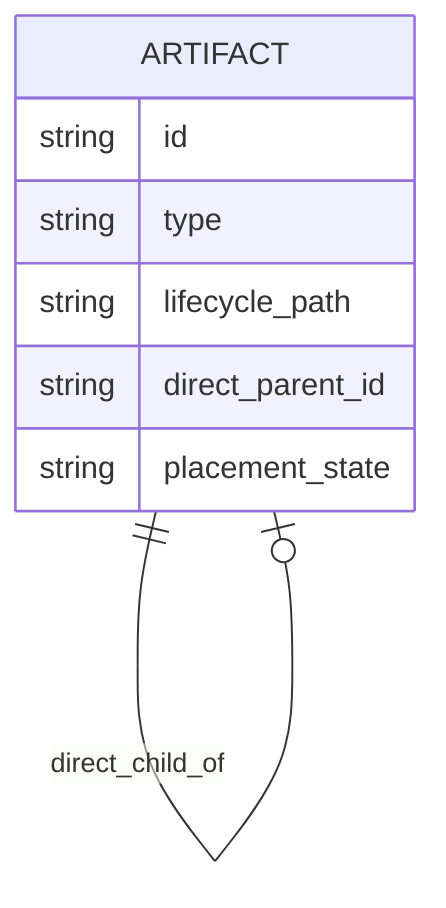

# Hierarchy Placement and _unparented Surfaces

## Design Intent

**Context:** Once hierarchy is projected into folders, placement rules must be deterministic. The main failure mode is duplicate visibility, where one artifact appears under both a broad ancestor and a narrower parent. Another risk is treating broken placement like a lifecycle state.

### Goals
- Materialize each artifact exactly once as a direct child
- Prefer the narrowest valid placement across all artifact types
- Keep unparented artifacts visible and repairable

### Constraints
- Placement is derived from `chart` output, not direct frontmatter parsing
- Broader ancestors inherit descendants through nesting, not duplicate direct links
- `_unparented/README.md` must explain that the folder is not a lifecycle bucket

### Non-goals
- Allowing multiple direct placements for convenience
- Inventing type-specific placement exceptions outside the normalized hierarchy
- Hiding unparented artifacts from the materialized view

## Data Surface

This design covers the normalized parent-child records that drive placement and the resulting filesystem locations under `docs/<type>/`.

## Entity Model



## Data Flow

```mermaid
flowchart TD
    graph["chart hierarchy output"] --> select_parent["Select narrowest valid parent"]
    select_parent --> placed{"Valid placement?"}
    placed -->|"yes"| direct_link["Create direct child symlink"]
    placed -->|"no"| unparented["Place under type _unparented/"]
```

## Schema Definitions

Placement records need to expose, at minimum:

| Field | Type | Nullable | Constraints | Description |
|-------|------|----------|-------------|-------------|
| `artifact` | string | no | valid artifact ID | Child artifact being placed |
| `path` | string | no | repo-relative lifecycle-scoped folder | Canonical target folder |
| `direct_parent` | string | yes | valid artifact ID if present | Narrowest valid hierarchical parent |
| `placement_state` | string | no | `placed` or `unparented` | Materializer action |

## Evolution Rules

Any future hierarchy type additions must still reduce to one direct parent for placement. If a new type allows multiple narrowest placements, the graph layer must resolve that before materialization.

## Invariants

- Every placed artifact has exactly one direct-child slot.
- No artifact is rendered directly under both an ancestor and a descendant.
- `_unparented/` contains only artifacts with no valid direct placement.
- `_unparented/README.md` exists for each type that exposes the repair surface.

## Edge Cases and Error States

- If a parent artifact is itself unparented, it can still own direct children beneath its authoritative folder.
- If a parent changes lifecycle, children follow the parent through the symlink target on rebuild.
- If lifecycle and graph output disagree, graph output decides placement but the target path must still resolve to a real lifecycle-scoped folder.

## Design Decisions

- "Narrowest valid parent wins" is the rule across all artifact types.
- `_unparented/` is preferred over `_orphans/` because it describes placement state without implying lifecycle abandonment.

## Assets

- Primary placement contract document only for now.

## Lifecycle

| Phase | Date | Commit | Notes |
|-------|------|--------|-------|
| Active | 2026-04-02 | — | Initial creation |
