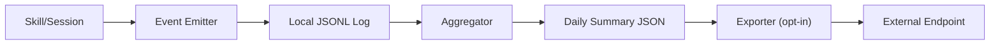

# Usage Logging and Telemetry

## Design Intent

**Context:** Track aggregate feature utilization in swain to inform improvement decisions — not to monitor individuals or capture private data.

### Goals
- All telemetry collection is opt-in and anonymous
- Local-first processing with operator-controlled export
- Coarse-grained events that describe swain behavior, not operator behavior
- Human-readable JSONL format for easy inspection
- OTel-compatible export format for future integration

### Constraints
- No personal data: no user ID, no project names, no file paths, no code content
- Single config toggle disables all collection
- Export only sends aggregate summaries, never raw events
- All processing happens locally until operator explicitly runs export

### Non-goals
- Real-time monitoring or dashboards
- Individual user tracking or productivity measurement
- Automatic cloud submission without operator action
- Error details or code snippet collection

## Interface Surface

This design covers the telemetry collection and export system boundary, including:
- Configuration API (enable/disable/endpoint)
- Event emission interface for skills
- Local aggregation and summary generation
- Export mechanism for sending summaries to external endpoints

## Contract Definition



**Event Schema:**
```json
{
  "ts": "ISO-8601 timestamp",
  "event": "enum: skill_invoked|artifact_created|artifact_transitioned|session_started|session_closed|worktree_created|spec_completed|command_run",
  "data": "object: coarse categories only, never paths or names"
}
```

**Config Schema:**
```json
{
  "enabled": "boolean",
  "endpoint": "string|null"
}
```

## Behavioral Guarantees

1. **Immediate disable**: Collection stops immediately when `enabled: false`
2. **Append-only logs**: Raw event files are never modified after write
3. **Summary-only export**: Only daily summaries are exported, never raw events
4. **No identifiers**: Exports contain no user, project, or session identifiers
5. **Operator inspection**: Raw logs always available at `.swain/telemetry/events/`

## Integration Patterns

**Event Emission (Skills):**
```bash
# Skills emit events via a shared emitter function
source "$SWAIN_TELEMETRY_EMITTER"
emit_telemetry "skill_invoked" "{\"skill_name\": \"swain-design\"}"
```

**Configuration:**
- Config file: `.swain/telemetry/config.json`
- Created on first opt-in via `swain telemetry enable`
- Checked before each emission (skip if disabled)

**Export:**
- Operator-initiated via `swain telemetry export`
- Reads summaries from `.swain/telemetry/events/YYYY-MM-DD-summary.json`
- POSTs to configured endpoint
- Logs export status and timestamp

## Evolution Rules

1. **Backward compatibility**: New event types are additive; existing consumers ignore unknown events
2. **Schema versioning**: Summary format includes `swain_version` field
3. **OTel alignment**: Event schema designed to map to OTel metrics/traces
4. **Endpoint flexibility**: Exporter supports any HTTP POST receiver

## Edge Cases and Error States

- **Missing config**: Treat as disabled (safe default)
- **Endpoint unreachable**: Log error locally, retry on next export (no blocking)
- **Malformed event**: Skip and log warning, continue processing
- **Disk space low**: Stop logging gracefully, preserve existing logs

## Design Decisions

1. **Local-first architecture**: Raw events never leave the machine unless operator explicitly exports
2. **Coarse-grained events**: Prevents accidental PII leakage through fine-grained tracking
3. **JSONL format**: Human-readable, streamable, easy to parse with standard tools
4. **Daily aggregation**: Balances granularity with export efficiency
5. **Opt-in default**: Respects operator privacy from the start

## Assets

None yet — implementation files will be indexed here upon completion.

## Lifecycle

| Phase | Date | Commit | Notes |
|-------|------|--------|-------|
| Active | 2026-04-03 | pending | Initial creation from spec |
| Active | 2026-04-03 | pending | Decomposed into EPIC-057 with 4 child SPECs |
| Active | 2026-04-03 | pending | Decomposed into EPIC-057 with 4 child SPECs |
