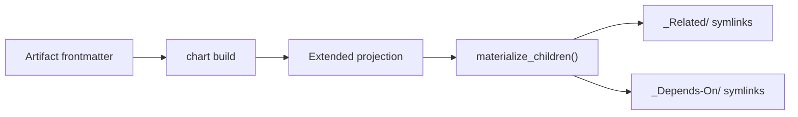

# Related Artifacts Materialization

## Design Intent

**Context:** Currently only parent-child hierarchy edges are materialized as symlinks. Cross-references (`linked-artifacts`, `artifact-refs`) and dependencies (`depends-on-artifacts`) are invisible in the filesystem. Operators must use `chart neighbors` to discover these relationships.

### Goals
- Materialize all graph edges as symlinks
- Make cross-references and dependencies browseable from filesystem
- Keep `chart` as single source of truth for graph interpretation
- Use existing atomic processing model

### Constraints
- No new CLI surface - extend `build_projection()` internally
- Normalized IDs in projection, `materialize.py` resolves paths
- Each artifact's symlinks derived from its own frontmatter only
- Symlink directories created only when non-empty

### Non-goals
- Rendering `artifact-refs.rel` types in directory structure
- Creating separate directories for different `rel` values
- Materializing edges not in `chart` output

## Interface Surface

This design covers the projection schema extension and materialization logic for `_Related/` and `_Depends-On/` symlink directories.

## Contract Definition



**Projection schema:**
```python
{
  "artifact": "EPIC-057",
  "linked_artifacts": ["DESIGN-015"],     # NEW: IDs only
  "depends_on_artifacts": ["SPEC-244"]    # NEW: IDs only
}
```

**Symlink structure:**
```
docs/epic/Active/(EPIC-057)-Foo/
├── _Related/
│   └── (DESIGN-015)-Baz -> ../../../design/Active/(DESIGN-015)-Baz/
└── _Depends-On/
    └── (SPEC-244)-Bar -> ../../../spec/Proposed/(SPEC-244)-Bar/
```

## Behavioral Guarantees

1. **Atomic processing** - each artifact's symlinks derived from its own frontmatter
2. **Bidirectional** - both sides get symlinks when both declare the relationship
3. **Skip missing** - no symlink if target ID not in nodes (broken reference)
4. **Skip self** - no symlink if artifact references itself
5. **Lazy directories** - `_Related/` and `_Depends-On/` created only if non-empty
6. **Stale cleanup** - remove symlinks when frontmatter links removed

## Integration Patterns

**`build_projection()` extension:**
```python
for artifact_id in sorted(nodes):
    node = nodes[artifact_id]
    # ... existing hierarchy fields ...
    
    # NEW: extract relationship IDs from edges
    linked = [e["to"] for e in edges 
              if e["from"] == artifact_id 
              and e["type"] in ("linked-artifacts", "artifact-refs")]
    
    depends = [e["to"] for e in edges 
               if e["from"] == artifact_id 
               and e["type"] == "depends-on"]
    
    projection.append({
        # ... existing fields ...
        "linked_artifacts": sorted(set(linked)),
        "depends_on_artifacts": sorted(set(depends)),
    })
```

**`materialize_children()` extension:**
```python
def _materialize_related(parent_path: Path, repo_root: Path, 
                         artifact_ids: list[str], nodes: dict) -> None:
    if not artifact_ids:
        return
    
    related_dir = parent_path / "_Related"
    related_dir.mkdir(exist_ok=True)
    
    for aid in artifact_ids:
        if aid not in nodes:
            continue  # skip broken reference
        if aid == parent_path.name.split(")")[0][1:]:  
            continue  # skip self-reference
        
        target_path = repo_root / nodes[aid]["canonical_path"]
        link_name = target_path.name
        link_path = related_dir / link_name
        
        relative_target = os.path.relpath(target_path, start=related_dir)
        link_path.symlink_to(relative_target)
```

## Evolution Rules

1. **Additive only** - new fields in projection don't break existing consumers
2. **Edge-first** - new relationship types must be edges before materialization
3. **Path resolution** - nodes dict must include canonical_path for all artifacts

## Edge Cases and Error States

- **Broken reference** - target ID not in nodes: skip symlink, continue processing
- **Self-reference** - artifact references itself: skip symlink
- **Empty relationships** - no `_Related/` or `_Depends-On/` directory created
- **Lifecycle change** - symlink target updates automatically on next rebuild
- **Concurrent modification** - materializer idempotent, safe to re-run

## Design Decisions

1. **IDs not paths** - projection uses IDs, materializer resolves paths (normalized)
2. **Edge source** - extract from edges, not frontmatter directly (chart owns interpretation)
3. **Directory naming** - `_Related/` and `_Depends-On/` match existing `_unparented/` pattern
4. **Symlink naming** - use target folder name `(ARTIFACT-ID)-Title` for consistency

## Assets

- Implementation files will be indexed in sourcecode-refs after completion

## Lifecycle

| Phase | Date | Commit | Notes |
|-------|------|--------|-------|
| Active | 2026-04-03 | pending | Initial creation from design spec |