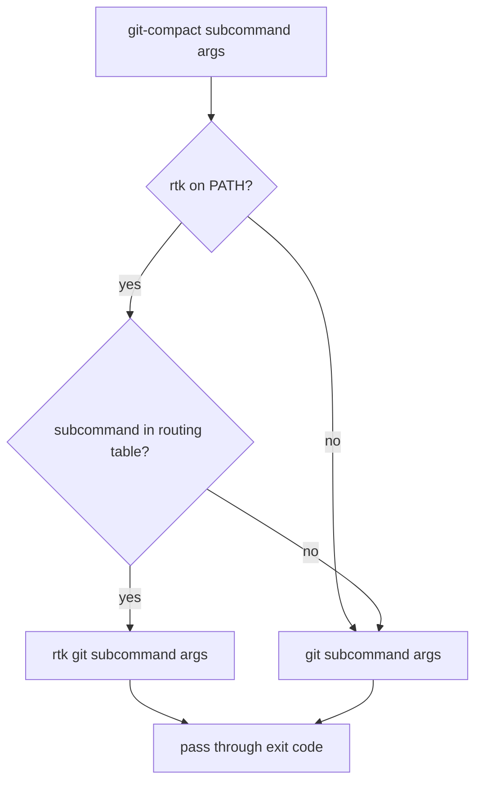

# Git-Compact CLI Contract

## Design Intent

**Context:** Swain agents run many git commands during sessions. RTK (Rust Token Killer) compresses CLI output by 75-94% for git commands, but installing it globally via its PreToolUse hook risks interfering with swain's structured JSON outputs (chart.sh, session scripts, tk).

### Goals

- Give agents a way to get compressed git output for high-noise commands (diff, log, status) without affecting swain's own tooling
- Keep compressed and full-fidelity git available side by side so agents can escalate when they need detail
- Require no agent-side configuration — the script handles RTK detection and fallback

### Constraints

- Must not modify the global git configuration or install hooks
- Must fall back to raw git transparently when RTK is not installed
- Must not compress any swain-specific script output
- Must live in `.agents/bin/` alongside other swain tooling

### Non-goals

- Not a general-purpose RTK wrapper — only git commands
- Not a replacement for git — agents use `git` for full output and `git-compact` for compressed
- No per-project configuration — a single script with hardcoded routing

## Interface Surface

`git-compact` is a shell script at `.agents/bin/git-compact` that accepts any git subcommand and arguments. For high-value compression targets, it routes through `rtk git`; for everything else, it passes through to raw `git`.

## Contract Definition

### Invocation

```
git-compact <subcommand> [args...]
```

Behaves identically to `git <subcommand> [args...]` except that output for routed commands is compressed by RTK.

### Routing table

| Subcommand | Route | Rationale |
|------------|-------|-----------|
| `diff` | `rtk git diff` | 94% compression — biggest token saver |
| `diff --staged` | `rtk git diff --staged` | Same as diff |
| `diff --cached` | `rtk git diff --cached` | Alias for --staged |
| `log` | `rtk git log` | 86% compression — one-line format |
| `status` | `rtk git status` | 75% compression — structured summary |
| Everything else | `git <subcommand> [args...]` | Passthrough — no compression |

### RTK detection

On invocation, check if `rtk` is on PATH:

```
command -v rtk >/dev/null 2>&1
```

If RTK is not found, pass ALL commands through to raw `git` — the script becomes a transparent proxy. No warning, no error, no degraded output. Agents should not need to know whether RTK is installed.

### Exit codes

Exit code from the underlying command (git or rtk) is passed through unchanged.

### Stdout / stderr

- Stdout: command output (compressed or raw)
- Stderr: passed through from the underlying command



## Behavioral Guarantees

- **Transparent fallback:** When RTK is absent, `git-compact` is functionally identical to `git`. No behavioral difference, no warnings.
- **No side effects:** The script does not modify git config, install hooks, write files, or maintain state.
- **Argument passthrough:** All arguments after the subcommand are forwarded verbatim to the underlying command. No argument parsing or rewriting beyond the subcommand routing.
- **Idempotent:** Running `git-compact` multiple times produces the same output as running it once.

## Integration Patterns

Agents reference `git-compact` when they want compressed output for context-window efficiency. The script lives at `.agents/bin/git-compact` and is available on PATH via swain's standard bin directory mechanism.

Agents are NOT required to use `git-compact`. It is an optimization, not a mandate. When full output is needed (merge conflict resolution, detailed code review, blame), agents use `git` directly.

## Evolution Rules

New subcommands can be added to the routing table by editing the script's case statement. No versioning needed — the script is internal tooling.

If RTK adds new git subcommand support, the routing table should be updated to match. Check RTK release notes when refreshing the trove (trove: rtk-cli-token-compression@c94bfc1). See [SPEC-253](../../../spec/Active/(SPEC-253)-Git-Compact-Wrapper-Script/(SPEC-253)-Git-Compact-Wrapper-Script.md) for the implementation specification.

## Edge Cases and Error States

| Scenario | Behavior |
|----------|----------|
| RTK not installed | Transparent passthrough to git |
| RTK installed but crashes | RTK's exit code propagated; stderr shows RTK error |
| No git repo (not in a git directory) | Git's own error propagated ("not a git repository") |
| Unknown subcommand | Passthrough to git — git handles its own unknown-command errors |
| No arguments | Passthrough to bare `git` (shows git help) |

## Design Decisions

1. **Single script, not a directory of shims** — Avoids PATH shadowing complexity. Agents explicitly choose compressed output by calling `git-compact` instead of `git`. This makes the compression decision visible in agent logs.

2. **Hardcoded routing table** — No configuration file. The set of high-value git compression targets is small and stable (diff, log, status). Adding commands means editing the script, which is a code change with review.

3. **No `--full` flag** — Instead of adding a bypass flag, agents just call `git` directly. Two clear tools with distinct contracts rather than one tool with modes.

## Assets

None — single script, no supporting files.

## Lifecycle

| Phase | Date | Commit | Notes |
|-------|------|--------|-------|
| Active | 2026-04-03 | 52f5c81 | Initial creation |
