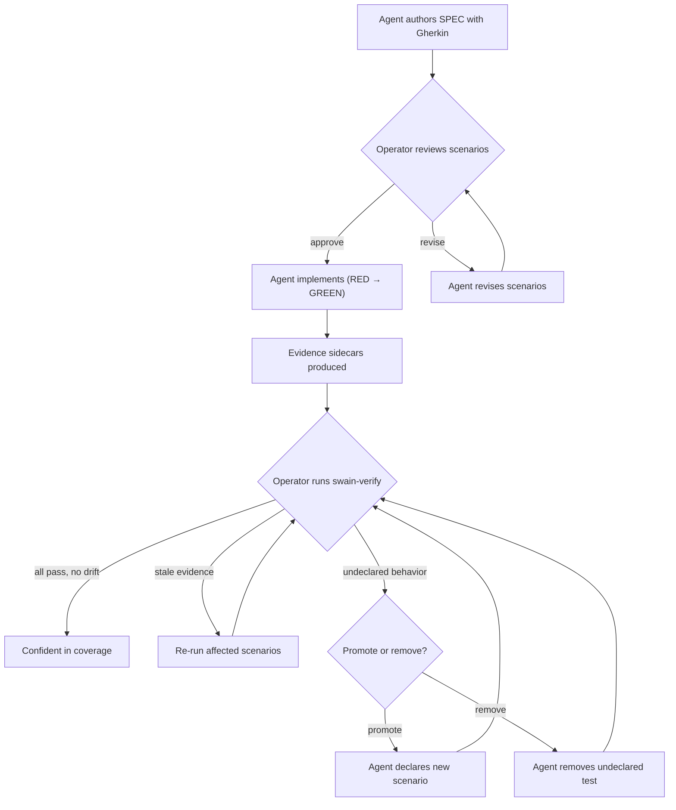

# Operator BDD Workflow

## Design Intent

**Context:** Agents write most BDD contracts. Operators review and guide them. The operator edits, not authors.

### Goals

- Operators scan a spec and see which behaviors exist, which have proof, and which are stale or missing
- Reading Gherkin that agents wrote feels like reading prose, not parsing test plumbing
- Drift reports (extra behaviors, stale proof) stand on their own. Operators need not read test code
- `swain-verify` shows a clear pass or fail for each scenario, with links to proof

### Constraints

- No new tools needed. Gherkin reads well in any markdown viewer (Typora, GitHub, IDE preview)
- Evidence sidecars are plain markdown files, not binary data
- Staleness signals use the same commit-hash style that lifecycle tables use

### Non-goals

- Teaching operators to write Gherkin. Agents write it; operators review and edit
- Live dashboards or web UIs for BDD status. This is file-based and git-native only
- Enforcing Gherkin style rules or linting past basic form

## Interaction Surface

The operator touches BDD in three ways. **Artifact review:** read specs and designs that hold Gherkin. **Evidence check:** look at sidecars and drift reports. **Verify:** run `swain-verify`.

## User Flow

### Reviewing agent-written scenarios

1. Agent creates or updates a SPEC with Gherkin in fenced code blocks
2. Operator opens the spec in their editor (Typora, VS Code, GitHub)
3. Each scenario has a clear title and an `@id:` tag. The operator reads the steps to check behavior
4. Operator approves, edits, or asks the agent to revise

### Checking evidence status

1. Operator runs `swain-verify <scope>` or reads sidecars by hand
2. Each sidecar shows: last pass or fail, commit hash, and timestamp
3. Stale evidence means an upstream file changed since the last run. The flag names the file that changed
4. Tests without `@bdd:` markers show up in a "drift" section

### Handling drift

1. The drift report lists tests that do not link to any scenario
2. Operator picks a path: promote it (agent adds `@id:` plus `@bdd:`), or drop it
3. Stale evidence means the operator should re-run `swain-verify` or ask the agent to update tests

## Screen States

This is a CLI and file-based workflow, so "screen states" map to artifact states:

| State | What the operator sees |
|-------|----------------------|
| **No scenarios** | SPEC has acceptance criteria but no Gherkin blocks — BDD has not started yet |
| **Scenarios, no evidence** | Gherkin blocks with `@id:` tags exist, but no evidence sidecars — tests have not run yet |
| **Fresh evidence** | Evidence sidecars exist, commit hashes are current, all scenarios pass |
| **Stale evidence** | Evidence exists but an upstream file (parent design, linked ADR, the spec) changed at a later commit |
| **Drift found** | Tests exist without `@bdd:` markers — behaviors the agent added without a declared scenario |

## Edge Cases and Error States

- **ID clash:** Two `@id:` tags match. `swain-doctor` spots this. The older one keeps its ID; the newer one gets a fresh ID.
- **Orphaned evidence:** A sidecar points to an ID that no longer exists. `swain-doctor` flags it for cleanup.
- **Partial test runs:** A run is cut short. Sidecars from the run are stamped but not done. The next full run writes over them.
- **Broken symlinks:** Sidecars are symlinked into parent folders. If the source moves, `swain-doctor` fixes it via `relink.sh`.

## Design Decisions

- **Gherkin as notation, not plumbing.** Same pattern as Jinja2 in spec templates. Agents read the format with no build step. No `.feature` export, no special runner. The toolchain stays the same.
- **Evidence as markdown sidecars, not structured data.** Operators read evidence in the same tools they use for specs. No JSON viewers or dashboards needed.
- **Drift as a top-level signal, not a lint warning.** Agents may write tests that do not link to any stated intent. Showing drift up front respects the operator's role as editor.

## Assets

_No supporting files yet._

## Lifecycle

| Phase | Date | Commit | Notes |
|-------|------|--------|-------|
| Active | 2026-04-04 | _pending_ | Initial creation from design conversation |
