# Agent BDD Contract

## Design Intent

**Context:** Agents are the main writers and runners of BDD contracts in swain. They write Gherkin when they make specs. They link tests to scenarios during builds. They output evidence. The operator reviews and steers.

### Goals

- Agents write valid Gherkin with stable IDs when they make or update specs
- Agents link every test to a scenario via `@bdd:` markers at RED phase
- Agents write `test-results.json` after test runs so tooling can gather evidence on its own
- Staleness checks work through the artifact graph with no agent help

### Constraints

- Agents must not mint IDs that clash with ones in use — use `next-artifact-id.sh` or UUID minting
- `@bdd:` markers must go in at RED phase (when the test is first written), not later after GREEN
- `test-results.json` is a swain-do contract — agents must write it in the right place and format
- Standing-track artifacts (Designs, Runbooks) may hold Gherkin; container-track ones (Epics, Initiatives, Visions) must not

### Non-goals

- Agents parsing or running `.feature` files from other BDD tools
- Agents calling things stale — tooling does that from commit hashes
- Agents writing evidence sidecars — tooling builds those from `test-results.json`

## Interface Surface

The agent touches BDD at two points. First is **authoring**: writing Gherkin in artifacts and minting `@id:` tags. Second is **execution**: adding `@bdd:` markers in test code and writing `test-results.json`. Tooling does the rest — evidence sidecars, staleness checks, and symlink upkeep.

## Contract Definition

### Authoring: Gherkin in artifacts

When an agent makes or updates a SPEC (or standing-track artifact with behavior rules), it writes Gherkin in fenced code blocks:

~~~markdown
```gherkin
@id:sc-a1b2c3
Scenario: Widget rejects invalid input
  Given a widget in ready state
  When the user submits empty input
  Then the widget displays a validation error
  And the input field retains focus
```
~~~

**Preconditions:**
- The agent has read the artifact's goals or design intent
- For new scenarios: the agent mints a unique `@id:<short-uuid>` tag (8-char hex or like it)
- For old scenarios: the agent keeps the `@id:` tag as-is

**Postconditions:**
- Each scenario has one `@id:` tag
- Titles are easy to read (the operator reviews them)
- Steps are clear enough to write a test but not so tight that they lock in the design

**Error semantics:**
- No `@id:` tag: `swain-doctor` or a hook auto-mints one. The agent should not skip tags, but tooling can fix it.
- Same `@id:` twice: `swain-doctor` catches it. The newer one gets a fresh ID.

### Execution: test-to-scenario linkage

When an agent writes a test from a scenario, it adds a `@bdd:` marker as a comment:

```python
# @bdd:sc-a1b2c3
def test_widget_rejects_invalid_input():
    widget = Widget(state="ready")
    widget.submit("")
    assert widget.error_displayed("validation error")
    assert widget.input_has_focus()
```

```javascript
// @bdd:sc-a1b2c3
test('widget rejects invalid input', () => { ... });
```

```bash
# @bdd:sc-a1b2c3
test_widget_rejects_invalid_input() { ... }
```

**Preconditions:**
- The agent is at RED phase — it writes the test before the code
- The `@id:` already exists in the artifact

**Postconditions:**
- The `@bdd:` marker sits on the line right before the test
- One marker per test. A test links to one scenario. Many tests may link to the same one.

**Error semantics:**
- `@bdd:` points to a missing ID: drift checks flag it as an orphan
- Test has no `@bdd:` marker: flagged as unlinked in drift reports

### Execution: test-results.json

After tests run, the agent writes `test-results.json` in the spec's evidence folder:

```json
[
  {
    "bdd_id": "sc-a1b2c3",
    "test": "test_widget_rejects_invalid_input",
    "status": "pass",
    "commit": "def4567",
    "timestamp": "2026-04-04T12:00:00Z"
  }
]
```

**Location:** `docs/spec/<Phase>/(SPEC-NNN)-Title/evidence/test-results.json`

**Preconditions:**
- Tests have run (RED or GREEN phase)
- The agent knows the current commit hash

**Postconditions:**
- Every test with a `@bdd:` marker has an entry
- Tests with no marker get `"bdd_id": null` (this makes unlinked tests show up in the data)
- `status` is one of: `pass`, `fail`, `error`, `skip`

**Error semantics:**
- No `test-results.json`: `swain-verify` cannot build sidecars for this spec. It flags "no evidence."
- Bad JSON: `swain-verify` logs a parse error and skips the spec.

```mermaid
flowchart LR
    subgraph authoring["Authoring (spec creation)"]
        read_ac["Read acceptance criteria"] --> write_gherkin["Write Gherkin scenarios"]
        write_gherkin --> mint_id["Mint @id: tags"]
    end

    subgraph execution["Execution (implementation)"]
        read_scenario["Read declared scenario"] --> write_test["Write test at RED phase"]
        write_test --> add_marker["Add @bdd: marker"]
        add_marker --> run_tests["Run tests"]
        run_tests --> produce_json["Produce test-results.json"]
    end

    subgraph tooling["Tooling (no agent needed)"]
        produce_json --> generate_sidecars["Generate evidence sidecars"]
        generate_sidecars --> check_staleness["Check commit-hash staleness"]
        check_staleness --> detect_drift["Detect undeclared behaviors"]
    end

    mint_id --> read_scenario
```



## Behavioral Guarantees

| Guarantee | Description |
|-----------|-------------|
| **Scenario stability** | Once an `@id:` is set, it stays for the life of the scenario. Agents must not re-mint IDs. |
| **Marker timing** | `@bdd:` markers go in at RED phase. The link must exist before the code, not after. |
| **Evidence completeness** | `test-results.json` lists all tests — those with markers AND those without (with `null` bdd_id). Nothing is left out. |
| **No agent-side staleness** | Agents do not judge staleness. They write commit hashes. Tooling does the rest. |
| **Track discipline** | Agents write Gherkin in SPECs and standing-track artifacts (Design, Runbook, Journey). Not in container-track ones (Epic, Initiative, Vision). |

## Integration Patterns

- **swain-do** reads `test-results.json` during the build cycle. The TDD skill (RED, GREEN, REFACTOR) is the hook point. Markers go in at RED. Results come out after GREEN.
- **swain-verify** reads `test-results.json` and builds sidecars. It does not call agents. It re-runs tests and writes fresh results.
- **swain-doctor** checks structure: `@id:` uniqueness, marker validity, orphan evidence, broken symlinks.
- **specgraph** walks the graph for staleness. When an artifact changes, all evidence stamped at an older commit is marked stale.

## Evolution Rules

- The `test-results.json` schema has a `schema_version` field (v1 at launch). Breaking changes need a migration in `swain-doctor`.
- New `@bdd:` syntax (like multi-scenario links) would add to the format. Old single-ID markers stay valid.
- If swain adopts fixed artifact paths later, sidecar paths change but the `test-results.json` contract stays the same.

## Edge Cases and Error States

- **Agent writes Gherkin with no `@id:`:** Tooling auto-mints one. The agent should not count on this. The scenario cannot be traced until the next doctor run.
- **Agent links `@bdd:` to the wrong scenario:** This makes a false link. Only the operator can spot it — the scenario text will not match the test. Same class of bug as a bad unit test.
- **Agent skips `test-results.json`:** Sidecars cannot be built. `swain-verify` flags the spec as lacking evidence. Not a hard failure. The agent can write the file on the next run.
- **Many agents work on the same spec:** Each writes its own `test-results.json`. Last write wins. Re-running tests fixes clashes. This works since `swain-verify` can always build fresh results.

## Design Decisions

- **Agents as main authors, not just users.** Most specs come from agents. This contract treats the agent as a first-class author who mints scenarios. The operator reviews and edits.
- **Markers at RED phase, not after the fact.** Markers go in when the test is written, not after tests pass. This keeps the link built in from the start. If an agent writes a test with no scenario, that gap is worth noting.
- **Unlinked tests in `test-results.json` with null bdd_id.** Tests with no link show up in the file, not dropped. This makes drift visible in the data, not just in lint output.
- **Tooling handles evidence, not agents.** Agents write raw results. Tooling turns them into sidecars and checks staleness. Evidence can be rebuilt with no agent. Staleness rules can change with no agent changes.

## Assets

_No supporting files yet._

## Lifecycle

| Phase | Date | Commit | Notes |
|-------|------|--------|-------|
| Active | 2026-04-04 | _pending_ | Initial creation from design conversation |
