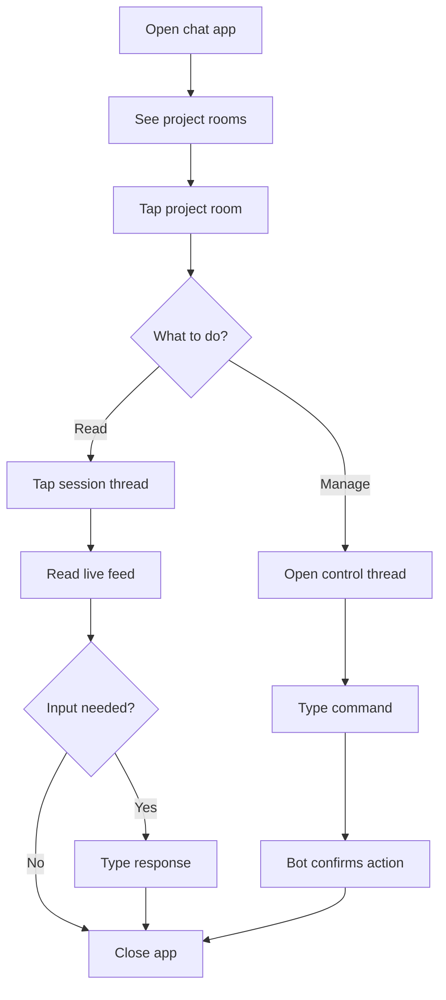

# Chat Interface Interaction

## Design Intent

**Context:** The chat interface is the operator's primary surface for steering agentic sessions across devices.

### Goals

- Passive check-in requires zero typing — open a thread, read the live feed.
- Active steering (prompts, approvals, commands) is low-friction and discoverable.
- Session and project navigation is instant via room hierarchy.
- Works equally on phone (small screen, touch) and desktop (keyboard, large screen).

### Constraints

- Must use the chat protocol's native primitives (rooms, threads, messages, reactions) — no custom client.
- Single-operator system.
- Bot posts continuously — the design must handle high message volume without overwhelming the operator.
- Graceful failure when the bridge encounters an unrecognized runtime interaction — unknown states surface as warnings, not fatal errors.

### Non-goals

- Custom chat client or web UI for v1.
- Rich media rendering (code diffs, file trees) beyond native chat support.
- Terminal-equivalent power — deep debugging stays in the TUI.

## Interaction Surface

The operator's chat experience for steering swain-governed agentic sessions. Covers project rooms, session threads, the control thread, and approval flows.

## User Flow

### Passive check-in (most common)

1. Operator opens the chat app on their phone.
2. Sees project rooms in the sidebar (one per project).
3. Taps into a project room.
4. Sees a list of active session threads with recent activity.
5. Taps into a session thread.
6. Reads the live feed — tool calls, text output, progress.
7. Closes the app.

### Active steering

1. Operator opens a session thread.
2. Types a message — it becomes a prompt sent to the runtime.
3. Or responds to an `@` mention — approves/denies a tool call.
4. Or types a command (`/cancel`, `/status`).

### Session lifecycle (via control thread)

1. Operator opens the project room's control thread.
2. Sees session inventory: active sessions, adoptable tmux sessions, stuck sessions.
3. Types a command: `/work SPEC-142` (spawn or reconnect), `/kill <session>`, `/adopt <tmux-target>`.
4. Bot responds with confirmation and a link to the new session thread.

## Screen States

**Project room:**
- **Active** — session threads with recent activity, control thread pinned.
- **Quiet** — no active sessions, control thread shows "No active sessions. Use `/work` to start one."

**Session thread:**
- **Live** — bot posting continuously (tool calls, text output, progress).
- **Waiting** — bot posted an `@` mention, waiting for operator response. Visual indicator in thread list.
- **Stuck** — bot posted a warning about an unrecognized state. Operator can `/kill` from control thread.
- **Dead** — session ended. Thread becomes read-only history.

**Control thread:**
- **Inventory** — lists active sessions, adoptable tmux sessions, recent completions.
- **Updated by host bridge** on a polling basis — not just on operator request.

## Edge Cases and Error States

- **Unrecognized runtime interaction.** The runtime produces something the adapter doesn't understand (new prompt format, unexpected TUI state). The chat adapter posts a warning in the session thread: "Unknown runtime state — session may be stuck. Use `/kill` in the control thread to restart." Not fatal.
- **Rate limit hit.** The bot exceeds the chat platform's rate limit. The adapter buffers events and posts them in batches. Recent events take priority over older ones. The operator sees "[N events buffered]" notices.
- **Session dies unexpectedly.** The runtime crashes or tmux session disappears. The project bridge emits `session_died`. The chat adapter posts "Session ended: <reason>" and marks the thread as dead.
- **Host bridge restarts.** All session threads go quiet briefly. After recovery (SPIKE-062), the control thread posts a reconciliation summary.

## Design Decisions

- **Continuous posting over on-demand.** The thread is a live feed. The operator reads passively. This matches the mental model of "watching an agent work" without the friction of requesting updates.
- **`@` mentions only for input.** Bot noise is high. The operator's attention is directed only when the kernel emits `approval_needed` or similar. Everything else is background.
- **Control thread as management surface.** Separates lifecycle commands from session conversations. The operator doesn't type `/kill` in the middle of a session feed — they go to the control thread.

## Assets

_None yet. Wireframes and mockups to be added during implementation._

## Lifecycle

| Phase | Date | Commit | Notes |
|-------|------|--------|-------|
| Active | 2026-04-06 | -- | Created from VISION-006 decomposition. Design Intent captured during brainstorming. |
