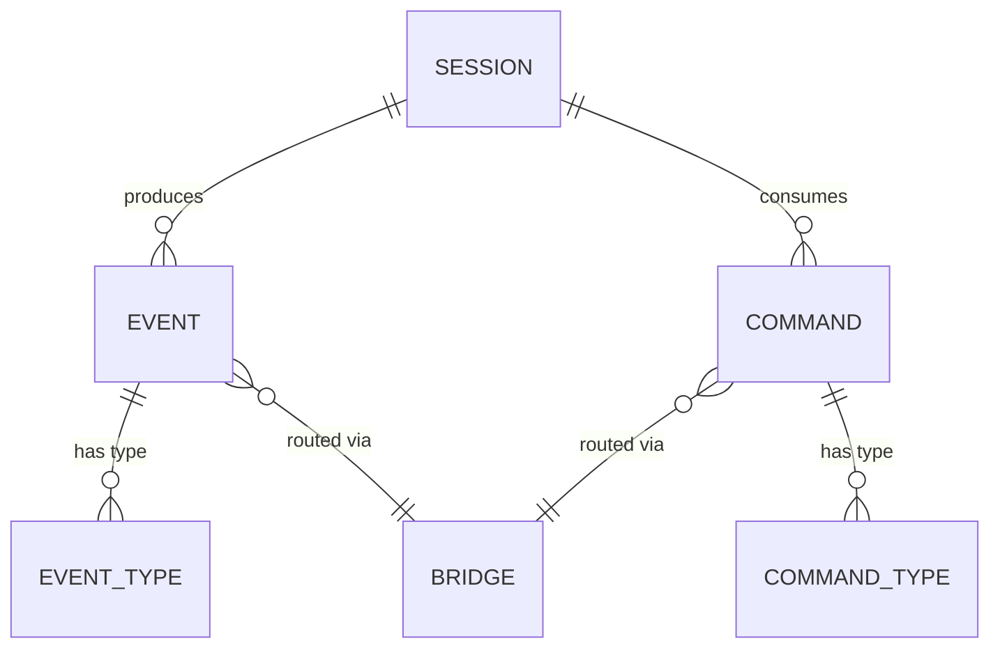
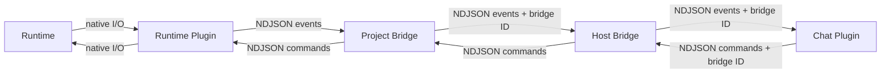

# Orchestrator Event Schema

## Design Intent

**Context:** The published language is the contract that all plugins conform to — it defines every event and command that flows through the kernel.

### Goals

- One schema covers both bridge types (host and project) and all plugin types (chat and runtime).
- Events and commands are self-describing — a plugin can render or route any message without understanding the full schema.
- The schema supports hub-and-spoke routing via a `bridge` field.

### Constraints

- NDJSON format (one JSON object per line).
- Must include routing metadata (`bridge` field) for host bridge multiplexing.
- Must be extensible without breaking existing plugins (unknown fields are ignored).

### Non-goals

- Binary protocols or compression.
- Schema negotiation or capability discovery (future MCP upgrade path).
- Streaming partial events (each line is a complete event).

## Data Surface

The event and command messages that flow between kernel components (host bridge, project bridge) and plugins (chat adapters, runtime adapters) over stdio.

## Entity Model

## Data Flow

## Schema Definitions

### Events (kernel → chat adapter, runtime adapter → kernel)

| Field | Type | Nullable | Constraints | Description |
|-------|------|----------|-------------|-------------|
| `type` | string | No | Enum (see below) | Event type discriminator. |
| `bridge` | string | Yes | null for host bridge events | Project ID for routing. `null` or `"__host__"` for host-scope events. |
| `session_id` | string | Yes | null for non-session events | Session this event belongs to. |
| `timestamp` | integer | No | Unix ms | When the event occurred. |
| `payload` | object | No | Varies by type | Type-specific data. |

**Event types — project scope:**

| Type | Payload fields | Description |
|------|---------------|-------------|
| `session_spawned` | `runtime`, `artifact?` | New session started. |
| `session_promoted` | `artifact`, `topic?` | Session bound to an artifact; chat adapter creates dedicated thread. |
| `text_output` | `content` | Runtime produced text. |
| `tool_call` | `tool_name`, `input`, `call_id` | Runtime invoked a tool. |
| `tool_result` | `call_id`, `output`, `success` | Tool returned. |
| `approval_needed` | `tool_name`, `description`, `call_id` | Runtime waiting for operator. |
| `session_died` | `reason` | Session terminated. |
| `web_output_available` | `path_or_port`, `label` | Session produced serveable content (v2). |

**Event types — host scope:**

| Type | Payload fields | Description |
|------|---------------|-------------|
| `host_status` | `bridges_running`, `disk`, `load` | Periodic status. |
| `unmanaged_session_found` | `tmux_target`, `runtime_hint?`, `project_path?` | Tmux session not owned by any bridge. |
| `unmanaged_session_gone` | `tmux_target` | Previously reported session disappeared. |
| `bridge_started` | `project`, `bridge_id` | Project bridge spawned. |
| `bridge_stopped` | `project`, `bridge_id`, `reason` | Project bridge terminated. |

### Commands (chat adapter → kernel, kernel → runtime adapter)

| Field | Type | Nullable | Constraints | Description |
|-------|------|----------|-------------|-------------|
| `type` | string | No | Enum (see below) | Command type discriminator. |
| `bridge` | string | Yes | null for host commands | Target project bridge. |
| `session_id` | string | Yes | null for non-session commands | Target session. |
| `timestamp` | integer | No | Unix ms | When the command was issued. |
| `payload` | object | No | Varies by type | Type-specific data. |

**Command types — project scope:**

| Type | Payload fields | Description |
|------|---------------|-------------|
| `start_session` | `runtime`, `artifact?`, `prompt?` | Spawn a new session in a tmux pane. |
| `launch_session` | `text?` | Start the launcher interview flow (`/work` or `/session`). |
| `control_message` | `text` | Natural language from the control topic. Lightweight query session or relay to active interview. |
| `send_prompt` | `text` | Send operator input to a running session. |
| `approve` | `call_id`, `approved` | Respond to approval request. |
| `cancel` | | Terminate session. |
| `bind_artifact` | `artifact_id` | Associate session with artifact. |

**Command types — host scope:**

| Type | Payload fields | Description |
|------|---------------|-------------|
| `clone_project` | `repo_url`, `host_path?` | Clone a repo. |
| `init_project` | `project_path` | Initialize swain. |
| `start_bridge` | `project_path` | Spawn project bridge. |
| `stop_bridge` | `project` | Stop project bridge. |
| `adopt_session` | `tmux_target`, `project`, `runtime?`, `artifact?` | Hand session to project bridge. |

### Config message (kernel → plugin, first line on stdin)

| Field | Type | Description |
|-------|------|-------------|
| `type` | string | Always `"config"`. |
| `plugin_type` | string | `"chat"` or `"runtime"`. |
| `config` | object | Plugin-specific config (credentials, settings). |

## Schema Evolution (ADR-046)

ADR-046 adds `worktree_added` and `worktree_removed` event types for continuous worktree discovery. Host-scope events and commands (`host_status`, `unmanaged_session_found`/`gone`, `bridge_started`/`stopped`, `clone_project`, `init_project`, `start_bridge`, `stop_bridge`, `adopt_session`) are retained but move from the hub to the project bridge scope.

## Evolution Rules

- New event/command types can be added without breaking existing plugins. Plugins must ignore unknown types (log a warning, don't crash).
- New payload fields can be added to existing types. Plugins must ignore unknown fields.
- Removing or renaming a type is a breaking change — requires a major version bump of the protocol.
- The `bridge` and `session_id` fields are stable routing infrastructure — never renamed.

## Invariants

- Every event has a `type` and `timestamp`.
- Every event from a project bridge has a non-null `bridge` field once it passes through the host bridge.
- `session_id` is unique within a project bridge's lifetime.
- `call_id` in `approval_needed` matches `call_id` in the corresponding `approve` command.

## Edge Cases and Error States

- **Unknown event type.** Plugin logs a warning and ignores the event. No crash, no error response.
- **Malformed JSON line.** Plugin logs the raw line and skips it. The kernel does the same for malformed plugin output.
- **Missing required field.** Plugin logs a warning with the raw event and skips it.
- **Plugin sends event with wrong `bridge` ID.** Host bridge logs a routing error and drops the event.

## Design Decisions

- **NDJSON over structured binary.** Human-readable, debuggable with `jq`, no serialization library needed. Performance is not a concern — event rates are low (tens per second, not thousands).
- **Flat type discriminator over nested envelopes.** `{"type": "text_output", ...}` is simpler than `{"envelope": {"type": "event", "event_type": "text_output", ...}}`.
- **Config on first stdin line.** Avoids environment variable complexity and config file path passing. The plugin reads one line, parses config, then enters the event loop.

## Assets

_None yet. JSON Schema files to be generated during implementation._

## Lifecycle

| Phase | Date | Commit | Notes |
|-------|------|--------|-------|
| Active | 2026-04-06 | -- | Created from VISION-006 decomposition. Schema sketched in architecture-overview. |
| Updated | 2026-04-06 | c59add66 | Added `session_promoted`, `launch_session`, `control_message`. Tmux adapter wired. |
| Updated | 2026-04-18 | -- | ADR-046 adds worktree_added and worktree_removed event types. Host-scope events/commands move from hub to project bridge scope. |
