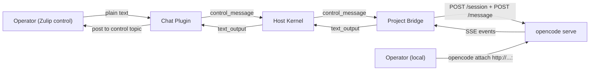

# Unified Session Launcher

## Design Intent

**Context:** There are two ways to start a session today: `bin/swain` from a terminal and natural language in the Zulip control topic. They follow different paths. The terminal launcher handles crash recovery, worktree creation, session purpose interview, and runtime selection. The Zulip path skips all of that and spawns a bare Claude Code session. This gap means the operator gets a degraded experience from chat.

### Goals

- A message in the Zulip control topic goes through the same session setup as `bin/swain`.
- The operator converses in the control topic to answer interview questions (what to work on, which worktree, resume or fresh). Only after the session purpose is set does a dedicated Zulip thread appear.
- The launcher logic runs once, in one place. Both entry points call the same code.

### Constraints

- `bin/swain` is a bash script (SPEC-180, ADR-018: structural logic lives in bash). It runs interactively in a terminal today.
- The Zulip chat adapter is a Python subprocess (ADR-038). It cannot run bash scripts interactively.
- Session state lives in `.agents/session-state.json` (SPEC-119). Both paths must write to it.
- Worktree creation requires git operations on the main checkout, not from inside a worktree.

### Non-goals

- Replacing `bin/swain` with Python. The launcher stays bash.
- Making the control topic a full terminal emulator.
- Automatic triage of queries vs work requests (separate concern, handled by the `control_message` command type).

## Problem

### Two launch paths, divergent behavior

| Capability | `bin/swain` (terminal) | Zulip control (today) |
|---|---|---|
| Crash recovery | Yes (Phase 1) | No |
| Worktree creation | Yes (Phase 2) | No |
| Session purpose interview | Yes (via `/swain-session`) | No |
| Runtime selection | Yes (`--runtime`) | Hardcoded to `claude` |
| Focus lane | Yes (from previous session) | No |
| Thread/topic creation | N/A (terminal) | Immediate (before purpose is set) |

### The thread-too-early problem

Today, `start_session` and `control_message` both create a session immediately. The Zulip chat adapter assigns a thread at `session_spawned` time. But the operator hasn't said what to work on yet. The thread gets a meaningless name like `sess-a1b2c3d4`.

The fix: delay thread creation until the session has a purpose (artifact binding).

## Proposed Design

### Two-phase session launch from control

**Phase 1: Interview (in control topic).** The control-origin session runs in the control topic. The operator and the session converse there. The session runs the same setup logic as `bin/swain`: crash recovery check, worktree selection, session purpose.

**Phase 2: Promote to thread.** When the session binds to an artifact (sets its purpose), the project bridge emits a `session_promoted` event. The chat adapter:
1. Removes the session from control-origin tracking.
2. Assigns a thread via `SessionTopicRegistry` (using the artifact name as topic).
3. Posts the announcement in control: "Session moved to topic **SPEC-142**."
4. All subsequent events for that session go to the dedicated thread.

### Launcher as a library

Extract the interview logic from `bin/swain` into a non-interactive mode that can be driven by NDJSON. The launcher accepts questions on stdin and emits answers on stdout.

```
bin/swain --non-interactive --format ndjson
```

The project bridge wraps this: it spawns `bin/swain --non-interactive` as a subprocess, relays the operator's control-topic messages as stdin, and reads launcher decisions from stdout. When the launcher completes (purpose set, worktree ready), the project bridge spawns the runtime adapter in the new worktree.

### Protocol additions

```
# New event type
session_promoted:
  session_id: str
  artifact: str
  topic: str  # suggested thread name

# New command type (already exists)
control_message:
  text: str  # operator's natural language from control topic
```

The `session_promoted` event triggers thread creation. It replaces the current behavior where `session_spawned` creates the thread.

### Sequence: Zulip control topic

```
Operator (control)      Chat Plugin       Kernel        Project Bridge      Launcher
    |                       |               |                |                 |
    |-- "What should I      |               |                |                 |
    |    work on?"          |               |                |                 |
    |                       |--control_msg-->|--control_msg-->|                 |
    |                       |               |                |--spawn launcher->|
    |                       |               |                |                 |
    |                       |<--text_output--|<--text_output--|<--"3 specs      |
    |<--post to control-----|               |                |   ready..."     |
    |                       |               |                |                 |
    |-- "Work on SPEC-142"  |               |                |                 |
    |                       |--control_msg-->|--control_msg-->|--stdin--------->|
    |                       |               |                |                 |
    |                       |               |                |<--purpose set----|
    |                       |               |                |--create worktree-|
    |                       |               |                |--spawn runtime-->|
    |                       |<--promoted-----|<--promoted-----|                 |
    |<--"Moved to SPEC-142"-|               |                |                 |
    |                       |               |                |                 |
    |   (now in SPEC-142    |               |                |                 |
    |    topic thread)      |               |                |                 |
```

### Runtime adapter strategies — the "untethered" model

The runtime is independent of the bridge process. If the bridge crashes, the runtime keeps running. The operator can connect directly. This is the core "untethered" concept.

Two adapter strategies support different runtimes:

#### Strategy 1: HTTP API adapter (opencode)

OpenCode provides `opencode serve` — a headless HTTP server with a REST API. The adapter is an HTTP client:

- **Sessions** — `POST /session` creates a session, `POST /session/{id}/message` sends prompts. The server maintains chat history across messages.
- **Streaming** — `GET /session/{id}/event` provides SSE (server-sent events) for real-time output.
- **Operator attachment** — `opencode attach http://127.0.0.1:<port>` connects the operator to the same session interactively.
- **Persistence** — if the bridge crashes, the opencode server keeps running. The bridge reconnects on restart.

This is the **MVP adapter** for control-topic queries and promoted sessions using opencode.

#### Strategy 2: tmux pane adapter (Claude Code, others)

For runtimes without a server mode (Claude Code, gemini, codex), the adapter runs the runtime in a tmux session:

- **Output** — `tmux pipe-pane` streams to a log file; `tail -f` emits events.
- **Input** — `tmux send-keys` relays operator messages.
- **Operator attachment** — `tmux attach -t <session>` connects directly.
- **Persistence** — if the bridge crashes, the tmux session keeps running.

This is the **fallback adapter** for runtimes that only support terminal I/O.

### Sequence: Zulip control topic (opencode serve)



### Sequence: Terminal (`bin/swain`)

No change to the operator's experience. `bin/swain` creates the tmux session and launches the runtime inside it. The operator interacts directly. The project bridge (if running) detects the tmux session and begins relaying events to Zulip.

## Migration

### Phase A (complete)

Protocol, kernel, plugin subprocess architecture, Zulip polling via `call_on_each_message`, `control_message` and `launch_session` command routing, `session_promoted` thread creation. All tested.

### Phase B (current — opencode server adapter)

1. ~~Replace `ClaudeCodeAdapter` / `OpenCodeAdapter` subprocess model with `TmuxPaneAdapter`.~~ Done (tmux proof of concept working).
2. Replace `TmuxPaneAdapter` for control sessions with `OpenCodeServerAdapter` (HTTP API). In progress — SPEC-292.
3. `OpenCodeServerAdapter` manages `opencode serve` lifecycle, creates sessions, sends messages via HTTP, streams responses via SSE.
4. Session persists across messages — server maintains chat history.
5. Operator attaches via `opencode attach http://...:<port>`.
6. `TmuxPaneAdapter` remains available for runtimes without server mode (Claude Code).
7. `bin/swain` (terminal path) continues to create tmux sessions — bridge adoption is a Phase C item.

Remaining Phase B work:
- ~~Strip ANSI escape codes from output before posting to Zulip.~~ Done.
- ~~Deduplicate Zulip message delivery.~~ Done.
- Build `OpenCodeServerAdapter` (SPEC-292).
- SPIKE: approval mechanism for different runtimes.

### Phase C (future)

- Query triage: control-origin sessions that answer a question and die without binding an artifact never create a thread.
- Multi-project: control topic can route to different project bridges based on context.
- Session adoption: bridge discovers existing tmux sessions (from `bin/swain` terminal launches) and begins relaying.

## Decisions

1. **`--non-interactive` flag on `bin/swain`**, not a separate script. Keeps the control surface in sync between terminal and non-terminal interactions.
2. **NDJSON** for launcher-to-bridge communication. Consistent with the rest of the plugin protocol (DESIGN-024).
3. **No timeout.** Interview sessions persist in control until the operator cancels or completes them. The operator can leave and come back. This matches the Zulip model where topics are durable.
4. **`opencode serve` HTTP API for MVP**, not tmux terminal scraping. Clean programmatic access, SSE streaming, server-managed session persistence. Operator attaches via `opencode attach`.
5. **tmux fallback** for runtimes without server mode (Claude Code). `TmuxPaneAdapter` remains available.

## Open Questions

1. ~~Which outbound relay strategy?~~ **Answered:** SSE from `opencode serve` for opencode; `pipe-pane` + `tail -f` for tmux fallback.
2. How does `approve` work? OpenCode's HTTP API may have a permission endpoint. SPIKE needed.
3. ~~How frequently should `capture-pane` poll?~~ **Answered:** No polling needed for either strategy.
