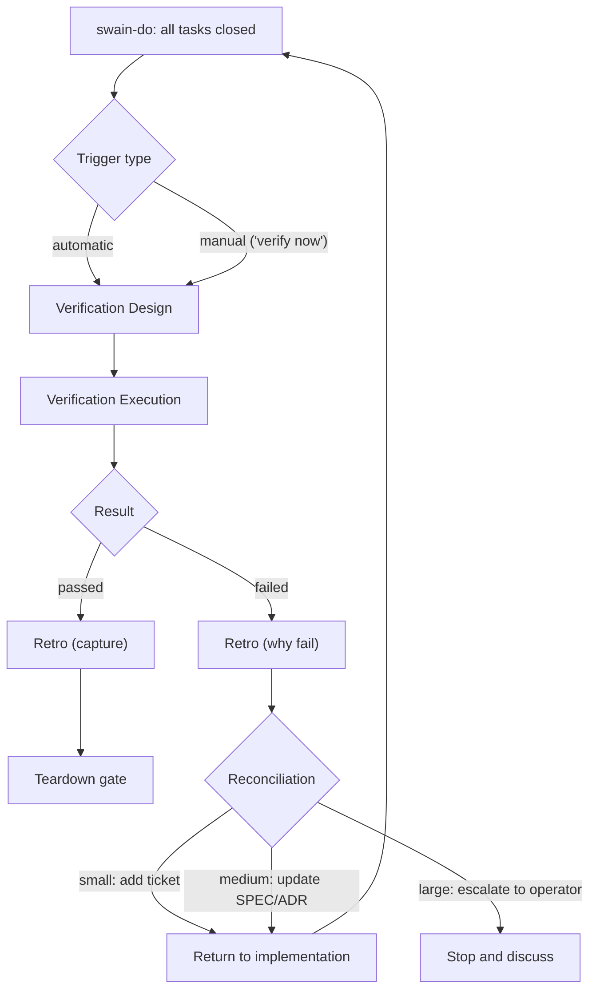

# Automated Verification Loop

## Design Intent

**Context:** The current model needs the operator to step in, and it relies on tests planned before code exists. This design replaces it with an automated loop that runs after implementation.

### Goals

- Agents iterate toward the best state, using intent close to the merge point.
- The operator reviews results at teardown, not process during execution.
- Every cycle (pass or fail) produces a retro about agent decisions.
- Small changes auto-merge with a saved report. Sensitive changes surface for human judgment.

### Constraints

- Verification design runs after implementation, using the current intent snapshot (artifact states now, not when the plan was written).
- Failed verification loops back without needing the operator.
- A teardown report must be saved before any trunk merge, no matter the size.
- The loop triggers on plan completion, and manually when the operator says "verify now."
- Reconciliation calls need max model capability. The system presents a recommendation; the operator confirms or overrides at teardown.

### Non-goals

- Pre-implementation test planning (superseded by post-implementation verification).
- Prompts to the operator during the loop (operator reviews at teardown).
- Deterministic sensitivity (v1 is judgment-based, not rule-based).
- Replacing prism-review (this builds on its methods).

## Interface Surface

The boundary between swain-do (implementation) and the new verification phase. Also the boundary between verification and swain-teardown (report and merge).

## Contract Definition

Two handoffs define the loop:

**Handoff 1: Implementation to Verification** (automatic on plan completion, or manual trigger)

**Handoff 2: Verification to Teardown** (passed verification)

The teardown report aggregates per-cycle retros. This is where the operator intervenes.

## Behavioral Guarantees

1. **No operator nagging.** The loop runs on its own. Failure routes back to implementation without waiting for a human (unless severity is large).
2. **Fresh intent snapshot.** Verification reads artifact states at verification time, not plan creation time. New ADRs, EPIC changes, or SPEC edits take effect right away.
3. **Report before merge.** No trunk merge without a saved teardown report. Review is optional for small changes, required for large ones.
4. **Retro accumulates.** Each cycle (pass or fail) triggers a retro. The teardown report weaves all retros into a single narrative about agent decisions and outcomes.
5. **Sensitivity scales verification.** Small changes to sensitive modules (auth, encryption, core paths) may get full verification. Large low-risk changes may get standard. VISION and INITIATIVE context shapes the judgment.
6. **Incremental loop limit with reset.** After all test results are collected for a cycle, the counter evaluates: if all tests passed, the counter resets to zero; if one or more tests failed, the counter increments by one. After 5 consecutive cycles with failures (default, configurable in `.agents/execution-tracking.vars.json`), the loop escalates to the operator at teardown. This supports incremental TDD — a single partial pass doesn't reset the counter, but a full pass does.

## Integration Patterns

### How verification design uses prism-review methods

The verification design phase uses prism-review's parallel agent pattern:

1. **Standard agents** — security, style, logic, docs (from prism-review).
2. **Artifact alignment agent** — iterates over active ADRs (batched), checks EPIC scope boundaries, validates SPEC acceptance criteria coverage.

Sensitivity judgment decides which agents run and how deeply. Low-sensitivity changes might run logic and docs only. High-sensitivity changes run all agents plus alignment.

### How swain-do triggers verification

On plan completion, swain-do's completion pipeline (SPEC-257) changes. Instead of BDD, smoke, retro, then transition, the new flow is:

1. Verification design (determine scope, select agents).
2. Verification execution (run tests, review agents, alignment checks).
3. Retro (capture cycle results).
4. Loop back or pass through to teardown.

### How swain-teardown uses the report

The teardown report replaces the current retro-first-then-sync flow. The report includes:

- Verification design decisions (what was checked and why).
- Verification results (tests, review findings, alignment checks).
- Agent decision history (what the agent chose during the loop).
- Retro accumulation (narrative from all cycles).
- Merge recommendation (PR, merge to trunk, or stop).

For small changes, the report is saved and the merge goes ahead. For sensitive changes, the operator reviews first.

### Reconciliation spectrum

| Severity | Signal | Action | Example |
|----------|--------|--------|---------|
| Small | Implementation plan missed an edge case | Add ticket, continue loop | Race condition in tk plan not accounted for |
| Medium | SPEC now misaligned with active ADR | Update SPEC, continue loop | New ADR adopted mid-work |
| Large | SPEC is impossible or fundamentally wrong | Stop and escalate to operator | "4GB embeddings in 200ms" |

The agent makes the judgment call using max model capability. It presents a recommendation and acts on it. For large severity, the loop stops and waits for the operator.

## Evolution Rules

- v1: judgment-based sensitivity detection (no deterministic classifier).
- v1: no operator prompts during the loop except for large-severity reconciliation.
- Future: automated sensitivity classifier based on file paths, ADR references, and VISION context.
- Future: configurable verification profiles (fast, standard, thorough) that agents select based on sensitivity.

## Edge Cases and Error States

- **Verification design fails to set scope.** Fall back to all agents at standard depth. Log it as a decision.
- **Alignment agent finds a new ADR that conflicts.** Medium severity: update SPEC, loop back. The ADR was not there when work started.
- **Loop exceeds max iterations.** The counter increments when one or more tests fail in a cycle; all tests passing resets it to zero. Default limit: 5 (configurable in `.agents/execution-tracking.vars.json`). After exceeding the limit, the loop stops and flags for operator review at teardown.
- **Operator makes manual changes mid-loop.** "Verify now" re-runs from scratch. Prior cycle results stay in the retro log.

## Design Decisions

1. **Post-implementation verification** — scope is set after code exists, not before. Plans are hypotheses. Real needs emerge from the code.
2. **Automated loop, operator at teardown** — the operator reviews at teardown, not mid-loop. This lets agents iterate without nagging.
3. **Retro after every cycle** — pass or fail, each cycle makes a retro. The teardown narrative ties them together. Retro is the operator's window into agent decisions.
4. **Gherkin as behavior design** — `@bdd` markers and Gherkin in specs survive from EPIC-062. They capture behavior intent. Test code is written during verification.
5. **Method reuse, not invocation** — the phase uses prism-review's agent pattern (parallel reviewers, structured JSON). It integrates with swain's artifact system rather than calling prism-review directly.

## Assets

## Lifecycle

| Phase | Date | Commit | Notes |
|-------|------|--------|-------|
| Active | 2026-04-17 | — | Initial creation. Readability grade 10.7 after 3 revision attempts. |