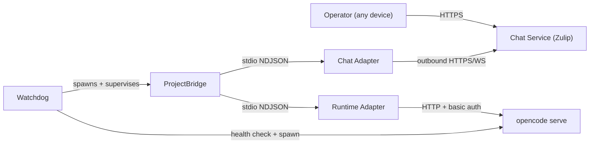

## Design Intent

**Context:** The swain-helm system has three process types that need placement, connection, and lifecycle definitions.

**Goals:**
- Clear component homes — each process type has an unambiguous host and parent.
- Outbound-only connections — no inbound ports on project hosts.
- Single watchdog per host — one supervisor, not one per domain or project.

**Constraints:**
- Bridges need filesystem and runtime CLI access.
- Chat service must be reachable.
- No inbound ports on project hosts.

**Non-goals:**
- High availability.
- Multi-region deployment.
- Container orchestration.

## Interface Surface

The deployment boundary between the watchdog, project bridges, opencode serve, and the chat service. All connections are outbound from the project host; no component accepts inbound TCP connections except opencode serve on localhost.

## Contract Definition

| Component | Runs on | Managed by |
|-----------|---------|-------------|
| Watchdog | Project host (native process) | swain-helm CLI or OS init |
| ProjectBridge | Project host (child of watchdog) | Watchdog |
| Chat adapter subprocess | Project host (child of ProjectBridge) | ProjectBridge |
| Runtime adapter subprocess | Project host (child of ProjectBridge) | ProjectBridge |
| Chat service | Hosted platform (Zulip Cloud) | Platform provider |
| opencode serve | Project host (shared process) | Watchdog / operator |

## Behavioral Guarantees

- **Watchdog crash:** All bridges and sessions continue running. No supervision until watchdog restarts.
- **ProjectBridge crash:** Watchdog detects within 30s, restarts. Bridge reads session-registry.json on startup.
- **Chat adapter crash:** ProjectBridge detects (stdout closed), restarts it.
- **Runtime adapter crash:** ProjectBridge detects, marks session dead, restarts if worktree still exists.
- **opencode serve crash:** Watchdog detects via health check, restarts if started_by_bridge=true.
- **Zulip event queue expires:** Chat adapter re-registers (SDK handles BAD_EVENT_QUEUE_ID).

## Integration Patterns

- **Credential resolution:** 1Password at startup, cached in process memory.
- **opencode serve discovery:** Scan configured ports, auth per-port, start if none found.
- **Project registration:** CLI writes config, watchdog picks it up on next reconciliation.
- **Session data:** `<project-root>/.swain/swain-helm/sessions/opencode/<branch>.json`

## Evolution Rules

- Adding a chat service: new chat adapter plugin, no topology change.
- v2: HTTP management API on watchdog for remote control.
- v2: OS-native daemon (launchd/systemd) replaces simple watchdog.

## Edge Cases

- **1Password locked at startup:** Watchdog exits, no partial startup.
- **Two watchdog processes:** PID file collision check, second exits with error.
- **opencode serve on unexpected port:** Noted in instance tracker, not used (no credentials).

## Design Decisions

- Native daemons over Docker — need tmux and filesystem access.
- One watchdog per host, not per domain — reduces resource overhead and simplifies supervision.

## Lifecycle

| Status | Date | Until | Note |
|--------|------|-------|------|
| Active | 2026-04-18 | -- | Replaces DESIGN-023. |