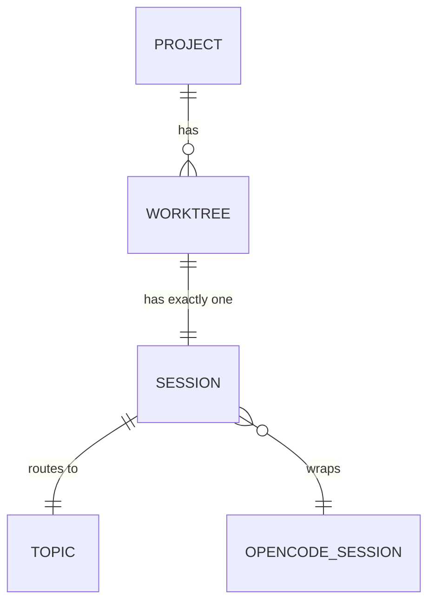

## Design Intent

**Context:** A project bridge must track one opencode session per git worktree, with Zulip topics mapping to branch names.

**Goals:**
- One session per worktree.
- Deterministic topic naming.
- Session persistence across restarts.
- Worktree lifecycle tracking.

**Constraints:**
- `git worktree list` is the source of truth for active worktrees.
- No second session per worktree under any circumstance.

**Non-goals:**
- Multi-session per worktree.
- Artifact-based topic naming.
- Cross-project session references.

## Data Surface

The session registry and its relationship to git worktrees and Zulip topics. All mutations write through to `session-registry.json` before returning.

## Entity Model

**Entities:**

- **PROJECT:** name, path, stream.
- **WORKTREE:** path, branch, project.
- **SESSION:** opencode_session_id, state, topic, worktree_path, artifact, started_at, last_activity.
- **TOPIC:** name, stream, session_id.
- **OPENCODE_SESSION:** id, port, worktree_path.

## Data Flow

1. Worktree scanner polls `git worktree list --porcelain`.
2. Diff against cached set → new/removed worktrees.
3. New worktree → create opencode session → write session registry entry → announce in control topic.
4. Removed worktree → abort opencode session → export session data → delete registry entry → announce.
5. State change → write session-registry.json.

## Schema Definitions

`session-registry.json` entry fields:

| Field | Type | Nullable | Constraints | Description |
|-------|------|----------|-------------|-------------|
| opencode_session_id | string | no | UUID format | The opencode serve session ID |
| state | string | no | one of: active, idle, dead | Current session state |
| topic | string | no | matches branch name or "trunk" | Zulip topic for this session |
| worktree_path | string | no | absolute path | Filesystem path to worktree root |
| artifact | string | yes | SPEC-NNN or null | Bound artifact if any |
| started_at | ISO 8601 | no | - | When session was created |
| last_activity | ISO 8601 | no | - | Last message or state change |

## Evolution Rules

- Additive only — new fields may be added to the session registry schema.
- Never remove fields — use null for unused fields instead.

## Invariants

- One session per worktree (enforced by primary key = branch name).
- Topic name = branch name for worktrees, "trunk" for trunk.
- Session registry file always reflects current state after any mutation.
- Orphaned sessions (worktree gone but session alive) are terminated within one poll cycle.

## Edge Cases

- **Branch name with special characters:** Sanitize for Zulip topic (alphanumeric + hyphens only).
- **Colliding branch names across worktrees:** Use full path basename to disambiguate.
- **Session registry corruption:** Rebuild from opencode session list + git worktree list.

## Design Decisions

- Branch name as topic (not artifact name) — worktrees are the unit of work, artifacts are bound later.
- Trunk is always "trunk" (no prefix).
- Session export is deferred to v2.

## Lifecycle

| Status | Date | Until | Note |
|--------|------|-------|------|
| Active | 2026-04-18 | -- | New design for swain-helm architecture. |