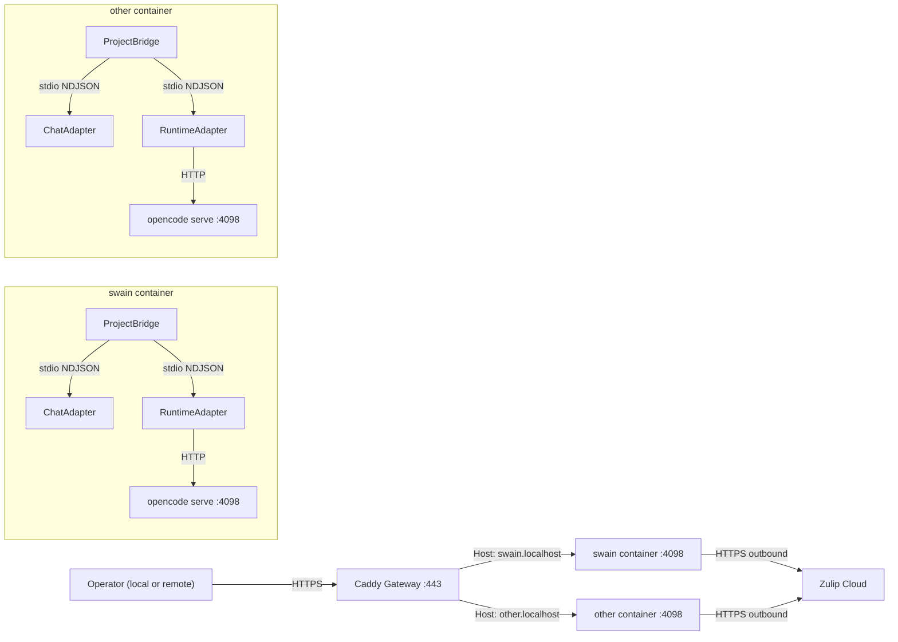

# swain-helm Container Gateway Topology

## Design Intent

**Context:** swain-helm's deployment topology must provide project isolation, remote inspectability, and zero-config deployment while preserving the NDJSON subprocess adapter model.

**Goals:**
- Each project's sessions and filesystem are isolated from every other project's.
- Operators can inspect any project's sessions from one URL space, locally or remotely.
- Adding a project requires adding a compose service — no gateway reconfiguration.
- The existing local-dev workflow (macOS native, no Docker) continues to work.

**Constraints:**
- opencode serve uses root-level HTTP paths (`/session`, `/event`, `/global/health`). Subpath routing (`/projects/A/session`) is not possible.
- opencode's built-in basic auth has a bug where `opencode attach` does not send credentials correctly. A reverse proxy must inject the `Authorization` header.
- No session should be able to access files outside its project directory (v1 constraint; future v2 may allow targeted read-only access).
- The system must work on a consumer machine without assuming the operator's specific zsh setup.

**Non-goals:**
- High availability or multi-region deployment.
- Micro-VM isolation (v2 concern).
- Managing opencode instances not owned by swain-helm.

## Interface Surface

The boundary between the operator (local or remote), the Caddy gateway, and per-project containers. All connections to Caddy are authenticated; connections from Caddy to containers inject auth headers.

## Contract Definition

| Component | Runs on | Managed by |
|-----------|---------|-------------|
| Caddy gateway | Docker container (compose service) | Docker Compose |
| Project bridge + opencode serve | Docker container (per project) | Docker Compose `restart: unless-stopped` |
| Chat adapter subprocess | Inside project container (child of bridge) | Bridge process via process groups |
| Runtime adapter subprocess | Inside project container (child of bridge) | Bridge process via process groups |
| Chat service | Hosted platform (Zulip Cloud) | Platform provider |

## Behavioral Guarantees

- **Caddy crash:** Projects continue running. Caddy restarts via Docker. Sessions are unaffected (Caddy is not in the data path between bridge and chat).
- **Project container crash:** Docker restarts the container. Bridge re-registers with Zulip. Sessions resume from opencode serve's persistent state.
- **Bridge process crash (inside container):** Process group termination kills all child subprocesses. Docker restarts the container.
- **Chat adapter crash:** Bridge detects (stdout closed), restarts it as a subprocess.
- **Runtime adapter crash:** Bridge detects, marks session dead, restarts if worktree still exists.
- **opencode serve crash:** Bridge detects via health check, restarts it.
- **Operator network interruption:** Zulip SDK re-registers the event queue. No data loss.

## Integration Patterns

- **Hostname-based routing:** Caddy routes by `Host` header. Each project gets a unique hostname (e.g., `swain.localhost`, `other.localhost`). No subpath routing.
- **Auth header injection:** Caddy handles basic auth (browser and API clients) and injects `Authorization` header via `header_up`, working around the opencode `attach` auth bug.
- **Docker label discovery:** Caddy auto-discovers project containers via Docker labels (`caddy=<hostname>`, `caddy.reverse_proxy={{upstreams 4098}}`). Adding a project = adding a compose service.
- **Tailscale for remote access:** One Tailscale node on the host. Caddy binds to the Tailscale interface. `opencode attach https://swain.tail-xxxx.ts.net` works from any device on the tailnet.
- **Local dev without Docker:** Bridge runs natively on macOS. One opencode serve on port 4095/4096 (existing setup). No Caddy, no routing — single project, single port.
- **Container filesystem isolation:** The entrypoint script mounts tmpfs over parent directories and bind-mounts the project read-write, matching the existing `entrypoint.sh` pattern.

## Evolution Rules

- **Adding a chat provider:** New chat adapter plugin (NDJSON-over-stdio). No topology change.
- **Adding an agent runtime:** New runtime adapter plugin. No topology change.
- **Micro-VM isolation (v2):** Replace Docker containers with micro-VMs. Same Caddy routing, same gateway, same compose shape. The per-project isolation boundary stays the same.
- **HTTP management API (v2):** Add a management endpoint to the bridge process for remote control. Goes through Caddy like any other HTTP route.

## Edge Cases and Error States

- **1Password locked at container start:** Entrypoint exits. Docker `restart: unless-stopped` retries. No partial startup.
- **Two instances of the same project:** Docker compose prevents this (container name uniqueness). If manually started, Zulip event queue conflicts produce duplicate messages.
- **opencode serve on unexpected port:** Bridge health check detects and restarts it on the configured port.
- **Stale processes from previous run:** Bridge scans for orphan swain_helm processes on startup and kills them (defense against Docker restart edge cases).
- **Caddy certificate management:** Caddy handles TLS certificates automatically via Let's Encrypt for public domains and self-signed certs for localhost.

## Design Decisions

- Caddy over Traefik: Caddy's `header_up` injection is simpler to configure for the opencode auth bug workaround. Both support Docker label discovery.
- Port 4098 inside containers (not 4095/4096): Avoids conflict with local dev opencode instances on the host machine.
- Process groups (`os.setpgrp`) for cascade termination: Unix-native mechanism, works on Linux containers. macOS local dev uses the same mechanism with identical behavior.
- `restart: unless-stopped`: Docker's native restart policy replaces the watchdog's reconciliation loop. Simpler, battle-tested, no PID file management.

## Lifecycle

| Status | Date | Commit | Note |
|--------|------|-------|------|
| Active | 2026-04-24 | -- | Replaces DESIGN-032. Container-per-project with Caddy gateway topology. |