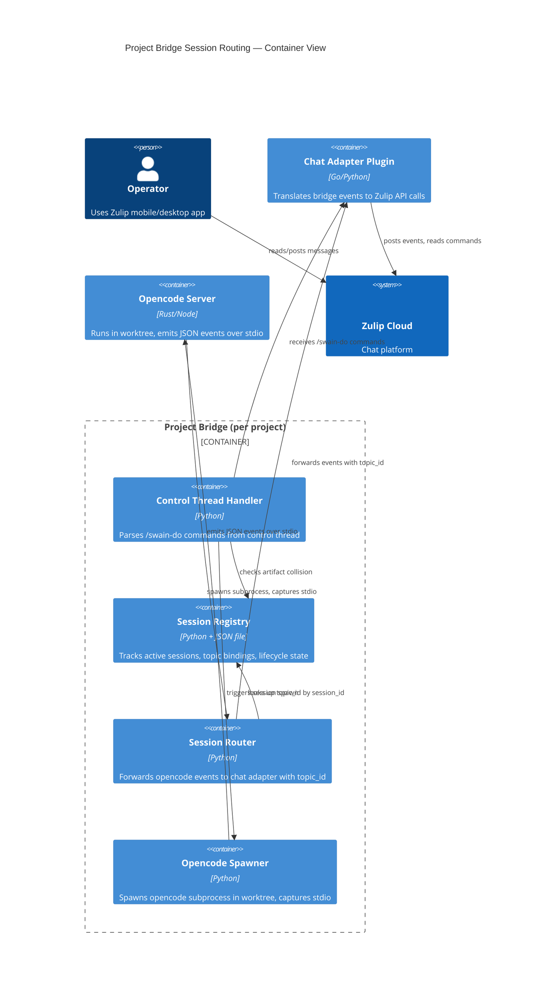
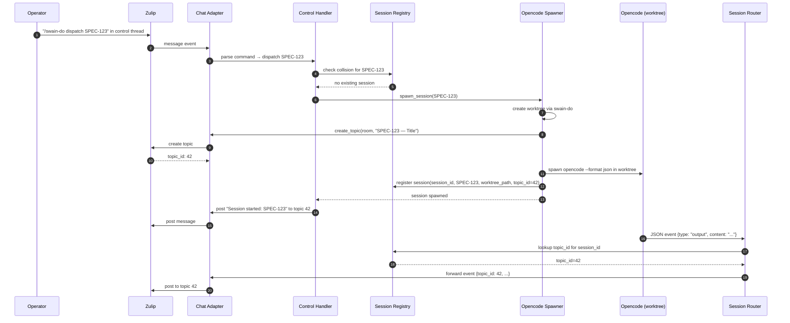
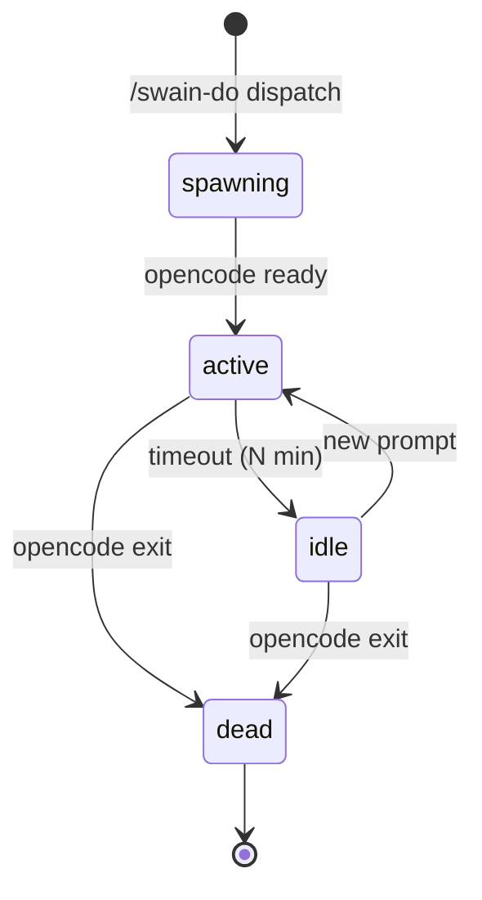

# Project Bridge Session Routing Architecture

## Design Intent

**Context:** The project bridge manages multiple concurrent opencode sessions across multiple worktrees, routing each session's output to the correct Zulip topic.

**Goals:**
- Sessions are isolated — output from one worktree never leaks to another topic.
- The bridge owns routing logic; opencode servers know nothing about Zulip.
- Session lifecycle (spawn, active, idle, dead) is tracked and recoverable.
- Topic IDs are stable and persisted across bridge restarts.

**Constraints:**
- Opencode speaks JSON over stdio — no Zulip awareness.
- Chat adapter is a separate plugin — bridge routes to it, not directly to Zulip.
- Multiple sessions can run concurrently under one project bridge.

**Non-goals:**
- Direct opencode-to-Zulip communication (violates layering).
- Session migration between bridges (future enhancement).

## Session Registry

The project bridge maintains an in-memory registry of active sessions:

```python
class SessionRegistry:
    sessions: dict[SessionId, SessionState]
    
class SessionState:
    session_id: str           # e.g., "session-20260407-001"
    artifact_id: str          # e.g., "SPEC-123"
    worktree_path: str        # absolute path to worktree
    zulip_topic_id: int       # Zulip topic/message ID for this session
    lifecycle_state: str      # spawning | active | idle | dead
    opencode_pid: int         # PID of opencode subprocess
    created_at: datetime
    last_activity: datetime
```

**Persistence:** The registry is written to disk (`<project>/.agents/session-registry.json`) on every state change. On restart, the bridge reconciles:
- Sessions with dead PIDs → mark as `dead`, post to control thread.
- Sessions with live PIDs → resume routing.

## Session-to-Topic Binding

When a session is spawned:

1. Bridge creates Zulip topic via chat adapter: `create_topic(room_id, artifact_id)` → returns `topic_id`.
2. Bridge stores `topic_id` in session registry.
3. All events from this session are forwarded with `topic_id` metadata.
4. Chat adapter posts to the topic.

**Topic naming convention:**
```
<artifact-id> — <short-title>
e.g., "SPEC-123 — Control Thread Worktree Spawning"
```

## C4 Container Diagram



## Sequence Diagram: Session Spawn



## Session Lifecycle States

| State | Transition In | Transition Out | Trigger |
|-------|---------------|----------------|---------|
| `spawning` | — | `active` | Worktree created, opencode starting |
| `active` | `spawning` | `idle`, `dead` | Opencode ready, processing prompts |
| `idle` | `active` | `active`, `dead` | No activity for N minutes |
| `dead` | any | — | Opencode exited, session ended |

**State machine:**


## Event Schema (Opencode → Bridge)

Opencode emits JSON over stdout. The bridge wraps events with session metadata:

**Opencode native event:**
```json
{
  "type": "output",
  "content": "Working on SPEC-123...",
  "timestamp": "2026-04-07T10:30:00Z"
}
```

**Bridge-wrapped event (to chat adapter):**
```json
{
  "bridge": "project-<project-id>",
  "session_id": "session-20260407-001",
  "topic_id": 42,
  "event": {
    "type": "output",
    "content": "Working on SPEC-123...",
    "timestamp": "2026-04-07T10:30:00Z"
  }
}
```

The chat adapter uses `topic_id` to route to the correct Zulip topic.

## Error Handling

| Error | Detection | Recovery |
|-------|-----------|----------|
| Opencode crashes | PID exits, stdio closes | Mark session `dead`, post to control thread |
| Zulip topic creation fails | Chat adapter returns error | Abort spawn, report to control thread |
| swain-do worktree creation fails | Non-zero exit code | Abort spawn, report error |
| Bridge restarts mid-session | PID dead on reconcile | Mark `dead`, offer respawn |
| Topic ID lost (corrupt registry) | Topic lookup returns None | Create new topic, update registry |

## Deployment Notes

- **Session registry location:** `<project>/.agents/session-registry.json`
- **Worktree location:** `<repo-root>/../<repo-name>-<branch>-<session-id>/`
- **Chat adapter:** Single instance per project bridge, spawned as subprocess
- **Zulip topic lifecycle:** Topics persist after session ends (Zulip behavior). Bridge does not delete topics.

## Lifecycle

| Phase | Date | Commit | Notes |
|-------|------|--------|-------|
| Active | 2026-04-07 | | Created for SPEC-298 session routing |
