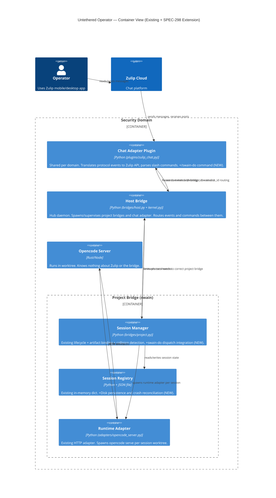
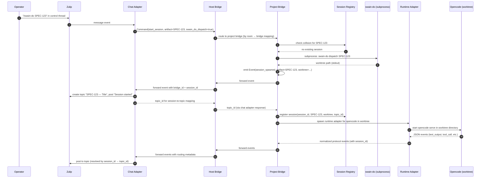
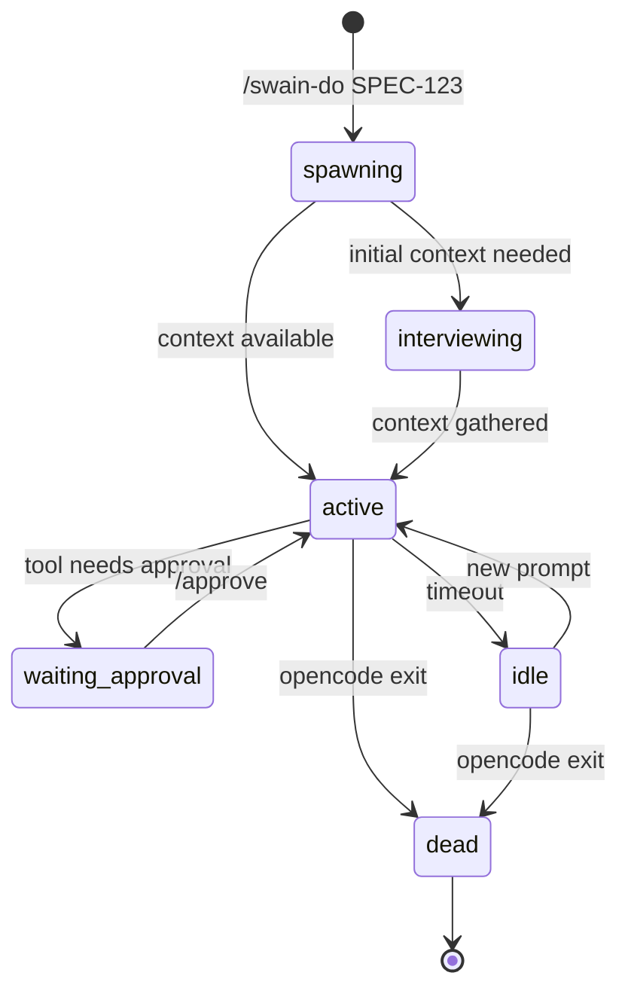

# Project Bridge Session Routing Architecture

## Design Intent

**Context:** The project bridge manages multiple concurrent opencode sessions across multiple worktrees, routing each session's output through the host bridge to the correct Zulip topic via the chat adapter plugin.

**Goals:**
- Sessions are isolated — output from one worktree never leaks to another topic.
- The project bridge owns session state; opencode servers know nothing about Zulip.
- Hub-and-spoke routing is preserved — project bridges never talk to the chat adapter directly.
- Session lifecycle (spawn, active, idle, dead) is tracked and persisted for crash recovery.
- Topic-to-session binding is stable across bridge restarts.

**Constraints:**
- Opencode speaks JSON over stdio — no Zulip awareness.
- All events route through: Opencode → Project Bridge → Host Bridge → Chat Adapter → Zulip.
- Chat adapter is a shared plugin (one per domain), not per project bridge.
- Multiple sessions can run concurrently under one project bridge.

**Non-goals:**
- Direct opencode-to-Zulip communication (violates hub-and-spoke layering).
- Session migration between bridges (future enhancement).
- Replacing existing protocol.py event schema (this extends it, not reinvents it).

## Existing Implementation

The bridge is already built and working. Key components in `src/untethered/`:

| Component | File | Role |
|-----------|------|------|
| HostKernel | `kernel.py` | Spawns plugin subprocesses, routes NDJSON between chat and project plugins |
| HostBridge | `bridges/host.py` | Hub daemon — project registration, command routing, host-scope command stubs |
| ProjectBridge | `bridges/project.py` | Session orchestrator — lifecycle, artifact binding, collision detection, runtime spawning |
| Protocol | `protocol.py` | Full NDJSON published language (Events + Commands) |
| ZulipChatAdapter (plugin) | `plugins/zulip_chat.py` | Zulip event formatting, message parsing, slash commands |
| OpenCodeServerAdapter | `adapters/opencode_server.py` | HTTP client — session create, message send, response parsing |

The project bridge already manages an in-memory `sessions` dict with lifecycle states. The Zulip adapter already creates topics and posts events. The host kernel already routes events between project bridges and the chat adapter.

This design documents the **gaps** that SPEC-298 fills — not a replacement or parallel architecture.

## Session Registry Persistence (Gap)

The existing `sessions` dict is in-memory only. On bridge restart, all session state is lost.

**Gap fix:** Persist to `<project>/.agents/session-registry.json` on every state change.

```python
# Existing in-memory structure (bridges/project.py)
# This already tracks: session_id, artifact_id, lifecycle_state, runtime, topic_id

# Addition: disk persistence
class SessionRegistry:
    sessions: dict[SessionId, SessionState]
    registry_path: Path  # <project>/.agents/session-registry.json

    def on_state_change(self):
        self.registry_path.write_text(json.dumps(self.sessions, indent=2))

    def reconcile_on_startup(self):
        for session_id, state in self.sessions.items():
            if not self._pid_alive(state.opencode_pid):
                state.lifecycle_state = "dead"
                # emit session_died event
```

**Startup reconciliation:**
- Dead PIDs → mark `dead`, emit `session_died` event (host bridge posts to control thread).
- Live PIDs → resume routing, re-subscribe to stdio.
- Orphaned topics (topic exists but session gone) → post closure notice to topic.

## `/swain-do` Command (Gap)

The Zulip adapter already supports `/work`, `/session`, `/approve`, `/cancel`, `/kill`. SPEC-298 adds `/swain-do`.

**Command syntax:** `/swain-do SPEC-123` — dispatch is implicit from the control thread context. No subcommand needed.

**Zulip adapter parsing:**
```python
# In plugins/zulip_chat.py message parser
if text.startswith("/swain-do "):
    artifact_id = text[len("/swain-do "):].strip()
    return Command("start_session", {
        "runtime": "opencode",
        "artifact": artifact_id,
        "swain_do_dispatch": True,  # flag: create worktree via swain-do
    })
```

**Project bridge handling:**
```python
# In bridges/project.py launch_session flow
if params.get("swain_do_dispatch"):
    worktree_path = self._invoke_swain_do(params["artifact"])
    session.workdir = worktree_path
```

The `_invoke_swain_do` method:
1. Runs `swain-do dispatch <artifact-id>` as subprocess.
2. Captures stdout for worktree path.
3. Returns path or raises on failure.

## Hub-and-Spoke Routing (Existing, Preserved)

The routing topology is already correct. This section documents it for clarity.

```
Opencode (worktree A) ──stdio──→ ProjectBridge ──NDJSON──→ HostBridge ──NDJSON──→ ChatAdapter ──API──→ Zulip (topic A)
Opencode (worktree B) ──stdio──→ ProjectBridge ──NDJSON──→ HostBridge ──NDJSON──→ ChatAdapter ──API──→ Zulip (topic B)
```

The project bridge emits events with `session_id`. The host bridge adds `bridge_id` (project identity). The chat adapter uses `bridge_id` → room mapping and `session_id` → topic mapping to route correctly.

**Project bridge never talks to chat adapter.** The host bridge is the single routing hub.

## C4 Container Diagram



## Sequence Diagram: /swain-do Flow



## Event Routing Detail

Events flow through three layers. Each layer adds metadata; none removes it.

**Layer 1: Opencode → Runtime Adapter (HTTP/stdio)**
```json
{"type": "text_output", "content": "Working on SPEC-123...", "timestamp": "..."}
```

**Layer 2: Runtime Adapter → Project Bridge (protocol.py)**
```json
{"event": "text_output", "session_id": "session-001", "content": "Working on SPEC-123..."}
```

**Layer 3: Project Bridge → Host Bridge → Chat Adapter (with routing)**
```json
{"bridge": "project-swain", "session_id": "session-001", "event": {"event": "text_output", "content": "..."}}
```

The chat adapter maintains an internal `session_id → topic_id` mapping. When it receives an event with `session_id`, it posts to the corresponding topic. No Zulip awareness needed in the project bridge.

## Session Lifecycle States (Existing)

The project bridge already implements these states:

| State | Transition In | Transition Out | Trigger |
|-------|---------------|----------------|---------|
| `spawning` | — | `active` | Worktree created, opencode starting |
| `interviewing` | `spawning` | `active` | Session gathering initial context (existing) |
| `active` | `spawning`/`interviewing` | `waiting_approval`, `idle`, `dead` | Processing prompts |
| `waiting_approval` | `active` | `active` | Tool call pending operator approval |
| `idle` | `active` | `active`, `dead` | No activity for N minutes |
| `dead` | any | — | Opencode exited, session ended |

**State machine:**


## Error Handling

| Error | Detection | Recovery |
|-------|-----------|----------|
| Opencode crashes | PID exits, HTTP connection drops | Mark session `dead`, emit `session_died`, host bridge posts to control thread |
| Zulip topic creation fails | Chat adapter returns error | Abort spawn, emit error to control thread |
| swain-do worktree creation fails | Non-zero exit code | Abort spawn, report error to control thread |
| Bridge restarts mid-session | Reconcile on startup (NEW) | Dead PIDs → `dead`, live PIDs → resume routing |
| Topic ID lost (corrupt registry) | Session lookup returns None | Create new topic, update registry, post reconnection notice |

## Deployment Notes

- **Session registry location:** `<project>/.agents/session-registry.json`
- **Worktree location:** determined by swain-do dispatch (SPEC-195)
- **Chat adapter:** shared per domain, spawned by host bridge, not per project bridge
- **Zulip topic lifecycle:** Topics persist after session ends (Zulip behavior). Bridge does not delete topics.
- **Existing code:** `src/untethered/` — this design extends, not replaces

## Lifecycle

| Phase | Date | Commit | Notes |
|-------|------|--------|-------|
| Active | 2026-04-07 | | Created for SPEC-298 session routing |
| Active | 2026-04-12 | | Rewritten: correct hub-and-spoke, reflect existing codebase, /swain-do SPEC-123 syntax |