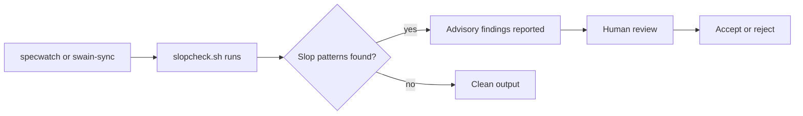

# Quality Signal Pipeline

## Design Intent

**Context:** AI-generated code carries invisible quality costs — slop patterns, debugging burden, and architectural drift — that the system currently cannot detect, track, or surface.

### Goals

- Make AI-characteristic code patterns visible before they merge.
- Give Shippers explicit permission to accept quality debt, tracked and time-bound.
- Produce commit-level signals that distinguish human- from AI-generated diffs.
- Flag artifacts that have stalled in non-terminal phases.

### Constraints

- Slop detection must be advisory, not blocking — it surfaces patterns for human review.
- Quality debt fields must not break existing SPEC frontmatter schemas.
- Commit annotations must be lightweight and non-invasive (no runtime tracking).
- Staleness thresholds must be configurable per repo.

### Non-goals

- Auto-fixing detected slop patterns (detection only).
- Replacing existing linting or formatting tools.
- Tracking which individual developer or AI model generated each line.
- CI/CD pipeline integration (separate concern).

## Interface Surface

The quality signal pipeline adds four new interfaces to the swain toolchain: a slop scanner, a debt tracker, a commit annotator, and a staleness detector.

## Contract Definition

### `slopcheck.sh` — AI Slop Pattern Scanner

**Input:** File paths or git diff output.
**Output:** Advisory findings (pattern, file, line, severity: advisory).
**Exit code:** Always 0 (advisory, never blocking).
**Idempotency:** Same input produces same findings.

### `quality-debt` frontmatter — SPEC Debt Tracking

**Input:** SPEC frontmatter fields.
**Output:** Visible in `chart.sh debt` lens.
**Fields:**
- `quality-debt:` list of accepted shortcuts (strings)
- `quality-debt-due:` ISO date for reconciliation

### Commit `Code-By` trailer

**Input:** Git commit message during `swain-sync`.
**Output:** `Code-By: human | ai-assisted | ai-generated` trailer.
**Convention:** Analogous to `Signed-off-by`. Added by swain-sync based on session metadata.

### Staleness detection in `specwatch.sh`

**Input:** Artifact frontmatter dates and phase directories.
**Output:** `STALE_PHASE` findings when an artifact has been in a non-terminal phase beyond a configurable threshold (default: 60 days).

## Behavioral Guarantees

- `slopcheck.sh` exits 0 even when findings exist — it never blocks a transition.
- `quality-debt` fields are optional; omitting them means no debt accepted.
- `Code-By` trailers are informational and do not affect merge decisions.
- Staleness findings are advisory and do not force phase transitions.

## Integration Patterns

- `slopcheck.sh` integrates into `specwatch scan` and `swain-sync` preflight.
- `quality-debt` displays in `chart.sh debt` lens alongside `ready` and `recommend`.
- `Code-By` integrates into `swain-sync` commit message generation.
- Staleness integrates into `specwatch scan` output as a new finding type.

## Evolution Rules

- Slop pattern ruleset must be extensible per repo (`.slopcheck.yaml` or similar).
- Default patterns ship with swain; teams add project-specific patterns.
- `quality-debt-due` dates trigger advisory warnings, not hard blocks.
- Staleness thresholds are repo-level configuration, not global constants.

## Edge Cases and Error States

- **No slop patterns defined:** `slopcheck.sh` exits 0 with no output (silent pass).
- **SPEC with debt but no due date:** Permitted; `chart.sh debt` shows it without a deadline.
- **Session metadata unavailable for Code-By:** Omit the trailer rather than guess.
- **Artifact moved between phases resetting the staleness clock:** Use `last-updated` frontmatter, not directory timestamps.

## Design Decisions

1. **Slop detection is advisory, not blocking.** Builders want to see patterns, not have a tool reject their code. Shippers need the system to inform, not prevent.
2. **Quality debt is opt-in, not opt-out.** Debt fields are empty by default. Accepting debt is an explicit choice that creates visibility.
3. **Code-By uses trailers, not git attributes.** Trailers are visible in `git log`, searchable, and don't require special git config.
4. **Staleness uses frontmatter dates, not filesystem timestamps.** Frontmatter is authoritative and survives git operations.

## Assets

_Index of supporting files to be added during implementation._

## Lifecycle

| Phase | Date | Commit | Notes |
|-------|------|--------|-------|
| Proposed | 2026-04-18 | — | Created from Builder/Shipper persona evaluation |