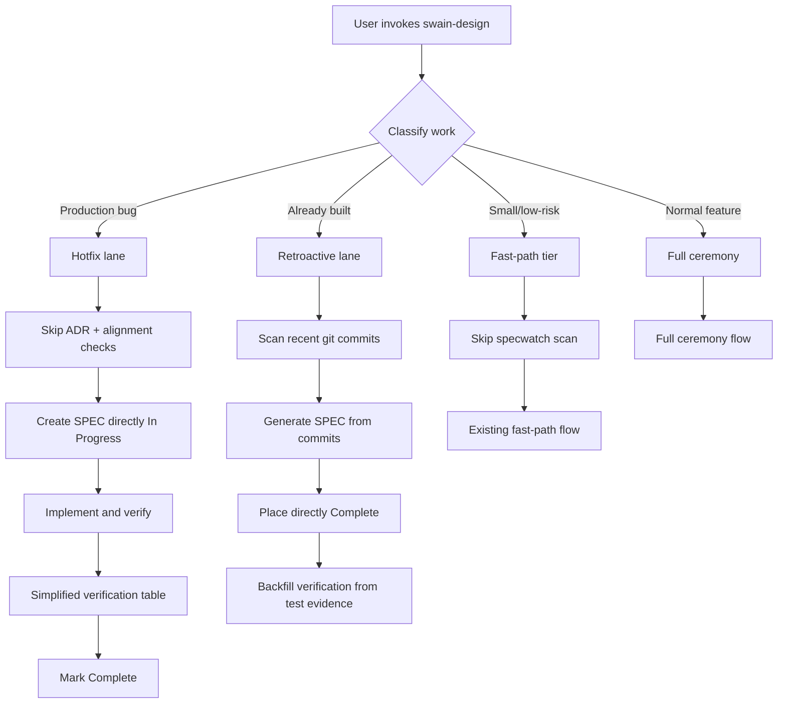

# Lifecycle Pathways

## Design Intent

**Context:** Swain's artifact lifecycle has one speed: full ceremony. There is no legitimate fast path for validated patterns, production bugs, or retroactive documentation, forcing Shippers to fight the system or skip it entirely.

### Goals

- Give Shippers legitimate escape hatches that work with the system, not against it.
- Reduce ceremony for low-risk work without weakening verification for high-risk work.
- Capture decisions retroactively so build-first workflows produce the same artifact graph quality as plan-first workflows.
- Prevent organizational debt from accumulating through stale artifact detection.

### Constraints

- Fast paths must preserve ADR compliance checking and alignment verification — they skip delay, not safety.
- Retroactive specs must still populate the artifact graph correctly (lifecycle table, index, frontmatter).
- Staleness thresholds must be configurable per repo.
- The existing SPEC `type: feature | enhancement | bug` taxonomy is not changing. CHORE exists for lightweight non-feature work and is not being renamed.

### Non-goals

- Adding new artifact types (CHORE and SPEC types cover the current taxonomy).
- Changing the verification gate model (tracked in DESIGN-0027).
- Adding EXPERIMENT artifact type (tracked in DESIGN-0028).
- Replacing the full-ceremony path for complex work.

## Interaction Surface

The lifecycle pathways design covers how users interact with the artifact system at different speeds: hotfix mode for production bugs, retroactive mode for build-first documentation, fast-path mode for low-complexity work, and staleness triage for organizational health.

## User Flow

## Screen States

1. **Normal mode:** Current full-ceremony flow (unchanged).
2. **Hotfix mode:** Triggered by `--hotfix` or `--fire` flag. SPEC created in `In Progress` with fast-path tier. Skips ADR check, alignment check, specwatch scan, and index refresh. Simplified verification table at completion.
3. **Retroactive mode:** Triggered by `--retroactive` flag. Scans recent git commits, generates a SPEC describing what was already built, places it in `Complete` with verification table backfilled from test evidence.
4. **Staleness triage:** Background — `specwatch scan` flags artifacts stuck in non-terminal phases beyond threshold. Surfaces as `STALE_PHASE` findings.

## Edge Cases and Error States

- **Hotfix SPEC later needs epic parenting:** User can retroactively add `parent-epic` to a hotfix SPEC. No lifecycle change required.
- **Retroactive SPEC with no recent commits:** Prompt user for commit range; if empty, fall back to normal SPEC creation.
- **Fast-path SPEC that grows in complexity:** User can manually switch to full ceremony by removing fast-path designation and running `specwatch scan`.
- **Staleness threshold set to 0:** Disables staleness detection entirely (repo-level config escape hatch).
- **Multiple retroactive SPECs for same commit range:** Warn about overlap; let user resolve.

## Design Decisions

1. **Hotfix is a flag, not a type.** SPECs don't get a new `type: hotfix`. The `type: bug` or `type: fix` already exists — hotfix is a modifier on the lifecycle, not the artifact itself.
2. **Retroactive specs start in Complete.** There's no point running a Proposed → Active → Complete lifecycle for work that's already done. The lifecycle table records the retroactive creation path.
3. **`swain-do: required | optional | skip`.** The existing hard requirement becomes a spectrum. Default stays `required`. `optional` creates a plan but doesn't enforce it. `skip` omits the plan entirely.
4. **Staleness is a finding, not a force.** `specwatch` surfaces `STALE_PHASE` but doesn't auto-transition or auto-abandon. Human triage is required.

## Assets

_Index of supporting files to be added during implementation._

## Lifecycle

| Phase | Date | Commit | Notes |
|-------|------|--------|-------|
| Proposed | 2026-04-18 | — | Created from Builder/Shipper persona evaluation |