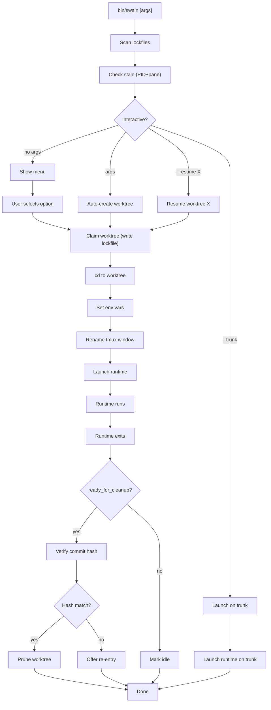

# DESIGN-021: bin/swain Worktree Router

## Interaction Surface

bin/swain is the structural entry point for swain sessions. It routes worktree selection/creation, claims the worktree via lockfile, launches the runtime IN the worktree, and handles cleanup on exit.

## User Flow



### Operator's Perspective

**Interactive mode (no args):**
```
$ swain
[1] Resume spec-054-worktree-isolation (15 min ago, PID 12345)
[2] Resume epic-012-migration (2 hours ago, PID 12345)
[3] Create new worktree
[4] Browse artifacts from chart
[5] Work on trunk (no isolation)
[6] Cleanup orphaned worktrees

Choice:
```

**Auto-create (purpose text):**
```
$ swain "implement SPEC-054 lockfile schema"
→ Extracts SPEC-054
→ Looks up title: "Worktree Isolation Redesign"
→ Creates: spec-054-worktree-isolation-redesign
→ Claims worktree
→ Launches claude
```

**Resume specific:**
```
$ swain --resume spec-054-worktree-isolation-redesign
→ Finds lockfile
→ Checks if active/stale
→ Claims worktree
→ Launches claude
```

**Trunk mode:**
```
$ swain --trunk
⚠ WARNING: Working on trunk violates worktree discipline.

This should only be used for:
- Quick typo fixes (≤3 files)
- Merge/rebase operations
- Emergency hotfixes

Proceed on trunk? (y/N):
```

### bin/swain's Perspective

**Lockfile scan:**
```bash
for lockfile in .agents/worktrees/*.lock; do
  source "$lockfile"
  if is_stale "$lockfile"; then
    status="orphaned"
  elif [[ "${ready_for_cleanup:-}" == "true" ]]; then
    status="ready"
  else
    status="active"
  fi
done
```

**Claim write:**
```bash
cat > "$LOCKFILE" << EOF
version=1
pid=$$
user=$(whoami)
exe=$RUNTIME
pane_id=$PANE_ID
claimed_at=$(date -Iseconds)
worktree_path=$WORKTREE_PATH
purpose="$PURPOSE"
status=active
EOF
```

**Cleanup verification:**
```bash
if [[ "${ready_for_cleanup:-}" == "true" ]]; then
  CURRENT=$(git -C "$WORKTREE_PATH" rev-parse HEAD)
  if [[ "$CURRENT" != "$READY_COMMIT" ]]; then
    echo "⚠ Worktree has new commits since ready_for_cleanup"
    # Offer re-entry
  else
    git worktree remove "$WORKTREE_PATH"
    rm "$LOCKFILE"
  fi
fi
```

## Screen States

### Menu Display
```
=== Worktree Selection ===

Active worktrees:
[1] spec-054-worktree-isolation-redesign
    Created: 15 min ago | PID: 12345 | Pane: %66
    Purpose: "implement SPEC-054 lockfile schema"

[2] epic-012-migration-20260404-143022
    Created: 2 hours ago | PID: 12345 | Pane: %66
    Purpose: "migration"

Orphaned worktrees:
[3] spec-050-chart-rendering (stale, 2 days ago)

Options:
[4] Create new worktree
[5] Browse artifacts from chart
[6] Work on trunk (no isolation)
[7] Cleanup orphaned worktrees

Choice:
```

### Collision Warning (Container)
```
⚠ Worktree 'epic-012-migration-*' already exists (active, PID 12345)

Options:
[1] Resume existing worktree
[2] Create new (epic-012-migration-20260404-150000)

Choice:
```

### Collision Error (Implementable/Standing)
```
⚠ Worktree 'spec-054-worktree-isolation' already exists (active, PID 12345)

Cannot create duplicate worktree for implementable artifact.

Options:
[1] Resume existing worktree
[2] Cancel

Choice:
```

### Ready for Cleanup
```
✓ Merged to trunk and pushed
⚠ Worktree marked ready_for_cleanup
  Worktree will be cleaned up when session ends.
```

### Cleanup Verification Failed
```
⚠ Worktree has new commits since ready_for_cleanup

  Ready commit: abc123
  Current commit: def456

The worktree was modified after marking ready. This may indicate:
- Additional work was done after swain-sync
- Another session modified the worktree

Options:
[1] Re-enter worktree to investigate (launches runtime)
[2] Force cleanup (discard new commits)
[3] Leave worktree as-is (keep lockfile)

Choice:
```

## Edge Cases and Error States

1. **Lockfile exists but path missing** — User manually deleted worktree
   - Detect: `[[ ! -d "$WORKTREE_PATH" ]]`
   - Response: "Lockfile exists but worktree missing. Remove stale lockfile?"

2. **PID recycling false positive** — Old lockfile, recycled PID
   - Detect: Check `user` and `exe` fields
   - Response: "PID belongs to different user/process. Claim is stale."

3. **Multiple tmux sessions** — pane_id exists in different session
   - Detect: `tmux list-panes -F '#{pane_id}'` across all sessions
   - Response: "Worktree claimed by pane %66 (session: research). Reattach?"

4. **Non-tmux runtime** — No pane_id
   - Detect: `[[ -z "$PANE_ID" ]]`
   - Response: Fall back to PID-only stale detection

5. **Worktree with uncommitted changes** — User wants cleanup but has dirty worktree
   - Detect: `git status --porcelain`
   - Response: "Uncommitted changes. Commit before cleanup? [y/n]"

6. **Concurrent swain launches** — Two panes launch swain simultaneously
   - Detect: Atomic lockfile write (temp file + mv)
   - Response: Second launch sees lockfile, warns of collision

## Design Decisions

1. **Lockfiles over JSON registry** — Simpler, git-ignorable, atomic writes
2. **Dual-check stale detection** — PID dead AND pane dead (handles E2: runtime quit, pane open)
3. **bin/swain does cleanup** — swain-sync marks ready, bin/swain verifies + prunes
4. **Artifact-aware naming** — Containers ask for purpose, implementable/standing use title
5. **Commit hash verification** — Prevents pruning worktrees with new commits
6. **Re-entry option** — If commit mismatch, offer to investigate before force-cleanup

## Assets

No wireframes — CLI interaction design. Menu states above serve as specification.

## Lifecycle

| Phase | Date | Commit | Notes |
|-------|------|--------|-------|
| Proposed | 2026-04-04 | — | Drafted for EPIC-056 |
