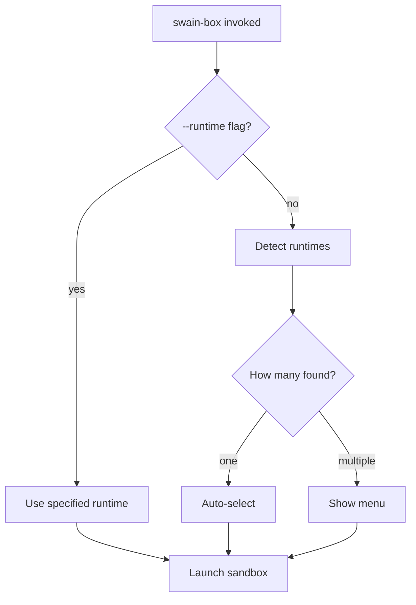

# swain-box Agent Selection Experience

## Interaction Surface

The terminal UX for `scripts/swain-box` from invocation to sandbox launch. Covers: detection phase output, the selection menu, error states, and the single-runtime fast path. This is a CLI-only surface — no GUI, no TUI library.

## User Flow



### Happy path: single runtime

```
$ swain-box /path/to/project
swain-box: using claude.
swain-box: CLAUDE_CODE_OAUTH_TOKEN set from Keychain.
[Docker Sandboxes launches]
```

No interaction required. The runtime name is echoed to stderr so the operator knows what launched.

### Happy path: multiple runtimes

```
$ swain-box /path/to/project
swain-box: Multiple agent runtimes available. Select one:
  1) claude
  2) copilot
  3) codex
Choice [1]: 2
swain-box: using copilot.
swain-box: GITHUB_TOKEN set from gh auth.
[Docker Sandboxes launches]
```

Operator types a number and presses Enter. Default (Enter alone) selects option 1.

### Explicit runtime flag

```
$ swain-box --runtime=codex /path/to/project
swain-box: using codex.
swain-box: NOTE: OPENAI_API_KEY not set. OpenAI Codex may require authentication inside the sandbox.
[Docker Sandboxes launches]
```

No menu shown. Credential note is advisory, not blocking.

### Non-interactive (piped / scripted)

```
$ echo "" | swain-box /path/to/project
swain-box: WARNING: multiple runtimes available; auto-selected claude (non-interactive mode). Use --runtime=<name> to specify.
[Docker Sandboxes launches]
```

## Screen States

| State | Description | Output target |
|-------|-------------|---------------|
| Detecting | Probing docker sandbox availability (silent, fast) | none |
| Single runtime | Auto-selected, prints runtime name | stderr |
| Multi-runtime menu | Numbered list + prompt | stdout |
| Awaiting input | Cursor after `Choice [1]: ` | stdout |
| Invalid input | "Invalid selection. Try again:" re-prompt | stdout |
| Second invalid | Exit non-zero with error message | stderr |
| No runtimes | Error + install hint | stderr |
| Credential note | Advisory warning when creds missing | stderr |
| Launch | `exec docker sandbox run ...` (replaces process) | — |

## Edge Cases and Error States

| Scenario | Behavior |
|----------|----------|
| No supported runtimes installed | Exit 1: "No supported agent runtimes found in Docker Sandboxes." |
| `--runtime=unknown` | Exit 1: "Runtime 'unknown' is not available in Docker Sandboxes." |
| Docker not installed | Exit 1 (existing check from SPEC-067) |
| Docker Desktop < 4.58 | Exit 1 (existing check from SPEC-067) |
| Path does not exist | Exit 1 (existing check from SPEC-067) |
| Detection probe hangs | Probe timeout at 2s per runtime; skip on timeout with warning |
| stdin closed mid-menu | Treat as non-interactive; auto-select first |

## Design Decisions

**All status output on stderr, menu interaction on stdout.** This keeps the script pipeable (stdout is only used when interaction is needed) and avoids polluting scripts that capture output.

**Detection uses `--version` probe rather than `docker sandbox list`.** The Docker Sandboxes CLI may not expose a reliable programmatic list command. Probing `--version` per known runtime is more portable and self-contained.

**Known runtime list is hardcoded in the script, not user-configurable.** Adding plugin support would require a configuration file and extension protocol. The three known runtimes (claude, copilot, codex) are sufficient for the near term. A future spec can introduce `~/.config/swain-box/runtimes` if needed.

**Menu defaults to option 1 (first detected, which is `claude`).** This preserves backward compatibility — operators who press Enter get the same experience they had before multi-runtime support.

**`--runtime` flag is the escape hatch for automation.** CI and scripted invocations should always pass `--runtime` explicitly rather than relying on auto-selection behavior.

## Assets

None. This design is fully expressible in prose and ASCII flows.

## Lifecycle

| Phase | Date | Commit | Notes |
|-------|------|--------|-------|
| Active | 2026-03-18 | — | Initial creation; defines swain-box selection UX for EPIC-030 |
| Superseded | 2026-03-19 | — | Superseded by DESIGN-005 (swain-box Launcher UX) which covers the full launcher flow |
