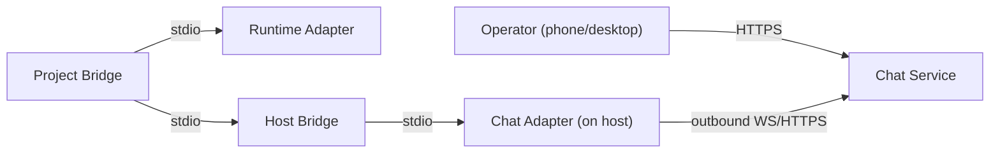

# Deployment Topology

## Design Intent

**Context:** The Untethered Operator stack spans multiple hosts and a chat service — the topology must be explicit about what runs where, how components connect, and how isolation works.

### Goals

- Every component has a clear home (host, VPS, or hosted platform).
- Connection directions are explicit — outbound-only from project hosts.
- Security domain isolation is structural, not just configurational.
- Adding a new project host or chat service is additive, not disruptive.

### Constraints

- Bridges must run on the project host (need tmux, filesystem, runtime CLIs).
- Chat service must be reachable from all project hosts over open internet.
- No inbound ports on project hosts.

### Non-goals

- High availability or load balancing.
- Multi-region deployment.
- Container orchestration (k8s, etc.) for v1.

## Interface Surface

The deployment boundary between project hosts, chat services, and the operator's devices. Covers component placement, connection topology, and provisioning sequences.

## Contract Definition

**Component placement:**

| Component | Runs on | Managed by |
|-----------|---------|------------|
| Chat service | Hosted platform (Zulip Cloud) or VPS | Platform provider or operator |
| Host bridge | Project host (native daemon) | launchd/systemd |
| Project bridge | Project host (child of host bridge) | Host bridge |
| Chat adapter plugin | Project host (child of host bridge) | Host bridge |
| Runtime adapter plugin | Project host (child of project bridge) | Project bridge |

**Connection directions:**

All connections are outbound from project hosts. The chat service never initiates connections to bridges.

**Security domain isolation:**

One host can run multiple host bridges (personal, work, client-A). Each is a separate daemon process with its own config, PID file, and project list. They share the machine but not state.

## Behavioral Guarantees

- Host bridge crash → all project bridges in that domain stop within 5 seconds (SIGTERM cascade).
- Chat adapter crash → host bridge respawns it within 10 seconds. Events buffered during restart.
- Project bridge crash → host bridge reports it in the control thread, offers respawn.
- Host reboot → host bridge restarts via OS init, reconciles state (SPIKE-062).

## Integration Patterns

**Provisioning sequence (first project, hosted):**

1. Operator runs `/swain-stage`.
2. Provisioning registers a bot on Zulip Cloud (API call).
3. Creates a stream for the project.
4. Generates bridge config (bot credentials, project path, security domain).
5. Installs and starts the host bridge daemon (launchd/systemd).
6. Host bridge spawns the project bridge and chat adapter.
7. Chat adapter posts "Project ready" in the new stream.

**Provisioning sequence (subsequent project, same chat service):**

1. Operator runs `/swain-stage` in the new project.
2. Creates a stream for the project on the existing Zulip org.
3. Updates bridge config (add project to existing security domain).
4. Host bridge spawns a new project bridge.
5. Chat adapter posts "Project ready" in the new stream.

## Evolution Rules

- Adding a new chat service (e.g., separate Slack for work) means a new host bridge daemon with its own config.
- v2 adds tunnel/ingress for the web pipe — this is a new component on the project host, not a change to existing topology.

## Edge Cases and Error States

- **Host bridge config has wrong permissions.** Daemon refuses to start. Error logged to syslog/journald.
- **Chat service unreachable.** Chat adapter retries with exponential backoff. Events buffer locally. Host bridge and project bridges continue running — sessions don't stall because chat is down.
- **Two host bridges claim the same project.** Config validation at startup — reject if project path appears in another domain's include list.

## Design Decisions

- **Native daemons over Docker for bridges.** Bridges need direct tmux and filesystem access. Docker adds a layer of indirection that complicates both.
- **One host bridge per security domain, not per project.** Reduces daemon count. A host with 5 personal projects runs one host bridge, not five.

## Assets

_Deployment diagrams in VISION-006 architecture-overview.md._

## Lifecycle

| Phase | Date | Commit | Notes |
|-------|------|--------|-------|
| Active | 2026-04-06 | -- | Created from VISION-006 decomposition. |
| Superseded | 2026-04-18 | -- | Superseded by DESIGN-032 (swain-helm Deployment Topology). |
