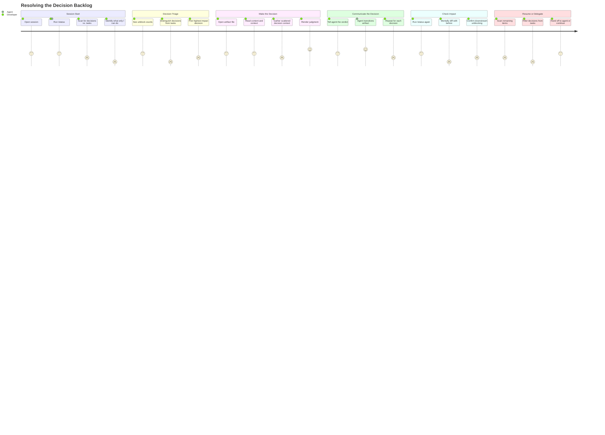

# Resolving the Decision Backlog

## Persona

**PERSONA-001: Swain Project Developer** — A solo developer working with AI coding agents (Claude Code, OpenCode, Codex, Gemini CLI). The developer makes decisions; the agents implement. When decisions stall, agents stall.

## Goal

Quickly find and resolve items that only the developer can act on — spec approvals, spike verdicts, ADR decisions, blocked-item triage, priority calls — so the agents' implementation backlog keeps moving.

## The Two Backlogs

Swain projects have two distinct backlogs with different owners:

**Decision backlog** (developer-owned): Items that require human judgment and cannot be delegated to an agent. These are the bottleneck — every unresolved decision item is a potential blocker for one or more implementation items.

- Specs in Draft needing approval
- SPIKEs with findings needing a go/no-go verdict
- ADRs proposed needing acceptance or rejection
- Blocked artifacts where the blocker requires a judgment call (not just implementation)
- GitHub issues needing triage and prioritization
- Architecture questions the agent surfaced mid-implementation

**Implementation backlog** (agent-owned): Items the agent can execute autonomously once decisions are made.

- Approved specs ready for task decomposition
- Tasks ready to be picked up
- In-progress tasks
- Tasks blocked on other tasks (not on decisions)

The developer's throughput on the decision backlog determines the project's overall velocity. An agent can implement a spec in minutes, but that spec may sit in Draft for days waiting for the developer to review and approve it.

## Steps / Stages

### 1. Session Start — "What decisions are waiting on me?"

The developer opens a session. They need to know: what piled up since last time? Not "what's the project state" broadly, but specifically "what can only I resolve?"

Today: `/status` shows all artifacts by actionability, but doesn't distinguish between "you need to decide on this" (approve a spec) and "the agent can handle this" (implement an approved spec). The developer must mentally classify each item.

### 2. Decision Triage — "Which decision matters most?"

Multiple items need decisions. The developer needs to know: which decision unblocks the most downstream work? Approving SPEC-001 might unblock 3 tasks; accepting ADR-002 might unblock nothing yet.

Today: swain-status shows unblock counts, but doesn't separate decision items from implementation items. The "Recommended Next" may suggest something the agent could handle autonomously, burying the decision item that's actually blocking progress.

### 3. Make the Decision — "I need context to decide"

To approve a spec or render a spike verdict, the developer needs the artifact content, its dependencies, what it unblocks, and any agent notes or investigation findings.

Today: the developer clicks an OSC 8 link to open the artifact file, reads it, then tells the agent the decision. The artifact is readable but the decision context is scattered — unblock info is in `/status` output, agent findings may be in a different session's context, and the spec content is in the file.

### 4. Communicate the Decision — "Now what?"

After deciding (approve, reject, revise), the developer needs to tell the agent and have the system update. Phase transitions, task creation, and downstream unblocking should cascade.

Today: the developer tells the agent in conversation ("approve SPEC-001, move it to Approved"). The agent runs swain-design to transition the artifact. This works but is entirely conversational — if the developer makes 5 decisions in a row, that's 5 back-and-forth exchanges.

### 5. Check Impact — "Did that unblock things?"

After resolving a decision, the developer wants confirmation: what moved? Did approving SPEC-001 make tasks ready? Did the spike verdict close a dependency chain?

Today: run `/status` again and compare mentally to previous output. No diff view, no "here's what changed since your last decision."

### 6. Resume or Delegate — "What's left for me vs. the agent?"

After clearing some decisions, the developer wants to know: is there more for me, or can I hand off to the agent and step away?

Today: no clear separation. The developer must scan the full status output and mentally filter for decision items vs. implementation items.

## Pain Points

> **PP-01:** No decision/implementation backlog separation. Status output mixes items the developer must decide on with items the agent can implement. The developer must mentally classify every item on every status check. The most important question — "what's waiting on *me*?" — has no direct answer.

> **PP-02:** Decision context is scattered. To make a decision (approve a spec, render a spike verdict), the developer needs: the artifact content, what it unblocks, related agent findings, and dependency state. These live in different places — the artifact file, status output, prior conversation context, and specgraph cache.

> **PP-03:** Decisions are communicated one-at-a-time in conversation. Each decision requires a conversational round-trip with the agent. Batch decisions (approve these 3 specs, reject this ADR) require multiple exchanges. No "decision queue" UI where the developer can resolve items in sequence.

> **PP-04:** No decision impact feedback. After making a decision, the developer can't immediately see what changed. Did approving SPEC-001 unblock tasks? Did the spike verdict close a dependency chain? Requires re-running `/status` and mentally diffing.

> **PP-05:** bd fragility blocks decision flow. Even when the developer knows what to decide, the tooling may not cooperate. bd crashes, Dolt errors, and stale state mean that acting on a decision (create tasks from an approved spec) may fail for infrastructure reasons unrelated to the decision itself.

| ID | Pain Point | Score | Stage | Root Cause | Opportunity |
|----|-----------|-------|-------|------------|-------------|
| JOURNEY-001.PP-01 | No decision/implementation separation | 1 | Session Start, Decision Triage, Resume | Status output doesn't classify items by owner (developer vs. agent) | Add decision backlog view to /status; web dashboard with decision queue |
| JOURNEY-001.PP-02 | Decision context is scattered | 2 | Make the Decision | Artifact content, unblock info, and agent findings live in different places | Decision detail view that aggregates artifact + dependencies + impact in one place |
| JOURNEY-001.PP-03 | One-at-a-time decision communication | 2 | Communicate the Decision | Conversational interface is serial; no batch decision UI | Web dashboard with approve/reject actions; or `/decide` batch command |
| JOURNEY-001.PP-04 | No decision impact feedback | 1 | Check Impact | No diff between pre- and post-decision state | Show "decision impact" summary after each transition; changelog in status |
| JOURNEY-001.PP-05 | bd fragility blocks decision flow | 1 | Communicate the Decision | Dolt server complexity, .beads maintenance | Replace bd backend (SPIKE-001); markdown-native task storage |

## Opportunities

### O-01: Decision backlog view in /status (addresses PP-01)

Add a dedicated "Decisions waiting on you" section to swain-status that filters artifacts to those requiring human judgment: Draft specs (need approval), Planned spikes (need activation or verdict), Proposed ADRs (need acceptance), and items blocked on non-implementation decisions. Sort by downstream impact (unblock count). This is the developer's primary entry point — answer "what's waiting on me?" before showing anything else.

Implementation: classify artifacts by whether their next phase transition requires human judgment (decision item) or can be delegated to an agent (implementation item). The `next_step` function in swain-status already maps (type, status) to actions — extend it to also classify owner (developer vs. agent).

### O-02: Decision detail aggregation (addresses PP-02)

When the developer focuses on a decision item, present all context in one view: the artifact content (or a summary), what it unblocks (with those items' descriptions), related findings (spike evidence, agent notes), and the specific decision being asked for (approve/reject/revise). This could be a section in `/status ARTIFACT-ID` or a page in the web dashboard.

### O-03: Web dashboard with decision queue (addresses PP-01, PP-03, PP-04)

A browser-based dashboard that shows the decision backlog as a queue. The developer works through items: read context, click approve/reject/revise, see impact, move to next. Batch operations supported. The dashboard reads specgraph cache and status-cache.json, and writes decisions back via the agent's MCP interface or a lightweight API.

**Key constraint:** Cannot be a TUI — swain runs inside AI coding agents that own the terminal. The agent launches the dashboard (`open http://localhost:PORT`), and the developer interacts in the browser.

### O-04: Decision impact feedback (addresses PP-04)

After each decision (artifact phase transition), show a brief "impact summary": what unblocked, what moved to ready, what new decisions were created. Could be inline in the agent's response ("Approved SPEC-001. This unblocked 3 tasks and made SPEC-002 actionable.") or as a diff section in `/status`.

### O-05: Markdown-native task backend (addresses PP-05)

Replace bd's Dolt database with markdown-file storage (Backlog.md with contributed dependency commands, or a simpler custom solution). Eliminates .beads directory, server management, and CLI errors. Ensures that acting on decisions is never blocked by infrastructure failures.

Evidence: SPIKE-001 found Backlog.md covers 70% of swain-do's term mapping. Contributing `ready`/`blocked` commands upstream is ~180 LOC.

## Lifecycle

| Phase | Date | Commit | Notes |
|-------|------|--------|-------|
| Draft | 2026-03-11 | d1929d5 | Initial creation from SPIKE-001/002 findings |
| Draft | 2026-03-11 | — | Reframed around decision backlog vs. implementation backlog |
| Validated | 2026-03-11 | a950529 | Approved by developer — pain points and journeys confirmed |
