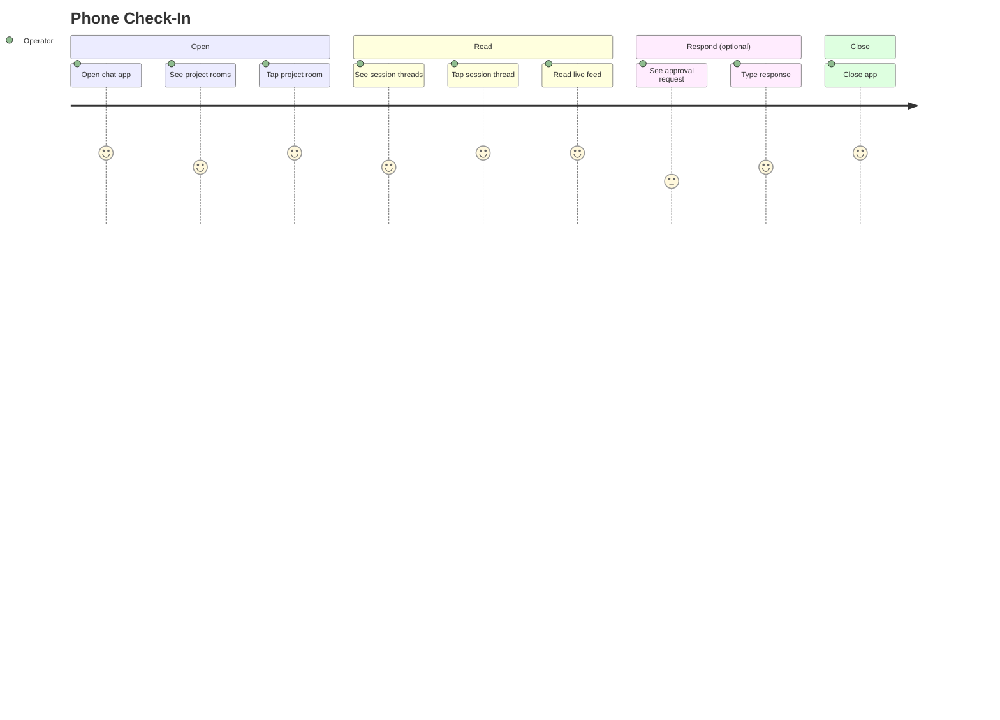

# Phone Check-In

## Persona

The swain operator — a solo developer steering agentic work sessions from their phone while away from the desk (or just preferring the chat surface).

## Goal

Check on a running agent session without typing anything. See what the agent is doing, whether it's stuck, and whether it needs input.

## Steps / Stages

1. Operator opens the chat app on their phone.
2. Sees project rooms in the sidebar with unread indicators.
3. Taps into the project room.
4. Sees active session threads — recent activity is visible in the thread list.
5. Taps into a session thread.
6. Reads the live feed — tool calls, text output, progress streaming in.
7. If the bot has `@`-mentioned them: reads the approval request, decides, types a response.
8. If not: scrolls, reads, closes the app.

## Pain Points

> **PP-01:** If the agent has been busy, the thread may have hundreds of messages since last check. Scrolling to find the `@` mention is tedious on a phone.

> **PP-02:** If the chat platform's unread tracking is per-room (not per-thread), the operator can't tell which session needs attention without opening each thread.

### Pain Points Summary

| ID | Pain Point | Score | Stage | Root Cause | Opportunity |
|----|------------|-------|-------|------------|-------------|
| JOURNEY-003.PP-01 | High message volume obscures approvals | 2 | Read | Continuous posting creates noise | Smart summary messages, approval pinning, or reaction-based filtering. |
| JOURNEY-003.PP-02 | Per-room unread hides per-thread urgency | 2 | Open | Chat platform unread granularity | Use platform-specific notification features (Zulip's topic-level unreads are good here). |

## Opportunities

- Zulip's topic-level unread tracking directly solves PP-02 — the operator sees which topic (session) has unread messages.
- A periodic summary message ("Last 5 minutes: 3 tool calls, 1 approval pending") could mitigate PP-01.
- The control thread could surface "sessions needing attention" as a pinned summary.

## Lifecycle

| Phase | Date | Commit | Notes |
|-------|------|--------|-------|
| Active | 2026-04-06 | -- | Created from VISION-006 decomposition. |
