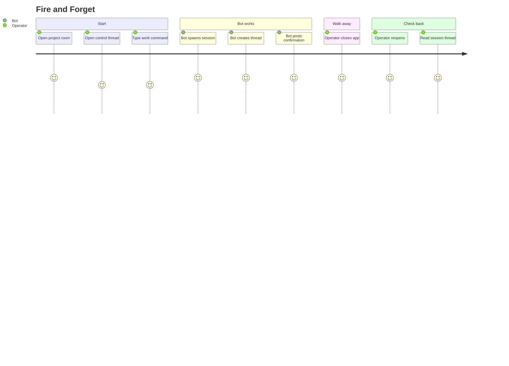

# Fire and Forget

## Persona

The swain operator — wants to kick off work on a spec from their phone and check back later.

## Goal

Start an agent session on a specific artifact from the chat interface, then walk away.

## Steps / Stages

1. Operator opens the project room.
2. Opens the control thread.
3. Types `/work SPEC-142` (or similar command).
4. Bot checks for an existing session on SPEC-142 — finds none.
5. Bot spawns a new tmux session, starts the runtime, binds to SPEC-142.
6. Bot creates a new session thread, posts "Session started on SPEC-142."
7. Bot links the thread from the control thread inventory.
8. Operator closes the app.
9. Later: operator reopens, taps the session thread, reads what happened.

## Pain Points

> **PP-01:** If the runtime hits an approval prompt while the operator is away, the session stalls. The operator may not know until they check back.

### Pain Points Summary

| ID | Pain Point | Score | Stage | Root Cause | Opportunity |
|----|------------|-------|-------|------------|-------------|
| JOURNEY-004.PP-01 | Unattended sessions stall on approvals | 2 | Bot works | Runtimes require permission for tool use | Push notifications for `@` mentions. Auto-approve trusted tool sets per project config. Timeout with sensible defaults. |

## Opportunities

- Push notifications from the chat platform alert the operator when `@`-mentioned — they can approve from the notification without opening the app.
- Per-project auto-approve lists reduce the number of stalls.
- The control thread's session inventory shows "waiting for approval" status — operator sees it on next check-in.

## Lifecycle

| Phase | Date | Commit | Notes |
|-------|------|--------|-------|
| Active | 2026-04-06 | -- | Created from VISION-006 decomposition. |
