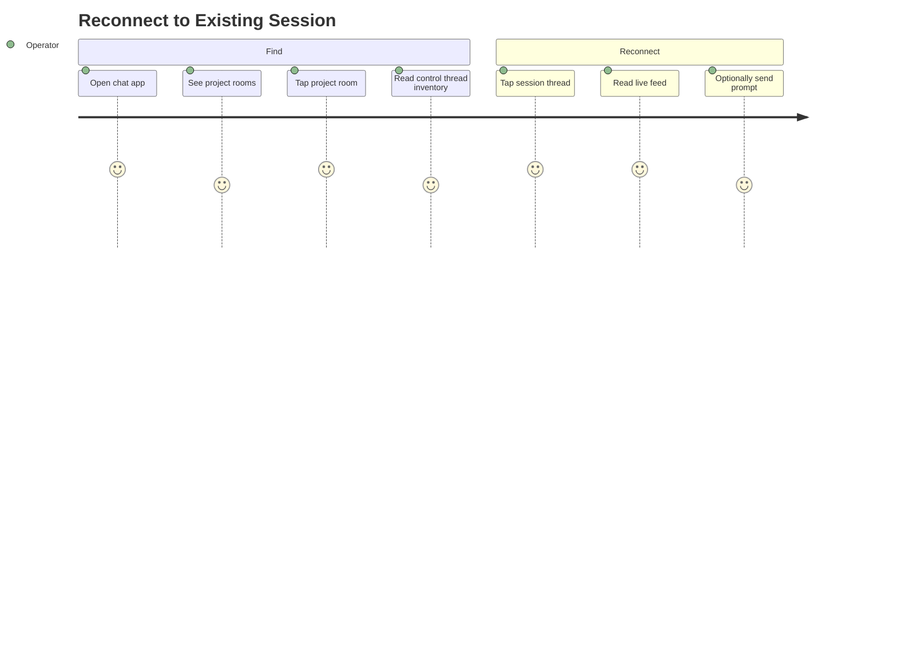

# Reconnect to Existing Session

## Persona

The swain operator — has sessions running and wants to find and re-engage with one.

## Goal

Find a running session and pick up where the agent left off, without remembering which tmux window or machine it's on.

## Steps / Stages

1. Operator opens the chat app.
2. Sees project rooms — picks the project they want.
3. The control thread shows active sessions (continuously updated by the host bridge).
4. Operator sees the session they want — taps the session thread link.
5. Reads the live feed. Caught up. Optionally sends a prompt.

## Pain Points

> **PP-01:** If the operator has sessions on multiple hosts for the same project, the control thread needs to disambiguate which host each session is on.

### Pain Points Summary

| ID | Pain Point | Score | Stage | Root Cause | Opportunity |
|----|------------|-------|-------|------------|-------------|
| JOURNEY-005.PP-01 | Multi-host session ambiguity | 2 | Find | Same project on multiple hosts | Control thread inventory includes host name per session. |

## Opportunities

- The control thread is the session directory. No manual discovery needed.
- Thread titles/topic names include the artifact ID and runtime — scannable at a glance.

## Lifecycle

| Phase | Date | Commit | Notes |
|-------|------|--------|-------|
| Active | 2026-04-06 | -- | Created from VISION-006 decomposition. |
