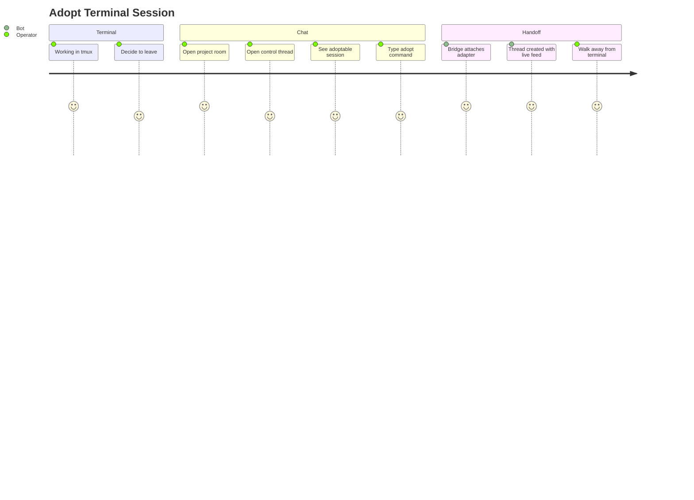

# Adopt Terminal Session

## Persona

The swain operator — started a tmux session at their laptop using the normal TUI workflow, now wants to continue steering it from the chat interface.

## Goal

Hand off a terminal-started agent session to the chat bridge without interrupting the agent's work.

## Steps / Stages

1. Operator is at their laptop, running an agent session in tmux.
2. Decides to step away but wants to keep steering from their phone.
3. Opens the project room in the chat app.
4. Opens the control thread.
5. Sees the tmux session listed as "adoptable" (host bridge discovered it via polling).
6. Types `/adopt <tmux-target>` (or taps an adopt button if the platform supports reactions/buttons).
7. Host bridge routes the adopt command to the project bridge.
8. Project bridge attaches a runtime adapter to the existing tmux session.
9. Bot creates a new session thread and begins posting the live feed.
10. Operator walks away from the terminal. Continues in chat.

## Pain Points

> **PP-01:** The host bridge's tmux polling interval creates a delay between starting a terminal session and seeing it as adoptable in chat.

> **PP-02:** If the runtime adapter attaches mid-stream, the first few messages in the chat thread may lack context (no history from before adoption).

### Pain Points Summary

| ID | Pain Point | Score | Stage | Root Cause | Opportunity |
|----|------------|-------|-------|------------|-------------|
| JOURNEY-006.PP-01 | Discovery delay | 2 | Chat | Polling interval for tmux sessions | Short polling interval (5-10 seconds). Or operator can name the tmux target explicitly. |
| JOURNEY-006.PP-02 | Missing pre-adoption context | 2 | Handoff | Adapter attaches mid-stream | Post a "Session adopted — prior output not captured" notice. Optionally tail tmux scrollback buffer for recent history. |

## Opportunities

- Tailing the tmux scrollback buffer on adoption could capture recent history.
- A swain TUI command (`/bridge this`) could pre-register the session for instant adoption.
- The control thread could show adoptable sessions immediately when the host bridge detects them.

## Lifecycle

| Phase | Date | Commit | Notes |
|-------|------|--------|-------|
| Active | 2026-04-06 | -- | Created from VISION-006 decomposition. |
