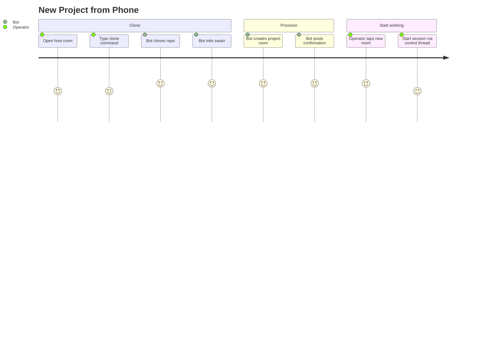

# New Project from Phone

## Persona

The swain operator — wants to start working on a new repo that doesn't exist on any host yet, using only their phone.

## Goal

Clone a repo onto a project host, initialize swain, provision a chat room, and start working — all from the chat interface.

## Steps / Stages

1. Operator opens the host room in the chat app (the room for a specific host's host bridge).
2. Types `/clone cristoslc/some-repo` (or similar command with a repo URL).
3. Host bridge clones the repo onto the host.
4. Host bridge initializes swain in the cloned project.
5. Host bridge spawns a project bridge for the new project.
6. Chat adapter creates a new project room (stream) on the chat service.
7. Host bridge posts "Project some-repo ready" with a link to the new room.
8. Operator taps into the new project room.
9. Opens the control thread, types `/work` to start a session.

## Pain Points

> **PP-01:** The operator needs to know which host to clone onto. If they have multiple hosts, they must choose the right host room.

> **PP-02:** Git clone may require SSH keys or credentials on the target host. If the repo is private and the host doesn't have access, the clone fails.

> **PP-03:** Swain initialization may require interactive decisions (which skills to install, etc.) that don't map well to a chat interface.

### Pain Points Summary

| ID | Pain Point | Score | Stage | Root Cause | Opportunity |
|----|------------|-------|-------|------------|-------------|
| JOURNEY-007.PP-01 | Host selection ambiguity | 2 | Clone | Multiple hosts available | Default host config per security domain. Or a cross-host command that picks the best available host. |
| JOURNEY-007.PP-02 | Auth on target host | 1 | Clone | Private repos need credentials | Pre-configured SSH keys per host. Fail with a clear message if auth fails. |
| JOURNEY-007.PP-03 | Interactive swain init | 2 | Clone | Init may require choices | Non-interactive init with sensible defaults. Or post choices as chat questions. |

## Opportunities

- Default host selection based on security domain.
- Non-interactive `swain-init` with a default skill set.
- The clone command could accept host as a parameter: `/clone some-repo on laptop`.

## Lifecycle

| Phase | Date | Commit | Notes |
|-------|------|--------|-------|
| Active | 2026-04-06 | -- | Created from VISION-006 decomposition. |
