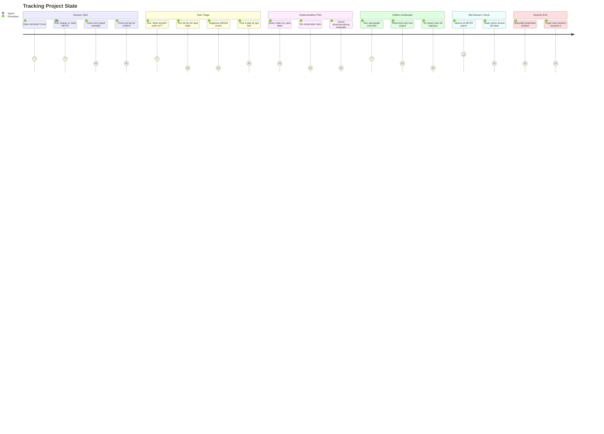

# Tracking Project State

## Persona

**PERSONA-001: Swain Project Developer** — A solo developer using swain + Claude Code to manage a multi-stream project. Wants to orient quickly at session start, track progress mid-session, and not lose context between sessions.

## Goal

Understand the current state of the project — what's done, what's in progress, what's blocked, and what to work on next — without running multiple commands, parsing raw CLI output, or maintaining a mental model across sessions.

## Steps / Stages

### 1. Session Start — "Where was I?"

The developer opens a new terminal session (or resumes a tmux workspace). They need to know: what branch am I on, what was I working on, what changed since last session?

Today: run `/status`, read text output, check git log, hope the session bookmark exists.

### 2. Task Triage — "What should I work on?"

With context restored, the developer needs to decide what to pick up. This means seeing: which tasks are in progress, which are blocked, which are ready, and which has the highest impact.

Today: `bd list` gives a flat text dump. No visual board, no priority sorting, no indication of which task unblocks the most work. The developer either asks the agent or makes a gut call.

### 3. Check Implementation Plan — "How far along is this spec?"

While working on a feature, the developer wants to see the implementation plan — what tasks were decomposed from the spec, how many are done, what's left.

Today: `bd list --labels spec:SPEC-NNN` returns matching tasks if bd is running. No visual progress bar, no tree view, no connection back to the spec document. If bd has crashed or the Dolt server is down, this returns an error.

### 4. Check Artifact Landscape — "What's the big picture?"

The developer wants to see all artifacts — epics, specs, spikes, ADRs — and their statuses at a glance. Which specs are approved and ready for implementation? Which spikes are still open?

Today: `specgraph overview` gives a text tree. `specgraph status` gives a table. Both are CLI-only, no interactive board, no drag-and-drop transitions. Output has clickable links (OSC 8) but no visual structure beyond indentation.

### 5. Mid-Session Check — "Am I making progress?"

After working for an hour, the developer glances at the MOTD panel or asks for status. They want confirmation that forward progress is happening — files touched, tasks completed, artifact statuses moved.

Today: swain-motd shows a compact panel with branch, epic progress, and task info. But it depends on the status cache, which may be stale, and it doesn't show task-level progress.

### 6. Session End — "Save my place"

Before stepping away, the developer wants to bookmark their current context — what they were working on, what files are relevant, what's unfinished — so the next session starts with context.

Today: `/session bookmark` exists but is manual. No automatic detection of "you were working on X." The MOTD panel doesn't persist session-end state.

## Pain Points

> **PP-01:** bd operational fragility. The Dolt database server crashes, leaves stale pid/lock files, and produces CLI errors. swain-doctor compensates but the underlying tool is unreliable. Every `bd list` is a coin flip.

> **PP-02:** No visual board for tasks. Implementation plans exist as flat text lists. There's no Kanban board, no progress bars, no way to see task structure at a glance. Developers parse `bd list` output mentally or ask the agent to summarize.

> **PP-03:** No visual board for artifacts. Specs, epics, spikes, and ADRs are only visible through `specgraph` CLI commands. No interactive board, no drag-and-drop phase transitions, no at-a-glance landscape view.

> **PP-04:** Context loss across sessions. Session bookmarks are manual and optional. No automatic "you were working on X" detection. Each new session starts cold — the developer must reconstruct context from status output and git log.

> **PP-05:** Implementation plan opacity. After a spec is decomposed into tasks, there's no visual way to see progress against the plan. "How far along is SPEC-003?" requires running a filtered `bd list` and counting manually.

| ID | Pain Point | Score | Stage | Root Cause | Opportunity |
|----|-----------|-------|-------|------------|-------------|
| JOURNEY-001.PP-01 | bd operational fragility | 1 | Task Triage | Dolt server complexity, .beads directory maintenance | Replace bd backend (SPIKE-001 hybrid approach) or simplify to markdown-native storage |
| JOURNEY-001.PP-02 | No visual board for tasks | 1 | Implementation Plan | bd has no UI; swain-do wraps CLI only | Adopt Backlog.md (with dependency contrib) for task board + MCP; or build `bd board` |
| JOURNEY-001.PP-03 | No visual board for artifacts | 1 | Artifact Landscape | specgraph is CLI-only output | Build `specgraph board` terminal Kanban; or web dashboard reading specgraph cache |
| JOURNEY-001.PP-04 | Context loss across sessions | 2 | Session Start, Session End | Manual bookmarking, no automatic context detection | Auto-bookmark on session end; agent reads bookmark + recent git on session start |
| JOURNEY-001.PP-05 | Implementation plan opacity | 1 | Implementation Plan | No spec→task progress view | Add spec-scoped progress view to swain-status; visual plan in board view |

## Opportunities

### O-01: Markdown-native task backend (addresses PP-01, PP-02)

Replace bd's Dolt database with a markdown-file-based backend (Backlog.md with contributed dependency commands, or a simpler custom solution). Eliminates .beads directory, server management, and CLI errors. Enables visual board via Backlog.md's `backlog board` / `backlog browser`.

Evidence: SPIKE-001 found that Backlog.md covers 70% of swain-do's term mapping and has the internal algorithms for dependency tracking. Contributing `ready`/`blocked` commands upstream is a tractable ~180 LOC PR.

### O-02: specgraph board command (addresses PP-03)

Add a `specgraph board` command that renders artifacts in a visual Kanban layout grouped by status. Must be a **web dashboard** (not a TUI) because swain runs inside AI coding agents (Claude Code, OpenCode, Codex, Gemini CLI) that own the terminal — a TUI would compete for stdin/stdout. The agent launches the dashboard via `open` or a local server; the developer views it in a browser tab.

The specgraph cache already has all the data needed. A lightweight static HTML page reading the JSON cache would suffice for v1.

Evidence: SPIKE-002 recommended this as the primary improvement over adopting Backlog.md for artifact management.

### O-03: Automatic session context (addresses PP-04)

Detect what the developer was working on (touched files, active branch, in-progress tasks) and auto-save on session end. On session start, surface this as "last session you were working on X" in the MOTD panel and `/status` output.

### O-04: Spec-scoped progress view (addresses PP-05)

Add a view to swain-status that groups tasks by their parent spec and shows completion progress. Example: "SPEC-003: swain-design Integration — 3/7 tasks done (2 in progress, 2 blocked)". Could be a section in `/status` output or a dedicated `/plan SPEC-003` command.

### O-05: Unified project dashboard (addresses PP-02, PP-03, PP-05)

A **web dashboard** that combines artifact landscape, task board, and spec-scoped progress into one view. The agent starts a local server (or generates a static HTML file from the specgraph/status cache) and opens it in the browser. The developer keeps it open in a browser tab alongside their terminal.

**Key constraint:** Cannot be a TUI. Swain runs inside AI coding agents (Claude Code, OpenCode, Codex, Gemini CLI) that own the terminal. Any interactive UI must live outside the terminal — browser-based is the only viable path. The agent can launch it (`open http://localhost:PORT` or `open /tmp/swain-dashboard.html`), and the dashboard reads from the existing JSON caches (specgraph cache, status-cache.json, stage-status.json).

This is the convergence point of O-01 through O-04.

## Lifecycle

| Phase | Date | Commit | Notes |
|-------|------|--------|-------|
| Draft | 2026-03-11 | — | Initial creation from SPIKE-001/002 findings |
