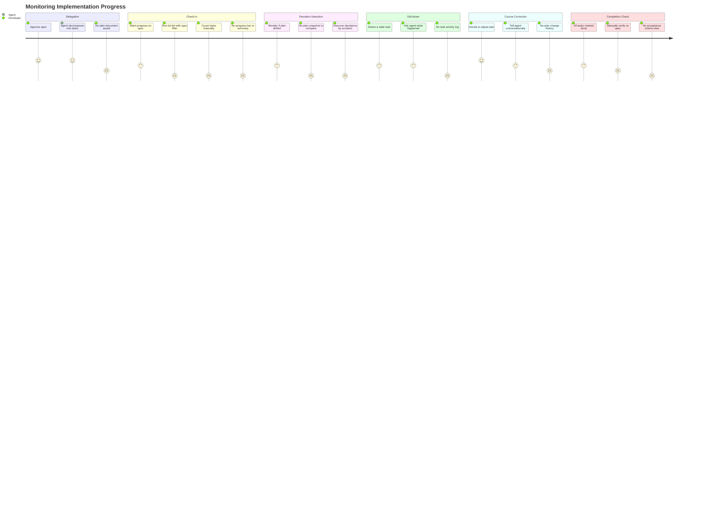

# Monitoring Implementation Progress

## Persona

**PERSONA-001: Swain Project Developer** — A solo developer working with AI coding agents. After approving a spec and delegating implementation, the developer needs to track progress and catch deviations without micromanaging the agent.

## Goal

See how far along an implementation plan has gotten, whether the agent is on track or has deviated from the plan, and whether any tasks need developer intervention — without having to ask the agent, parse flat task lists, or reconstruct progress mentally.

## Context

Once a spec is approved and decomposed into tasks, the agent executes. This may happen within a single session or span multiple sessions across days. The developer's role shifts from decision-maker to supervisor: they need progress visibility and deviation alerts, not detailed task management.

The key question isn't "what tasks exist?" but "is this spec getting implemented correctly, and how much is left?"

## Steps / Stages

### 1. Delegation — "Go build this"

The developer approves a spec and tells the agent to decompose it into tasks and start implementation. The agent creates an implementation plan (task breakdown) and begins working.

Today: the agent runs swain-do to create tasks, then starts implementing. The plan exists as a set of bd tasks with `spec:SPEC-NNN` labels. There's no plan document, no visual breakdown, no estimated scope.

### 2. Check-in — "How far along are we?"

Hours or days later, the developer wants a progress report. How many tasks are done? How many remain? Is the agent actively working on something or idle?

Today: `bd list --labels spec:SPEC-NNN` returns a flat list if bd is running. The developer counts done/in-progress/remaining manually. No progress bar, no percentage, no timeline. If bd has crashed, this returns nothing useful.

### 3. Deviation Detection — "Is this still on track?"

The developer wants to know: did the agent discover something unexpected? Did scope creep? Were tasks added or removed from the original plan? Did the agent make architectural decisions that should have been escalated?

Today: no deviation detection exists. The developer would have to compare the current task list against the original plan — but the original plan isn't saved as a snapshot. There's no "diff" between planned and actual. The developer discovers deviations by accident (reviewing code, noticing unexpected files, or the agent mentioning it in conversation).

### 4. Drill-down — "What happened with task X?"

Something looks off — a task has been in progress too long, or a completed task seems wrong. The developer wants to see what the agent actually did: which files were touched, what the commit messages say, whether tests pass.

Today: the developer asks the agent ("what did you do for task #7?") or checks git log manually. There's no task-level activity log, no link from task → commits → files changed.

### 5. Course Correction — "Change the plan"

Based on what they see, the developer needs to adjust: reprioritize tasks, add new ones, remove ones that turned out to be unnecessary, or redirect the agent's approach.

Today: conversational — the developer tells the agent to adjust. The agent updates bd tasks. There's no visual plan editor, no drag-and-drop reprioritization, and no record of why the plan changed.

### 6. Completion Check — "Are we done?"

All tasks show as complete. But does "tasks done" mean "spec implemented correctly"? The developer needs to verify: do the changes match the spec's acceptance criteria? Are there loose ends?

Today: the developer reads the spec, reviews the code manually or asks the agent, and makes a judgment call. There's no automated spec-vs-implementation verification, no acceptance criteria checklist view.



## Pain Points

> **PP-01:** No spec-scoped progress view. After delegation, the developer has no way to see "SPEC-003: 4/7 tasks done, 2 in progress, 1 blocked" at a glance. Progress requires running a filtered `bd list`, hoping bd is running, and counting manually. The most common question — "how far along is this?" — has no direct answer.

> **PP-02:** No plan snapshot or deviation tracking. The implementation plan isn't saved as a baseline. When the agent adds, removes, or modifies tasks during implementation, there's no diff against the original plan. The developer discovers scope creep or architectural drift by accident, often too late.

> **PP-03:** No task-to-code traceability. Completed tasks don't link to what actually changed — no commits, no files touched, no test results. The developer can't verify "task #5: implement caching layer" without asking the agent or searching git log manually.

> **PP-04:** bd fragility undermines progress tracking. Even the basic filtered list (`bd list --labels spec:SPEC-NNN`) is unreliable because bd's Dolt server may be down. The developer can't check progress when the infrastructure is broken.

> **PP-05:** No acceptance criteria verification. When all tasks are marked done, there's no systematic check against the spec's acceptance criteria. "Done" means "tasks completed," not "spec satisfied." The developer must manually cross-reference the spec document with the implementation.

| ID | Pain Point | Score | Stage | Root Cause | Opportunity |
|----|-----------|-------|-------|------------|-------------|
| JOURNEY-002.PP-01 | No spec-scoped progress view | 1 | Check-in | bd has no spec-grouped view; swain-status doesn't track per-spec progress | Spec progress section in /status; web dashboard plan view |
| JOURNEY-002.PP-02 | No plan snapshot or deviation tracking | 1 | Deviation Detection | Implementation plans aren't baselined; no plan-vs-actual diff | Save plan snapshot at decomposition; flag deviations on check-in |
| JOURNEY-002.PP-03 | No task-to-code traceability | 1 | Drill-down | Tasks don't link to commits or file changes | Tag commits with task IDs; task activity log from git history |
| JOURNEY-002.PP-04 | bd fragility undermines progress tracking | 1 | Check-in | Dolt server complexity | Replace bd backend (SPIKE-001); markdown-native storage |
| JOURNEY-002.PP-05 | No acceptance criteria verification | 1 | Completion Check | No spec→implementation cross-check | Acceptance criteria checklist view; automated verification where possible |

## Opportunities

### O-01: Spec progress in /status (addresses PP-01)

Add a section to swain-status that groups tasks by parent spec and shows completion progress. Example output:

```
## Implementation Plans
SPEC-001: swain-search Skill — 4/7 tasks (2 in progress, 1 blocked)
SPEC-003: swain-design Integration — not started (0/3 tasks)
```

The data exists (tasks have `spec:SPEC-NNN` labels, specgraph has artifact metadata). The gap is aggregation and display.

### O-02: Plan baseline and deviation tracking (addresses PP-02)

When the agent decomposes a spec into tasks, save the plan as a snapshot (task list with descriptions, in order). On subsequent check-ins, diff current tasks against the baseline: added tasks, removed tasks, reordered tasks, scope changes. Surface deviations proactively — "SPEC-001 plan has 2 new tasks and 1 removed since decomposition."

### O-03: Task-to-code traceability (addresses PP-03)

Require or encourage commit messages to reference task IDs (e.g., `feat(SPEC-001/#3): implement cache layer`). Build a reverse index from git log: for each task, list commits and files changed. Surface in the plan view: "Task #3: 4 commits, 12 files changed, all tests passing."

### O-04: Web dashboard plan view (addresses PP-01, PP-02, PP-03)

A browser-based plan view for each spec, showing:
- Task breakdown with status (done/in-progress/blocked/pending)
- Progress bar
- Deviation indicators (added/removed/changed since baseline)
- Per-task commit history and file changes
- Acceptance criteria checklist

The agent launches it; the developer monitors in a browser tab. Reads from the same JSON caches as the status dashboard (JOURNEY-001 O-03).

### O-05: Acceptance criteria checklist (addresses PP-05)

Extract acceptance criteria from spec frontmatter or body, render as a checklist in the web dashboard or `/status` output. Allow the developer to check items off (via dashboard UI or conversational command). "Spec complete" means "all acceptance criteria verified," not just "all tasks done."

### O-06: Markdown-native task backend (addresses PP-04)

Same as JOURNEY-001 O-05. Replace bd with markdown-native storage to eliminate infrastructure fragility. Shared dependency — both journeys converge on this.

## Lifecycle

| Phase | Date | Commit | Notes |
|-------|------|--------|-------|
| Draft | 2026-03-11 | — | Initial creation; companion to JOURNEY-001 |
| Validated | 2026-03-11 | a950529 | Approved by developer — pain points and journeys confirmed |
