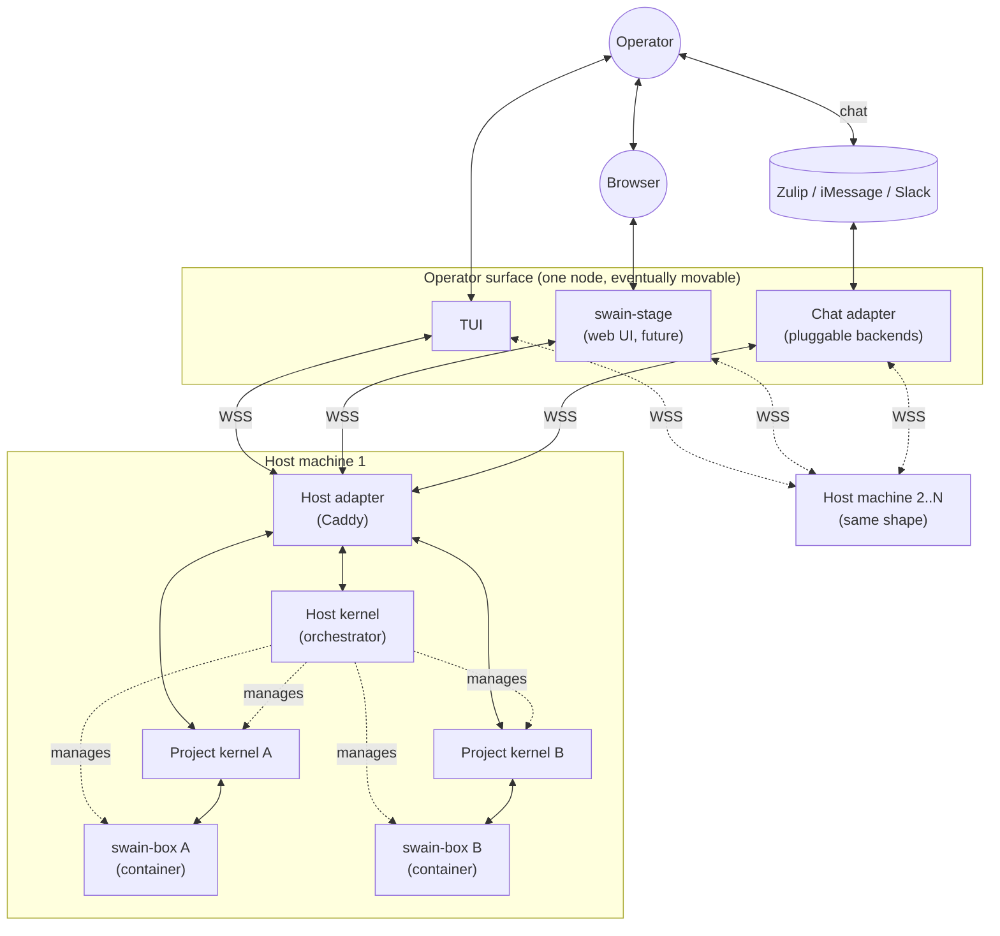
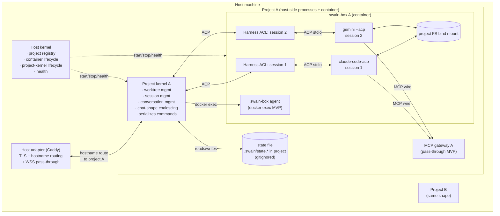

# swain architecture — bounded-context layering

Status: thinking-in-progress. Not an artifact. Supersedes prior scratchpads at `2026-04-26-swain-box-bridge-realignment*` (deleted; preserved in git history).

This scratchpad consolidates the layered model the operator articulated. Earlier scratchpads were wrong about kernel placement (had it inside the container) and conflated chat-aware domain logic with the chat-transport layer. This one corrects both and bakes in the multi-host hierarchy.

## Glossary

| Name | What | Where | How many | Speaks |
|---|---|---|---|---|
| **Operator surface** | Bounded context that presents to humans. Includes TUI, web UI (`swain-stage`), chat adapter | host (today), separate node (eventually) | many surface processes | varies (chat APIs, HTTPS, terminal) |
| **Chat adapter** | Marshals chat-service messages to/from operator-surface event stream. Pluggable: Zulip / iMessage / Slack | operator-surface node | one process, internal backends per service | chat APIs outward; WSS to host adapter inward |
| **TUI** | Host operator terminal UI | operator-surface node | one per operator | terminal; WSS to host adapter |
| **swain-stage** | Web UI (future) | operator-surface node | one per operator | HTTPS to browser; WSS to host adapter |
| **Host adapter** | Caddy. Routing fabric for the host bounded context. TLS, hostname routing, WSS pass-through | host | singleton per host | TLS, HTTP/WS routing |
| **Host kernel** | Per-host orchestrator. Manages project lifecycle, project registry, container start/stop, project-kernel processes. Ex-watchdog, but more | host | singleton per host | WSS to host adapter; spawns project kernels and swain-boxes |
| **Project kernel** | Per-project domain logic. Owns worktree, session, conversation state. Stateful | host | one per project | ACP outward to harness ACLs; structured RPC to swain-box agent; WSS to host adapter for surface traffic |
| **Project state file** | Persisted kernel state | host, in project dir, **gitignored** (`<project>/.swain/state.*`) | one per project | (storage) |
| **MCP gateway** | Per-project MCP server pass-through, kernel-hosted, published to swain-box | host | one per project | MCP wire to runtimes-in-box; configurable upstream |
| **swain-box** | Per-project Docker container | host docker | one per project | n/a |
| **swain-box agent** | Deterministic-ops helper inside the container. Health, git, shell-with-allowlist | inside swain-box | one per swain-box | `docker exec` (MVP); structured RPC (future) |
| **Harness ACL** | Anti-corruption layer per active session. Spawns the runtime, normalizes its quirks, exposes clean ACP to the project kernel | inside swain-box | **one per active session** | ACP outward to kernel; ACP stdio to runtime |
| **Runtime ACP agent** | The actual AI coding tool: `gemini --acp`, `claude-code-acp`, `opencode acp`, `codex-acp` | inside swain-box, child of harness ACL | one process per session | ACP stdio |

The word "bridge" is retired (it overloaded with too many things — historical opencode bridge, generic ACP bridge, the chat connector, etc.). The kernel-on-host correction means the in-container "kernel" of earlier scratchpads is now just the swain-box agent + harness ACLs.

## Bounded context hierarchy

```
operator surface  (TUI, swain-stage, chat adapter)
        │
        ▼
host  (host kernel, host adapter, MCP gateways, project kernels)
        │
        ▼
project  (project kernel, swain-box)
        │
        ▼
worktree / branch  (within a project)
```

**Cross-context properties:**

- An operator surface can run on a different node than a host. (TUI on laptop → host on home server.)
- One operator surface can talk to multiple hosts. (Aggregate dashboard across machines.)
- Each host can manage multiple projects.
- Each project has multiple worktrees/branches.

This is the property that justifies splitting "chat adapter" out of the host into the operator surface: chat adapter coordinates *operator inputs* across services; it doesn't belong to any specific host. Today it'll co-locate with a host (no network configured), but the model permits separation.

## C4 — System context



## C4 — Inside one host



## Seams (canonical list)

Categorized by which bounded contexts they cross. "BC" = bounded context.

### Operator surface ↔ host (BC crossing — networked even when co-located)

1. **TUI ↔ host adapter** — WSS, ACP-shaped events for runtime traffic + side channel for swain events (worktree, project list)
2. **swain-stage ↔ host adapter** — WSS, same protocols as TUI
3. **Chat adapter ↔ host adapter** — WSS, same protocols
4. **Chat adapter ↔ chat service** — chat-service-specific (Zulip API long-poll, iMessage, etc.)

### Within host: between host kernel and host adapter

5. **Host kernel ↔ host adapter** — host kernel registers project routes, configures Caddy, listens for control commands

### Within host: project kernel boundaries (BC crossing — process boundary)

6. **Host adapter ↔ project kernel** — WSS routed by hostname; surface traffic flows here
7. **Host kernel ↔ project kernel** — lifecycle: start, stop, health, restart, registration

### Project kernel ↔ container

8. **Project kernel ↔ harness ACL** — ACP over WSS or local TCP; one connection per active session
9. **Project kernel ↔ swain-box agent** — docker exec (MVP) or structured RPC (future)
10. **Runtime (in box) ↔ MCP gateway (on host)** — MCP wire over network into the container

### Within container

11. **Harness ACL ↔ runtime ACP agent** — ACP JSON-RPC over stdio; the ACL spawns the runtime
12. **swain-box agent ↔ container OS** — runs allowlisted shell, reads logs, checks state
13. **Runtime ↔ project filesystem** — bind mount

## Persistence

**Project state file**: `<project-root>/.swain/state.*` on the host filesystem. Gitignored.

Contents:
- Active sessions per worktree, with runtime + ACP session-id mapping
- Conversation history references (which Zulip topic / TUI buffer corresponds to which session)
- Worktree map snapshot
- Per-conversation defaults (preferred runtime, etc.)

The state file lives **in the project**, not in the swain-box volume, because:
- Operator can inspect / back up via normal filesystem tools
- Survives container destroy/recreate cleanly
- Co-located with project metadata (CLAUDE.md, etc.) is conceptually right

The kernel reads state on start, writes on every meaningful change. Probably SQLite or JSON-with-fsync depending on traffic; SQLite for the typical case.

**Host kernel state**: project registry (which projects are registered, hostnames, container references). Lives at `~/.swain/host/registry.*`. Not gitignored (operator-level, not project-level).

**Why kernel can't live in container**: a kernel that lives inside its own swain-box can't kill, restart, or manage the lifecycle of that swain-box (the kernel goes down with the container). Lifecycle management requires an outside-the-container controller. Either the host kernel does it directly, or the project kernel does it (and lives on host). Both put the project kernel on the host.

## Multi-runtime: ACP everywhere, ACL per session

ACP (Agent Client Protocol) is the wire format inside the container, between the harness ACL and the runtime ACP agent. JSON-RPC 2.0 over stdio, designed for "external thing controls AI coding agent." Industry standard governed by Zed's working group.

Runtimes that speak ACP:
- **gemini**: native (`gemini --acp`)
- **claude-code-acp**: official Zed adapter wrapping the Anthropic SDK
- **opencode acp**: native (`opencode acp` subcommand). Has open issues — see "known integration friction" below
- **codex-acp**: community adapter (v2 — wait for stability)

**One harness ACL per active session.** Reasons:
- claude can't multiplex sessions in one process (verified empirically: SPIKE 2026-04-26 showed `session_id` field in stream-json input is ignored by the CLI; one process = one conversation)
- Per-session ACL is a clean isolation boundary — one session's quirks/bugs don't bleed
- Process count = active session count (acceptable cost; sessions are typically <10)

**The harness ACL is the runtime-side anti-corruption layer.** It:
- Spawns the runtime subprocess with the right flags (e.g. `--yolo`, `--dangerously-skip-permissions`, `--full-auto`)
- Filters known runtime quirks (e.g., opencode #17282 ANSI-escape leak in JSON-RPC)
- Translates runtime-specific events into normalized ACP that the kernel can consume uniformly
- Auto-allows `session/request_permission` (sandbox-level approval, not per-tool)

**Sandbox-level approval, not per-tool.** Operator approval at session level (start/kill); container is the safety boundary. Each runtime launched in its most permissive mode. ACP `session/request_permission` is auto-allowed.

### Known integration friction (sampled 2026-04-26)

Per-runtime issues the harness ACL must defend against:

- **opencode acp**: `#22795` (server exits immediately on startup), `#17282` (ANSI escapes corrupt JSON-RPC), `#24494` (`end_turn` returned on errors), `#21013` (no `session_info_update`), `#17019` (oversized payload crashes). Defensive parsing + retry on startup + payload-size guard required.
- **claude-code-acp**: third-party (Zed-maintained) — version pinning + soak testing before bumps.
- **gemini --acp**: less battle-tested than the others; verify headless container behavior without a display server.
- **codex-acp**: deferred to v2; SDK still experimental.

## MCP gateway: per-project on host, pass-through MVP

One MCP gateway process per project, hosted by (or alongside) the project kernel on the host. Published to the swain-box container via a network socket / port mount. Runtimes inside the container connect to it.

**MVP behavior**: pass-through to the upstream MCP servers configured for the project. No filtering, no caching, no rewriting.

**Future**: kernel can intercept (rate-limit, audit-log, redact) without changing the runtime-facing wire.

**Why per-project**: each project has different MCP needs (different toolsets, different upstreams). Per-project also means a misbehaving MCP server in one project can't take down others.

**Why on host**: kernel hosts it because the kernel is where project domain logic lives, including "which MCP servers does this project use." Putting it in the container would couple it to container lifecycle (restart on rebuild), which we don't want.

## swain-box agent: docker exec MVP, designed for RPC future

The kernel needs to run deterministic operations *inside* the container — health checks, git operations on the project mount, log inspection. Two implementations:

**MVP — docker exec.** Kernel shells out: `docker exec <container> <command>`. Each call is a separate process. Simple, no extra long-running processes inside the container. Latency-OK for the volume of calls expected.

**Future — RPC daemon.** A small in-container daemon (`swain-box-agentd`) listening on a unix socket or local TCP. Kernel sends structured RPC requests over a long-lived connection. Lower latency, cleaner observability, structured surface. Required if call volume grows or if we need streaming responses (e.g., live log tailing).

**Design constraint**: build the kernel-side abstraction so swapping MVP for RPC is purely an implementation detail of one module. The kernel's call sites use a `BoxAgent` interface; the implementation today shells out, the implementation later RPCs. Same verbs.

**RPC surface (deferred)**: small allowlisted set — health, git status/log, read project file, restart-runtime, inspect-runtime-state, stream logs. Explicit verbs only. No arbitrary shell.

## Coordination concerns

**Multiple operator surfaces don't know about each other.** A TUI says "kill session X" while chat says "send prompt to session X" — both arrive at the project kernel. Kernel serializes its command intake (actor-style). Last-arriving wins for conflicting commands; non-conflicting commands compose naturally.

**Read access multiplexes naturally.** All operator surfaces subscribe to the project kernel's event stream. Each renders events in its own way. No coordination required for reads.

**Multi-host operator surface.** When the TUI talks to two hosts, it shows projects from both. Each host kernel knows only its own projects. Aggregation happens in the operator surface (or in a future operator-surface-side aggregator). No host-to-host communication required.

## Two paths into the runtime: ACP and TTY

The architecture has been describing the **ACP path** — kernel-mediated, what chat/web/the-project-kernel use. But operators also need direct interactive access to runtimes for:

- **First-time sign-in.** Claude OAuth, opencode auth login, gemini auth — all bootstrap via interactive CLI (device flow → paste code → runtime polls → writes credentials to its volume). One-time per project per runtime.
- **Full TUI experience.** Operator preference for the rich runtime-native TUI over chat-mediated streaming. Just `claude` (no `--print`, no `--acp`) inside `docker exec -it`.
- **Direct attach / "remote control."** Same mechanism as full TUI; the runtime's own attach machinery handles the rest (e.g., Claude Code's `--remote-control-session-name-prefix`).

These all collapse to one second path: **TTY**. Operator shell → `docker exec -it <container> <command>`. The kernel is not in the data path.

### Path comparison

| Operation | Path | Through |
|---|---|---|
| Chat prompt → runtime | ACP | chat adapter → host adapter → project kernel → harness ACL → runtime |
| Web UI prompts runtime | ACP | swain-stage → host adapter → kernel → ACL → runtime |
| TUI dashboard view (read) | ACP read-only | TUI → host adapter → kernel state |
| `swain-box shell <project>` | TTY | operator shell → docker exec -it |
| `swain-box auth <project> <runtime>` | TTY | operator shell → docker exec -it `<runtime>` auth flow |
| `swain-box exec <project> -- <cmd>` | TTY | operator shell → docker exec -it |

### Why the two paths compose

State lives on disk in the container's volumes, not in the kernel:

- Runtime credentials (e.g., `/root/.claude/.credentials.json`)
- Runtime session files (e.g., `/root/.claude/projects/<project>/<id>.jsonl`)

Both paths read and write the same disk. So:

- Sign-in via TTY → credentials on disk → ACP-mode picks them up next call.
- TTY-started session → appears in claude's session files → ACP `session/list` (which queries those files via the runtime) sees it automatically.
- No kernel coordination needed. Runtimes don't care who started them; they just persist to disk.

### What this adds to the swain-box agent

- `pty_exec(runtime, args)` verb: allocate a PTY, run the command, stream stdin/stdout/stderr to the operator's terminal. Wraps `docker exec -it`. MVP via the docker exec abstraction the agent already uses.

### What this adds to the operator-local CLI

The host-side `swain-box` tool gains:

- `swain-box auth <project> <runtime>` — convenience for the right auth-bootstrap command per runtime
- `swain-box exec <project> -- <command>` — generic `pty_exec` passthrough
- `swain-box shell <project>` — sugar for `exec ... bash`

These commands query the kernel for "what's project A's container?" then run `docker exec -it` directly from the operator's shell. Kernel routes; doesn't see the session.

### Multi-node implication

TTY path requires docker access **on the same node as the container**. If the operator surface runs on a different node than the host (allowed by the bounded-context hierarchy), then:

- **MVP**: operator SSHes to the host first, then runs `swain-box shell ...`. Document this constraint.
- **Future**: WebSocket-multiplexed terminal relay (xterm.js-style) through the host adapter. The TUI gets a "shell" tab that pipes to docker exec via the host. Real work, not in scope for v1.

### Open concerns the TTY path introduces

- **Concurrent use of the same session from both paths.** If TTY-claude is running a session and ACP-claude wants to drive the same session, they spawn parallel claude processes against the same session file. Likely race. Mitigations: kernel detects "session is currently TTY-held" and refuses parallel ACP spawn for the same id; or trust claude's own session-file locking. Worth a small SPIKE before locking.
- **Persistent detached TUI** (operator disconnects without killing). Out of scope for swain core. Document: use tmux inside the container if you want detached TUI.
- **OAuth flows that need a real browser** (no device-flow path). Operator must do auth on a host (where browsers exist) and volume-mount the credentials in. Per-runtime case work; document as needed.

## Open decisions deferred

- **Auth between layers.** Bearer tokens? mTLS? Caddy basic auth? Defer until model is finalized; will come with a security-minded ADR.
- **Single chat adapter process or one per service.** Operationally minor; design adapter so either works.
- **Kernel discovery.** When chat adapter receives "user X says hi in project A topic Y", how does it find project A's kernel? Likely Caddy hostname routing — chat adapter targets `https://swain-projecta.localhost`, hostname is in its registration record. Fully resolved during host-kernel definition.
- **swain-box agent RPC verb list** (when we move past MVP).
- **Session persistence semantics across kernel restart.** ACP `session/list` + `session/resume` is the mechanism; what we replay on the chat surface side is a UX decision.
- **Capability bridges for host tmux.** Per-project mount of host tmux socket into the swain-box. Mostly just config; no architectural moving parts beyond the mount.

## What this scratchpad commits to

- Bounded contexts: operator surface → host → project → worktree
- Project kernel runs on host, one per project, stateful
- Host kernel is a real component (more than a watchdog) — ex-watchdog promoted to orchestrator
- Operator surface can move off-host eventually
- ACP is the wire inside the container, ACL per session
- MCP gateway: per-project, host-side, pass-through to start
- swain-box agent: docker exec MVP, RPC-shaped abstraction in code from day one
- Persistence: project state in `.swain/` (gitignored), host registry in `~/.swain/host/`
- Sandbox-level approval, not per-tool; auto-allow ACP permission requests

## What this throws away from prior scratchpads

- "Kernel-in-container" — wrong placement; kernel is host-side
- Generic "ACP proxy in container" framing — replaced by harness ACLs (per session) + swain-box agent (deterministic ops) + (no proxy as a separate component)
- "swain-bridge" as one host process bundling chat adapter + chat-shape domain logic — split into chat adapter (transport, in operator surface) + project kernel (domain, on host)
- Singular "WSS endpoint per swain-box" — replaced by per-session ACP connections from kernel to harness ACL; runtime traffic doesn't traverse the host adapter
- Mixed glossary in v1/v2/multiruntime variants — superseded by this single scratchpad

## What needs to happen before this becomes an ADR

1. Operator review and sign-off on this layered model
2. Decide host kernel naming (use "host kernel" or different?)
3. Settle the still-open decisions above (auth, kernel discovery details)
4. Verify the integration-friction issues actually behave as described under load (read existing worktree code; dispatch a small SPIKE per runtime)
5. Promote to ADR(s): probably one per bounded context (operator-surface ADR, host ADR, project-kernel ADR) — or one big ADR with sections

The current ADR-048 (Container-Per-Project Topology) sits at the host-and-project-container layer; it stays valid. The new ADRs would extend it upward (operator surface) and inward (kernel/ACL split).
