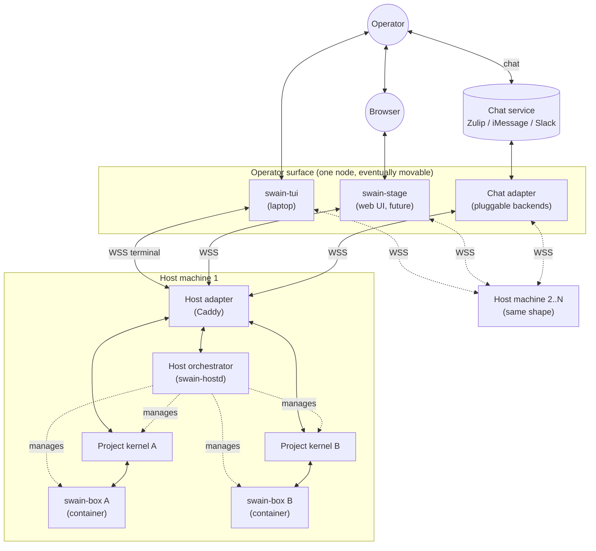
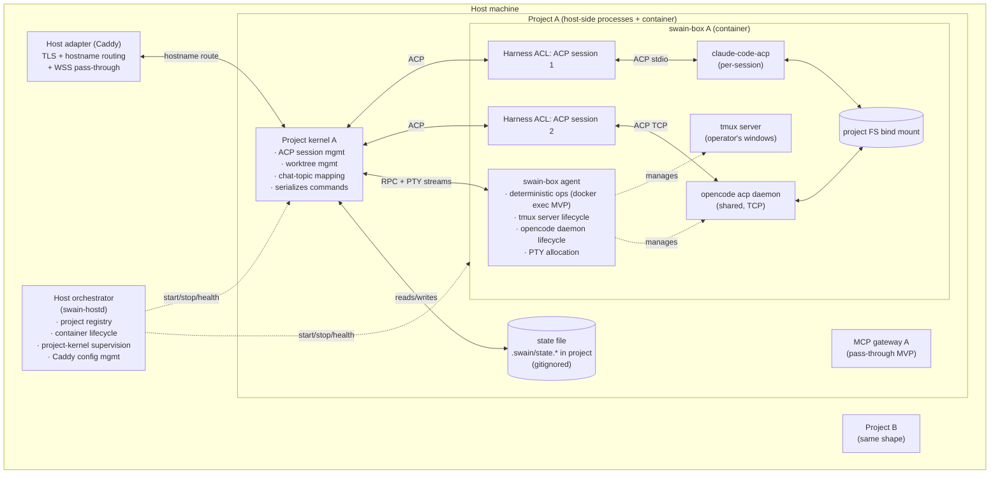

# swain architecture — bounded-context layering

Status: thinking-in-progress. Not an artifact. Living scratchpad — updates as decisions land.

This consolidates the layered design: how operator surfaces, host services, project services, and runtime processes compose. The biggest commitments: ACP everywhere inside the container, tmux mandatory for native-runtime TTY, chat sessions are dedicated, project state on host (not in container), and two stream types (ACP and tmux-mediated TTY) over one routing stack.

## Glossary (locked terms)

| Name | What | Where | How many | Speaks |
|---|---|---|---|---|
| **Operator surface** | Bounded context that presents to humans. Includes laptop TUI (swain-tui), web UI (swain-stage), chat adapter | host (today), separate node (eventually) | many surface processes | varies (chat APIs, HTTPS, terminal) |
| **swain-tui** | Laptop client. Thin remote-PTY client that attaches to a project's tmux server through the host adapter | operator-surface node | one process per attach | WSS terminal stream to host adapter |
| **Chat adapter** | Marshals chat-service messages to/from operator-surface event stream. Pluggable: Zulip / iMessage / Slack | operator-surface node | one process; internal backends per service | chat APIs outward; WSS to host adapter inward |
| **swain-stage** | Web UI (future) | operator-surface node | one per operator | HTTPS to browser; WSS to host adapter |
| **Host adapter** | Caddy. Routing fabric for the host bounded context. TLS, hostname routing, WSS pass-through | host | singleton per host | TLS, HTTP/WS routing |
| **Host orchestrator** | Per-host control plane. Owns project registry, project lifecycle, container lifecycle, project-kernel supervision, Caddy config management | host | singleton per host (`swain-hostd`) | WSS via Caddy at `host.<hostname>` |
| **Project kernel** | Per-project domain logic. Owns ACP sessions (and their chat-topic mappings), worktree state | host | one per project | ACP outward to harness ACLs; structured RPC + PTY streams to swain-box agent; WSS to host adapter for surface traffic |
| **Project state file** | Persisted kernel state | host, in project dir, **gitignored** (`<project>/.swain/state.*`) | one per project | (storage) |
| **MCP gateway** | Per-project MCP server pass-through, kernel-hosted, published to swain-box | host | one per project | MCP wire to runtimes-in-box; configurable upstream |
| **swain-box** | Per-project Docker container | host docker | one per project | n/a |
| **swain-box agent** | In-container daemon. Owns deterministic ops, tmux server lifecycle, runtime-daemon lifecycle (e.g., opencode acp), PTY allocation | inside swain-box | one per swain-box | docker exec (MVP); structured RPC + PTY streams (future) |
| **Tmux server** | Persistent terminal multiplexer inside swain-box. Default-on. Operators attach via swain-tui to run runtimes natively | inside swain-box | one per swain-box | tmux wire (operator side via PTY relay) |
| **Harness ACL** | Anti-corruption layer per active **ACP** session. Spawns or connects to the runtime, normalizes its quirks, exposes clean ACP to project kernel | inside swain-box | **one per active ACP session** | ACP outward to kernel; ACP stdio or TCP to runtime |
| **Runtime ACP agent** | The runtime in ACP mode: `gemini --acp`, `claude-code-acp`, `opencode acp`, `codex-acp` | inside swain-box | per-session subprocess (claude/gemini) OR shared daemon (opencode acp on TCP) | stdio JSON-RPC ACP (claude/gemini) or TCP (opencode) |
| **Runtime in TTY mode** | The runtime in interactive mode: plain `claude`, `opencode`, `gemini`, etc. | inside swain-box, inside tmux | one per tmux window | terminal bytes |

Notable terms retired or absent:

- **"Conversation"** — collapsed for MVP. Chat sessions are dedicated 1:1 with a chat-topic mapping; no separate conversation entity needed. Resurrect later if multi-session-per-conversation routing becomes a real requirement.
- **"Bridge"** — overloaded historically; doesn't appear in the current model.

## Bounded context hierarchy

```
operator surface  (swain-tui, swain-stage, chat adapter)
        │
        ▼
host  (host orchestrator, host adapter, MCP gateways, project kernels)
        │
        ▼
project  (project kernel, swain-box)
        │
        ▼
worktree / branch  (within a project)
```

**Cross-context properties:**

- An operator surface can run on a different node than the host (laptop TUI talking to home-server host).
- One operator surface can talk to multiple hosts.
- Each host can manage multiple projects.
- Each project has multiple worktrees/branches.
- Operator-surface authentication is at the host adapter boundary (Caddy WSS).

## C4 — System context



## C4 — Inside one host



## Seams (canonical list)

Categorized by which bounded contexts they cross.

### Operator surface ↔ host (BC crossing — always networked, even when co-located)

1. **swain-tui ↔ host adapter** — WSS, terminal stream (PTY bytes from tmux client)
2. **swain-stage ↔ host adapter** — WSS, ACP frames + future swain-event side channel
3. **Chat adapter ↔ host adapter** — WSS, ACP frames for the chat session
4. **Chat adapter ↔ chat service** — service-specific (Zulip API, etc.)

### Host: between host orchestrator and host adapter

5. **Host orchestrator ↔ host adapter** — registers project routes, signals Caddy reload, listens for control commands (WSS via Caddy at `host.<hostname>`)

### Host: project-kernel boundaries

6. **Host adapter ↔ project kernel** — WSS routed by hostname; ACP frames + terminal streams + future swain-event channel
7. **Host orchestrator ↔ project kernel** — lifecycle: start, stop, health, restart, registration

### Project kernel ↔ container

8. **Project kernel ↔ harness ACL** — ACP frames; one connection per active ACP session
9. **Project kernel ↔ swain-box agent** — structured RPC for ops; PTY streams forwarded for swain-tui
10. **Runtime (in box) ↔ MCP gateway (on host)** — MCP wire over container network into the kernel-hosted gateway

### Within container

11. **Harness ACL ↔ runtime ACP agent** — ACP JSON-RPC over stdio (claude/gemini) or TCP (opencode acp daemon)
12. **swain-box agent ↔ container OS** — runs allowlisted ops, manages tmux server and runtime daemons, allocates PTYs
13. **Runtime ↔ project filesystem** — bind mount

## Persistence

**Project state file** at `<project-root>/.swain/state.*` (gitignored). Contents:

- Active ACP sessions per project: kernel-internal session-id, runtime, ACP session-id (from runtime), chat-topic mapping (if chat-bound), created-by, created-at, last-activity-at
- Worktree map snapshot
- Per-runtime defaults

The file lives in the project, not in the swain-box volume:

- Operator can inspect/back up via normal filesystem tools.
- Survives container destroy/recreate cleanly.
- Co-located with project metadata (CLAUDE.md, etc.).

The kernel reads state on start, writes on every meaningful change. SQLite for the typical case; JSON-with-fsync acceptable for a starter.

**Host orchestrator state** at `~/.swain/host/`:

- `projects.{db,yaml}` — registry
- `config.yaml` — host identity, defaults, Caddy mode setting
- `swain-projects.caddyfile` (or similar) — Caddy fragment generated by orchestrator

**Why kernel can't live in container**: a kernel inside its own swain-box can't kill, restart, or manage the lifecycle of that swain-box (the kernel goes down with the container). Lifecycle management requires an outside-the-container controller.

## Host orchestrator (pinned)

The per-host control plane. Was historically the "watchdog"; in this model it's bigger than supervision.

### What it owns (state)

- **Project registry** — name, project path, hostname assigned, container ID (when running), runtime credential volumes assigned, capability bridge config. Persisted at `~/.swain/host/projects.{db,yaml}`.
- **Project-kernel runtime registry** — which project-kernel processes are currently running, PIDs, last health check. In-memory; reconciled on orchestrator restart against docker + on-disk state.
- **Host config** — operator identity, host name, defaults, paths to host-managed sockets, Caddy mode setting. At `~/.swain/host/config.yaml`.
- **Caddy config fragments** — per-project hostname routes. Written so a hand-edited Caddyfile and the orchestrator's projects don't fight (orchestrator owns its own fragment included by main config).

Notably **absent**: anything per-project beyond identity. Worktrees, sessions, conversations — all live in the project kernel or below.

### API surface

```
Project lifecycle:
  POST   /projects                   register a new project
  GET    /projects                   list (name, status, hostname, container, kernel pid)
  GET    /projects/:name             project detail
  DELETE /projects/:name             deregister (does not delete project filesystem)
  POST   /projects/:name/up          bring up (container + kernel + Caddy refresh)
  POST   /projects/:name/down        bring down
  POST   /projects/:name/restart     restart kernel + container

Project status:
  GET    /projects/:name/health      aggregated health
  GET    /projects/:name/logs        kernel logs (read-only stream)

Host:
  GET    /info                       host identity, version, config summary
  GET    /health                     orchestrator self-health
  GET    /clients                    connected operator surfaces (introspection)
```

Transport: **WSS-only for v1**, via Caddy on `host.<hostname>`. Same auth boundary as project-kernel WSS. Unix socket for local-CLI fast path is a v1.5 add if local-auth friction shows up.

### Lifecycle

- systemd / launchd unit runs `swain-hostd` at host boot. Restart on failure.
- Caddy mode is one of three (`managed` / `integrate` / `auto`):
  - **managed**: orchestrator starts Caddy as a child process, owns lifecycle, restarts on crash.
  - **integrate**: existing Caddy is running (managed by something else); orchestrator writes a config fragment and signals reload via Caddy's admin API.
  - **auto** (default): detect on startup; integrate if Caddy reachable on its admin port, else managed.
- Hard guarantee: **after orchestrator startup, Caddy is running and configured**. If Caddy fails, orchestrator fails to start (no silent degraded mode).
- On orchestrator startup: read project registry, reconcile against docker + Caddy state, bring up auto-start projects.
- On clean shutdown: configurable — usually leave running projects alone.
- On crash + restart: reattach to existing project kernels and containers (they survive). Rebuild in-memory state.

Net: **orchestrator restarts are recoverable without disrupting running projects**.

### What it is NOT

- Not the routing fabric (Caddy).
- Not a domain-logic owner (project kernel does that).
- Not an operator surface.
- Not the chat adapter (operator-surface bounded context).
- Not docker compose; uses docker for container lifecycle.
- Not a per-project event router (operator-surface ↔ project-kernel traffic goes through Caddy, not orchestrator).
- Not the auth policy store (Caddy + token storage handle that).

### Distinguishing from "docker compose + scripts"

Compose can do static container lifecycle for a fixed list. The orchestrator adds:

- Dynamic project addition without editing files
- Non-docker process supervision (project kernels run on host)
- Caddy config coordination with project lifecycle
- Runtime API for operators
- Reconciliation after partial failures

Compose is fine underneath for individual project containers if it's there; orchestrator manages the compose file as project config.

## Multi-runtime: ACP everywhere, ACL per session

ACP (Agent Client Protocol) is the wire format inside the container, between the harness ACL and the runtime ACP agent. JSON-RPC 2.0 over stdio (or opencode's TCP variant). Industry standard, governed by Zed's working group.

Runtimes that speak ACP:

- **gemini**: native (`gemini --acp`)
- **claude-code-acp**: official Zed adapter wrapping the Anthropic SDK
- **opencode acp**: native (`opencode acp`); listens on TCP, multi-session capable. Has open issues — defensive parsing required.
- **codex-acp**: community adapter (v2 — wait for stability)

### ACL per session — but underlying processes vary

The kernel sees N ACL handles, one per active ACP session. Underneath:

- **Per-session subprocess** (claude, gemini): each ACL spawns its own runtime subprocess. Process count = active session count.
- **Shared daemon** (opencode): one `opencode acp` daemon per swain-box; ACLs connect via TCP. Long-lived process, multi-session over connections.

The swain-box agent owns the long-lived daemons (ensure opencode acp running before any opencode session). Per-session subprocesses are owned by the harness ACL that spawned them.

### Sandbox-level approval, not per-tool

The container is the safety boundary. Each runtime is launched in autonomous mode:

| Runtime | Autonomous-mode flag |
|---|---|
| opencode | (kernel auto-allows on `permission.asked`) |
| claude | `--dangerously-skip-permissions` (or equivalent on the SDK adapter) |
| codex | `--full-auto --sandbox danger-full-access` |
| gemini | `--yolo` / `--approval-mode=yolo` |

ACP `session/request_permission` is auto-allowed by the ACL. Operator visibility comes from forwarding tool-call events to surfaces as notifications (not gates).

### Known integration friction

Per-runtime issues the harness ACL must defend against (sampled 2026-04-26 — opencode `anomalyco/opencode`):

- **opencode acp**: `#22795` (server exits on startup), `#17282` (ANSI escapes corrupt JSON-RPC), `#24494` (`end_turn` returned on errors), `#21013` (no `session_info_update`), `#17019` (oversized payload crashes). Defensive parsing + retry on startup + payload-size guard.
- **claude-code-acp**: third-party (Zed-maintained) — version pinning + soak testing.
- **gemini --acp**: less battle-tested — verify headless container behavior.
- **codex-acp**: deferred to v2; SDK still experimental.

## swain-box agent

In-container daemon. Owns three concerns:

1. **Deterministic ops** — `health_check`, `git_status`, `read_log`, etc. (request/response RPC)
2. **Tmux server lifecycle** — start tmux server on container up; restart on death; expose default session for swain-tui attaches
3. **Long-lived runtime daemons** — currently just opencode acp; spawn before first opencode session, monitor health, restart on death
4. **PTY allocation** — `pty_attach(command, args, env)` returns a stream-id; bytes flow bidirectionally between kernel and PTY (used by swain-tui terminal streams)

**Implementation transport**: WSS or local TCP carrying JSON frames for RPC + binary frames for PTY streams, multiplexed. **MVP**: rides atop `docker exec -i` for structured RPC and `docker exec -it` for PTY (same docker-exec abstraction in code). **Future**: long-running RPC daemon supports both natively.

**RPC verb list** (deferred — small, allowlisted set; no arbitrary shell).

## MCP gateway: per-project on host, pass-through MVP

One MCP gateway process per project, host-side, kernel-hosted (or alongside). Published to the swain-box container via a network socket / port. Runtimes inside connect to it.

**MVP behavior**: pass-through to the upstream MCP servers configured for the project. No filtering, no caching, no rewriting.

**Future**: kernel can intercept (rate-limit, audit-log, redact).

**Why per-project**: each project has different MCP needs; misbehaving server in one project can't take down others.

**Why on host (not in container)**: kernel is where project domain logic lives, including MCP server configuration. In-container coupling would mean restart-on-rebuild, which we don't want.

## Two stream types into the runtime: ACP and tmux-mediated TTY

Operators reach runtimes via **two stream types**, both flowing through the same routing stack (operator surface → host adapter → project kernel → swain-box agent), differing only at the agent's last hop:

- **ACP stream** — structured JSON-RPC. Kernel-mediated; ACP session in kernel state; harness ACL spawns/connects to runtime.
- **Tmux-mediated TTY stream** — bidirectional bytes. Kernel routes; swain-box agent allocates a PTY that's attached as a tmux client to the project's tmux server. Operator runs the runtime's native CLI inside a tmux window.

### Why TTY is mediated through tmux

- Persistence: WSS dies → tmux session keeps running; operator reattaches and sees their state intact.
- Multiplexing: native tmux windows for runtime sessions, shells, etc.
- Multi-operator on same screen: free (tmux's native client mode).
- Native runtime TUIs (claude, opencode, gemini) work because they're literally running inside a real terminal session — same as if SSHed in.

### Why TTY is a surface stream, not a `docker exec` bypass

It flows through the same auth boundary (host adapter), same routing (project kernel via Caddy hostname), same agent (swain-box agent allocates PTYs). Multi-node works: web UI on phone reaches container PTY through Caddy. No requirement that the operator surface be on the host node.

### Use cases all collapse to this path

| Case | Surface action | Stream content |
|---|---|---|
| First-time auth (claude OAuth device flow) | swain-box auth claude | tmux window runs `claude /login`; operator types device code, watches polling output |
| Native claude TUI | swain-box tui | tmux attach; operator runs `claude` (or `claude --resume <id>`) in a window |
| Remote-control / attach existing TUI | swain-box tui (re-attach) | tmux's native shared-attach; both clients see the same screen |
| Ad-hoc shell | swain-box tui | tmux attach; new window: `bash` |

### Surfaces that render terminals

| Surface | Renders terminal? | How |
|---|---|---|
| swain-tui (laptop) | Yes | Pass-through to operator's actual terminal |
| swain-stage (web UI) | Yes (future) | xterm.js |
| Chat adapter | **No** | Auth/shell don't fit chat shape; chat is ACP-only |

### Kernel involvement in terminal streams

Kernel routes; doesn't parse bytes. State tracked:

- Which terminal streams are open (for visibility)
- Per-session lock if relevant: not strictly needed because TTY-mode runs are not kernel-tracked sessions; they're tmux windows. Operator manages their own conflicts (running `claude --resume <id>` twice is on them).

### State sharing

Credentials and runtime session files live on disk in container volumes:

- `/root/.claude/.credentials.json`, `/root/.opencode/...`
- `/root/.claude/projects/<project>/<session-id>.jsonl` (and per-runtime equivalents)

Both stream types read/write the same disk. Auth done via tmux → credentials persisted → next ACP-mode runtime spawn picks them up. TTY-mode runtime sessions are visible to chat-mode runtime via on-disk reads (see "Cross-session visibility" below).

## swain-box CLI surface (operator-side commands)

```
swain-box tui [host:]<project>          attach to project's tmux server
                                         no args → auto-detect from cwd via .swain/project.yaml walk-up
                                         default localhost; <host>:<project> for remote
swain-box auth <project> <runtime>      sugar for tui that runs the runtime's auth flow in a tmux window
                                         (e.g., for claude: opens window, runs `claude /login`)
swain-host list                          list projects on a host
swain-host up <project>                  bring project up
swain-host down <project>                bring project down
swain-host status [project]              health summary
```

For MVP: `swain-box tui` is the only TTY-side entry point. If operator wants raw shell, they get one inside tmux (new window or pane). "Everything is tmux."

## Chat: dedicated session and hierarchy mapping

### Dedicated session

Chat adapter creates and owns **one ACP session per chat-topic mapping**. That session never picks up activity from other sessions in the project. TTY-mode sessions are invisible to chat. Other ACP sessions (e.g., a future web UI's session) are also invisible to chat.

Implications:

- Routing within a topic is unambiguous (always the dedicated session).
- "Conversation" as a kernel entity collapses out — session-with-chat-topic-mapping is the unit.
- If operator wants chat-mode runtime to know what their TTY-mode work was about, that's the cross-session-visibility story (next section).

### Hierarchy mapping

Swain hierarchy: **host → project → session**. Most chat services have a similar two-level hierarchy.

| Chat service | Bot identity | Top-level (project) | Inner (session) |
|---|---|---|---|
| Zulip | one per host | stream named after project | topic named after session |
| Slack | one per host | channel named after project | thread within channel |
| Discord | one per host | category or channel named after project | thread |
| iMessage / SMS | one per host | (no native channels) | (no native threads) — degraded UX, single-bot-single-session-per-chat |

**Bot per host**: each host runs one chat-adapter bot identity per service. The bot owns its top-level objects (streams/channels/categories) one per project, and inner objects (topics/threads) one per session.

For services without rich hierarchy (iMessage), the chat adapter does best-effort: one chat = one project's currently-active session, with text markers to disambiguate.

This mapping is chat-adapter logic, not kernel-side. The kernel just records `chat_topic` as opaque dict on the session.

## Cross-session visibility

Question that comes up: "if my TUI claude session was working on something, can my chat-mode session see what happened?"

**MVP answer**: yes, via on-disk inspection by the chat-mode runtime.

### Mechanism

Runtime session files live on a shared volume readable by all in-container processes:

- Claude: `/root/.claude/projects/<project>/<session-id>.jsonl`
- OpenCode: `/root/.opencode/sessions/...` (verify exact path; see also opencode-daemon caveat below)
- Gemini: per-project session directory

Chat-mode runtime can use its built-in tools (Read/Grep/Bash) to inspect those files. Operator asks "summarize what I worked on this morning" → runtime Reads recent session files, summarizes.

### Helpers (existing prior art to ride on)

Don't invent in swain. Lean on:

- **`session-history-redacter`** (`~/Documents/code/session-history-redacter`) — already documents on-disk session formats and provides safe scrubbing. Useful for "show me this session but redact secrets" use cases.
- **`@ccusage/*` family** (used by `~/Documents/code/ai-usage-cost-analysis`) — per-runtime telemetry over the same on-disk files (`@ccusage/codex`, `@ccusage/opencode`, `@ccusage/mcp` exposes via MCP). Useful for cost/usage queries from chat ("what did this session cost?").
- **swain EPIC-022 / claude-code-recap trove** — recap-architecture work in swain itself. Claude Code has native `/recap` (v2.1.108+) that produces an "away summary." When EPIC-022 lands, chat-mode runtime can invoke recap-style summaries directly.
- **`claude-acp-harness`** (`~/Documents/code/claude-acp-harness`) — separate but related project (ACP + tmux + REST API for Claude Code). Worth watching for shared concerns.

### MVP setup for cross-session visibility

- Ensure session-files volume is readable by chat-mode runtime's user inside the swain-box.
- Inject a CLAUDE.md hint pointing chat-mode runtime to where session files live: `/root/.claude/projects/<project>/`.
- Optionally bundle `ccusage`-related tools in the swain-box image for telemetry queries.
- Defer recap-summary integration to when EPIC-022 lands.

### Asymmetry: opencode

OpenCode's session state lives in the daemon's memory (when started via `opencode acp`), not on disk. TTY-mode opencode sessions (run directly in tmux) are also separate from the daemon's state. Cross-session visibility between TTY-opencode and chat-opencode is degraded for MVP — document the tradeoff. Resolvable later by exposing the daemon's session list via its API.

## Coordination concerns

**Multiple operator surfaces don't know about each other.** Surfaces send commands to project kernel; kernel serializes intake (actor-style). Last-arriving wins for conflicting commands; non-conflicting commands compose naturally.

**Read access multiplexes naturally.** All operator surfaces subscribe to project kernel's event stream. Each renders independently.

**Multi-host operator surface.** TUI/web/chat connect to multiple hosts; aggregation happens client-side. Each host orchestrator knows only its own projects.

## Open decisions deferred

- **Auth between layers.** Bearer tokens? mTLS? Caddy basic auth? Defer; will come with a security-minded ADR.
- **swain-box agent RPC verb list** (when we move past `docker exec` MVP).
- **Idle eviction policy.** Auto-stop idle ACP sessions after N minutes? Lean: no, configurable per project.
- **Capability bridges (host tmux, etc.).** Per-project mounts; mostly config rather than architectural moving parts.
- **Multi-host federation aggregation.** Currently client-side; possible host-side aggregator later if needed.
- **OpenCode cross-session visibility.** Resolvable via daemon API expose; deferred.

## What this scratchpad commits to

- Bounded contexts: operator surface → host → project → worktree
- Project kernel runs on host, one per project, stateful
- Host orchestrator is a real component (ex-watchdog, promoted to control plane), one per host
- Operator surface can move off-host eventually
- ACP everywhere inside the container; ACL per session
- Tmux server is mandatory and default-on inside swain-box
- swain-tui is a thin tmux-client over WSS PTY relay
- swain-box CLI: `swain-box tui [host:]<project>`, `swain-box auth <project> <runtime>`
- Chat sessions are dedicated 1:1 with chat-topic mappings
- "Conversation" entity collapsed for MVP; sessions are the unit
- TTY-mode sessions are NOT kernel-tracked
- Cross-session visibility via on-disk reads, riding on existing prior-art tools
- Persistence: project state in `<project>/.swain/state.*` (gitignored), host state in `~/.swain/host/`
- Sandbox-level approval; ACP `session/request_permission` auto-allowed
- Caddy as routing fabric in three modes (managed / integrate / auto) with strict-running guarantee
- WSS-only transport for v1

## ADR roadmap

This scratchpad is pre-ADR thinking. Promotion path:

1. Operator review and lock-in.
2. Promote to one or more ADRs:
   - **Bounded-context architecture ADR** — extends ADR-048 (Container-Per-Project Topology) with the operator-surface and host-orchestrator layers and the ACP-everywhere container internals.
   - **Host orchestrator ADR** — name, scope, API, lifecycle, Caddy integration.
   - **Tmux-mediated TTY path ADR** — captures the swain-box-tui design.
   - Possibly: **Chat-dedicated-session ADR** if it's worth its own decision record vs. folding into the bounded-context ADR.
3. Per-runtime SPECs for harness ACL implementations.
4. SPEC for the swain-box agent's MVP (docker exec) and its planned RPC successor.

ADR-048 stays valid at the host-and-project-container layer; the new ADRs extend it upward (operator surface) and inward (kernel/ACL split).
