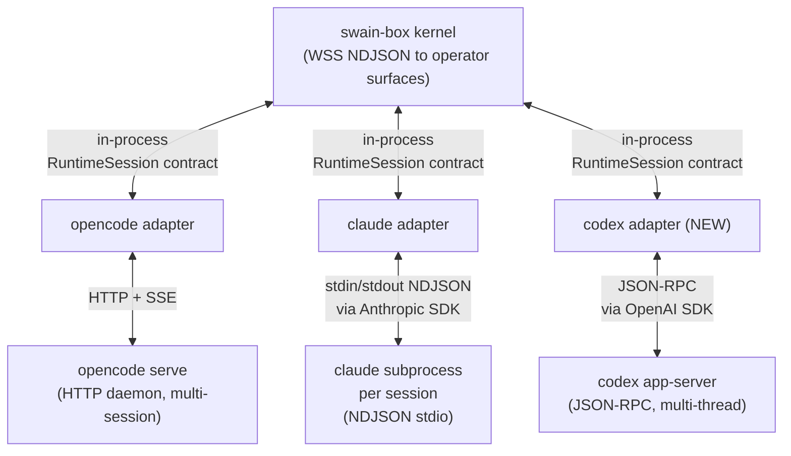
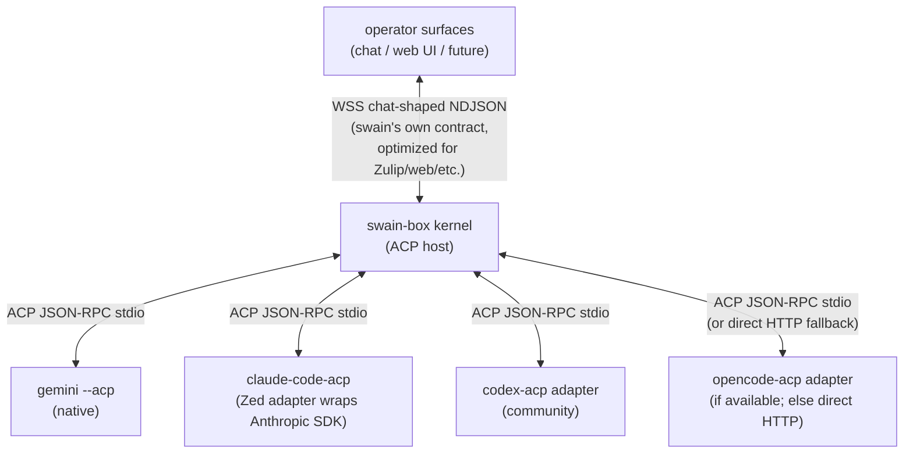
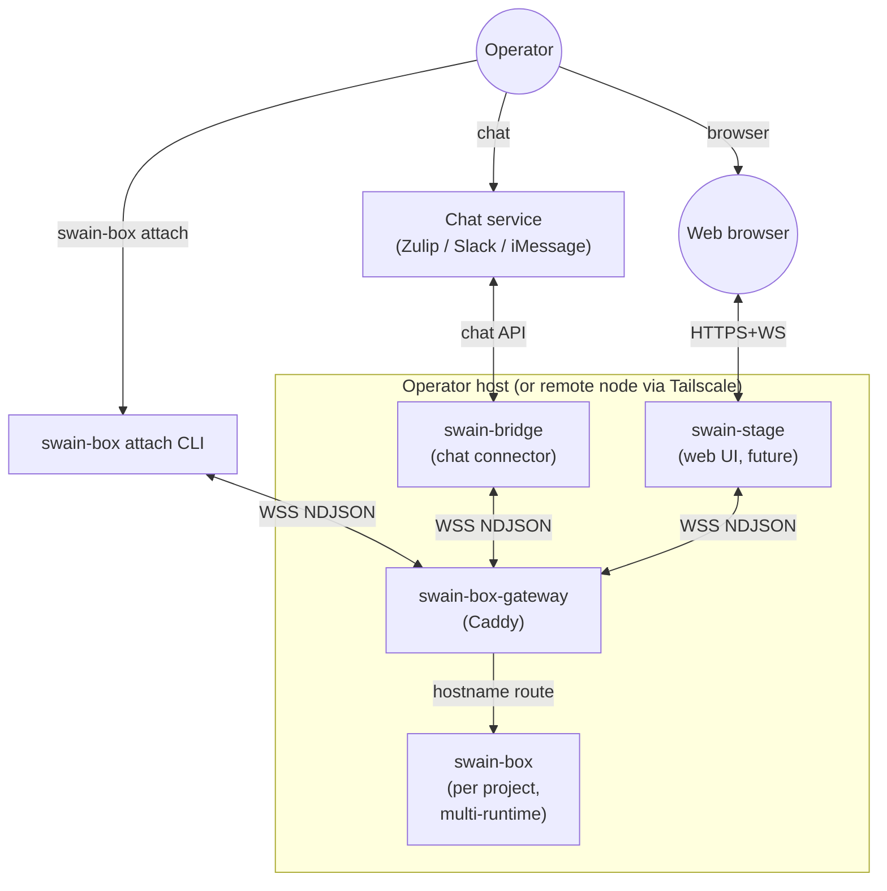
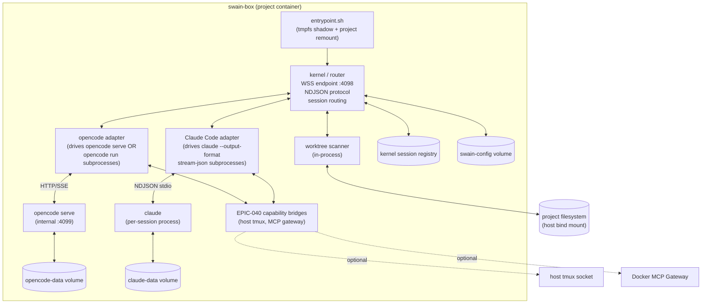
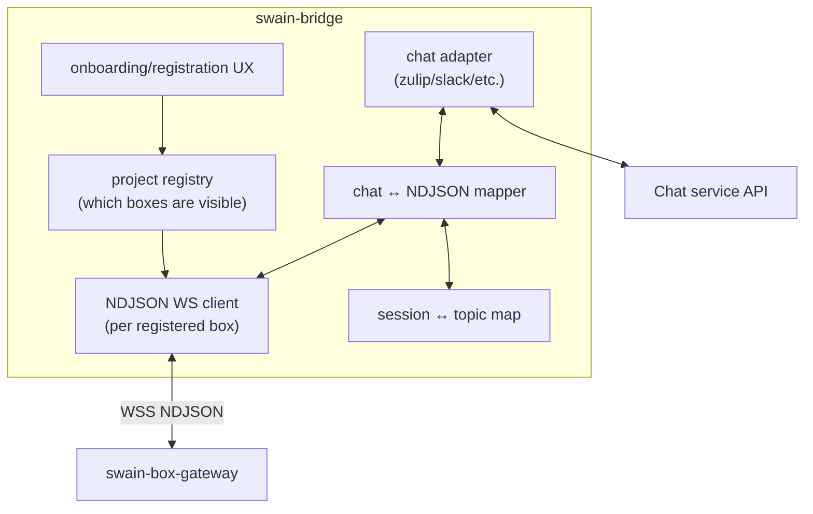
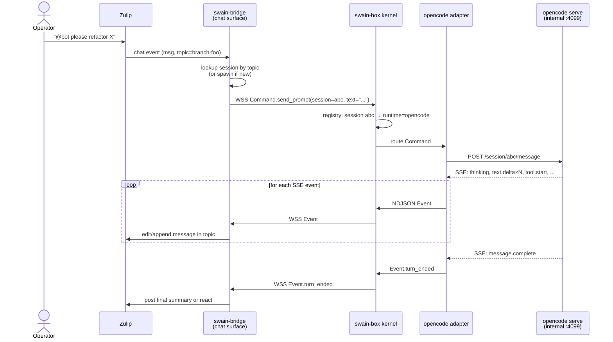
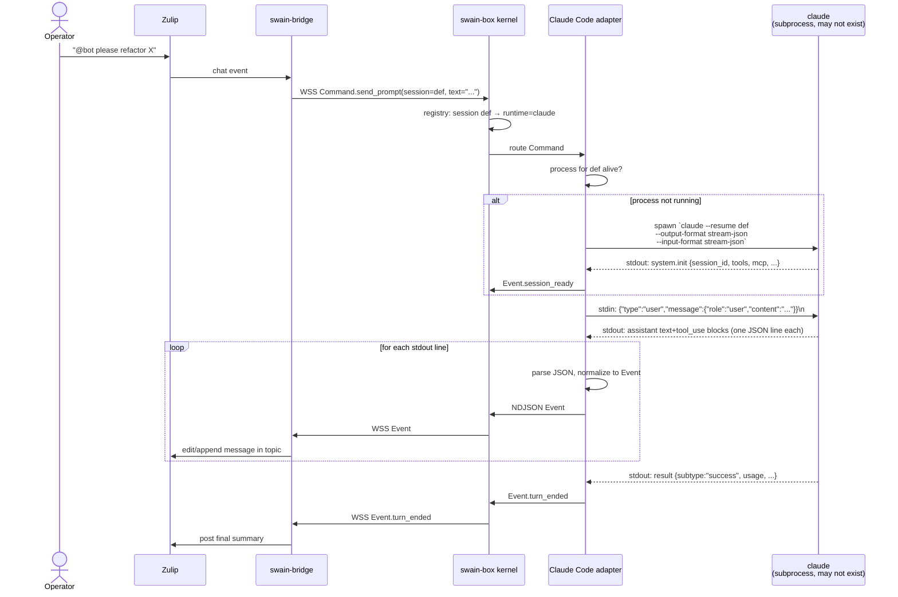
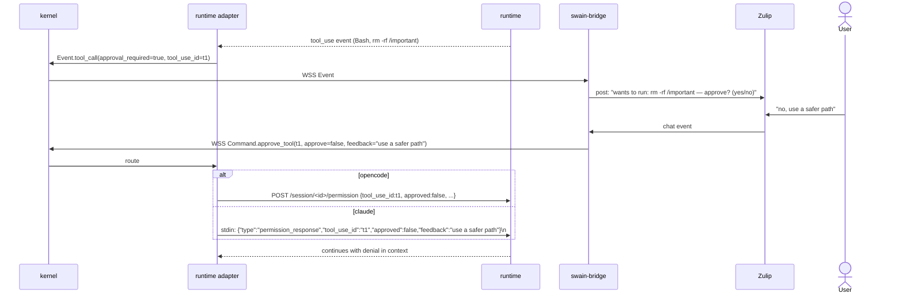

# swain-box / swain-bridge / swain-stage realignment — multi-runtime v1 variant

Status: thinking-in-progress. Not an artifact. Sibling to `../2026-04-26-swain-box-bridge-realignment/scratchpad.md` — that scratchpad assumed opencode-only v1; this one assumes **Claude Code AND opencode are both first-class harnesses in v1**. Written from scratch, not as a diff.

## The realignment in one paragraph

Three peer primitives plus a singleton gateway. Inside swain-box, a runtime-agnostic kernel exposes a single contract (NDJSON over WebSocket) that abstracts over multiple runtime harnesses. Operator surfaces talk to the kernel, never to runtimes directly.

- **swain-box** — per-project isolation container. Owns a runtime-agnostic kernel + N runtime adapters (opencode, Claude Code, future) + capability bridges + worktree state. No registration. Brought up ad-hoc by a CLI that handles missing infra.
- **swain-bridge** (rename candidate: `swain-chat`) — per-host chat connector. Holds project ↔ stream mapping. Talks to swain-boxes via the kernel's NDJSON contract. Onboarding/registration UX.
- **swain-stage** (future) — per-host web UI. Same shape as swain-bridge: another operator surface that speaks NDJSON.
- **swain-box-gateway** — Caddy. Singleton per host. TLS termination + hostname routing + WebSocket upgrade pass-through. No more auth header injection (auth lives at the kernel now).

## The load-bearing contract: NDJSON over WebSocket

This is the central architectural commitment in this variant. The protocol that exists today in `src/swain_helm/protocol.py` (`Event`, `Command`, `ConfigMessage`) is designed exactly for runtime-agnostic translation. Today it runs over stdio between trusted in-container subprocess plugins. In this variant it gets lifted to a networked transport so external operator surfaces can speak it.

Why this matters: opencode has `opencode serve` (HTTP/SSE), Claude Code does not. There is no shared upstream contract. Either:

- We pick opencode HTTP and write a Claude→opencode-HTTP shim (one direction only — claude can't easily mimic opencode serve), OR
- We pick our own contract and write adapters to both runtimes.

The second is what the kernel was designed for. Lifting it from stdio to WebSocket is incremental compared to inventing a new shim.

## The kernel is the new attach point

This is the key architectural shift to internalize before reading the rest of this scratchpad. In the opencode-only world, "attach" means "open an HTTP/SSE connection to opencode serve." Operators talk to opencode directly; opencode is the serve.

In the multi-runtime world, that doesn't work — claude has no equivalent of `opencode serve`. There is no `claude serve` daemon. So:

**The kernel becomes the long-running daemon that operator surfaces connect to.** opencode serve is demoted to "an internal subprocess the opencode adapter happens to use" — bound to localhost inside the container, not exposed through Caddy. claude is run as one short-lived (or per-session-lived) subprocess per active claude session, owned by the claude adapter.

What an operator surface sees: a single WSS endpoint per swain-box (`wss://<box-hostname>/`, terminated by the kernel). Send Commands, receive Events. Whether a given session is opencode-backed or claude-backed is invisible at that layer — runtime is just a field on `Command.spawn_session`.

What lives inside swain-box:

```
┌── swain-box ────────────────────────────────────────┐
│                                                     │
│  kernel  ◄─── the only externally-reachable surface │
│   │       (WSS NDJSON, on :4098, behind Caddy)      │
│   │                                                 │
│   ├── opencode adapter                              │
│   │     │                                           │
│   │     └─► opencode serve (localhost:4099)         │
│   │           one process, multiplexes sessions     │
│   │                                                 │
│   └── claude adapter                                │
│         │                                           │
│         ├─► claude subprocess for session abc       │
│         ├─► claude subprocess for session def       │
│         └─► (one per active session, lazy spawn)    │
│                                                     │
└─────────────────────────────────────────────────────┘
```

So: **"how does an operator connect to claude" → they don't, they connect to the kernel; the kernel owns the claude subprocess.** The kernel is the attach surface; runtimes are implementation details behind it.

### Concrete: how the kernel sends commands to claude

The claude CLI supports a streaming mode designed for programmatic use:

```
claude --resume <session-id> \
       --output-format stream-json \
       --input-format stream-json
```

Stdin and stdout are NDJSON streams. The kernel keeps this process alive (per session) and:

- **Sends a prompt**: write one JSON line to stdin
  ```json
  {"type":"user","message":{"role":"user","content":"please refactor X"}}
  ```
- **Reads events**: read stdout line by line; each line is a JSON object (system.init, assistant text/tool_use, tool result, result)
- **Approves a tool use**: write another JSON line to stdin
  ```json
  {"type":"permission_response","tool_use_id":"toolu_abc","approved":true}
  ```
- **Interrupts**: send SIGINT to the process

That's the entire mechanism. The kernel is just a pipe-and-WebSocket proxy that translates between operator-side NDJSON Commands/Events and runtime-side stdin/stdout (claude) or HTTP (opencode).

### Verified wire format (from Python SDK source, 2026-04-26)

Verified against `anthropic/claude-agent-sdk-python` source (the official SDK is the de-facto spec — the CLI flags are officially undocumented, see "documentation risk" below).

**Required CLI invocation** (`_internal/transport/subprocess_cli.py:207,384`):
```
claude --output-format stream-json --verbose --input-format stream-json [--resume <id>] [other args]
```
Both `stream-json` flags work only with `--print` (`-p`). The SDK confirms `--verbose` is also passed.

**Multi-turn in one process: confirmed.** `ClaudeSDKClient` keeps the subprocess alive across many `query(...)` calls (`client.py`); `examples/streaming_mode.py:example_multi_turn_conversation` demos sequential turns against one open client. Stdin EOF terminates the process.

**User message wire format** (`client.py:297-302`):
```json
{
  "type": "user",
  "message": {"role": "user", "content": "your prompt"},
  "parent_tool_use_id": null,
  "session_id": "default"
}
```
followed by `\n`. Note `session_id` is per-message — see "session multiplexing" below.

**Tool permission is a layered control protocol** on top of stream-json, not a simple permission_response (`query.py:264-310,335-383`):
- CLI emits `{"type":"control_request","subtype":"can_use_tool","input":...}` to stdout
- Caller writes back to stdin:
  ```json
  {"type":"control_response","response":{"behavior":"allow"}}
  ```
  or
  ```json
  {"type":"control_response","response":{"behavior":"deny","message":"...","interrupt":true}}
  ```
- The CLI can also emit `control_cancel_request` mid-flight

**Interrupt is a control request** (`query.py:684`): `{"type":"control_request","subtype":"interrupt"}`

### SPIKE result (2026-04-26): `session_id` is ignored, multi-turn confirmed

Ran `cat msgs.jsonl | claude -p --input-format stream-json --output-format stream-json --verbose` with three messages tagged `sess-A`, `sess-A`, `sess-B`.

What the CLI emitted on stdout:

```json
{"type":"system","subtype":"init","session_id":"514d5cf8-680f-4aaa-9ae5-afc236389f14",...}
{"type":"assistant","session_id":"514d5cf8-...","message":{"content":[{"type":"text","text":"OK"}]}}
{"type":"result","subtype":"success","session_id":"514d5cf8-...","result":"OK"}
{"type":"system","subtype":"init","session_id":"514d5cf8-680f-4aaa-9ae5-afc236389f14",...}
{"type":"assistant","session_id":"514d5cf8-...","message":{"content":[{"type":"text","text":"42"}]}}
{"type":"result","subtype":"success","session_id":"514d5cf8-...","result":"42"}
```

Conclusions:

- **The `session_id` field on input messages is ignored.** The CLI generated one UUID at startup and used it for all events, regardless of what I sent. Per-message session multiplexing inside one process is **not supported** at the CLI wire level.
- **Multi-turn within one process works.** The second message asked "what number did I tell you?" and the answer was "42" — context retained across turns within the same subprocess.
- **The third message wasn't processed** — likely a stdin-EOF-too-soon artifact of bulk-feeding via `cat | claude`. The SDK pattern (write-one-message → wait-for-`result` → write-next) avoids this; the kernel will follow the same pattern.
- **Each turn re-emits a `system.init` event** describing the available tools, MCP servers, model, etc. Useful for the kernel to track per-turn state changes (model swap, MCP server config, etc.) but verbose if forwarded raw to operator surfaces.

**Architectural consequence:** the kernel's claude adapter must keep one subprocess per claude-backed session — the "one process multiplexes many sessions" optimization is off the table for claude. Process count = active session count (with lazy spawn keeping idle sessions cold).

The CLI does also accept `--session-id <uuid>` at process start (per `claude --help`), so the kernel can pre-assign UUIDs rather than letting claude generate them. That's the right pattern for kernel session bookkeeping.

## Session model comparison: opencode vs claude vs codex

The three runtimes pick three different programmatic shapes. Each adapter inside swain-box's kernel has to deal with a different transport — but the kernel's external contract (NDJSON over WSS) hides this from operator surfaces.

| Aspect | opencode | claude (Claude Code) | codex (OpenAI Codex) |
|---|---|---|---|
| Programmatic mode | `opencode serve` (HTTP daemon) | `claude -p --input-format stream-json` (subprocess) | `codex exec --json` (one-shot) OR Codex SDK (JSON-RPC) |
| Daemon process? | Yes — long-lived server | No — subprocess per session | Optional — SDK uses local "app-server" via JSON-RPC |
| Session multiplexing | Native — N sessions per daemon, addressable by ID | None — 1 process = 1 session | Native via app-server (SDK); none via `exec` (one-shot) |
| Multi-turn in one invocation | Yes (server keeps sessions alive across requests) | Yes (within one subprocess, sequential turns) | Yes via SDK threads; no via `exec` (use `exec resume <id>`) |
| Wire protocol | HTTP + SSE for events | NDJSON over stdin/stdout | JSON-RPC (SDK); JSON Lines stdout only (`exec --json`) |
| Event format | SSE: `message.part.delta`, `session.idle`, `permission.asked`, etc. | NDJSON: `system`, `assistant`, `tool`, `result`, `control_request` | JSON Lines: `thread.started`, `turn.started`, `item.*`, `turn.completed` |
| Tool permission callback | Yes — `permission.asked` SSE event + `POST /session/<id>/permission` reply | Yes — `control_request` (subtype `can_use_tool`) + `control_response` reply | **No documented mechanism** — only inline auto-approve modes (`--full-auto`, `--sandbox` levels) |
| Session resume | Sessions persist on disk; daemon restores on restart | `claude --resume <uuid>` spawns a new process for an existing session | `codex exec resume <id>` or `--last`; SDK `resumeThread(id)` |
| Session ID origin | Server-assigned at `POST /session` | Auto-generated; can override with `--session-id <uuid>` at process start | Server-assigned thread_id (in `thread.started` event) |
| Official SDK | None first-party in Python (HTTP is the canonical interface) | `claude-agent-sdk` (Python + TypeScript) | Python SDK (experimental, JSON-RPC); TypeScript library |
| Existing swain code | `adapters/opencode_server.py` already implements this | `adapters/claude_code.py` exists in worktree (subprocess wrapper) | None |

### Three different transports, one external contract



Each adapter is meaningfully different inside but exposes the same `RuntimeSession`-style contract to the kernel. The complexity is contained.

### Approval model: sandbox-level, not per-tool

Operator-in-the-loop *per-tool* approval is **not a goal** of swain-box. The container is the safety boundary — read-only rootfs, tmpfs shadowing, scoped paths, no host filesystem access outside the project mount. Agents run autonomously inside.

Concretely, every runtime is launched in its most-permissive mode:

| Runtime | Autonomous-mode flag |
|---|---|
| opencode | (no equivalent — opencode currently emits `permission.asked`; kernel auto-allows) |
| claude | `--dangerously-skip-permissions` |
| codex | `--full-auto --sandbox danger-full-access` |
| gemini | `--yolo` (or `--approval-mode=yolo`) |

Operator visibility into what the agent is doing comes from forwarding tool-call events to the operator surface (chat shows "ran: rm -rf /tmp/staging") *as a notification*, not as a gate. The operator can interrupt or kill the session at the session level, but doesn't approve individual tool uses.

This kills the "codex has no permission callback" worry — that's not a gap, it's the design.

### Implementation cost ranking, lowest to highest

1. **opencode adapter** — already exists in the worktree (`adapters/opencode_server.py`), production-tested.
2. **claude adapter** — exists as subprocess wrapper (`adapters/claude_code.py`); replace with a thin layer over the official `claude-agent-sdk` Python package to eliminate the documentation-gap risk. Net effort: rewrite the existing adapter on top of the SDK.
3. **codex adapter** — does not exist; would use OpenAI's experimental Python SDK (JSON-RPC to local app-server). Need to bundle the codex binary in the Dockerfile alongside opencode and claude, and add the SDK as a dependency.

For v1, "first-class opencode + claude" is the realistic scope. **Codex as v2** because: (a) the SDK is experimental, (b) the permission asymmetry needs explicit UX design, (c) operational scope creep — three runtimes triple the auth/credential/upgrade surface area on day one.

### Updated implication for the scratchpad's earlier "first-class multi-runtime" framing

The original premise was "claude and opencode both first-class in v1." That holds and the architecture supports it cleanly. **Codex is a clean add-on for v2** under the same kernel — the RuntimeSession contract absorbs the JSON-RPC transport without disturbing operator surfaces.

The earlier doc-gap mitigation (layering through the official Anthropic SDK rather than the raw CLI) generalizes: **every runtime adapter should layer through the official SDK where one exists** (Anthropic's for claude, OpenAI's for codex), and use direct HTTP only when no SDK exists (opencode). This pushes upstream-API drift onto the SDK maintainers and lets us track stable SDK version pins instead of CLI flag stability.

## Gemini and the ACP convergence (2026-04-26 update)

Adding Gemini to the comparison turned up a result that supersedes the per-runtime-adapter framing above.

### Gemini CLI (verified locally, version 0.38.1)

| Aspect | Gemini |
|---|---|
| Programmatic mode | `gemini -p <prompt>` (single-shot) OR `gemini --acp` (bidirectional ACP server) |
| Output formats | `text`, `json`, `stream-json` |
| Session resume | `gemini --resume <index|latest>`, `--list-sessions`, `--delete-session` |
| Approval modes | `default` (prompts), `auto_edit`, `yolo`, `plan` |
| MCP | `gemini mcp` subcommand |
| Skills | `gemini skills` (extension surface) |
| Hooks | `gemini hooks` |
| Notable | First-class **`--acp` flag** — speaks the Agent Client Protocol natively |

### Agent Client Protocol (ACP) — the actual convergent standard

**ACP is JSON-RPC 2.0 over stdio**, designed for "external thing controls AI coding agent." Stabilizing additional transports (HTTP and WebSocket) per a published RFD. It standardizes the exact pattern this scratchpad has been sketching ad-hoc: spawn an agent subprocess, send `session/prompt`, receive streaming `session/update` notifications, optionally respond to `session/request_permission`, terminate via `session/close`.

Key methods (from the spec):

| Direction | Method | Purpose |
|---|---|---|
| Client → Agent | `session/prompt` | Start a turn (returns `{stopReason}` when complete) |
| Client → Agent | `session/list`, `session/resume`, `session/close` | Session lifecycle |
| Agent → Client (notification) | `session/update` with `sessionUpdate: agent_message_chunk` | Streaming text |
| Agent → Client (notification) | `session/update` with `sessionUpdate: tool_call` / `tool_call_update` | Tool execution events |
| Agent → Client (notification) | `session/update` with `sessionUpdate: plan` | Agent's task plan |
| Agent → Client (request) | `session/request_permission` | Permission gate (auto-allowed in swain-box) |

`session/prompt` returns one of: `end_turn`, `max_tokens`, `max_turn_requests`, `refusal`, `cancelled`. Tool calls support embedded terminal streaming for live shell output.

### Who speaks ACP

| Runtime | ACP support |
|---|---|
| Gemini CLI | Native (`--acp` flag, reference implementation) |
| Claude Code | Official Zed adapter `@zed-industries/claude-code-acp` (Apache-licensed, wraps the Anthropic SDK) |
| Codex | Community ACP adapters; listed in Zed's external-agents docs |
| OpenCode | Listed as ACP-implementing on agentclientprotocol.com (verify before depending on it) |

Other ecosystem members: Cline, Cursor, GitHub Copilot (beta), OpenHands, Mistral Vibe — 30+ agents on the official agent list. Clients consuming ACP: Zed, Neovim (CodeCompanion plugin), and growing.

### Architectural pivot: ACP-internal, custom-external

The "three different transports inside swain-box, kernel hides this" picture is now **outdated**. Better:



The kernel becomes an **ACP client** that orchestrates ACP agent subprocesses. Per-runtime bespoke code largely disappears: spawn the right agent subprocess, route `session/prompt` to the right session, forward `session/update` notifications. Auto-allow all `session/request_permission`. The kernel's residual swain-specific work is the chat-friendly translation layer for operator surfaces (because chat is shaped differently than IDE-shaped ACP clients) plus worktree scanning and capability bridges.

### Cost/benefit of going ACP-internal

**Wins:**
- One protocol inside the container instead of three or four. Less code, less drift exposure.
- Every new ACP-implementing runtime is a near-zero-cost addition. The runtime ecosystem is converging here.
- Tool-call streaming and session lifecycle are already designed; we don't reinvent them.
- ACP's terminal-embedding for live shell output maps cleanly to swain's existing tmux-bridge ambitions.
- Operator surfaces stay decoupled from the runtime mix — they speak swain's chat-shaped contract; the kernel translates ACP events.
- Free interop bonus: future power-users can plug Zed or Neovim directly at one of the swain-box's ACP-speaking subprocesses, bypassing the kernel for IDE-shape work.

**Risks / costs:**
- ACP is young — protocol can evolve. Pin a version; track the Transports Working Group output.
- The Claude Code and Codex ACP adapters are third-party (Zed-maintained / community), not vendor-maintained. We get one layer of indirection for both.
- ACP is opinionated — if our needs (chat-shaped events, custom MCP wiring, worktree integration) don't map, we either extend or work around.
- OpenCode ACP support listed but not yet verified — may need a thin shim or stay HTTP-direct.
- The chat-shaped WSS façade still has to exist; ACP doesn't replace it (ACP is IDE-shaped, swain's surfaces are chat-shaped).

### Where this lands the v1 architecture

- **Kernel speaks ACP internally to all runtime subprocesses where possible.** Where an ACP adapter doesn't exist (e.g., opencode if its support turns out to be aspirational), keep a direct adapter as the exception, not the rule.
- **Kernel's external WSS protocol stays swain's own** — chat-shaped, includes worktree events, capability bridge events, and other swain-specific concerns ACP doesn't model.
- **Sandbox-level safety**: every agent launched in its autonomous mode (`--yolo` / `--dangerously-skip-permissions` / `--full-auto`); permission requests over ACP get auto-allowed. The container is the safety boundary.
- **v1 scope**: opencode + claude + gemini (gemini joins because ACP makes it nearly free). Codex bumps to v2 only because the SDK is experimental — not because the wire model is hard.

### Verification needed before locking the ACP-internal direction

- Confirm the ACP version + transport stability story (currently stdio-only, HTTP/WebSocket per RFD). Pin to stable.
- Verify opencode ACP support — adapter exists? Maintained? Or aspirational?
- Test the Zed `claude-code-acp` adapter inside a container — auth flow, MCP config inheritance, tool-call streaming under load.
- Confirm gemini's `--acp` mode works headless inside a container without a display server.
- Read the ACP `terminal/create` flow vs swain's planned host-tmux capability bridge — confirm they compose cleanly.

### Documentation risk to flag

The CLI flags `--input-format stream-json` and `--output-format stream-json` are **officially undocumented** beyond the one-line description in `claude --help`. [GitHub issue #24594](https://github.com/anthropics/claude-code/issues/24594) tracks the gap. The Python SDK source is currently the de-facto spec.

Implication: the wire format above could change without warning in a CLI version bump. Mitigations:

- Pin the CLI version in the Dockerfile (already done for opencode at 1.14.19).
- Track CLI version in the kernel and warn on mismatch with what was tested.
- Layer the kernel's claude adapter through the official Python or TypeScript SDK rather than calling the CLI directly — push the wire-format risk onto Anthropic's SDK maintainers, who handle CLI version compatibility internally. Trade-off: SDK adds a runtime dep but kills the documentation-gap risk.

The third option is probably the right call. It also gives us hooks (`PreToolUse`, `PostToolUse`, etc.), structured types for events, and the control-protocol implementation already battle-tested. The kernel's claude adapter becomes a thin wrapper around `ClaudeSDKClient` rather than a stdin/stdout marshaller of an undocumented format.

## C4 — System Context



## C4 — Container view (one swain-box, multi-runtime)



Notes on this view:
- The kernel is the only externally-reachable surface. opencode serve is internal (`localhost:4099`) and not exposed by Caddy.
- Each adapter wraps one runtime's native shape (HTTP for opencode, stdio for claude) and translates to/from the kernel's NDJSON.
- Per-runtime data volumes — opencode and claude have completely different state directories and credential models.
- Capability bridges are runtime-agnostic. Both adapters can opt sessions into them.

## C4 — Container view (swain-bridge)



The mapper is runtime-agnostic — it speaks the kernel's NDJSON, not opencode-specific or claude-specific shapes. Sessions identify which runtime they're on (a field in the spawn command) but events look the same downstream.

## Steering: how the kernel actually drives both runtimes

This is the load-bearing concrete detail that the C4 diagrams skip. Every operator action becomes a Command in the kernel's NDJSON protocol; each runtime adapter implements those Commands by mapping to runtime-native operations.

### Verb mapping

| Kernel Command | opencode adapter (drives `opencode serve` via HTTP) | Claude Code adapter (drives `claude` subprocess via stdio) |
|---|---|---|
| `spawn_session(runtime, system_prompt?, model?)` | `POST /session` to opencode serve; capture session_id from response | Generate session_id (uuid); record in registry; do NOT spawn process yet (lazy) |
| `attach_session(session_id)` | Subscribe to opencode SSE stream filtered to session_id | If process not running, spawn `claude --resume <session_id> --output-format stream-json --input-format stream-json`; wire up its stdout |
| `send_prompt(session_id, text)` | `POST /session/<id>/message` with `{role:"user", content:text}` | Write `{"type":"user","message":{"role":"user","content":text}}\n` to claude's stdin |
| `interrupt_session(session_id)` | `POST /session/<id>/interrupt` (or DELETE on the active stream) | Send SIGINT to claude process |
| `approve_tool(session_id, tool_use_id, approve, feedback?)` | `POST /session/<id>/permission` with the decision | Write `{"type":"permission_response","tool_use_id":...,"approved":true/false}\n` to stdin |
| `list_sessions()` | `GET /session` | Read directory listing of `~/.claude/projects/<project>/` (claude persists each session as a `.jsonl` file) |
| `kill_session(session_id)` | `DELETE /session/<id>` (or just stop tracking) | SIGTERM the process; leave session file on disk for resume |
| `set_model(session_id, model)` | `POST /session/<id>/model` (if exposed) | Write `{"type":"set_model","model":...}\n` to stdin (claude supports mid-session model switch) |

### Event mapping (runtime → kernel domain)

| Runtime event | opencode (SSE event types) | Claude (stream-json types) | Kernel `Event` |
|---|---|---|---|
| Text delta from agent | `message.delta` with text chunk | `assistant` message with `content[].type=="text"` | `Event.text_output(content=...)` |
| Tool invocation | `tool.start` | `assistant` message with `content[].type=="tool_use"` | `Event.tool_call(name, input, tool_use_id, approval_required)` |
| Tool result | `tool.complete` | `tool` message (tool_result) | `Event.tool_result(tool_use_id, output, is_error)` |
| Thinking | `thinking` event | `assistant` message with `content[].type=="thinking"` | `Event.thinking_output(content=...)` |
| Permission needed | `permission.request` | system message of `subtype:"permission_required"` (or stalled tool_use awaiting response) | `Event.tool_call(approval_required=true)` |
| Turn complete | `message.complete` | `result` message (subtype: `success`/`error_max_turns`/etc.) | `Event.turn_ended(reason, usage)` |
| Compaction occurred | `session.compacted` | `system.compaction_summary` | `Event.compaction(summary)` |
| Process death | (HTTP connection drop) | stdout EOF + non-zero exit | `Event.session_dead(reason)` |

### Sequence: one full chat round-trip, opencode session



### Sequence: same round-trip, Claude Code session (lazy spawn)



### Sequence: tool approval, both runtimes (same surface contract)



### What's still hand-wavy and needs SPIKE work

- **Exact wire format of claude's `permission_response`**. The stream-json input format supports user messages cleanly; permission/interactive flows are documented but I haven't verified the exact JSON shape against current claude-cli behavior. Confirm before committing to the contract.
- **opencode serve's permission API surface**. The existing `adapters/opencode_server.py` is the closest reference — verify its assumptions are still current with opencode 1.14.19+.
- **Claude session file format**. Listing sessions by reading `~/.claude/projects/<project>/*.jsonl` is reasonable but the format is private and could change. Alternative: keep our own session registry and ignore claude's directory layout.
- **Streaming back-pressure**. opencode SSE and claude stdout both push events fast. Operator surface (especially chat) can't keep up — needs coalescing/batching at the kernel or surface side. Today's `bridges/project.py` has some batching logic worth preserving.
- **Session ownership across runtime restarts**. If swain-box restarts: opencode serve restores its session state from its volume; claude sessions are file-based so resume works; but the kernel's session registry needs to reconcile both sources without ghost sessions.
- **Mid-conversation runtime switch**. Could a session that started on opencode be continued on claude (or vice versa)? Probably not in v1 — different conversation history formats. Document as out-of-scope.

## Contracts (the seams)

| Seam | Direction | Protocol | Auth | Notes |
|---|---|---|---|---|
| Operator → CLI → swain-box | local exec | shell | local user | `swain-box up`, `down`, `attach`, `list`, `rm` |
| Gateway → swain-box | container network | WSS pass-through | none (network-isolated) | hostname routing, kernel on :4098 |
| Operator surface → Gateway | TCP/HTTPS | WSS NDJSON | bearer token at WS handshake | gateway terminates TLS; kernel terminates auth |
| swain-box kernel ↔ opencode adapter | in-process | function calls + opencode HTTP internally | none | adapter owns opencode serve subprocess |
| swain-box kernel ↔ Claude adapter | in-process | NDJSON stdio to claude | claude OAuth/API key in env | adapter owns claude subprocess per session |
| swain-bridge → chat service | external | service-specific | service token | one per registered service |
| swain-box ↔ host capabilities | host syscalls | tmux socket, docker socket | container caps | EPIC-040 territory |
| Operator → swain-bridge | local exec | shell | local user | registration commands |
| Operator → swain-stage | browser | HTTPS+WSS | session cookie | future |

The single externally-visible contract: **WSS NDJSON to the kernel**. Everything else is internal to swain-box or operator-side.

## User interaction contracts

### swain-box CLI

```
swain-box up [path] [--runtimes=opencode,claude]
                                 # start container; default path=$PWD
                                 # default runtimes: both
                                 # idempotent: if running, no-op + print URL
                                 # creates project name from dir basename if missing
                                 # runs `git init` if no .git
                                 # brings up swain-box-gateway if not running
                                 # writes hostname to gateway config + reloads
                                 # provisions per-runtime credential volumes

swain-box down [name|path]       # stop; preserve volumes
swain-box rm   [name|path]       # destroy; -f to wipe volumes
swain-box list                   # running boxes, hostnames, attach URLs, runtimes available
swain-box attach [name|path] [--runtime=opencode|claude] [--session=ID]
                                 # speaks NDJSON to the kernel
                                 # interactive runtime/session picker if not specified
swain-box logs [name|path] [--runtime=opencode|claude]
swain-box exec [name|path] -- cmd
swain-box auth [name|path] --runtime=opencode|claude
                                 # interactive auth bootstrap per runtime
```

### swain-bridge CLI (registration required)

```
swain-bridge up                  # start daemon; first-run prompts for chat config
swain-bridge down
swain-bridge register <name|path> [--stream X] [--service zulip] [--default-runtime=opencode|claude]
                                 # adds project to chat surface
                                 # creates stream/topic in chat service
                                 # records hostname for kernel WS target
                                 # default-runtime sets which runtime new chat-spawned sessions use
swain-bridge unregister <name>
swain-bridge list                # registered projects, services, addresses, default runtimes
swain-bridge status              # daemon health, connected services, attached boxes
```

Chat-side runtime selection: in chat, operator can override per-message (`@bot use:claude make this change`) — runtime is a parameter of the spawn command, not a property of the project.

### swain-stage CLI (future)

```
swain-stage up   [--port N]
swain-stage down
swain-stage open
# UI shows runtime per session, lets operator pick on spawn.
```

## Inventory of assumptions, with critique

| # | Assumption | Verdict | Notes |
|---|---|---|---|
| A1 | swain-box is the per-project isolation primitive | **Yes** | Container model from ADR-048. Read-only rootfs + tmpfs shadowing + project remount stays. |
| A2 | swain-box CLI builds missing infra ad-hoc (git init, project name, etc.) | **Yes** | Plus per-runtime credential bootstrap (`swain-box auth --runtime=...`). |
| A3 | swain-bridge requires registration; chat is curated | **Yes** | Same as the opencode-only variant. |
| A4 | First-run swain-bridge does onboarding | **Yes** | Plus per-project default-runtime selection. |
| A5 | swain-stage is a future GUI built on swain-box | **Yes** | And in this variant, the contract it speaks (NDJSON over WebSocket) is the same one swain-bridge speaks. They share an SDK. |
| A6 | **Both opencode and Claude Code are first-class in v1** | **The premise** | Drives the kernel-as-spine architecture. Without this, the kernel is overkill. |
| A7 | Operator surfaces should be runtime-agnostic | **Yes** | Otherwise multi-runtime support is a fiction — every surface ends up needing per-runtime code. |
| A8 | The existing NDJSON `protocol.py` is the right starting point for the kernel's external contract | **Yes, with hardening** | It was designed for this. Lifting from stdio to WSS adds: framing, auth, reconnection, backpressure. None are exotic. |

## Gaps and open questions

### G1. Caddy placement

Same as the opencode-only variant: swain-box-gateway is a host-level singleton (Caddy). `swain-box up` brings it up if not running. In this variant Caddy's role is simpler — TLS termination + hostname routing + WebSocket pass-through. No auth header injection (the kernel terminates auth itself, since we're no longer routing to opencode serve).

### G2. Claude session model vs opencode session model

opencode (via serve) keeps sessions alive in a long-running process; sessions are server-side state addressable by ID. Claude is the opposite: each session is a fresh `claude` process spawned at attach time, conversation state held in claude's per-project store on disk, resumed via `--resume <session-id>`.

The kernel has to abstract this. Options:

- **Eager spawn** — kernel keeps a claude process alive per session (mirror opencode's model). Memory cost per idle session; matches operator surface assumption that "session is connected."
- **Lazy spawn** — kernel keeps session metadata only; spawns claude process on first incoming command for that session, idles it after a timeout. Cheaper; needs careful state machine for "session exists but not loaded."
- **Hybrid** — eager for "active" sessions (recently used), lazy for the rest. Best UX/cost tradeoff; most code.

Recommend lazy spawn for v1. It matches claude's own design (the CLI spawns fresh on every invocation; conversation state is in `~/.claude/projects/<project>/`). Operator surfaces see "session 123 exists" via a list call; only on send-prompt does claude actually wake up.

### G3. Protocol completeness for both runtimes

Today's `protocol.py` has Event/Command shapes that grew up around opencode. Need to verify (or extend) coverage for:

- claude's stream-json events: `system.init`, `system.result`, `assistant.text`, `assistant.tool_use`, `tool.result`, `user.echo`, plus thinking blocks
- claude's permission/approval flow (claude prompts for tool approval inline; opencode doesn't have an exact equivalent)
- claude's mid-session model switches (Opus/Sonnet/Haiku)
- claude's MCP server invocations (visible in tool events)
- error and interrupt semantics (claude vs opencode handle SIGINT differently)
- compaction/summarization events (both runtimes auto-compact long conversations)

This is the work of a SPIKE. If the protocol turns out to be less runtime-agnostic than its name suggests, the entire variant is in question.

### G4. Per-runtime credentials and state

| Runtime | Credentials | State directory | Inside container |
|---|---|---|---|
| opencode | `opencode auth login` writes to `~/.opencode/auth.json`; or env vars | `~/.opencode/` | `opencode-data` volume mounted at `/root/.opencode` |
| Claude Code | Claude OAuth (browser flow) writes to `~/.claude/.credentials.json`; or `ANTHROPIC_API_KEY` env | `~/.claude/projects/<project>/` and `~/.claude/.config/` | new `claude-data` volume mounted at `/root/.claude` |

OAuth flows that require a browser are awkward inside containers. Both runtimes have this issue. Workarounds:

- API key only inside containers (no OAuth) — simplest, requires the operator to have keys provisioned
- OAuth done on host, credentials volume-mounted in (read-only) — preserves OAuth UX, couples container auth to host filesystem layout
- `swain-box auth` interactive bootstrap — runs the browser flow on the host, captures the result, writes to the container's credential volume — most polished, most code

Recommend API-key-only for v1, with `swain-box auth` as a follow-up. Document the key requirements clearly. This is one place where "first-class" might really mean "first-class with a constraint" until OAuth-in-container is solved.

### G5. MCP server configuration divergence

opencode and Claude Code both consume MCP servers but configure them differently (opencode in `.opencode.toml` or `~/.opencode/mcp.json`; claude in `.mcp.json` or `~/.claude/mcp_servers.json` or per-project). swain-box probably wants a single project-level MCP config that both runtimes inherit. Options:

- Generate per-runtime config files from a unified swain-level config at container start
- Document that operators maintain both files
- Defer MCP support and let each runtime use its own config independently

Recommend generate-from-unified for v1, with a small `swain-box.mcp.toml` schema. Aligns with the "kernel is the unifier" architectural bet.

### G6. Ad-hoc hostname collisions

Same as the opencode-only variant. Derive from basename, hash on collision, allow `--name` override.

### G7. swain-bridge ↔ swain-stage shared state

Same recommendation as the opencode-only variant: shared **project list** (boxes that exist) lives at the gateway level (Caddy's known hosts), each operator surface keeps its own **subscription** (which to surface).

In this variant there's an additional shared concern: **runtime preferences**. If a project's "default runtime" is configured in swain-bridge, swain-stage probably wants to honor that too. Push it down to a per-project config file in `swain-config` volume so any operator surface can read it.

### G8. Auth model

The kernel terminates auth at WSS handshake. Bearer token, generated per swain-box at first start, written to `swain-config` volume. Operator surfaces fetch the token via:

- `swain-box token <name>` (CLI)
- `~/.swain/box-tokens.json` (persisted on operator host)

swain-bridge and swain-stage read this file or call the CLI on first connect. swain-box itself rotates tokens on `swain-box up --rotate-token`.

Caddy still does TLS, but no longer does auth (it just passes WSS frames through). This simplifies Caddy and gives the kernel a real auth surface that doesn't depend on opencode's `attach` workaround.

### G9. `opencode attach` as a debug backdoor

opencode serve runs internally inside swain-box. It could be exposed via Caddy at a separate hostname (`opencode-attach.<box>.local`) for power-users, with a clear caveat: this bypasses the kernel, only sees opencode sessions, and operator surfaces won't show its activity. Or: don't expose it externally at all; if you want to use `opencode attach`, `docker exec` into the container and attach over localhost.

Recommend not-exposed-externally for v1. Keeps the surface minimal. Power-users can `swain-box exec` if they need raw opencode access.

### G10. Where Claude Code lives inside the container

The container needs both opencode and claude binaries installed. Today's Dockerfile installs opencode via npm (pinned + hash-verified). Claude Code is also npm (`@anthropic-ai/claude-code`) and supports the same install/pin/verify pattern. Image gets ~50MB heavier per runtime added. Acceptable for v1; consider per-runtime images later if multi-runtime fan-out gets painful.

### G11. Kernel as a long-running production service

In the opencode-only variant, the kernel could be skipped — opencode serve was the long-running service. In this variant the kernel IS the long-running service, and it's our code, not upstream's. Implications:

- Crash-restart story: kernel crashes mean loss of in-flight session subprocess handles. Sessions on disk survive (claude's resumable sessions, opencode's serve state); in-flight prompts mid-flight are lost. Document and accept.
- Upgrade story: kernel updates mean container rebuild. Same as today.
- Observability: needs structured logs, metrics endpoint, healthcheck. The watchdog/zombie-cleanup files in the current package can be repurposed as kernel internals (process group management, child reaper).
- Backpressure: WSS clients consuming events slowly shouldn't OOM the kernel. Per-client bounded queues.

This is real engineering. Allocate for it.

## Cleaner alternatives considered

### Alt A: opencode HTTP as the contract; claude wrapped in an opencode-shim

Write a small HTTP server inside swain-box that mimics opencode's session API but routes to claude underneath. Operator surfaces speak opencode HTTP unchanged.

Rejected: opencode's API surface is large and evolving. Mimicking it for claude means tracking opencode's upstream changes forever, with subtle bugs at every divergence point. Worse, it makes opencode the "real" runtime and claude a second-class adapter — exactly what "first-class" was supposed to avoid.

### Alt B: Per-runtime kernels (one swain-box per runtime per project)

`swain-box-opencode-foo` and `swain-box-claude-foo` are two separate containers. Each speaks its native protocol. Operator picks at attach time which to talk to.

Rejected: doubles container count, splits worktree state, complicates capability bridges (do both containers share the host tmux?), forces operator to think about which runtime they're on at attach time rather than at session-spawn time. Loses the "switch runtime mid-conversation" possibility forever.

### Alt C: No kernel; operator surfaces poll opencode HTTP and claude's session files directly

Each operator surface reads opencode serve's events and tails claude's project files in `~/.claude/projects/`. No kernel, no NDJSON, no WSS.

Rejected: turns operator surfaces into runtime experts (every surface needs both opencode and claude knowledge). Tailing claude's session files is fragile (private file format that can change). Doesn't compose with capability bridges (who routes the host tmux events?).

### Alt D: Use MCP as the universal protocol

Both runtimes consume MCP. Could the kernel expose itself as an MCP server, and operator surfaces consume it as an MCP client?

Considered but deferred: MCP is designed for tool invocation, not session control / event streaming. Forcing session-spawn / session-list / event-replay into MCP is round-peg-square-hole. Worth revisiting if MCP grows session semantics upstream, but not the v1 path.

**Settled**: kernel + NDJSON-over-WSS is the cleanest path that meets the "both first-class in v1" bar.

## Iteration suggestions

1. **Spike the protocol coverage first.** Before committing to this variant, run a SPIKE that maps every claude stream-json event type to the existing `protocol.py` Event/Command shapes. If coverage is >85% and the gaps are additive, proceed. If there are fundamental impedance mismatches (e.g., claude's permission flow can't fit), reconsider.

2. **Build the kernel as a library, not a daemon, first.** Wire up both adapters in a CLI test harness (no WSS, no Caddy). Prove that you can route a chat-style "send this prompt" command to either runtime and get back a normalized event stream. Once that works, lifting to WSS is mostly transport plumbing.

3. **Ship single-operator-surface MVP.** Pick one of {`swain-box attach` CLI, swain-bridge} as the first operator surface against the kernel. Don't build both in parallel — they'll force premature contract decisions.

4. **Per-runtime credential bootstrap (`swain-box auth`) is the highest-friction UX.** Probably the right place to invest the most polish, because it's the first-time-user experience for every runtime.

5. **Defer MCP unification (G5).** Let each runtime read its own MCP config for v1. Add the unified config later once both runtimes' MCP behaviors are well-understood inside swain-box.

## What this realignment supersedes / changes

| Existing | Becomes |
|---|---|
| `bin/swain-bridge` (bash start script) | `swain-bridge` CLI — daemon mgmt + registration |
| `skills/swain/scripts/swain-box` (multi-runtime local launcher) | DELETED — replaced by `swain-box` CLI with cleaner contract |
| `src/swain_helm/` package | SPLIT: `src/swain_box/kernel/`, `src/swain_box/adapters/`, `src/swain_chat/` |
| `src/swain_helm/bridges/project.py` (microkernel) | KEPT and PROMOTED — becomes the kernel, exposes WSS endpoint instead of subprocess stdio |
| `src/swain_helm/adapters/opencode.py` | KEPT — drives opencode serve via internal HTTP |
| `src/swain_helm/adapters/claude_code.py` | KEPT and PROMOTED to first-class — drives claude subprocesses |
| `src/swain_helm/adapters/zulip_chat.py` | MOVED to swain-chat |
| `src/swain_helm/protocol.py` | EXTENDED — gain framing, auth, reconnection semantics for WSS use |
| `src/swain_helm/watchdog.py`, `zombie_cleanup.py` | REPURPOSED as kernel internals (child process supervision, reaping) |
| `swain-helm` skill | RENAMED/SPLIT to `swain-box` and `swain-chat` skills |
| EPIC-040 (Sandbox Capability Bridges) | RE-PARENTED to target swain-box-the-container; runtime-agnostic capability surface |
| ADR-048 (Container-Per-Project Topology) | EXTENDED — adds the kernel-as-multi-runtime-spine, names the gateway, drops the "opencode attach via Caddy" auth workaround |
| Caddyfile | SIMPLIFIED — TLS + hostname route + WSS pass-through; no auth header injection |
| Dockerfile | EXTENDED — installs Claude Code (`@anthropic-ai/claude-code`) alongside opencode; both pinned + hash-verified |

## What needs to be decided to proceed

- [ ] Final names: `swain-bridge` vs `swain-chat`. (My vote: `swain-chat`.)
- [ ] Package split: one repo with `swain_box`+`swain_chat`, or two repos.
- [ ] Kernel session model: lazy claude spawn vs eager (G2).
- [ ] Auth: API-key-only v1 or `swain-box auth` browser flow at v1 (G4).
- [ ] MCP: per-runtime configs vs unified swain-level config (G5).
- [ ] Whether to expose opencode serve externally as a debug backdoor (G9).
- [ ] Bearer token storage location on operator host (G8).

## Risks (red-team this scratchpad)

- **Protocol coverage** (G3) is the load-bearing assumption. If `protocol.py` can't represent claude's full event stream, the kernel can't be runtime-agnostic and the variant collapses.
- **Kernel as production service** (G11) is real engineering — multi-week effort, not a weekend. Be honest about that scope before committing.
- **Per-runtime auth UX** (G4) is the v1 friction wall. If `swain-box up` then `swain-box auth --runtime=claude` then `swain-box attach` is too many steps, operators will revert to running claude on the host.
- **opencode upstream API drift** still affects us, just inside the opencode adapter rather than at the operator-surface boundary. Better, but not zero risk.
- **Claude Code license & ToS** — verify that running Claude Code inside a non-Anthropic-blessed container doesn't violate terms before committing to first-class support. (The CLI is publicly available; this is mostly a sanity check.)
- **Kernel as new attack surface** — WSS endpoint exposed to the network (even via Caddy) is now ours to harden. Audit auth + input validation more carefully than the original "Caddy proxies to opencode serve" model required.
- **The architecture is provably correct but possibly over-engineered for one operator.** If swain stays solo for the foreseeable future, "just install both binaries on the host and pick one per project" might be 95% as good with 10% the code. The kernel pays off when there are multiple operator surfaces consuming the same sessions — chat AND web UI AND CLI all watching the same agent work. Worth being honest: how much of the design value is "first-class multi-runtime" vs "future-proofing for surfaces"?

## When to choose this variant over the opencode-only variant

This variant is the right call if:

- Claude Code is a hard requirement for v1 (not a nice-to-have).
- You expect 2+ operator surfaces (chat + web + CLI) consuming sessions in parallel.
- You're willing to invest in the kernel as production code and the protocol coverage SPIKE up front.

The opencode-only variant is the right call if:

- One runtime in v1 is acceptable; multi-runtime can wait.
- The operator surface count stays small (just chat for now).
- You want to ship faster and iterate, accepting that adding claude later is a non-trivial refactor.

The cost delta is meaningful: opencode-only is "lift current code into a container, bolt on a chat surface"; multi-runtime-v1 is "build a runtime-agnostic kernel as production infrastructure." Both lead to the same architectural endpoint eventually. The question is when you pay the kernel cost.
