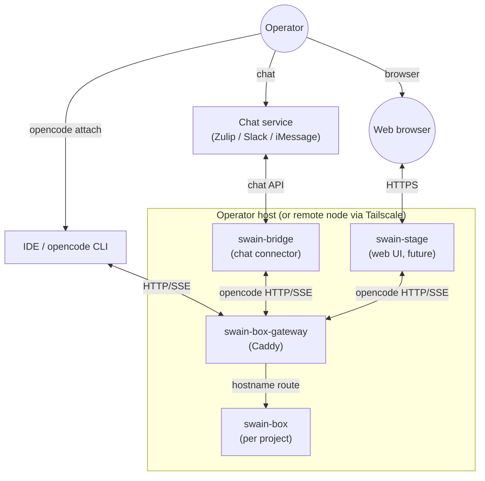
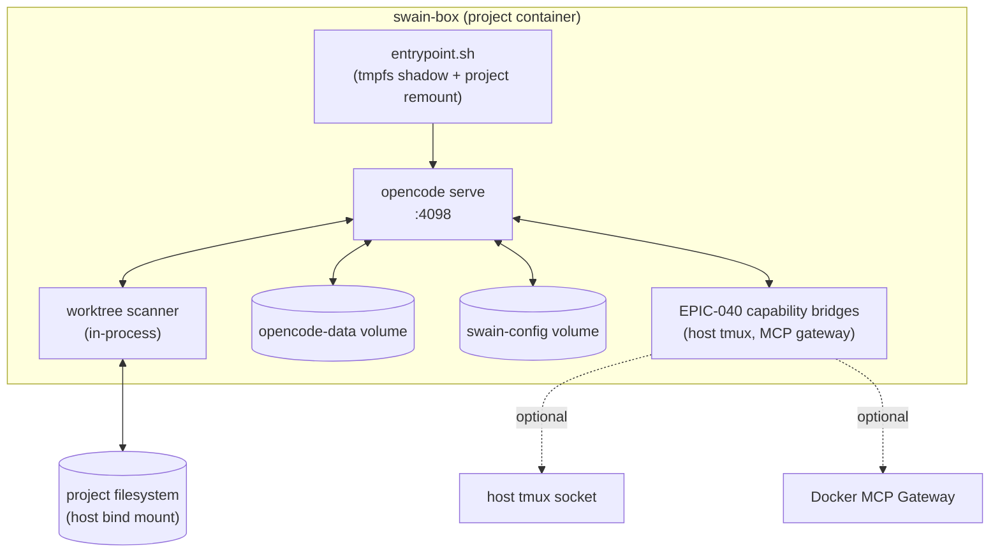
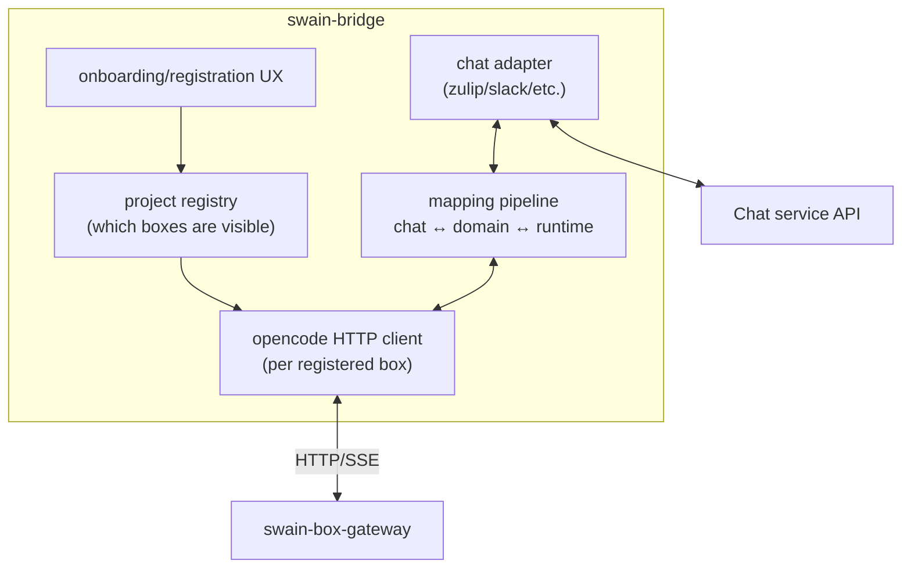

# swain-box / swain-bridge / swain-stage realignment — scratchpad

Status: thinking-in-progress. Not an artifact. Promote to ADR/DESIGN when settled.

## The realignment in one paragraph

Three peer primitives instead of nested ones:

- **swain-box** — per-project isolation container. Owns opencode serve + capability bridges + worktree state. No registration, no chat coupling. Brought up ad-hoc by a CLI that handles missing infra (git init, project name derivation, etc.).
- **swain-bridge** (rename candidate: `swain-chat`) — per-host chat connector. Holds project ↔ stream mapping. Talks to swain-boxes via opencode HTTP API. Onboarding/registration UX. Curated surface — only registered projects appear.
- **swain-stage** (future) — per-host web UI. Same shape as swain-bridge but a different operator surface. Talks to swain-boxes via opencode HTTP API.

Plus one supporting singleton:

- **swain-box-gateway** — Caddy. One per host. Auth + hostname routing. Brought up automatically when first swain-box starts; otherwise transparent.

## C4 — System Context



## C4 — Container view (one swain-box)



Open question: does the bridge microkernel (today's `bridges/project.py`) belong inside swain-box or does it die? See "tensions" below.

## C4 — Container view (swain-bridge)



## Contracts (the seams)

| Seam | Direction | Protocol | Auth | Notes |
|---|---|---|---|---|
| Operator → CLI → swain-box | local exec | shell | local user | `swain-box up [path]`, `down`, `attach`, `list`, `rm` |
| Gateway → swain-box | container network | HTTP/SSE (opencode native) | none (network-isolated) | hostname routing, project-port-4098 |
| Operator surface → Gateway | TCP/HTTPS | HTTP/SSE (opencode native) | basic auth via Caddy header injection | gateway = single auth boundary |
| swain-bridge → chat service | external | service-specific | service token | one per registered service |
| swain-box ↔ host capabilities | host syscalls | tmux socket, docker socket | container caps (SYS_ADMIN today) | EPIC-040 territory |
| Operator → swain-bridge | local exec | shell | local user | registration commands |
| Operator → swain-stage | browser | HTTPS | TBD (delegate to gateway? own session?) | future |

The critical contract is **opencode HTTP/SSE** between operator surfaces and swain-box. Everything downstream of that (chat translation, web UI rendering) is a client of one stable API.

## User interaction contracts

### swain-box CLI (no registration)

```
swain-box up [path]              # start container; default path=$PWD
                                 # idempotent: if running, no-op + print URL
                                 # creates project name from dir basename if missing
                                 # runs `git init` if no .git
                                 # brings up swain-box-gateway if not running
                                 # writes hostname to gateway config + reloads

swain-box down [name|path]       # stop; preserve volumes
swain-box rm   [name|path]       # destroy; -f to wipe volumes
swain-box list                   # running boxes, hostnames, attach URLs
swain-box attach [name|path]     # convenience: opencode attach $url
swain-box logs [name|path]
swain-box exec [name|path] -- cmd # for capability-bridge debugging
```

### swain-bridge CLI (registration required)

```
swain-bridge up                  # start daemon; prompts for chat config on first run
swain-bridge down
swain-bridge register <name|path> [--stream X] [--service zulip]
                                 # adds project to chat surface
                                 # creates stream/topic in chat service
                                 # records hostname for opencode HTTP target
swain-bridge unregister <name>
swain-bridge list                # registered projects, services, addresses
swain-bridge status              # daemon health, connected services, attached boxes
```

### swain-stage CLI (future)

```
swain-stage up   [--port N]      # start web server
swain-stage down
swain-stage open                 # open URL in browser
# Project visibility likely shares swain-bridge's registry, OR has its own.
# Open question — see "tensions" below.
```

## Inventory of user's stated assumptions, with my critique

| # | Assumption | Verdict | Notes |
|---|---|---|---|
| A1 | swain-box runs containerized opencode serve + Caddy as a "pod"; user attaches via `opencode attach` | **Refine** | Caddy is per-host, not per-box. A single Caddy serves all boxes. Conflating them creates port conflicts and defeats hostname routing. |
| A2 | swain-box CLI builds missing infra ad-hoc (git init, etc.) | **Yes** | Add: derives project name from directory, ensures gateway running, writes Caddy config block, persists project metadata so `swain-box up` is idempotent across restarts. |
| A3 | swain-bridge requires registration to control chat visibility | **Yes** | This is the right asymmetry: boxes are infrastructure (cheap, ephemeral); chat is a curated social surface (expensive to add noise to). |
| A4 | First-run swain-bridge does onboarding (chat service config, topic creation) | **Yes** | Plus: per-project registration is a separate command, since you'll add projects over time, not all at first run. |
| A5 | swain-stage is a future GUI built on the same swain-box primitive | **Yes, and stronger** | The pattern generalizes: swain-bridge and swain-stage are both "operator surfaces" — clients of swain-box's opencode HTTP API. There will be more (mobile, IDE plugin, voice). The architecture is "swain-box + N operator surfaces." |

## Gaps and open questions

### G1. Caddy placement

You said swain-box "starts the containerized pod (opencode serve + caddy)." If literal, every box has its own Caddy → port conflicts, no single auth boundary, no unified URL space.

**Resolution:** swain-box-gateway is a host-level singleton. `swain-box up` brings it up if not running and registers the new box's hostname. The user-facing experience is still "I just ran swain-box and got a URL," but Caddy is shared.

### G2. ProjectBridge microkernel — keep or kill?

Today's `src/swain_helm/bridges/project.py` is a microkernel that spawns chat-adapter and runtime-adapter as NDJSON subprocesses. Under the new model:

- Chat-adapter moves OUT to swain-bridge.
- Runtime-adapter (`adapters/opencode.py` wrapping `opencode run --format json`) is **redundant with opencode serve**. opencode serve already exposes sessions over HTTP. The subprocess wrapper exists because the original kernel design predated the decision to host opencode serve in-container.

So: **kill ProjectBridge inside swain-box.** swain-box becomes "opencode serve + capability bridges + worktree scanner." All routing/translation moves to operator surfaces (swain-bridge, swain-stage).

That leaves one question: **what about non-opencode runtimes** (claude, codex)? They don't have an HTTP serve mode. Three options:

1. **Per-runtime serve shim inside swain-box.** Wrap `claude` in a tiny HTTP server that mimics opencode's API. High effort, fragile, every runtime needs maintenance.
2. **Keep the subprocess kernel for non-opencode runtimes only.** swain-box ships two execution models: opencode-direct, and subprocess-kernel-for-others. Operator surface picks one. Clean conceptually, more code.
3. **Defer.** Start opencode-only as you said. Decide runtime expansion later. Document the choice.

Recommend (3) for now, with explicit "we will revisit when adding runtime N+1."

### G3. Ad-hoc hostname collisions

`cd /tmp/foo && swain-box up` and `cd /home/me/foo && swain-box up` both want hostname `foo.localhost`. Options:

- Hash the absolute path into the hostname (`foo-a4b2.localhost`) — collision-free, ugly URLs.
- Refuse and ask for explicit `--name` — explicit, friction.
- Last-wins with warning — bad, footgun.

Recommend: derive from basename, hash on collision, allow `--name` override. Caddy config records canonical path → hostname mapping for idempotency.

### G4. swain-bridge ↔ swain-stage shared state

If both are operator surfaces with project registries, do they share registration?

- **Shared registry** (sqlite or json file in `.swain/`): one `swain register <project>` command, all surfaces see it. But "registration" carried different semantics earlier (which projects appear in chat). Maybe each surface has its own opt-in subscription against a shared project list.
- **Independent registries**: simpler, but operator has to register twice. Bad UX.

Recommend: shared **project list** (which boxes exist, by hostname) lives in swain-box-gateway's discovered set. Each operator surface keeps its own **subscription list** (which of those it surfaces). One source of truth, opt-in per surface.

### G5. Auth model

Caddy injects basic auth headers to work around opencode's `attach` auth bug (DESIGN-033). Three operator surfaces all use this:

- `opencode attach` — Caddy adds auth header on the way through.
- swain-bridge — runs as a known process; gets credentials from environment or 1Password; attaches via Caddy.
- swain-stage — terminates user-facing auth in the browser (OAuth? basic auth UI?), then proxies to Caddy with service auth.

**Open**: when (not if) opencode's attach auth bug is fixed upstream, the workaround should retract gracefully. Worth a SPEC to track and remove.

### G6. opencode serve as the abstraction boundary

This realignment leans hard on opencode's HTTP API being the universal contract between swain-box and operator surfaces. Risks:

- opencode is upstream we don't control. If they change the API, every operator surface breaks.
- opencode's session model may not fit every operator surface (e.g., a chat bridge wants long-running sessions; a web UI wants ephemeral request-response).
- Vendor lock-in: swain-box becomes "the container that hosts opencode," which makes "I want to use a different runtime entirely" expensive.

Mitigation: keep opencode HTTP as the **default** API, but design operator surfaces to talk through a thin adapter so swapping the runtime substrate later is a contained change. Don't over-engineer this — just don't sprinkle opencode-specific JSON shapes through the bridge code.

### G7. Where does `swain-init` / `swain-status` / etc. live?

Swain skills are Claude Code skills — they run wherever Claude is running. Inside swain-box, Claude Code (the CLI) could be installed alongside opencode, and skills work from there. Outside swain-box (operator's host shell), skills also work. So:

- Swain skills are **runtime-agnostic** and **isolation-agnostic** — they run wherever the user runs Claude.
- The realignment doesn't move them. It only changes what `swain-box` (the script) and `swain-bridge` (the script) refer to.

### G8. `opencode attach` itself
Today the Dockerfile pins opencode 1.14.19 with hash verification (good). The attach command runs on the operator host and needs a compatible opencode client — version skew between client and serve is a future support burden. Worth a SPEC to either pin the client version (operator instructions) or have the gateway expose a `/version` endpoint for client-side warning.

## Cleaner alternatives considered

### Alt A: Collapse swain-bridge into swain-box (my prior model)

What I proposed last turn. Rejected by user, correctly: it makes swain-box require chat config to start, and conflates "isolation primitive" with "operator surface." Also makes swain-stage awkward to add (it'd be a peer of swain-bridge inside swain-box, which doesn't compose).

### Alt B: One monolithic daemon ("swain-daemon")

Single host process owns gateway + chat + UI. Boxes are dumb subprocesses. Simpler in some ways but loses the per-project filesystem isolation that ADR-048 explicitly bought back from the ADR-046 incident. Rejected.

### Alt C: Each operator surface is its own container too

swain-bridge and swain-stage as containers in the same compose stack as swain-box and gateway. Works, but adds operational weight (more containers to manage). Plus chat services and UIs don't need filesystem isolation — they're operator-side, not agent-side. Possible later for deployment but not required architecturally.

### Alt D: Drop Caddy, expose each swain-box on its own port

swain-box on :4098, :4099, etc. No hostname routing, no auth gateway. Operator surfaces target ports directly. Simpler infrastructure but: no auth boundary, port discovery problem, ugly URLs, doesn't work over Tailscale without per-port firewall rules. Rejected — Caddy is doing real work.

**The user's model wins.** Three peers + a singleton gateway is the cleanest decomposition that preserves isolation, supports ad-hoc and registered modes, and admits future operator surfaces without redesign.

## Iteration suggestions

1. **Rename `swain-bridge` → `swain-chat`** to reflect its actual scope. "Bridge" is a generic word that historically meant the whole pipeline; promoting one of the surfaces to own the name leaves "bridge" available as a pattern noun (the in-process mapping pipeline that any operator surface implements). Or kill "bridge" terminology entirely — operator surfaces are *clients* of swain-box, not bridges.

2. **Define the "operator surface" abstraction explicitly**, even if there's only one (chat) initially. Document the contract: opencode HTTP client + service-specific transport + project subscription. Makes swain-stage drop in cleanly later.

3. **Promote swain-box-gateway to first-class.** It's not an implementation detail of swain-box — it's a separate component with its own lifecycle, config (Caddyfile), and concerns (auth). Name it, document it, give it its own tiny CLI (`swain-gateway status` / `reload` / `logs`).

4. **Build `swain-box up` ad-hoc-first.** The "no registration" promise lives or dies on this command working flawlessly in an empty directory. Treat it as the load-bearing UX. Test it in `/tmp`, in a fresh git repo, in a worktree, in a directory with a name that's already taken.

5. **Defer non-opencode runtimes.** Don't let G2 stall the realignment. Ship opencode-only swain-box, add a "future runtimes: TBD" section to the ADR, revisit when there's a concrete pull (e.g., "I want claude in here").

## What this realignment supersedes / changes

| Existing | Becomes |
|---|---|
| `bin/swain-bridge` (bash start script) | `swain-bridge` CLI (or `swain-chat`) — daemon mgmt + registration |
| `skills/swain/scripts/swain-box` (multi-runtime local launcher) | DELETED |
| `src/swain_helm/` package | `src/swain_box/` (container side) + `src/swain_chat/` (chat surface side); split, not just rename |
| `src/swain_helm/bridges/project.py` (microkernel) | DELETED inside swain-box; moves to swain-chat as a thinner mapper |
| `src/swain_helm/adapters/opencode.py` (subprocess wrapper) | DELETED — opencode serve replaces it |
| `src/swain_helm/adapters/claude_code.py` | DEFERRED — see G2 |
| `src/swain_helm/adapters/zulip_chat.py` | MOVED to swain-chat |
| `src/swain_helm/watchdog.py`, `zombie_cleanup.py` | DELETED — Docker owns lifecycle |
| `swain-helm` skill | RENAMED/SPLIT to `swain-box` and `swain-chat` skills |
| EPIC-040 (Sandbox Capability Bridges) | RE-PARENTED to target swain-box-the-container; SPEC-130/SPEC-131 rewritten |
| ADR-048 (Container-Per-Project Topology) | EXTENDED — adds the operator-surface peer model, names the gateway as a first-class component |

## What needs to be decided to proceed

- [ ] Final names: `swain-bridge` vs `swain-chat`. (My vote: `swain-chat`.)
- [ ] Package split: one `swain_box`+`swain_chat` repo, or two? (My vote: one repo, two top-level packages.)
- [ ] Gateway CLI surface and config format.
- [ ] Hostname derivation rules + collision policy.
- [ ] Whether ProjectBridge microkernel survives in any form (G2).
- [ ] Auth model for swain-stage when it lands (G5).

## Risks (red-team this scratchpad)

- **Opencode lock-in** (G6) is a real architectural bet. If you ever want to host non-opencode runtimes as first-class citizens, you'll regret making opencode HTTP the contract.
- **The renames will break in-flight INITIATIVE-018 worktree work.** Sequence the realignment after the worktree merges, not in parallel.
- **`opencode attach` auth bug** — the realignment depends on Caddy-injected auth working. If upstream changes auth semantics, the gateway changes.
- **SYS_ADMIN inside the container** — load-bearing for tmpfs shadowing. Worth a SPEC to either replace with rootless approach (overlayfs in user namespace) or document the threat model explicitly.
- **swain-bridge as the curated chat surface** assumes the operator wants curation. If you ever want "every box is automatically chat-visible by default," the asymmetry inverts.
