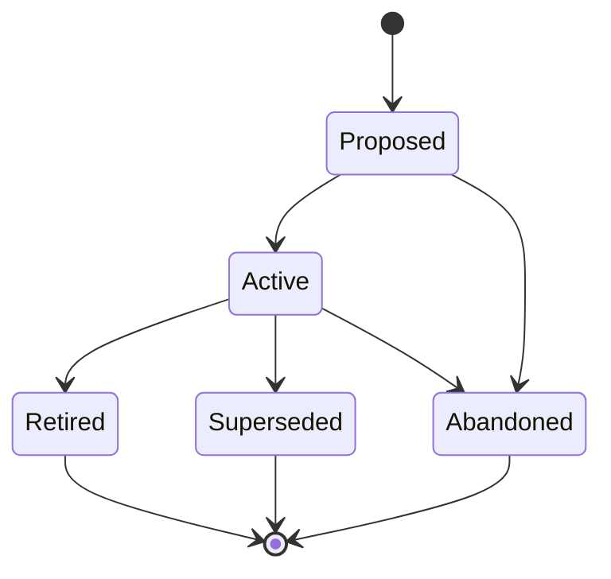

# TRAIN Artifact Type

## Problem Statement

Swain has artifact types for technical planning (SPECs, SPIKEs, ADRs), user experience (JOURNEYs, PERSONAs, DESIGNs), and operational procedures (RUNBOOKs), but no artifact type for human-facing training materials. When a feature ships, the knowledge of *how to use it* lives only in commit messages, spec acceptance criteria, and tribal memory. Operators need structured, maintainable documentation — help guides, product walkthroughs, reference cards, onboarding tutorials — that tracks alongside the artifacts it teaches.

## External Behavior

### New artifact type: TRAIN-NNN

**Lifecycle track: Standing**

**Folder structure:** `docs/train/<Phase>/(TRAIN-NNN)-<Title>/`
- Phase subdirectories: `Proposed/`, `Active/`, `Retired/`, `Superseded/`
- Primary file: `(TRAIN-NNN)-<Title>.md` — the training document
- Supporting files: screenshots, diagrams, example configs, exercise files

**Frontmatter fields:**
- `title` — training document title
- `artifact` — TRAIN-NNN identifier
- `track` — `standing`
- `status` — current lifecycle phase
- `author` — creator
- `audience` — target reader(s): persona references or free-text (e.g., `PERSONA-001`, "new operators", "skill authors")
- `train-type` — one of: `guide | tutorial | reference | onboarding | faq`
- `linked-artifacts` — SPECs, EPICs, RUNBOOKs, or other artifacts this training covers
- `superseded-by` — (optional) pointer to replacement TRAIN when superseded
- `created`, `last-updated` — dates

**Train types:**
- `guide` — task-oriented how-to for a specific workflow (e.g., "How to create a SPEC")
- `tutorial` — step-by-step learning path with exercises (e.g., "Your first swain project")
- `reference` — lookup-oriented material: glossary, cheat sheet, command reference
- `onboarding` — structured introduction for new operators joining the project
- `faq` — frequently asked questions with answers

**Content structure (template sections):**
- Prerequisites — what the reader needs before starting
- Learning Objectives — what the reader will be able to do after
- Body — the training content itself (format varies by train-type)
- Summary / Key Takeaways — recap of essential points
- Next Steps — where to go from here (links to related TRAINs or artifacts)

**Integration points:**
- `swain-design` SKILL.md artifact type table gains a TRAIN row
- `chart.sh` renders TRAIN nodes in the artifact graph
- `specwatch.sh` scans TRAIN artifacts for stale references
- `adr-check.sh` validates TRAIN artifacts against active ADRs
- TRAIN artifacts appear in `swain-status` under a "Documentation" section when relevant

**Cross-referencing:**
- SPECs and EPICs can reference TRAINs via `linked-artifacts` to indicate "this feature has training materials"
- TRAINs reference the artifacts they teach via their own `linked-artifacts`
- When a SPEC transitions to Complete, `specwatch.sh` can flag if linked TRAINs need updating

### Files to create

1. `references/train-definition.md` — artifact type definition (lifecycle, conventions, folder structure)
2. `references/train-template.md.template` — Jinja2 structural template with frontmatter and document skeleton
3. Updates to `swain-design/SKILL.md` — add TRAIN to the artifact type table and "Choosing the right artifact type" section

### Files to update

4. `scripts/chart.sh` — handle `train` artifact type in graph building
5. `scripts/specwatch.sh` — scan `docs/train/` directories
6. `scripts/adr-check.sh` — include TRAIN in compliance scanning

## Acceptance Criteria

- **Given** an operator requests a new TRAIN artifact, **When** swain-design processes the request, **Then** it creates a `docs/train/<Phase>/(TRAIN-NNN)-<Title>/` folder with a properly templated markdown file
- **Given** a TRAIN artifact exists, **When** `chart.sh build` runs, **Then** TRAIN nodes appear in the artifact graph with correct parent/linked edges
- **Given** a TRAIN references a SPEC via `linked-artifacts`, **When** that SPEC transitions to a new phase, **Then** `specwatch.sh scan` flags the TRAIN for review if the SPEC's scope changed
- **Given** a TRAIN artifact exists, **When** `adr-check.sh` runs against it, **Then** it validates the TRAIN against active ADRs (same as other artifact types)
- **Given** an operator runs `swain-design` with intent to create documentation or training materials, **Then** the "Choosing the right artifact type" table routes them to TRAIN
- **Given** a TRAIN with `train-type: tutorial`, **When** it is created from the template, **Then** it includes Prerequisites, Learning Objectives, step-by-step Body, Summary, and Next Steps sections

## Scope & Constraints

- TRAIN is a **standing** (non-implementable) artifact — it has no execution tracking, no swain-do integration, no verification table
- TRAIN does NOT replace READMEs, CLAUDE.md, or AGENTS.md — those are operational configuration. TRAIN is for structured learning materials that teach humans how to use features
- TRAIN does NOT replace RUNBOOKs — runbooks are executable procedures with pass/fail outcomes. TRAINs are educational content with learning objectives
- The `audience` field references PERSONAs when available but does not require them — free-text audiences are valid
- No new lifecycle phases — TRAIN uses the standard Standing track (Proposed → Active → Retired/Superseded/Abandoned)

## Implementation Approach

1. **Definition + Template (TDD: criteria 1, 6):**
   - Create `train-definition.md` following the pattern of `runbook-definition.md` and `design-definition.md`
   - Create `train-template.md.template` following the Jinja2 pattern of existing templates
   - Test: create a TRAIN artifact manually and verify structure

2. **SKILL.md integration (TDD: criteria 5):**
   - Add TRAIN row to the artifact type table
   - Add documentation/training signals to the "Choosing the right artifact type" table
   - Test: verify swain-design routes "create training docs" to TRAIN

3. **chart.sh integration (TDD: criteria 2):**
   - Add `train` to the artifact type scanner in `chart.sh`
   - Handle TRAIN → linked-artifact edges
   - Test: `chart.sh build` with a TRAIN artifact present

4. **specwatch.sh integration (TDD: criteria 3):**
   - Add `docs/train/` to the scan paths
   - Add staleness heuristic: flag TRAINs when linked SPECs change phase
   - Test: `specwatch.sh scan` detects TRAIN with stale SPEC reference

5. **adr-check.sh integration (TDD: criteria 4):**
   - Include `docs/train/` in compliance scanning
   - Test: `adr-check.sh` processes a TRAIN artifact

## Lifecycle

| Phase | Date | Commit | Notes |
|-------|------|--------|-------|
| Active | 2026-03-19 | — | Initial creation |
