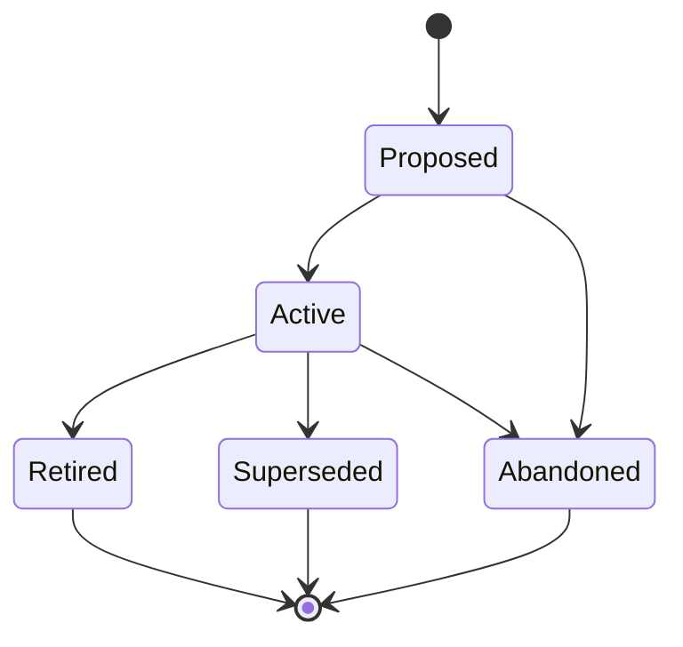

# TRAIN Artifact Type

## Problem Statement

Swain has artifact types for technical planning (SPECs, SPIKEs, ADRs), user experience (JOURNEYs, PERSONAs, DESIGNs), and operational procedures (RUNBOOKs), but no artifact type for human-facing training materials. When a feature ships, the knowledge of *how to use it* lives only in commit messages, spec acceptance criteria, and tribal memory. Operators need structured, maintainable documentation — help guides, product walkthroughs, reference cards, onboarding tutorials — that tracks alongside the artifacts it teaches.

## External Behavior

### New artifact type: TRAIN-NNN

**Lifecycle track: Standing**



**Folder structure:** `docs/train/<Phase>/(TRAIN-NNN)-<Title>/`
- Phase subdirectories: `Proposed/`, `Active/`, `Retired/`, `Superseded/`
- Primary file: `(TRAIN-NNN)-<Title>.md` — the training document
- Supporting files: screenshots, diagrams, example configs, exercise files

**Frontmatter fields:**
- `title` — training document title
- `artifact` — TRAIN-NNN identifier
- `track` — `standing`
- `status` — current lifecycle phase
- `author` — creator
- `audience` — target reader(s): persona references or free-text (e.g., `PERSONA-001`, "new operators", "skill authors")
- `train-type` — one of: `how-to | reference | quickstart` (Diataxis MVP; additional types added when demand emerges)
- `linked-artifacts` — enriched format supporting `rel` tags and commit pinning (see Design Decision 3 in design doc)
- `superseded-by` — (optional) pointer to replacement TRAIN when superseded
- `parent-epic` OR `parent-initiative` — hierarchy anchor (never both; same pattern as SPEC)
- `created`, `last-updated` — dates

**Train types** (based on [Diataxis framework](https://diataxis.fr/)):
- `how-to` — goal-oriented steps for a specific task, assumes competence (e.g., "How to configure credential scoping")
- `reference` — factual lookup material: descriptive, complete, neutral (e.g., "Artifact type reference")
- `quickstart` — compressed tutorial for time-to-first-success under 10 minutes (e.g., "Your first swain project")

Key Diataxis rule: never mix types in a single document.

**Content structure (template sections):**
- Prerequisites — what the reader needs before starting
- Learning Objectives — what the reader will be able to do after
- Body — the training content itself (format varies by train-type)
- Summary / Key Takeaways — recap of essential points
- Next Steps — where to go from here (links to related TRAINs or artifacts)

**Integration points:**
- `swain-design` SKILL.md artifact type table gains a TRAIN row
- `chart.sh` renders TRAIN nodes in the artifact graph
- `specwatch.sh` scans TRAIN artifacts for stale references
- `adr-check.sh` validates TRAIN artifacts against active ADRs
- TRAIN artifacts appear in `swain-status` under a "Documentation" section when relevant

**Cross-referencing (enriched `linked-artifacts`):**
TRAINs use enriched `linked-artifacts` entries with `rel` tags and optional commit pinning:
```yaml
linked-artifacts:
  - artifact: SPEC-067
    rel: [documents]
    commit: abc1234
    verified: 2026-03-19
  - DESIGN-003              # plain string = rel: linked (default)
```
- `rel: [documents]` — content dependency with commit-pinned staleness tracking
- `train-check.sh` reads entries with `documents` in `rel`, diffs pinned commit against HEAD
- SPECs and EPICs can reference TRAINs via plain `linked-artifacts` entries
- When a SPEC transitions to Complete, the SPEC completion hook nudges TRAIN updates
- When an EPIC completes with no linked TRAINs, the EPIC completion hook suggests creating one

**Staleness detection:**
- `train-check.sh` — standalone script, also called by `specwatch.sh scan`
- Compares `commit` hashes in enriched entries against current HEAD for each documented artifact
- Exit 0 = current, Exit 1 = drift found, Exit 2 = git unavailable (graceful degradation)

**Back-propagation:**
Step 4e in phase-transitions.md (SPIKE completion sibling scan) is extended to include TRAINs in the same Vision/Initiative scope. Semantic conflicts surfaced as `IMPLICIT_CONFLICT`.

### Files to create

1. `references/train-definition.md` — artifact type definition (lifecycle, conventions, folder structure)
2. `references/train-template.md.template` — Jinja2 structural template with frontmatter and document skeleton
3. `scripts/train-check.sh` — standalone staleness detection script

### Files to update

4. `swain-design/SKILL.md` — add TRAIN to the artifact type table and "Choosing the right artifact type" section
5. `scripts/specwatch.sh` — add `train` to TYPE_DIRS; add `train-check` pass in `scan`; handle enriched `linked-artifacts`
6. `scripts/adr-check.sh` — include `docs/train/` in compliance scanning
7. `scripts/chart.sh` / specgraph parser — handle enriched `linked-artifacts` entries (string or object)
8. `references/relationship-model.md` — add TRAIN node to ER diagram, add `documents` rel type
9. `references/phase-transitions.md` — add SPEC/EPIC completion hooks, extend step 4e to include TRAINs
10. `scripts/rebuild-index.sh` — add `train` type title mapping

## Acceptance Criteria

- **Given** an operator requests a new TRAIN artifact, **When** swain-design processes the request, **Then** it creates a `docs/train/<Phase>/(TRAIN-NNN)-<Title>/` folder with a properly templated markdown file
- **Given** a TRAIN artifact exists, **When** `chart.sh build` runs, **Then** TRAIN nodes appear in the artifact graph with correct parent/linked edges
- **Given** a TRAIN has enriched `linked-artifacts` entries with `rel: [documents]` and commit pins, **When** `train-check.sh` runs, **Then** it detects drift between pinned commits and current HEAD for each documented artifact
- **Given** a SPEC transitions to Complete and a TRAIN documents it via `rel: [documents]`, **When** the SPEC completion hook fires, **Then** it nudges the operator to update the existing TRAIN (prefer update over create)
- **Given** an EPIC transitions to Complete with no linked TRAINs, **When** the EPIC completion hook fires, **Then** it suggests creating documentation for the Epic's features
- **Given** a SPIKE completes with findings that contradict a TRAIN's content, **When** step 4e back-propagation runs, **Then** the TRAIN is included in the sibling scan and surfaced as `IMPLICIT_CONFLICT`
- **Given** a TRAIN artifact exists, **When** `adr-check.sh` runs against it, **Then** it validates the TRAIN against active ADRs (same as other artifact types)
- **Given** an operator runs `swain-design` with intent to create documentation or training materials, **Then** the "Choosing the right artifact type" table routes them to TRAIN
- **Given** a TRAIN with any `train-type`, **When** it is created from the template, **Then** it includes Prerequisites, Learning Objectives, Body, Key Takeaways, and Next Steps sections

## Scope & Constraints

- TRAIN is a **standing** (non-implementable) artifact — it has no execution tracking, no swain-do integration, no verification table
- TRAIN does NOT replace READMEs, CLAUDE.md, or AGENTS.md — those are operational configuration. TRAIN is for structured learning materials that teach humans how to use features
- TRAIN does NOT replace RUNBOOKs — runbooks are executable procedures with pass/fail outcomes. TRAINs are educational content with learning objectives
- The `audience` field references PERSONAs when available but does not require them — free-text audiences are valid
- No new lifecycle phases — TRAIN uses the standard Standing track (Proposed → Active → Retired/Superseded/Abandoned)

## Implementation Approach

1. **Definition + Template (TDD: criteria 1, 7):**
   - Create `train-definition.md` following the pattern of `runbook-definition.md` and `design-definition.md`
   - Create `train-template.md.template` with enriched `linked-artifacts` format
   - Test: create a TRAIN artifact manually and verify structure

2. **SKILL.md integration (TDD: criteria 8):**
   - Add TRAIN row to the artifact type table
   - Add documentation/training signals to the "Choosing the right artifact type" table

3. **Enriched `linked-artifacts` + specgraph parser (TDD: criteria 2):**
   - Update specgraph parser to handle both string and object entries in `linked-artifacts`
   - Extract `rel` tags and commit pins from enriched entries
   - Update `relationship-model.md` with TRAIN node and `documents` rel type
   - Test: `chart.sh build` with a TRAIN artifact using enriched `linked-artifacts`

4. **train-check.sh (TDD: criteria 2):**
   - Create standalone staleness detection script
   - Read enriched `linked-artifacts`, filter for `rel: [documents]`, diff commit hashes
   - Test: `train-check.sh` detects drift on stale pins and passes on current pins

5. **specwatch.sh integration (TDD: criteria 2, 3):**
   - Add `train` to TYPE_DIRS for phase-fix
   - Add `train-check` pass in `scan` subcommand
   - Update frontmatter parser to handle enriched `linked-artifacts` object entries
   - Test: `specwatch.sh scan` calls `train-check.sh` and reports stale TRAINs

6. **Phase transition hooks (TDD: criteria 3, 4, 5):**
   - Add SPEC completion hook: scan for TRAINs documenting the SPEC, nudge update
   - Add EPIC completion hook: check for linked TRAINs, suggest creating if none
   - Extend step 4e sibling scan to include TRAINs in back-propagation
   - Test: SPEC transition fires TRAIN nudge; SPIKE completion flags contradicted TRAIN

7. **adr-check.sh + rebuild-index.sh (TDD: criteria 5):**
   - Include `docs/train/` in ADR compliance scanning
   - Add `train` type title mapping to rebuild-index.sh

8. **swain-sync integration:**
   - Add `train` to the rebuild-index loop in swain-sync SKILL.md (hardcoded type list)
   - Add `docs/train/` to the ADR compliance artifact path list in swain-sync SKILL.md

## Verification

| Criterion | Evidence | Result |
|-----------|----------|--------|
| train-definition.md exists with lifecycle and conventions | `references/train-definition.md` | PASS |
| train-template.md.template exists with all required sections | `references/train-template.md.template` | PASS |
| train-check.sh staleness detector exists | `scripts/train-check.sh` | PASS |
| TRAIN registered in SKILL.md artifact type table | `skills/swain-design/SKILL.md` artifact type table (2 refs) | PASS |
| TRAIN integrated in specwatch.sh | `scripts/specwatch.sh` (8 references) | PASS |
| adr-check.sh scans docs/train/ | `scripts/adr-check.sh` includes train path | PASS |

## Lifecycle

| Phase | Date | Commit | Notes |
|-------|------|--------|-------|
| Active | 2026-03-19 | — | Initial creation |
| Complete | 2026-03-22 | — | Retroactive close — train-definition.md, template, train-check.sh, SKILL.md and specwatch integration all implemented across 7+ commits |


# Operator Feedback

- ~~there's a RETRO about an issue when a SPIKE's findings didn't back-propagate. TRAIN seems like it would also be affected.~~ **Resolved:** step 4e back-propagation scan extended to include TRAINs; acceptance criterion added above. See design doc Decision 4.
