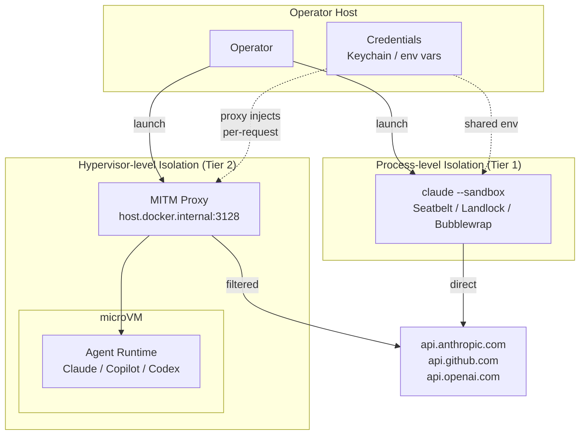

# Architecture Overview — Safe Autonomy (VISION-002)

## Diagram

## Isolation Spectrum

Sandbox types are ordered by isolation strength. Stronger isolation comes with more constraints (startup time, credential handling complexity, platform requirements).

| | Process-level | Container-level | Hypervisor-level |
|---|---|---|---|
| **Mechanism** | Seatbelt / Landlock | Custom Docker image | Docker Sandboxes / Apple Containers |
| **Kernel** | Shared | Shared | Separate |
| **Network** | Shared | Isolated | Isolated + MITM proxy (Docker) |
| **Credentials** | Host env (leaky) | Explicit `-e` vars | Proxy-managed (never enter VM) |
| **Overhead** | Near-zero | Sub-second startup | VM boot (~2-5s) |
| **Runtimes** | Claude-specific | Runtime-agnostic | Runtime-agnostic |

## Credential Scoping Model

The core security property: an agent should receive only the credentials it needs, injected at the sandbox boundary, never persisted inside the sandbox.

| Sandbox type | Credential mechanism | Scoping | Status |
|---|---|---|---|
| Native (Seatbelt/Landlock) | Inherits host environment | No scoping — shares operator's full env | Working, but leaky |
| Docker Sandboxes | MITM proxy injects per-request | Strong scoping — credentials never enter VM | Working for API keys; broken for OAuth (docker/desktop-feedback#198) |
| Custom Docker image | Explicit `-e` env vars at launch | Manual scoping — operator controls what's passed | Not yet built |
| Apple Containers | TBD | TBD | Not yet available |

## Runtime Compatibility Matrix

| Runtime | Native sandbox | Docker Sandboxes | Custom Docker | Notes |
|---|---|---|---|---|
| Claude Code | `claude --sandbox` | Blocked (OAuth MITM bug) | Possible | Native is current workaround |
| GitHub Copilot | N/A (no native sandbox) | Untested | Possible | Needs GITHUB_TOKEN passthrough |
| OpenAI Codex | N/A (no native sandbox) | Likely works (API key auth) | Possible | Needs OPENAI_API_KEY passthrough |

## Threat Model

**What we defend against:**
- Agent accessing filesystem outside the project directory
- Agent using credentials it wasn't granted
- Agent making network requests to undeclared endpoints (Docker Sandboxes only)
- Cross-agent interference in multi-agent scenarios (future)

**What we explicitly do not defend against:**
- Agent writing bad, insecure, or malicious code within the project
- Agent exhausting API quotas or rate limits
- Kernel exploits that escape the sandbox
- Supply chain attacks via compromised dependencies

**What is best-effort (varies by sandbox type):**
- Network egress restriction (strong in Docker Sandboxes, weak in native)
- Credential isolation (strong in Docker Sandboxes, absent in native)
- Process isolation (strong in Docker Sandboxes, moderate in native)
