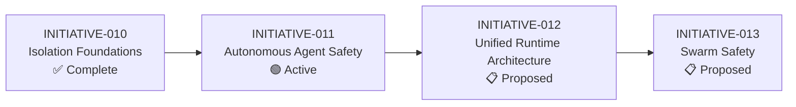

# Roadmap — Safe Autonomy (VISION-002)

## Initiative Sequence

## Status

| Initiative | Phase | Goal | Dependencies |
|---|---|---|---|
| INITIATIVE-010: Isolation Foundations | Complete | Establish sandbox primitives (Tier 1 native, Tier 2 Docker Sandboxes) | None |
| INITIATIVE-011: Autonomous Agent Safety | Active | Credential scoping analysis; unblock Docker Sandboxes for OAuth users | INITIATIVE-010 |
| INITIATIVE-012: Unified Runtime Architecture | Proposed | Architecture that hosts Claude, Copilot, Codex — possibly different sandbox types per runtime | INITIATIVE-011 |
| INITIATIVE-013: Swarm Safety | Proposed | Prevent cross-agent interference in multi-agent swarms (worktree isolation, branch scoping) | INITIATIVE-012 |

## Key Decision Points

- **INITIATIVE-011**: Is Docker Sandboxes' OAuth bug a blocker we wait on, or do we architect around it? (Spike needed if the bug persists.)
- **INITIATIVE-012**: One sandbox type for all runtimes, or per-runtime sandbox selection? (Spike needed.)
- **INITIATIVE-013**: Scope TBD — depends on how multi-agent orchestration evolves under VISION-001.
